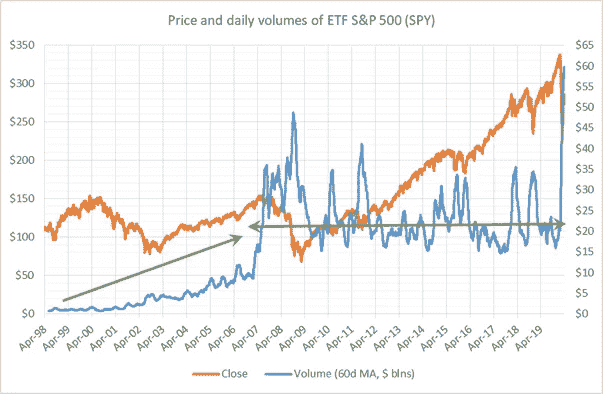
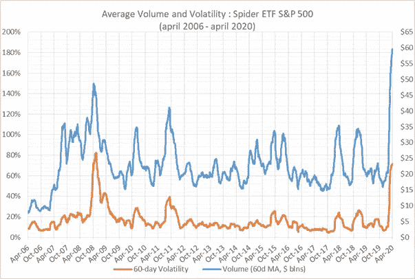
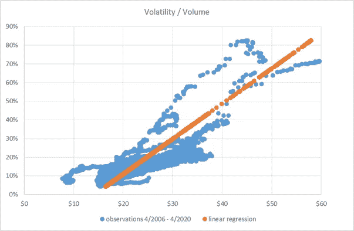
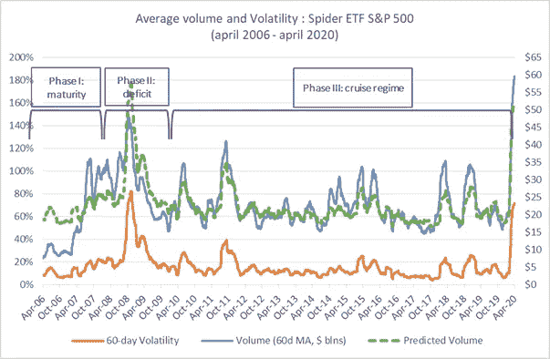

# 金融市场的真实流动性是什么样的？

> 原文：<https://medium.datadriveninvestor.com/what-does-real-liquidity-in-the-financial-markets-look-like-edbd7e07893f?source=collection_archive---------14----------------------->

*本文分析了 S & P 500 ETF 的流动性。这只 ETF 是全球流动性最强的现金产品之一。该研究显示了日交易量与波动性的历史相关性。与 2008 年相反，当时交易量的下降反映了投资者(特别是个人投资者)可能撤离，但在 2020 年 3 月至 4 月，没有观察到这种下降，这表明尽管市场出现严重调整，投资者并没有“抛弃”市场。*

在这个危机时期，金融市场的正常运转引发了问题。2008 年，媒体传达了监管机构和国家机构对市场参与者融资能力的担忧。不确定性集中在公司的困难上，这些困难可能在不久的将来导致破产。这种失败会让人质疑银行的偿付能力，以及它们为恢复正常经济所需的努力提供融资的能力。

尽管流动性(从货币意义上来说)是一个基本问题，但在有组织的市场中，流动性同样重要。资产的流动性被定义为投资者在不过度改变价格的情况下，轻松、快速地买卖该资产的能力。例如，房地产是典型的非流动性资产类别*案例:购买或出售一套公寓需要几个月的时间。更快的交易是可能的，但是人们不应该关心价格——尤其是卖家。*

对投资者来说，买卖资产的能力至关重要，尤其是在压力时期。对于个人来说，这意味着，例如，能够清算可用的储蓄，以满足计划内或计划外的财务承诺。对于机构投资者来说，这意味着能够出售某些风险资产，并可能购买风险较低的资产。提出流动性的问题是一项重要的练习。

本文的目的是提出一个简单的流动性检查:它是如何产生的？它是一种内在的特征吗？它会随着时间而改变吗？是什么潜在的因素推动了它的发展？

我们的试验品将是世界上最具流动性的工具之一，美国标准普尔 500 蜘蛛(间谍)ETF。Spider 是一只在纽约证券交易所上市的投资基金，散户和机构投资者均可投资。它是一种现金产品:以 282 美元购买 1 股股票需要支付 282 美元，所有者将看到该股票出现在他的证券账户上。存在更多的流动性衍生品(如标准普尔 500 的 E-mini 期货)，但它可能是世界上流动性最强的现金产品。

为了抓住问题的核心，这里有一张从 1998 年 6 月 25 日到 2020 年 4 月 24 日的 20 多年来的间谍图表:

【注:交易量是指纽约证券交易所的交易量。它们表示通过交易的存在观察到的后验流动性*。另一种可能的方法是考虑交易所订单簿所表达的潜在流动性。鉴于交易只占订单簿中的一小部分，这种潜在流动性比这里研究的流动性要高得多(这也更难研究，因为订单可以在没有任何实际执行意图的情况下下达)。*

在大约 10 年后(该间谍于 1993 年 1 月推出)，其日均交易量达到约 100 亿美元，该间谍在 2007 年突然改变制度，每天交易 200 亿至 300 亿美元。相比之下，流动性最强的美国证券每天的交易量只有几十亿美元。我们远远高于市场上的其他资产。

这张图表需要一些评论。

首先，数量增长最初是缓慢的，而且大部分是线性的。从 1998 年到 2006 年，我们逐渐达到 100 亿美元。趋势很明显，但独立于市场变化，因为间谍在 80 美元和 160 美元之间波动。这种流动性从何而来？当它在 1993 年推出时，间谍是一种新产品。机构投资者习惯于衍生品(即期货合约)，个人投资者熟悉股票和共同基金。交易所交易基金是一个新的想法，它提供了许多服务，但成本确实高于期货，而且个人对其知之甚少。它的主要附加值在于，它使得买卖 500 种成分的整个指数变得容易。这一价值主张将会成功:不同类别的投资者的采用是真实的，但相对缓慢。尽管速度并不慢:在推出五年后，SPY 每天的交易量接近 10 亿美元，这已经使其成为流动性极强的证券。

第二点，2007 年达到的稳定期(绿线)似乎特别稳定。撇开短期变化不谈(我们将在后面探讨)，直到最近的爆炸使交易量达到每天近 600 亿美元之前，什么都没有发生。这种稳定性证实了流动性真的不取决于价格。2007-2020 年期间发生了重大金融危机、深刻的监管变化、市场结构和技术方面的重大创新，更不用说费用调整，特别是经纪佣金，这些都面临着持续的压力。不管怎样，似乎什么都没发生:间谍交易…它交易的东西。

现在让我们看看更近的历史，特别是从 2006 年开始:

波动性是流动性激增的主要解释因素，上图很好地说明了这一点。2006 年至 2007 年间的交易量激增无法用波动性来解释，但其它所有峰值似乎都可以解释。

2006 年至 2007 年发生了什么，让投资者有理由突然感兴趣？我们记得这是次贷危机的开始。房地产的“问题”开始被识别出来:无法解决。2008 年初，濒临破产的贝尔斯登被摩根大通“拯救”。然而，市场的紧张情绪并没有反映在波动性上，波动性呈上升趋势，但仍低于 20%。不仔细观察，很难给出令人信服的解释:间谍的流动性是否发生了不利于衍生品的变化？芝加哥商品交易所改变了它的风险参数，使得期货更加昂贵了吗？纽交所是否投机性地调整了定价，以吸引新的参与者？一个可能需要进一步调查的问题。

下图清楚地显示了成交量和波动率之间的关系，其中一个是另一个的函数:

该图也是应用线性回归来确定两者之间的确切相关性的机会。获得的回归如下:

> 成交量(十亿美元)= 53 *波动率+ 14.19

这往往显示约 140 亿美元的“内在”流动性。这个回归的决定系数是 0.66，这是一个很高的水平，证实了一个(波动性)在另一个(成交量)中的解释力。

再深入一点，让我们考察一下建模和现实之间的差异，即实际观察到的流动性和可以从当前波动性做出的预测之间的差异。下图以绿色显示回归预测的体积:

可以区分三种制度:

*   从 2010 年 4 月到今天(危机前):流动性与波动性直接相关，但绿色曲线系统性地低估了蓝色曲线。当波动性增加时，交易量的增加超过了模型的预测，相反，当一切恢复正常时，通过比模型更大的交易量收缩来实现正常的恢复。对这一现象的一种可能的解释是，投资者在高波动时期特别活跃。他们的进入带来了额外的活动，当波动性下降时，这些活动也会很快消失。这方面的一个例子是可能激活专门的自动机的自动交易基金。
*   2006 年至 2007 年(第一阶段)的“成熟”制度，在此期间，间谍获得了一种前所未有的自然流动性，而且自那以后也没有失去过。如上所述，理解这种变化需要进一步的分析。
*   特别对应于 2008 年金融危机的中间体制(第二阶段),其中间谍的流动性不如预测的那样高。尽管交易量从每天 250 亿美元激增至 450 亿美元，但交易量仍低于应有水平。解释很清楚:2008 年的危机永久性地损害了投资者的干预能力和资本配置。

在本分析结束时，似乎最后两个月(2020 年 3 月和 4 月)事实上并非异常，因为观察到的流量超过了整个第三阶段的预测。这是一个好消息:尽管不可能推广到所有工具和所有市场，但活动的增加意味着经济参与者应该能够毫无困难地进行他们需要的操作。无论是直接削减损失以释放现金，还是通过各种产品或策略调整风险，如果市场运行正常，管理决策将更容易实施。资本市场的作用是形成价格和分配资源，特别是通过将储蓄与投资需求联系起来。2008 年，这些机制严重失灵，使得恢复正常变得更加困难。尽管当前的危机并非源于金融，但市场的平稳运行，加上监管机构的迅速反应，意味着 2008 年的一些问题不会出现。