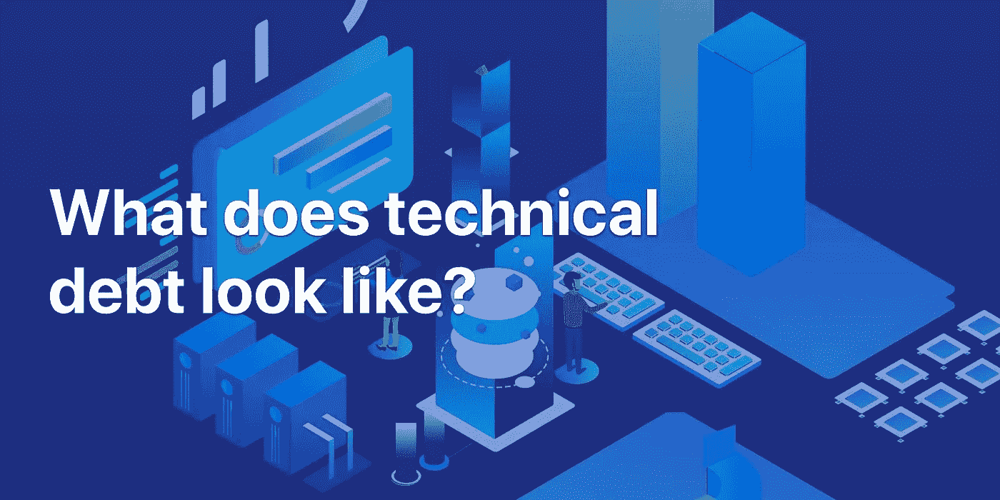
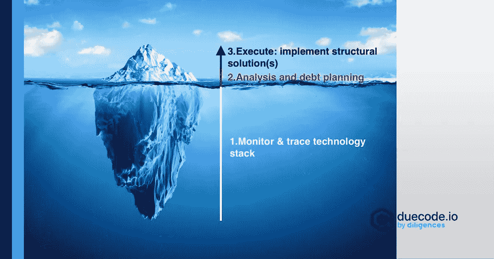

# 技术债是什么样子的？

> 原文：<https://medium.datadriveninvestor.com/what-does-technical-debt-look-like-cea3e6754331?source=collection_archive---------23----------------------->

[技术债](https://duecode.io/blog/what-is-technical-debt/)可以定义为你今天拖延但明天又不得不做的工作。在软件开发中，它指的是一些重要的工作没有为一个可交付的产品实现，但它必须在未来完成。基本上，优先考虑快速交付而不是代码质量。

# 如何量化技术债？

技术债务是软件开发的一个重要方面。拥有大量的技术债务会导致将来的问题和成本。量化它可以帮助我们理解一个阈值，并以更有效的方式管理它。

[计算一个数字来反映技术债务](https://duecode.io/blog/how-to-measure-technical-debt/)需要很多考虑。有多个变量会对代码质量产生影响，包括复杂性、代码行数、继承性、嵌套深度等等。因此，由于要考虑这么多因素，得出一个数字可能很有挑战性。

为了缓解这个问题，技术债务被表示为补救成本(修复系统的成本)和开发成本(开发成本)的比率。

技术负债率(TDR) =补救成本/开发成本 x 100%

# 如何解决技术债务？

技术债务应该保持在一定的限度内，以允许软件的[简单管理和开发](https://duecode.io/blog/how-to-manage-technical-debt/)。有几种技术可以用来控制它:

✔️定义了技术债务并设定了门槛

✔️确定了债务任务的优先顺序

✔️使用敏捷开发

✔️定期与工程师和业主开会

✔️设定了编码标准

✔️自动化测试

✔️重构代码

前四项技术归入[防止技术债务](https://duecode.io/blog/how-to-prevent-technical-debt-in-startup/)项下，而其余三项用于偿还技术债务。

# 多少技术债可以接受？

技术债务是软件开发领域的一个紧迫问题。然而，这种现象是不可避免的，尤其是当开发项目越来越大的时候。从理论上讲，技术债务可以减少到零，然而在现实生活中这是不可能的。总有这样的情况，你必须优先考虑速度而不是质量。

只要管理和维护得当，负债不是问题。您的技术债务不应该超过某个设定的阈值，您的开发人员也应该积极地偿还它。

请你的程序员跟踪你的代码中的依赖关系和技术债务部分，它们会对系统的其他功能产生影响。如果你在一个子特性中有大量的技术债务,而这个子特性在整个系统中并不经常使用，那么与在一个更重要的子系统中较少的技术债务相比，它仍然是相对不重要的。

因此，为你能承受的债务量设定一个基准，并要求你的开发者遵守这个基准。

# 技术债务冰山

你的主要目标是看你在任一时刻有多少技术债务。这里是技术债务冰山将帮助你:

你必须从冰山的底部爬到顶端。

*原载于 2020 年 12 月 8 日*[*https://due code . io*](https://duecode.io/blog/what-does-technical-debt-look-like/)*。*

在 [**编码、软件和移动开发**](https://app.ddichat.com/category/coding-software-mobile-development) 中安排 DDIChat 会话:

 [## 专家-编码、软件和移动开发- DDIChat

### DDIChat 允许个人和企业直接与主题专家交流。它使咨询变得快速…

app.ddichat.com](https://app.ddichat.com/category/coding-software-mobile-development) 

在此申请成为 DDIChat 专家[。
与 DDI 合作:](https://app.ddichat.com/expertsignup)[https://datadriveninvestor.com/collaborate](https://datadriveninvestor.com/collaborate)
点击订阅 DDIntel [。](https://ddintel.datadriveninvestor.com/)