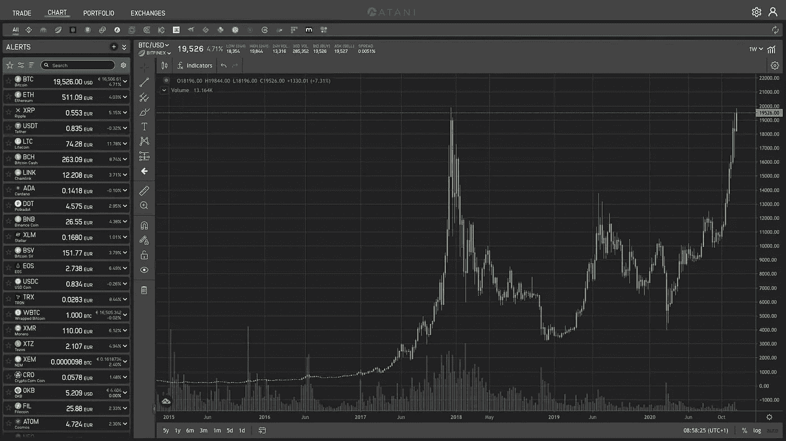
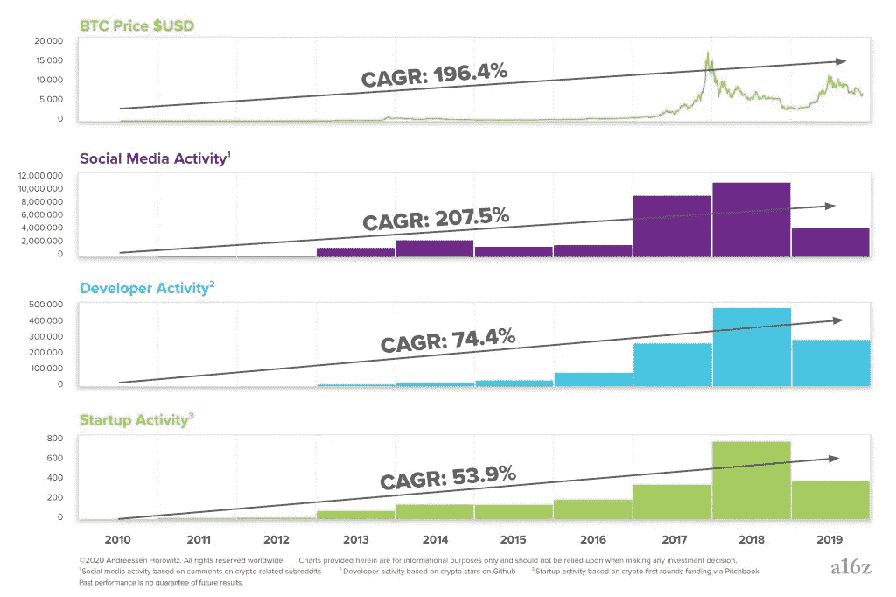
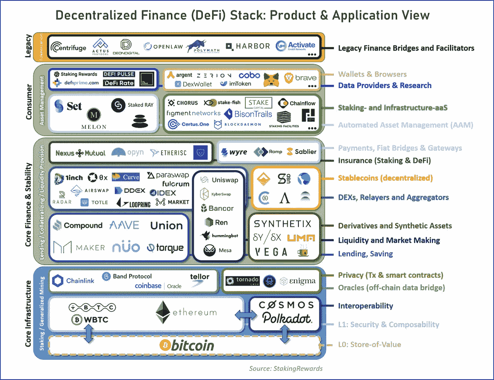

# 比特币 ATH 意味着什么？

> 原文：<https://medium.datadriveninvestor.com/what-does-the-bitcoin-ath-mean-e34153911738?source=collection_archive---------0----------------------->

Mountain range / [Jerry Zhang](https://unsplash.com/@z734923105?utm_source=unsplash&utm_medium=referral&utm_content=creditCopyText) on [Unsplash](https://unsplash.com/s/photos/mountain?utm_source=unsplash&utm_medium=referral&utm_content=creditCopyText)

> 比特币价格最近飙升，令许多人感到意外。价格上涨的前提条件和长期影响是什么？

# 背景:历史新高

ATH 代表“有史以来最高”，意思就是有史以来的最高值。该术语与资产在特定市场或交易所达到的最高价格有关，通常用于数字资产(也称为“加密资产”)的投资者。

**比特币(BTC)已经在 2017 年末的牛市中，于 11 月 30 日和 2020 年 12 月 16 日在许多加密货币交易所打破了之前的历史高点(ATH)** 。这一事件标志着比特币进入价格发现的新阶段。

*Bitcoin vs. US Dollar 2015-today weekly chart /* [*Atani Crypto Trading*](https://atani.com)

**但是，这和价格有什么关系呢？**除了首字母缩写和大肆宣传，BTC·ATH 还意味着什么？为了回答这个问题，我们必须后退一步，了解加密行业的创新周期是如何进行的。

# 加密中的价格创新周期

在加密行业工作了很长时间的人认为这个领域是循环发展的，在高活动期和“加密冬天”之间交替至今已有三个周期。第一次在 2011 年达到顶峰，第二次在 2013 年，第三次在 2017 年。

这些周期看似混乱，但有一个潜在的秩序，大致特征为:

1.  资本流向该行业，比特币和其他加密资产的**价格上涨。**
2.  价格上涨引发新的兴趣、社交媒体活动和大众媒体报道。
3.  兴趣的增加导致更多的人参与进来，贡献更多的金融和智力资本(新的想法和代码)。
4.  丰富的金融和智力资本导致新项目和创业公司的产生。
5.  **产品发布增加了行业的基本价值**它们激励更多的人，最终在下一个周期达到高潮。

从长期来看，加密周期已经产生了软件创新的基本驱动力的稳定增长:新的想法、代码、项目和创业。

Crypto industry compound annual growth rates in 2010–19 / [a16z](https://a16z.com/2020/05/15/the-crypto-price-innovation-cycle/)

**但是，传递的基本价值是什么？那些新的想法、代码、项目和创业都是关于什么的？**

 [## 稳定币会危及比特币在加密领域的地位吗？数据驱动的投资者

### Stablecoin 是一种加密货币，主要用于维持稳定的市场价值。它可以通过…

www.datadriveninvestor.com](https://www.datadriveninvestor.com/2020/06/08/can-a-stablecoin-jeopardize-the-position-of-bitcoin-in-the-crypto-space/) 

# 构建一个分散的互联网

早在 2008 年，笔名**的中本聪发表了一份 9 页的** [**白皮书**](https://bitcoin.org/bitcoin.pdf) **描述了一个优雅的解决方案，解决了计算机科学的一个长期存在的问题**即所谓的拜占庭将军问题。从技术角度来看，该解决方案使得由相互怀疑的团体操作的计算机系统能够合作。这些计算机合作的任务是对等金融交易的会计和结算。

多亏了 Nakamoto 的解决方案和基于它(比特币)构建的系统，**有史以来第一次有可能在很远的距离内快速转移价值，而不依赖于可信任的中介**，如银行或政府。

比特币是一场影响深远的运动的第一步。从点对点传输开始，密码行业正在将传统金融产品转移到开源和去中心化的世界。**金融去中心化消除了对可信中介的需求，降低了总体成本并极大地提高了安全性。**

分散金融仅仅是个开始。密码行业正在建立一个去中心化的互联网，随着时间的推移，它将减少我们对脸书、谷歌或亚马逊等垄断巨头的应用程序的依赖。

# 我们在旅程中的位置:基本面

距离 2017 年的高峰已经过去了近三年，生态系统已经急剧成长和成熟。这种根本性的发展反映在作为“三相点”资产的加密资产的概念中。

## 作为价值储存手段的头号加密资产

大型老牌企业开始将加密技术视为有效的国库储备资产(如 [Square](https://www.cnbc.com/2020/10/08/square-buys-50-million-in-bitcoin-says-cryptocurrency-aligns-with-companys-purpose.html) 、 [MicroStrategy](https://www.coindesk.com/microstrategy-ceo-bitcoin-better-than-antiquated-gold) )，全球的资产管理公司也在为机构投资者和高净值个人提供的资产配置建议中加入了加密技术(如 [Fidelity](https://news.bitcoin.com/sec-filing-fidelity-bitcoin-fund/) 、 [J.P. Morgan](https://fortune.com/2020/10/26/jp-morgan-chase-bitcoin-predictions-analyst-jpm-cryptocurrency/) )。

最广泛的理论认为，在由公共债务增加和无限量化宽松驱动的通货膨胀货币危机场景中，加密(尤其是比特币)可以成为一种对冲**。**

****

**Gross Federal Debt US / [FRED](https://fred.stlouisfed.org/series/GFDEBTN)**

## ****#2 加密资产作为安全保障****

**全球许多中央银行(如[澳洲](https://www.coindesk.com/australian-central-bank-coaustralian-central-bank-commonwealth-national-australia-bank-partner-on-cbdc-research-projectmmonwealth-national-australia-bank-partner-on-cbdc-research-project)、[英国](https://coingeek.com/uk-drafts-plan-to-regulate-stablecoins-research-cbdc/)、[瑞典](https://www.reuters.com/article/us-cenbank-digital-sweden-idUSKBN20E26G)、[美国](https://www.coindesk.com/muzinich-treasury-digital-currency)等)。)正在探索，目标是实现**【央行数字货币】**。CBDC 是建立在区块链技术基础上的数字货币，旨在消除现金并简化对货币供应的控制。**

**这些努力，加上**私人倡议，如推出**[**Libra/Diem**](https://libra.org/)**支付系统，或**[**PayPal**](https://newsroom.paypal-corp.com/2020-10-21-PayPal-Launches-New-Service-Enabling-Users-to-Buy-Hold-and-Sell-Cryptocurrency)**服务，使用户能够购买、持有和出售加密**资产，将推动采用并加速向基于开源和分散技术的金融系统过渡。**

**将货币移植到加密技术只是第一步。事实上，**许多雄心勃勃、才华横溢的团队已经在致力于将每一种金融证券(例如，国债、债券、贷款、股票)迁移到区块链**(例如，由苹果或特斯拉股票或 SPDR 的& P500 ETF 支持的加密资产)。最终目标是建立一个更加安全的金融系统，大幅降低价值积累、保管和分配的成本。**

## **#3 加密资产作为加密项目的风险资本**

**加密资产是开源软件社区的一种协调机制。**投资分散协议的本地加密资产，支持开发人员社区和产品的增长**(正如风险投资支持科技初创公司的增长一样)，还可以提供某种形式的治理权(例如，赌注、投票)。**

**因此，加密资产是成熟投资者的一种机制，旨在获得对新技术和商业模式的爆炸式生态系统的“所有权”和“曝光”。**

****

**Decentralised Finance map / [StakingRewards](https://twitter.com/stakingrewards/status/1256182438482640902)**

# **结论:ATH 只是一个开始**

**比特币不经意的价格飙升标志着加密行业又一个繁荣周期的开始。大众媒体和散户投资者的兴趣仍然很低，因此目前的估值可能仍远低于正在开发的应用程序的基本价值。**

****

**Interest over time for Bitcoin 2016-today / [Google Trends](https://trends.google.com/trends/explore?date=2016-01-11%202020-01-12&q=bitcoin)**

****在过去十年左右的时间里，加密一直是一个令人着迷的行业，而且该行业仍处于起步阶段。**从更长远的角度来看，可以肯定地说，这将是未来 10 到 20 年的高速增长空间。**

**它将继续吸引越来越多有才华、充满想法、雄心和信念的团队。无数的创新将会发生。许多人可能不会通过仅仅是新奇的状态，但有些人肯定会坚持。那些坚持下来的人将**彻底改善金融、互联网和社会。****

## **访问专家视图— [订阅 DDI 英特尔](https://datadriveninvestor.com/ddi-intel)**