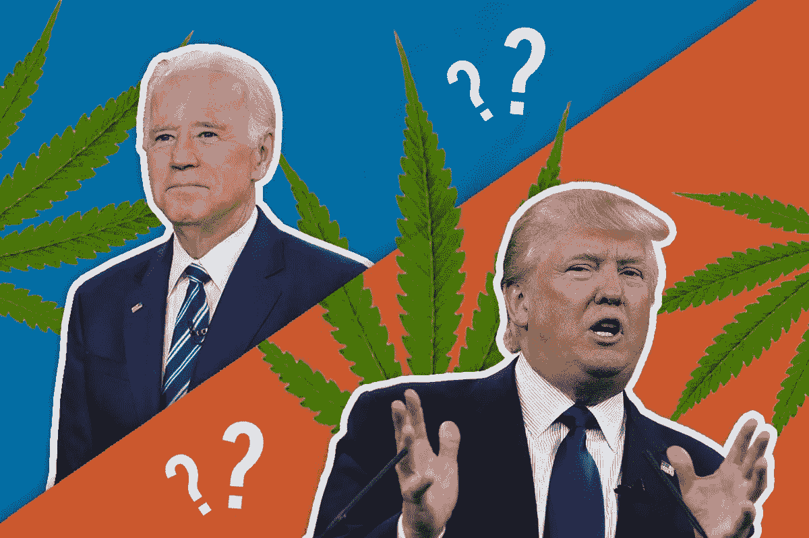

# 11 月的总统选举对美国大麻合法化意味着什么？

> 原文：<https://medium.datadriveninvestor.com/what-does-the-november-presidential-election-mean-for-cannabis-legalization-in-the-u-s-2e67d720f1ff?source=collection_archive---------5----------------------->

# 2020 年后，乔·拜登或唐纳德·特朗普当选总统对美国大麻合法化意味着什么？

11 月 3 日星期二，美国将决定谁将是他们的总统，至少在接下来的四年里。目前的选择是在巴拉克·奥巴马总统时期的前副总统乔·拜登和现任唐纳德·特朗普政府的延续之间。最近，坎耶·韦斯特(Kanye West)抛出了他的红帽，并在推特上宣布，他将在这个选举周期中参加竞选，尽管他是否真的参加竞选目前仍不确定。

2020 年是这些选举的完全非传统的前奏，正在进行的新冠肺炎疫情影响着美国和全球，以及最近黑人的命也是命抗议和骚乱的兴起。这导致了一个相当平静的竞选周期，因为候选人被迫在社交上保持距离，并保持对当前问题的关注，而不是他们各自的竞选活动。唐纳德·特朗普(Donald Trump)最近才在俄克拉荷马州塔尔萨(Tulsa)举行了他的第一场竞选集会，由于缺乏社交距离，以及缺乏参加活动的人，这遭到了批评。

但现在，随着 11 月的临近，美国公民开始决定支持哪位候选人，一些人可能会想知道每位潜在候选人将如何影响美国的大麻合法化。

所以，让我们分析一下每位候选人对大麻的立场，看看他们的总统任期会如何影响未来的大麻政策。

 [## 全民或跨州的国营保险私人医疗保险:经济学…

### 我们目前生活在一个所有非医疗行业都痴迷于…

www.datadriveninvestor.com](https://www.datadriveninvestor.com/2020/05/21/state-run-insurance-for-all-or-across-the-state-lines-private-healthcare-coverage-economics-politics-social-mix-up/) 

# 唐纳德·特朗普对大麻合法化的立场是什么？

唐纳德·特朗普(Donald Trump)在过去四年里一直担任总统，可以肯定地说，我们目睹了他的大麻政策在发挥作用；也就是说，他对此事的不作为。唐纳德·特朗普(Donald Trump)曾说过一句名言，他将“把(大麻合法化)留给各州决定”，这句话概括了他迄今为止对大麻的态度。

特朗普总统多年来对大麻的立场已经发生了变化，他之前曾向 GQ 表示，“(大麻)用于医疗目的，绝对是好的。”

美国总统还告诉《华盛顿邮报》，“就大麻和合法化而言，我认为这应该是一个州的问题，一个州接一个州。大麻是件大事。我认为[医学](https://thegreenfund.com/where-is-medical-marijuana-legal-in-the-u-s)应该发生——对吗？我们同意吗？我也这么认为然后我真的相信我们应该把它留给各州。”

最后，关于医用大麻的话题，特朗普告诉比尔·奥雷利，“我知道有人有严重的问题，而且[医用大麻]——这真的对他们有帮助，”特朗普说。

事实上，在 2018 年，特朗普甚至表示他将结束联邦对大麻的禁令，允许企业更容易地获得联邦资金。

尽管我们提到过，他的任期在大麻方面相对平静。尽管在新冠肺炎危机期间，大麻行业被视为“必不可少”的行业，药房也被允许继续营业，但由于其在联邦政府的非法性，该行业也被排除在任何冠状病毒刺激计划之外。此外，最近有指控称，特朗普政府时期的司法部长比尔·巴尔(Bill Barr)被指[受到反大麻偏见的推动](https://thegreenfund.com/the-u-s-attorney-general-is-accused-of-having-an-anti-cannabis-bias)，当时他将近三分之一的反垄断调查集中在大麻行业的公司合并上。

对巴尔的指控令人担忧，如果证明属实，肯定会表明特朗普政府对大麻合法化并不感冒。然而，在不知道这些指控属实的情况下，唐纳德·特朗普(Donald Trump)总统任期的其余时间一直相对远离大麻，现状几乎没有改变。除非有证据表明唐纳德·特朗普(Donald Trump)在连任后会将策略转向大麻，否则我们可以预计，特朗普政府的延续将同样是现状的延续，各州有责任根据自己的意愿改变自己的大麻立法。

# 乔·拜登当选总统对大麻合法化意味着什么？

因此，我们已经确定，唐纳德·特朗普(Donald Trump)的连任对于大麻合法化来说相对平静，但他在民主党这边的对手乔·拜登(Joe Biden)会怎么样呢？乔·拜登担任总统会推动美国大麻合法化吗？

人们可以假设拜登当选总统将导致当前大麻政策的改变，因为从定义上来说，他取代唐纳德·特朗普是对现状的破坏。然而，这不一定是真的。首先，乔·拜登自 1973 年以来一直从政，他的记录很难反映出大麻宣传的历史。此外，直到最近，他一直对大麻合法化持否定态度。

就在几个月前，乔·拜登在[媒体](https://medium.com/@JoeBiden/lift-every-voice-the-biden-plan-for-black-america-d546228da188)和他的[网站](https://joebiden.com/blackamerica/)上发布了他的“美国黑人计划”，称如果他当选，拜登将寻求“提高非洲裔美国人的经济流动性，缩小种族财富和收入差距。”

作为实现这一目标的手段，拜登表示，他将“将大麻的使用非刑罪化，并自动删除所有先前的大麻使用定罪，结束所有仅因吸毒而被监禁的人，而是将个人转移到毒品法庭和治疗。”

这一举动代表了这位前副总统的左倾，他此前曾表示，“几乎没有足够的证据……证明[大麻]是否是一种入门药物。”

当时，拜登因为他的评论受到了许多[的抨击](https://www.cbsnews.com/news/joe-biden-rolls-back-stance-on-marijuana-being-a-gateway-drug-2019-11-26/)，因为他们违背了美国公众的想法，其中三分之二的人支持大麻合法化。

尽管拜登对大麻的新方法旨在在联邦基础上使大麻合法化，但这仍然背离了他在民主党这边的同行，因为几乎所有人都表示他们支持全面的大麻合法化。

比如，伯尼·桑德斯是除了乔·拜登之外最后剩下的民主党候选人，伯尼发誓如果他赢得选举，他将在总统任期的头 50 天内实现大麻的联邦合法化。这一点尤其重要，因为拜登一直在努力吸引年轻选民的同时，也在吸引年龄较大的选民。另一方面，伯尼有着完全相反的问题；年轻选民基数大，但老年选民不够多。出于这个原因，如果拜登想获得更多年轻选民的支持，大麻可能是他的一个关键问题。

# 哪位美国总统对大麻合法化比较在行？

显然，乔·拜登最近发表的言论表明，他对大麻的看法比他的对手、现任美国总统唐纳德·特朗普更有利。尽管美国超过一半的州已经将大麻合法化，但从长远来看，拜登在美国其他州将大麻合法化的努力仍将产生强大的影响。

这是因为，首先，大麻的非刑罪化将人们对大麻使用的看法从犯罪转变为健康问题，这在许多方面比现行政策更合适。此外，通过大麻的非刑罪化和与大麻有关的犯罪的删除，那些被判犯有使用毒品的非暴力罪行的人将不再面临就业障碍。

当人们展望大麻合法化的更广泛的历史影响时，它通常先于娱乐用大麻的最终合法化，并且可以被认为是向它迈出了一步，而不是保持该植物在联邦政府是非法的。

总之，尽管乔·拜登(Joe Biden)提出的对当前大麻立法的修改相对零碎，但与特朗普竞选团队或共和党相比，它们仍对立法产生了更积极的影响。在这方面，如果拜登在 11 月当选，我们可能会看到美国目前的大麻势头略有加快

**进入专家视角—** [**订阅 DDI 英特尔**](https://datadriveninvestor.com/ddi-intel)