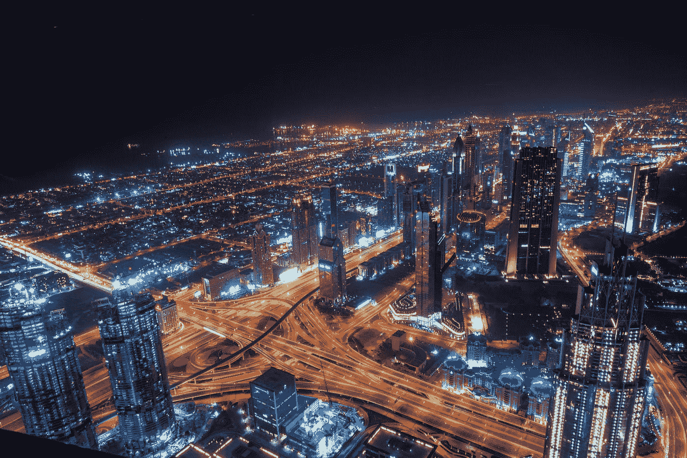

# 疫情、Autonomy 和 5G 有什么共同点？

> 原文：<https://medium.datadriveninvestor.com/what-does-the-pandemic-autonomy-and-5g-have-in-common-690e291436a3?source=collection_archive---------11----------------------->

Photo by [Tom Chen](https://unsplash.com/@tomcchen?utm_source=medium&utm_medium=referral) on [Unsplash](https://unsplash.com?utm_source=medium&utm_medium=referral)

## 没什么。但这种不太可能的融合提供了一个独特的机会。

到 2020 年，各种事件将会汇合在一起，这将会彻底改变我们所知道的世界。我们可能只有在多年后，通过后知之明或研究，才能意识到这一点。冠状病毒疫情、车辆的自主性和 5G 网络提供了一个新的机会、技术和数据媒体三驾马车，将在未来十年改变世界。

第一个是新冠肺炎。不是因为它在 2020 年的前九个月内感染了全球超过 3500 万人并导致超过 100 万人死亡的明显结果。虽然“悲剧性”是一种轻描淡写的说法，但疫情的遗产将是它迫使人类重新评估自己。由于不得不严格检查我们的卫生基础设施，这也促使我们以一种连格里塔·图恩伯格做梦也想不到的方式来思考环境问题。持续不断的野火和猛烈的风暴是气候变化的进一步例证，这一点不容忽视，而在全球范围内的停工期间，污染减少带来的更新鲜的空气和水为我们“正常”的生活方式带来的有害影响提供了确凿的证据。除了少数例外，世界上大部分地区开始采用严格的，甚至是立法的，到 2050 年净零碳的目标，并且许多航空业将这一目标延长到 2035 年。这是一个严肃的承诺，将推动替代能源解决方案的创新和技术——其中一些可以在无人机和轻型实验飞机上找到，但随着波音、空客和通用电气和普惠等发动机制造商的加入，这种程度的雄心可能会衍生出尚未完全发现的技术解决方案。虽然冠状病毒本身并不是这种环境关注的原因，但疫情的影响和持续时间提供了一个机会，让我们重新关注从人类角度来看什么是重要的，并提供了一个以更合作的方式引导努力的机会，这在 2020 年之前竞争激烈但现在需要重塑自我的航空业中可能不会发生。

第二个事件是自动驾驶汽车领域的快速创新——包括汽车和飞机。遥控车辆并不新鲜。几十年来，它们一直是许多模型玩具的主题，制导武器系统现在是国家和非国家行为者武库中的常态，而不是例外。但是新的是完全自主的系统。近年来，我们已经看到了机器人出租车的实验(匹兹堡 PA、旧金山 CA 和 Tempe AZ)，以及埃隆马斯克对完全自动驾驶特斯拉汽车和半卡车的承诺。最近，加拿大渥太华市宣布投资数百万美元建设一个自动驾驶汽车测试场，该测试场将对任何希望尝试最新自动驾驶技术的初创企业或大规模企业开放。自动无人机已经在亚马逊送货上门的未来计划中有一段时间了，2020 年英国批准了疫情相关医疗送货的有限试验。自主水下系统作为遥控潜水器的自然延伸正在被研究和开发，用于船舶、管道和自然栖息地的水下检查活动。

第三个事件，是 5G 网络技术的准时到来。大约从 2015 年开始，有人预测第五代移动通信将于 2020 年问世。它将以一种我们甚至还不知道的方式具有革命性。就像 2G 带给我们短信一样，短信开始永远改变我们的交流方式。第三代引入了网络浏览，这导致了智能手机和平板电脑。然后，有了 4G，我们能够添加越来越多的应用程序，数据传输速度也越来越快，让我们无论身在何处，都能几乎瞬间掌控我们的生活。但是在每一个时期开始的时候，我们不知道这些变化会发生。因此，尽管 5G 长期以来一直承诺“物联网”，即在几年内将联网设备的数量从今天的约 20 亿增加到数百亿，但 5G 的真正革命很可能尚未被想象出来。

2020 年，这三个事件的交汇可能会给我们的世界带来一些重大变化。例如，疫情迫使城市以更具环境意识的方式重新思考城市土地使用和集约化计划，再加上自主技术和快速通信的互联设备，可能会产生“更智能”的交通流模式。想一想，有多少次你坐在一个方向的交通堵塞中，废气从空转的车辆中喷出，而在相反的方向，多条车道实际上是空的。当汽车能够不断地相互通信并与智能交通灯(它们当前的位置以及它们编程的目的地和路线选项)通信时，我们可以想象有一天所有可用的交通车道都可以用于同一方向，以减少或消除拥堵。备用路线可以被计算和交流，这样，少数几辆车可以自动地沿着不太拥挤的道路改道。忘了在后座看你的 medium 文章吧，这才是自动驾驶真正的承诺。汽车不需要依赖当前的摄像头和雷达技术来“看到”车道(顺便说一句，这在积雪的环境中不是很有效)，而是所有汽车都将不断相互聊天，并通过 5G 网络更新道路和交通基础设施，这样车道实际上变得多余。

虽然疫情减速和锁定给了你们时间，但我要求你们考虑环境可持续性、自主系统和 5G，提出自己的使用案例。自主系统和 5G 支持的物联网所提供的改变可能性的程度，只受到我们的想象力、机会和改变意愿的限制。正是疫情提供的条件——找到解决办法和改变规范的机会和意愿——使现在成为利用这一事件交汇的独特时机。