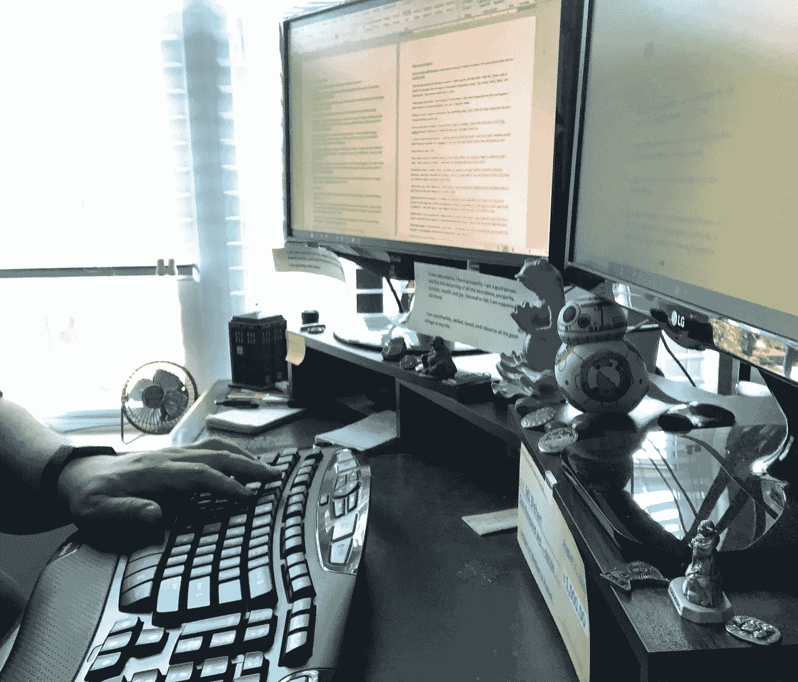

# 你不写什么？

> 原文：<https://medium.datadriveninvestor.com/what-dont-you-write-eadcf5a3783c?source=collection_archive---------13----------------------->

## 因为种种原因，有些事情我没有写。你不写什么？

Photo by [Luca Laurence](https://unsplash.com/@luca_tism?utm_source=unsplash&utm_medium=referral&utm_content=creditCopyText) on [Unsplash](https://unsplash.com/s/photos/write?utm_source=unsplash&utm_medium=referral&utm_content=creditCopyText)

我已经写了很多次我所写的各种不同的东西。但是我从来没有提到过我*不写的东西。*

这可以适用于我工作的每一个流派。从小说到非小说再到商业，有些东西我不写或者不能写。

有些是选择。其他双边投资条约是由于缺乏知识、愿望和/或理解。

例如，我选择不在小说中写性爱场景。我得到的最接近的东西往往是将要发生的事情的暗示——或者我告诉你，它正在发生，没有任何细节。我关上门，这样这对夫妇就有了隐私。

 [## 从新冠肺炎学到的 8 个教训，但它们不会持久|数据驱动的投资者

### 由于新冠肺炎，生活在 2020 年 3 月初几乎一夜之间发生了巨大的变化，越来越多的人认为…

www.datadriveninvestor.com](https://www.datadriveninvestor.com/2020/05/20/the-8-lessons-learned-from-covid-19-but-they-wont-last/) 

是的，我即将出版的奇幻小说将会有*几乎*的性爱场景——但它们一点也不生动、露骨，也不是免费的。这是因为其中一个角色将性作为一种工具——所以你知道它正在发生，但细节却一点也不详细。

在这个话题上，我一点也不拘谨或拘谨。我只是觉得没有必要这样写。我的小说很大程度上是科幻和幻想的——虽然性对于角色来说肯定是一个事件——但我没有必要展示它。

当谈到非虚构作品时——虽然我会涉及政治，但我努力避免宣传。此外，我不会声称我没有任何专业知识。我永远是学生，虽然我可能掌握了一两件事情，但我不会称自己为大师。

说到商业，我不会写任何推销我不相信或不支持的东西。香烟、vapes、共和党、反堕胎等等。

# 选择很重要

生活中的一切都与选择有关。选择不写什么和选择做什么一样重要。

为什么？因为至少我认为这是艺术家和黑客之间的界限。出卖你的灵魂是在做你知道会造成伤害的工作，传播虚假宣传，伤害他人，或者通常不会给这个世界带来一点好处或积极。

你为金钱而写作，却没有灵魂。嘿，如果那能支付账单，你能和你自己一起生活，那才是重要的。我知道，对我来说，我的底线在哪里。

所以，你可以选择做什么和不写什么。

大多数作家都比我专业得多。一个重点，一个主要话题及其分支，就是这样。我认为，不幸的是，有时我是一个多面手对我没有好处。

尽管如此，我还是选择跨越三个截然不同的节点来写。小说、非小说(自助/灵感/正念/积极/写作/等等)和商业。我的工作方式是不同的，因为它们都是不同的。

# 你为什么写作很重要

每个自称作家的人写作是因为这对他们很重要。然而，有些人写作，但不喜欢它。

这是我尝试进行一项商业冒险的前提，但没有成功。例如，我认识很多艺术家，他们可以用颜料、泥土、木头、金属、织物和其他媒介雄辩地表达自己——但是书面文字呢？没有那么多。

我喜欢玩文字游戏。我手机上最常玩的两个游戏都是文字游戏。我为自己丰富的词汇量而自豪，而且我经常阅读。

对我来说，写作几乎是一种强迫行为。但是确定我没有写的东西很重要，因为它让我丢掉了一两份工作。

你写作只是为了钱吗？你为爱写作吗？你是否全心全意地写作？这一点很重要，因为它将对你的信息产生影响。

如果我没有激情地写作——我的作品背后没有火焰——你就不会读它。没人会。为什么？因为那不吸引人。如果我不喜欢这些话，你为什么会喜欢？

Photo by MJ Blehart

# 知道你不写什么吗

这才是识别自己不写的好。当你能指出你没有写的东西时——当你喜欢写作时——它会让你保持激情和专注。

在我写作的三个节点中，我最不喜欢商业写作。我会为网站、小册子和其他商业材料做内容——但如果我能先为我的非小说或小说获得报酬，他们就赢了。这些是我最有激情的地方。

这并不是说我不为自己为商业撰写的内容感到自豪。我绝对相信。虽然我喜欢它，但我对它的喜爱程度不如我的其他作品。

我不为商业写什么是良心问题。你可以给我一大笔钱来写 vape 广告，违背我价值观的政治宣传，或者任何我不同意或不相信的东西——我会拒绝。我的正直和价值观对我来说远比金钱更重要。

话语很重要。他们很强大。我相信我的文字有力量——我不会为了一个我不能或不支持的原因而创造它们。如果我知道我的话可能会造成伤害，我会非常难过。

当这种情况无意中发生时——它会发生的——我仍然感觉很糟糕。但是因为我的意图不是有害的——我可以道歉，从经历中学习，然后继续前进。

知识就是力量。写作是知识的一部分。知道你写什么和不写什么是一个正念、正直和你个人能力的问题。

有些事情我不写——因为上面解释的许多原因。你不写什么？

要知道你是有价值的，值得用正念去发现和/或创造你渴望生活的现实。当该说的都说了，该做的都做了，我们的想法、感觉和行为都很重要，你写什么和不写什么也很重要。

## [在这里获取我的五个简单步骤，让世界变得更美好](http://www.mjblehart.com/mailinglist/)

*原载于 2020 年 8 月 21 日*[*【https://www.mjblehart.com】*](https://www.mjblehart.com/what-dont-you-write/)*。*

**访问专家视图—** [**订阅 DDI 英特尔**](https://datadriveninvestor.com/ddi-intel)