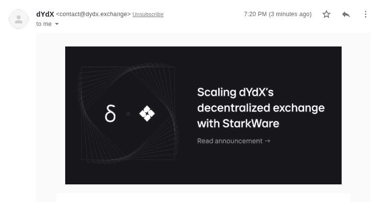
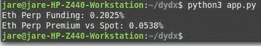
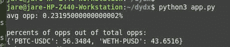
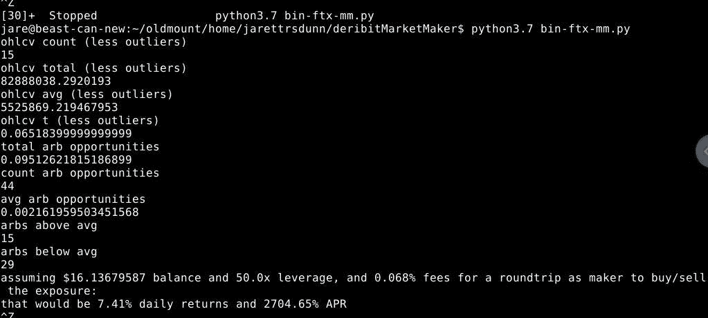
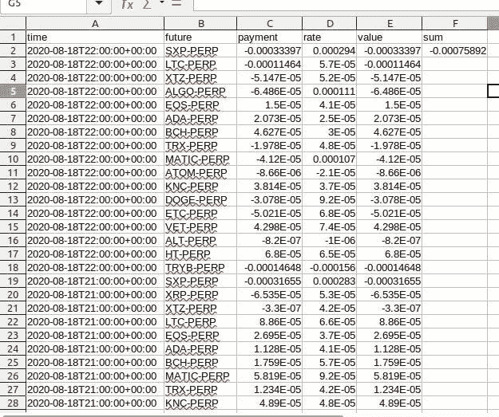
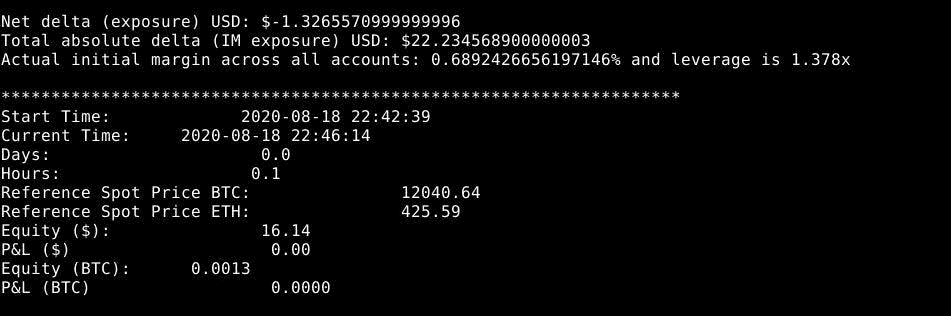
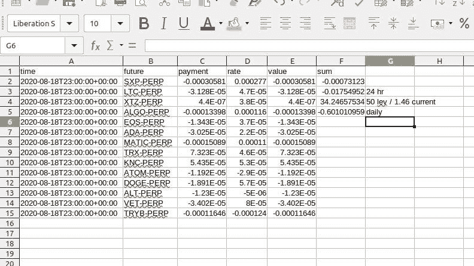

# dYdX 和 StarkWare 的合作对 DeFi 的永久和未来意味着什么

> 原文：<https://medium.datadriveninvestor.com/what-dydx-and-starkwares-partnership-means-for-defi-s-perpetuals-future-s-8ae106631428?source=collection_archive---------19----------------------->

Source: My email

dYdX、[、](https://medium.com/u/b3d17ffd3219)、、【Brendan Chou】[Everett Hu](https://medium.com/u/df39ca337f70)刚刚给我发了这封信，宣布与 stark ware[和他们的可扩展性引擎 StarkEx 建立合作关系。](https://medium.com/u/373f5878a0c6)

这意味着 dYdX 羽翼未丰的永久债券(以及后来的期货合约)将能够比以前执行得更快、更便宜、杠杆更大。

 [## 是的，我们可以！SBIR 和 STTR 对美国小企业的资助|数据驱动的投资者

### 在 20 世纪 80 年代，当伯顿·A·魏斯布罗德首次出版《非营利经济》时，他写道，美国经济是由…

www.datadriveninvestor.com](https://www.datadriveninvestor.com/2020/08/10/yes-we-can-the-sbir-and-sttr-grants-for-american-small-business/) 

实际上，看看我写的这段代码，它使用了一些他们的 dydx-python 包:

插入一个私钥，您将看到类似于以下内容的输出:

Source: my terminal

稍微编辑一些代码，您会看到:

Source: My terminal

这意味着，随着 dYdX 向其阵容中添加更多的永久资产和匹配的期货合约，我们可以将我们的股权分配到篮子中，匹配融资利率允许我们获得的总机会百分比——同时匹配期货溢价，并权衡进入哪些和避免哪些，因为它可能无利可图。我们还可以签订期货合约来对冲这些头寸，这将使我们拥有一组 delta 中性的头寸，这些头寸仅暴露于融资利率和/或期货溢价，具体取决于一天中的时间:)

为什么这很重要？

这将是我可以利用的第一个非托管解决方案(嗯，我确实在利用市场条件和%s 中的% s…)—我甚至可以在理论上通过支持令牌化资产来实现这一点，该资产以 buy-n-burn 的形式分配奖金(以安抚监管机构)，减少供应并增加所述令牌的价值。

为什么保管方案不好？

戈克斯山。

不，真的吗？

有了托管解决方案，你就面临着风险，交易所或实体可能会出问题，带着你所有的资金跑路。

智能合约难道没有内在的风险吗？

的确，但我更相信审计技术而不是超级富豪的话。

这种策略真的有效吗？

在[FTX——加密货币衍生品交易所](https://medium.com/u/6f53ad934548)查看我的小额基金:

Source: My GCP Terminal

[https://ftx.com/shareable-pnl/published/38012](https://ftx.com/shareable-pnl/published/38012)https://ftx.com/shareable-pnl/published/38017

感兴趣吗？评论这篇文章，并在这里报名参加那边的交流:[https://ftx.com/#a=JaresFundingArbitrage](https://ftx.com/#a=JaresFundingArbitrage)

Source: my LibreOffice Calc

现在，它仅运行了大约 2 到 3 个小时，尚未达到 50 倍的杠杆阈值，即大约 1.38 倍的杠杆。

我们可以假设每小时融资收入的 25 倍，或每天 0.38 美元，余额为 16.13 美元，或每天 2.3%。几乎没有风险。因为我们几乎完全对冲了，这里唯一的风险是一个罪犯和它的对冲价格运动之间的差异，这违背了其他人都渴望或与我们一起做空的资金或溢价的方向…

Source: My GCP Terminal

Woot。

完成此草稿后 11 分钟更新:

Source: My Calc again

我们是@ 1.41 倍杠杆，每天预测和预测@ 50 倍杠杆，我们将是 0.60 美元的收入/天，16.13 美元是 3.72%/天:D

今后，一旦 dYdX 兑现这些美好的承诺，您将真正拥有一份智能合同 DeFi token

*先前发表于*

[https://medium . com/@ jarettdunn/what-dydx-and-stark wares-partnership-means-for-defi-s-perps-future-s-e 88612 b 860 ef](https://medium.com/@jarettdunn/what-dydx-and-starkwares-partnership-means-for-defi-s-perps-future-s-e88612b860ef)

订阅获取您的每日顶级科技报道综述！

*原载于 2020 年 8 月 19 日 https://hackernoon.com**的* [*。*](https://hackernoon.com/what-dydx-and-starkwares-partnership-means-for-defis-perpetuals-and-futures-9z123xul)

看啊！一个插头！

！！点击此处订阅:[http://bit.ly/JarettMail](http://bit.ly/JarettMail)

收到关于新文章的通知？技术？比特币/加密/区块链(不一样的东西？)?心理健康漫谈？欢迎来到 Jarett Dunn 电子邮件订户名单！每个新注册者都会收到一个下载 Coindex Labs 非 NDA 预告的链接，其中包括关于我的组织的价值主张的信息，我们首先将目光放在印钞机上，然后作为征服英雄回来，以便战胜世界上更大的人道主义问题。

记得点击，订阅:[http://bit.ly/JarettMail](http://bit.ly/JarettMail)！！

想要平装本还是电子书漫谈和废话？查 Kindle:[https://amzn.to/2FycOfp](https://amzn.to/2FycOfp)

**访问专家视图—** [**订阅 DDI 英特尔**](https://datadriveninvestor.com/ddi-intel)