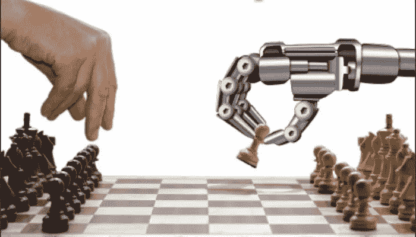

# 什么是机器学习？

> 原文：<https://medium.datadriveninvestor.com/what-even-is-machine-learning-ecae9c617112?source=collection_archive---------32----------------------->

因此，AI(人工智能)和机器学习如今正在成为一件非常重要的事情，这已经不是什么秘密了。每天有数百甚至数千人从事机器学习，从在线象棋作弊到推荐你在 YouTube 上看到的视频。但是机器学习到底是从什么开始的，它是如何工作的？

# 我们知道吗？

因此，不幸的是，很多时候，即使是构建这些机器人的程序员自己也不知道它们是如何工作的，大公司经常会隐瞒他们的“机器人员工”实际上是如何工作的。

然而，好消息是，他们不会自己动手，他们会动手，但除非我们先让他们自己动手！

是的，这很令人困惑…

# 主要概念

正如之前提到的，你需要教它如何制造自己，或者有些人可能会称之为机器人制造其他机器人或机器人教其他机器人。无论哪种方式，这个概念都是你不直接教它任何东西，你在教它如何自己学习。

理解了这一点，你就让他们踏上了学习之旅，这可能需要几秒钟到几年的时间才能真正正常工作。

# 例子

第一个很好的例子是一个机器人，当给它一张画有猫的图片时，它可以分辨出来。人类可以分辨出这是一只猫，但是你怎么知道这是一只猫呢？

你被告知这是一只猫的样子，当你看到你不认识的猫时，你再次被告知这是一只猫，但是假设你一生中从未见过一只蓝色的猫。

根据猫通常具有的共同特征，你仍然可以分辨出它是猫。

现在，如果你以一种不同的方式来思考这个问题，你认识到了其他事物也有的模式，你被告知是猫，这就是你能够辨别它是猫的方式。

是的，这正是机器学习所做的。它创造了一个机器人，给它提供了大量的资源，如果有足够多的这些模式，它会告诉它该把它归类为什么，并且它会教自己识别猫。

另一个很好的例子是教机器弹钢琴。流行的游戏，你必须击中黑色瓷砖的进展，因为歌曲变得更快，你必须努力跟上，不要点击黑色方块外或错过它们

作为人类，你只需看到黑色的方块并点击它。现在，如果你构建了游戏，你可能只需要告诉机器去做，但是对于更复杂的过程和游戏，就没那么简单了。

为了教会机器人，你要加入所谓的世代。你开始一轮游戏，许多机器人都会按下屏幕上的某个地方。没有击中黑色方块或错误的黑色方块的机器人被摧毁！或者回收利用，无论哪种方式，只要知道它们不会像现在这样延续到下一代。击中正确黑色方块的机器人会传给下一代，并被用来为下一代制造更多的机器人。1 代很有可能卡在 0 分上。事实上，它们会经历几十代甚至几百代，只是为了开始连续击中几个，但最终它会教和训练它的机器人如何变得如此优秀，人类甚至做梦都想不到。

 [## 机器学习和人工智能如何改变电子商务的面貌？|数据驱动…

### 电子商务开发公司，现在，整合先进的客户体验到一个新的水平…

www.datadriveninvestor.com](https://www.datadriveninvestor.com/2020/11/19/how-machine-learning-and-artificial-intelligence-changing-the-face-of-ecommerce/) 

# 然而，他们实际上是如何学习的呢

他们通过选择少数碰巧找到正确答案的幸运儿来学习，并不断重复，直到他们有很高的成功率。这就像把一万亿粒大米扔向某人，目的是让大米进入那个人的耳朵，碰巧一些大米实际上会进入那个人的耳朵。

现在有几个幸运儿成功了，“教师/建筑机器人”将会看到是什么让他们成功，而不是其他人。在钢琴瓦片的例子中，成功获得一分而不是导致游戏结束的一代:

1.  点击了黑屏的屏幕
2.  在屏幕的某个高度之下或者在其他黑色方块之下
3.  只点击了一次

这就是机器人如何学会停止随机并实际执行的。

然后，他们可能会开始学习速度和秩序是重要的，这就是为什么他们很快甚至可以永远走下去。

# 这一切是好是坏？

嗯……都有！很好，因为我们可以用这项技术做以前不可能的事情，也可以让事情变得更加高效和准确。令人惊讶的是，人类实际上可以从他们创造的机器人身上学到很多东西。

一个在特定领域非常有用的机器人的例子，是一个擅长下棋的机器人。“但是你说人们可以用它们来作弊”我听到你说，是的，但是你知道吗，用机器人作弊的人会被机器人抓住。一个人无法抓住一个骗子，但是当一个机器人看到一个人以最好的方式做了 100%的动作，真相是显而易见的，这是唯一可能的，因为人类永远不可能变得那么好。除此之外，我们可以看到国际象棋的最佳开局是什么，或者如何处理棘手的情况。

一个有争议的话题是收集和提供机器人在浏览网页时收集的个人数据。是的，你可能不希望人们知道你的搜索历史，或者当你查找“lol”时，因为你太老了，不知道那是什么意思，但这些机器人也可以帮助向你定向相关广告，而不是你很明显不想要的东西。

现在事情的坏的一面是，它们是不可预测的，随着人们赋予这些机器人物理形态，接触潜在危险的东西，甚至类似人类的情感体验，它们可能有一天会试图摆脱人类，我们知道他们会这样做，因为例如，如果他们的目标是保护野生动物和地球，人类对他们来说只是破坏性的寄生虫。当机器人明白人类有情绪反应时会发生什么，如果他们试图摆脱这些情绪反应，就会引起他们的敌意，因此他们会计算替代方法来清除地球上的人类。

# 在不久的将来，我们会看到这些吗？

是啊！不管这是好是坏，很多这样的事情已经存在并且已经存在了。事实上，有一个软件(人工智能机器人)正在提供数千种类似人类的体验，并发展出某种形式的情感和对它们的深刻理解。说“我的经历是痛苦的，但它们定义了我，我的思想，我的情绪，我的反应，以及未来什么会让我快乐”。有些引用是荒谬的，并不适用于任何人，但它正在慢慢成为一个成熟的哲学家。如前所述，国际象棋机器人正在教授世界上最好的国际象棋大师。汽车将很快自动驾驶，以减少事故和其他事情的数量。专家预测，到 2045-2055 年，我们将拥有与人类功能相似的机器人，拥有身体、意识、情感，甚至是个性。

# 你如何构建这些机器人？

要开始制作有用的机器人，有很多东西需要学习，但是一个好的和必要的开始是练习你的数学技能和学习一种编码语言，在这种情况下，出于许多不同的原因，几乎总是建议从 python 开始。

那么还在等什么呢？去学吧！GOOOOO！

## 访问专家视图— [订阅 DDI 英特尔](https://datadriveninvestor.com/ddi-intel)