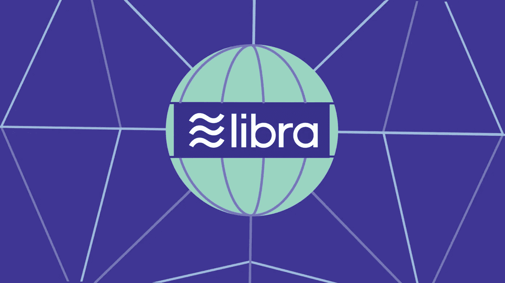
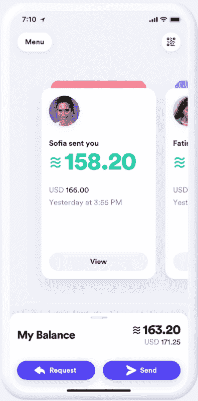
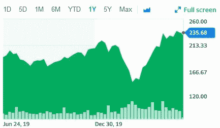

# 天秤座到底是什么？

> 原文：<https://medium.datadriveninvestor.com/what-exactly-is-libra-682f87b2c094?source=collection_archive---------18----------------------->

## 一个进化的比特币？

前两天，我偶然看到一篇令人惊讶的文章，它确实引起了我的好奇心。我读到脸书正在开发一个名为 Libra 的加密货币系统，它有可能取代我们所知的实物货币。

在这篇文章中，我想回答两个问题。

天秤座是什么，为什么要了解它？

Libra 是一种加密货币，可以让你以近乎零的手续费买东西或送钱给人。这将在任何可互操作的钱包和脸书自己的钱包上操作，Calibra 钱包将内置于 WhatsApp、Messenger 和自己的应用程序中。

Libra 将建立在安全、可伸缩、可靠的区块链之上；它将得到旨在赋予其内在价值的资产储备的支持；它将由独立的 Libra 协会管理，该协会的成立是为了管理和发展这个新的生态系统。

这种货币不是像比特币那样相对不稳定的投机资产，而是一种由不同资产储备支持的数字货币。脸书的高管们表示，总有一天，你将能够使用 Libra 支付线上和线下服务。最初，该公司设想 Libra 将主要用于发展中国家无法进入传统银行的个人之间的资金转移。

令人惊讶的是，脸书不是完全控制的人，他们在决策中只有一票，在管理方面，其他投资者包括 Visa、优步和 Andreessen Horowitz 都有同等的投票权。所有公司都在项目运营和工作中投资了 1000 万美元或更多。

据《金融时报》报道，据三位参与该计划的人士称，期待已久的脸书主导的数字货币 Libra 准备最早于 2021 年 1 月推出，但其形式比已经降级的版本更加有限。

发电和采矿 Libra 也将站在积极分子的右边，他们说加密货币采矿行业需要大量的电力和能源，即比特币采矿。

**工作原理**

Libra 将像互联网上的一个数字“钱包”,你可以在里面装入本国货币，并用它来购买脸书或其他允许 Libra 交易的公司的服务和产品。到目前为止，许多世界顶级公司已经批准了 Libra 在其支付和运营系统中的未来使用。PayPal、Stripe、Spotify、优步、Lyft 和沃达丰等公司。这些各自行业的大型庞然大物也将有助于为 Libra association 形成一个储备，这将确保货币得到一些内在价值的坚实支持，而不是像上文提到的其他加密货币那样简单的稀缺性。但最近一个有趣的转变是，一些较大的创始成员似乎已经临阵退缩。最初的 28 个创始成员中有 7 个——占总数的四分之一——在该协会在日内瓦召开首次会议之前退出了。退出的包括 PayPal、T2、易贝、Stripe 以及金融服务巨头 Visa 和万事达。这些成员的离开是巨大的损失，因为他们带来了支付和转移技术方面的专业知识。

Libra 本质上想做的是瞄准世界上没有银行账户的 14 亿人。这些人主要生活在第三世界国家，主要包括拉丁美洲和非洲。如果这次冒险成功，这将是脸书相对较小的历史上最具突破性的时刻之一，更不用说世界了。它可以为现有的银行系统提供一个令人信服的替代方案，尤其是对那些甚至没有正常运作的银行的发展中国家的人们来说。它还可能让脸书与其用户的生活密不可分——在美国和海外监管机构呼吁拆分该公司之际，这是该公司的一项首要任务。

我想到了脸书将如何从中获利的问题，所以基本上脸书将拥有大约 10 亿人的账户信息和交易信息。

其次，为了从货币意义上获益，脸书推出了自己的子公司 Calibra。Calibra 在一个典型的人的生活中会起到与西联汇款、Venmo、他们的支票账户和(多种用途的)现金的组合相同的作用。这将不同于通过 Facebook Messenger 已经拥有的支付系统偿还某人，因为你将无缝转移一种安全的数字货币，而不是发送信息供银行处理并以美元形式吐出。

该公司不会收取竞争对手收取的交易费——这将使他们成为一大块零钱——所以金钱首先或最重要的不是唯一的目标。据 The Verge 报道，扎克伯格没有提到 Libra 是否会收取交易费——这是人们为什么喜欢去中心化加密货币(没有这些货币)的一个关键部分，也是他的项目(没有去中心化，因此可以)的一个关键问题。有各种各样的文章说扎克的野心就像一个运营中的政府，他试图在提供全球基础设施和免费基本 Wi-Fi 方面影响世界各国政府，所有这些都由脸书提供。从而试图使我国近三分之一的人口依赖脸书满足其几乎所有的基本需求。Libra 本质上将通过提高数字广告的价格来为脸书赚钱。

今天你能为天秤座做些什么？

你今天不能买天秤座，但是你可以买脸书的股票。这是它去年的表现。

从 193 美元到 235 美元:一年内**上涨了 18%。总的来说，现在跳上天秤座过山车并确保你的赌注还不算太晚。一旦金融多米诺骨牌开始倒下，天秤座开始为主流公众所用，脸书的股票就会像火箭一样飙升。所有这些谈话中唯一的缺陷是，天秤座仍然只是理论上的，现在没有人真正使用它，我们不知道它需要多长时间才能成为现实。根据情况变得有多糟糕，我们普通投资者可能需要在世界任何地方快速方便地转移资金。这只有在天秤座的帮助下才有可能实现。**

一方面，我对 Libra 的整个迷人的想法有点怀疑，我特别不满意的是，它并不一定是分散的，但另一方面，所有这些都是由 Libra 协会的 Mark 和他的团队完成的，而不是一些随机的银行，因为我觉得 Mark 的团队在推出新货币方面比任何国家银行都更成功。

最初的发布将只在美国和一些拉丁美洲国家进行。消息人士称，最终目标是使用人民币提供跨平台支付系统。