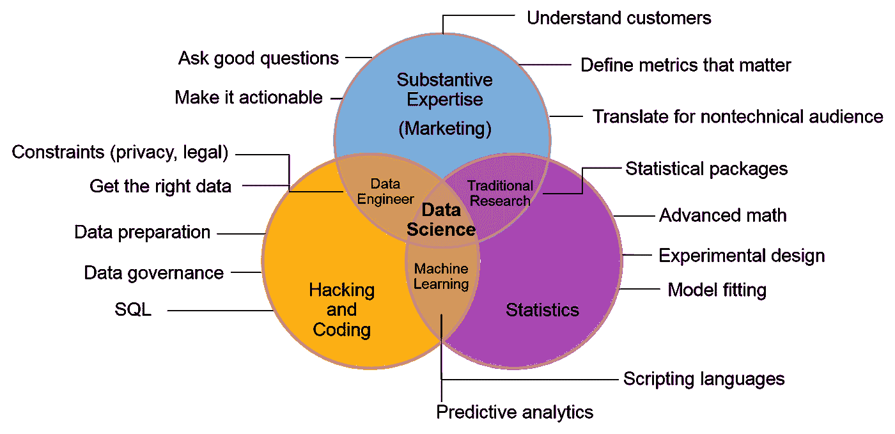

# 数据科学让你兴奋的是什么？

> 原文：<https://medium.datadriveninvestor.com/what-excites-you-about-data-science-2d2a42041cf2?source=collection_archive---------2----------------------->

尽管艰难，但有些东西让我坚持下来。数据科学声望很高。

Photo by [Hans-Peter Gauster](https://unsplash.com/@sloppyperfectionist?utm_source=unsplash&utm_medium=referral&utm_content=creditCopyText) on [Unsplash](https://unsplash.com/s/photos/research?utm_source=unsplash&utm_medium=referral&utm_content=creditCopyText)

当企业第一次遇到数据科学家时会发生什么。一次简短但有见地的谈话。

BU:早上好，很高兴见到你，blaah，blaah…好的，让我想想，我可以看到 X 产品的一些趋势，我相信如果我们能建立一个系统来预测 X 产品的未来销售，这将是我们公司的一大进步。

DS:嗯，听起来很有趣。你是怎么做到的，我的意思是你有分析还是你的话是基于直觉？

BU:嗯……是的，主要是我的直觉，也许是我对事物运作方式的偏见……

DS:(思考，分析，直觉…)我承认你的思维中可能存在缺陷，这让你在与数据科学家可以得出的冷酷事实相比时处于劣势。我在这里帮助你分析过去的数据，找出预测未来销售的有用模式。

 [## 成为数据科学家所需的 8 项技能|数据驱动型投资者

### 数字吓不倒你？没有什么比一张漂亮的 excel 表更令人满意的了？你会说几种语言…

www.datadriveninvestor.com](https://www.datadriveninvestor.com/2019/02/07/8-skills-you-need-to-become-a-data-scientist/) 

布:我不确定，我理解你…

采用数据科学应用程序的最大障碍之一是业务用户缺乏信任。虽然机器学习模型可能非常有用，但许多业务用户不信任他们不理解的流程。

因此，良好的沟通技巧至关重要，以便能够用简单的语言解释模型并传达结果。

除了拥有与领域专家(通常是业务用户)有效沟通的良好技能之外，数据科学家还拥有更强的技术专长，尤其是在计算机编程、系统工程和统计方面。数据科学很难，成为一名优秀的数据科学家需要时间。它是硬技能(如数学、计算机科学)、软技能(如商业和沟通技能)等的结合。

# 数据科学家的技能组合:

*   大量的数学，尤其是统计学，所以如果你已经有一段时间没有上大学水平的统计学课程了，一定要复习一下。
*   机器学习。这是推动当今大部分数据分析的引擎。
*   学习编码。数据科学家中缺乏优秀的编程技能。如果你知道如何编码，把你的技能提高到一个新的水平，你一定能够建立自己的系统和算法。
*   大量的练习。业余时间练习。将您的激情项目转化为数据科学项目。寻找值得一试的公共数据集。一个好的开始是 [Kaggle](http://www.kaggle.com) 或[谷歌数据集搜索](https://toolbox.google.com/datasetsearch)。
*   写作，大量的写作。高效地写报告，写科学论文作为交流概念、想法和结果的一种方式。开始写你感兴趣的话题。尝试向非此背景的人解释数据科学概念。
*   思想要开放。新技术不断涌现，人工智能(AI)和机器学习(ML)在我们生活中的持续渗透正在塑造未来。关注跨学科领域，有很多东西要学。自科学诞生以来，思想开放是任何科学家的关键特质。数据科学有很多研究工作。

# 为什么这么刺激？

我在硬科学上花了很多年，我的背景是物理学和计算机科学，我在软件工程和系统架构上有很多年，我敢说软件开发人员擅长给想法赋予生命，他们就像艺术家一样。即使你不详细解释，他们也能描绘出画面(想法)。他们的工作除了需要逻辑和分析能力之外，还需要创造性的技能。当然，自学、自我成长的技能总是受欢迎的，而且对开发人员来说是如此重要。

Photo by [Dustin Tramel](https://unsplash.com/@dustintramel?utm_source=medium&utm_medium=referral) on [Unsplash](https://unsplash.com?utm_source=medium&utm_medium=referral)

如果我们得到一份软件工程师的工作，并让它充满快乐

*   从无信息的原始数据中发现新的见解
*   化繁为简(易懂)，加强沟通
*   无限的学习机会，数据科学涵盖了如此多的主题(多样性),有一点可以肯定的是，不会缺少学习新事物的机会
*   工作的多样性
*   赋予数据生命，从数据收集、模型构建到信息仪表板

有人可能会问自己

“我能否看到自己在一个快速发展和不断变化的领域成长，这个领域将在各个方面挑战我？我能接受变化并尽快适应吗？”

如果是这样，那么这个职业适合我…欢迎加入。

# 数据科学的下一步是什么？

自动化，是的，数据科学生命周期几个阶段的自动化。他们在数据预处理方面的许多不那么具有挑战性的工作以及在机器学习和人工智能方面的挑战性工作将被自动化，在这方面已经取得了很多进展，参见[谷歌的 AutoML](https://cloud.google.com/automl/) 、 [Auto-WEKA](https://www.automl.org/automl/autoweka/) 。

**人工智能能取代数据科学家吗？**

这可以使他们的工作容易得多。因此，未来的数据科学家可以更加专业化，解决最关键和最复杂的业务挑战，帮助他们的业务实现革命性的飞跃。

**AI 能取代程序员吗？**

这可以使他们的工作容易得多。人工智能将影响软件工程，但创造实际的、值得生产的代码需要时间。

**AI 能取代艺人吗？**

这可以使他们的工作容易得多。由情绪驱动的创造力可以自动化吗？

自动化将人类从平凡的任务中解放出来，使其反应更灵敏、更有创造力、更主动。希望数据科学能给行业的许多领域带来许多好处。