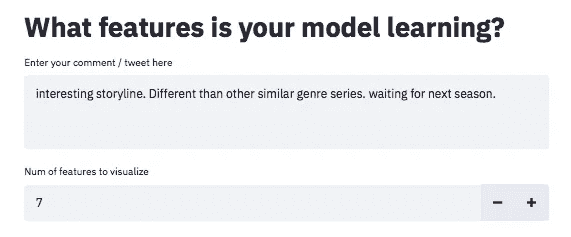
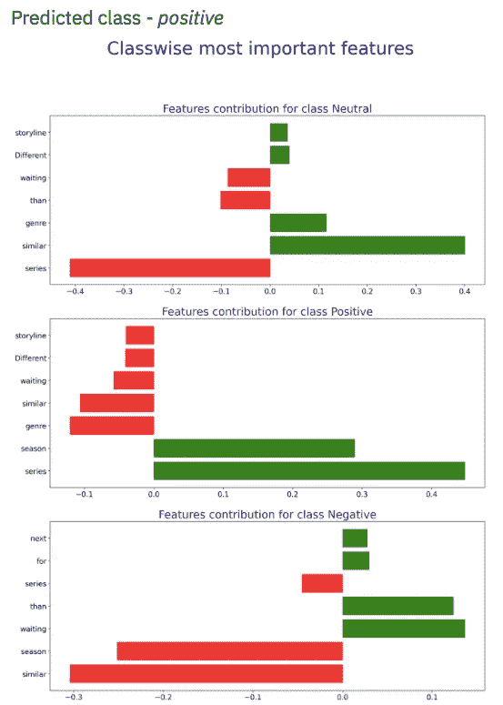

# 你的 ML 模型从文本输入中学到了什么特性？

> 原文：<https://medium.datadriveninvestor.com/what-features-does-your-ml-model-learn-from-text-input-52e36c31d2df?source=collection_archive---------10----------------------->

Photo by [Ross Sneddon](https://unsplash.com/@rosssneddon?utm_source=medium&utm_medium=referral) on [Unsplash](https://unsplash.com?utm_source=medium&utm_medium=referral)

# 目标

这篇文章的目的是帮助你理解如何识别你的 ML 模型从文本输入中学习的特征，并理解预测它所做的类别背后的原因。

# 背景

有助于可视化文本特征的网络应用程序建立在情感分析包的基础上。虽然核心包处于非常基础的开发阶段，但这篇文章的重点是了解你的模型学习有哪些特性。

# 成分

Sentipy 依赖于几个开源组件。以下是构建模块:

1.  空间—文本处理
2.  Spacy Textcat-senti py 利用 Spacy 的 text cat 组件和混合架构进行情感分类
3.  石灰——用于识别和可视化学习到的特征
4.  简化—创建网络应用

这里有一个数据流程图，提供了有关步骤的快速概述

sentipy data flow

我们只关注这些组件的应用。对于所有好奇的人，如果你想了解石灰是什么以及它是如何工作的，我提供了几个链接:

1.  Abhishek Sharma 的博客—[https://towards data science . com/decrypting-your-machine-learning-model-using-lime-5 ADC 035109 b5](https://towardsdatascience.com/decrypting-your-machine-learning-model-using-lime-5adc035109b5)
2.  LIME Github—[https://github.com/marcotcr/lime](https://github.com/marcotcr/lime)
3.  LIME 作者的博客—[https://homes.cs.washington.edu/~marcotcr/blog/lime/](https://homes.cs.washington.edu/~marcotcr/blog/lime/)
4.  建造石灰的原始纸张—[https://arxiv.org/abs/1602.04938](https://arxiv.org/abs/1602.04938)

# 如何使用`sentipy`

1.  git 克隆了 https://github.com/sagard21/sentipy 的回购协议
2.  创建新的 conda /虚拟环境
3.  通过在终端上运行命令`setup.py install`来安装 sentipy
4.  在终端上运行以下命令启动可视化工具— `sentipy streamlit`

# 一瞥

下面是一些来自`sentipy`特性可视化工具的截图

图 1-文本和要可视化的特征数量。目前，最大功能限制为 7 个

图 2-预测类和图表

上图摘自我让我妻子为她最近看的一部网络连续剧写的一篇评论文章。很高兴分类器工作良好:D

# 最后的想法

仍是一项进行中的工作，还有许多进展有待取得。然而，streamlit 应用程序 MVP 已准备就绪，可用于识别基础模型学习到的功能。github 中的 readme 文件列出了接下来的一些改进。

 [## ML 中的数学:余弦相似度|数据驱动的投资者

### 在机器学习中，我们经常将两个向量之间的相似性表示为余弦相似性。到底是什么…

www.datadriveninvestor.com](https://www.datadriveninvestor.com/2019/11/20/the-math-in-ml-cosine-similarity/) 

如果你有任何关于如何改进这个包的想法，请留言。非常欢迎您的反馈。

# 其他参考资料和来源

1.  Spacy — [https://spacy.io](https://spacy.io)
2.  streamlit—[https://www . streamlit . io](https://www.streamlit.io)

**访问专家视图—** [**订阅 DDI 英特尔**](https://datadriveninvestor.com/ddi-intel)