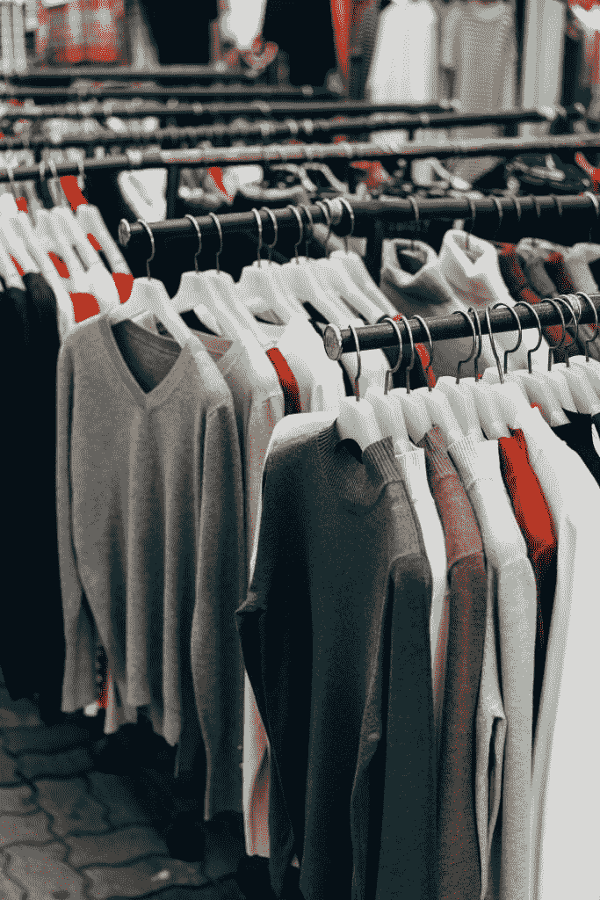
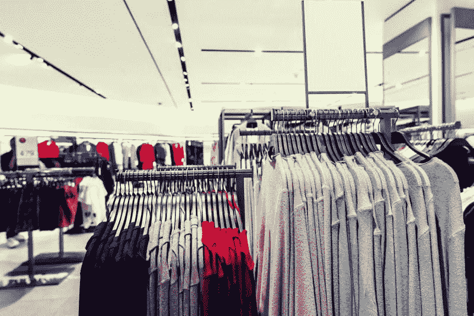

# 塔吉特百货(纽约证券交易所代码:TGT)有什么未来？—市场疯人院

> 原文：<https://medium.datadriveninvestor.com/what-future-does-target-nyse-tgt-have-market-mad-house-b6f619259374?source=collection_archive---------21----------------------->

塔吉特百货(纽约证券交易所:TGT) 可能没有未来，因为冠状病毒正在摧毁美国的实体零售业。

例如，美国商务部估计，2020 年 4 月美国零售额将下降 16.4%，*商业内幕*。继 2020 年 3 月暴跌 8.3%之后，股市再次下跌。荷兰国际集团首席国际经济学家詹姆斯·奈特利估计，美国整体零售额在两个月内下降了 23%。

塔吉特处境危险，因为服装店的销售额下降了 78.8%，电子和家电商店的销售额下降了 60.6%。服装和电子产品是塔吉特百货的主要产品。然而，人们并没有购买它们。

 [## 投资区块链前要问的三个简单问题(也是一个困难的问题)|数据…

### 现在是了解区块链的最佳时机。不同货币之间的增长率，比如…

www.datadriveninvestor.com](https://www.datadriveninvestor.com/2020/03/12/three-simple-questions-and-one-difficult-one-to-ask-before-investing-in-a-blockchain/) 

# 冠状病毒能帮助靶向治疗吗？

冠状病毒可以通过杀死竞争对手来帮助**瞄准(纽约证券交易所:TGT)** 。

例如， **JC Penney(纽约证券交易所代码:JCP)** 于 2020 年 5 月 15 日申请第 11 章破产。引人注目的是，一些分析师认为 JC Penney 再也不能赚钱了，美国消费者新闻与商业频道。塔吉特百货还在营业时，彭尼的所有商店都关门了。

目标商店是开放的；然而，因为塔吉特百货出售包括杂货在内的必需品。值得注意的是，4 月份美国所有食品杂货销售额增长了 13%。另外， **CVS Health (NYSE: CVS)** 在部分目标门店经营药店。

美国消费者新闻与商业频道称 JC Penney 是塔吉特百货的直接竞争对手。不仅仅是彭尼有麻烦。**诺德斯特龙(纽约证券交易所:JWM)** 计划关闭 16 家门店， *Market Mad House* 。J. Crew Group 和 Neiman Marcus 也已经申请破产。

因此，冠状病毒终结后，Target 面临的竞争可能会减少。冠状病毒可能摧毁的其他目标竞争对手包括西尔斯、**迪拉德(NYSE: DDS)** 、**美国柯尔百货公司(NYSE: KSS)** 和**梅西百货(NYSE: M)。**

# 冠状病毒能杀死目标吗？

冠状病毒威胁 Target 因为 4 月美国电商销售额增长 20.5%*数字商务 360* 。

特别是，在截至 2020 年 5 月 2 日的四周内，消费者包装商品的在线销售额增长了 45%。这个数字对塔吉特来说可能是个好消息，因为它包括了杂货店销售的商品。

相反，据数字商务 360 估计，这一类别的总支出下降了 5.9%。因此，人们在网上购买的东西越来越多，但花费却越来越少。

# Target 能和亚马逊竞争吗

不幸的是，大部分销售增长都流向了塔吉特最危险的竞争对手**亚马逊(NASDAQ: AMZN)** 。2020 年第一季度，亚马逊全球销售额增长 26%，*数字商务 360* 。

此外，科罗纳夫留斯可以让亚马逊变得更强大。杰夫·贝索斯承诺将 Everything Store 40 亿美元的营业利润全部投资回公司。亚马逊报告截至 2020 年 3 月 31 日的季度毛利为 311.95 亿美元。

贝佐斯在一份新闻稿中写道:“相反，我们预计将把这 40 亿美元全部花在与 COVID 相关的费用上，或许更多，以便将产品送到客户手中，并确保员工的安全。”。因此，贝佐斯正在通过提高亚马逊对冠状病毒和未来疫情的抵抗力来加强亚马逊的运营。

因此，亚马逊可以因为冠状病毒赚更多的钱。具体来说，亚马逊可以在未来大流行导致实体店关门的情况下运营。

# 冠状病毒会让亚马逊变得更大更强

值得注意的是，亚马逊在 3 月和 4 月雇佣了 175，000 名新员工。因此，亚马逊在扩张，而冠状病毒关闭了其他零售商。

因此，当冠状病毒消退时，塔吉特将面临一个更大、更强、更坚韧的亚马逊。此外，更大更强的亚马逊将为秋季和冬季新的冠状病毒爆发做好准备。

理查德·雷德菲尔德博士预计 2020 年秋天和明年冬天冠状病毒会爆发得更厉害。雷德菲尔德是疾病控制和预防中心的主任。

# Target 能和亚马逊竞争吗？

因此，随着冠状病毒的回归，亚马逊的业务可能会在秋季以牺牲塔吉特的利益为代价实现增长。在截至 2020 年 5 月 16 日的一段时间里，冠状病毒感染了 148.6 万美国人，导致 88，557 名美国人死亡。

Target 现在很难和亚马逊竞争。我不得不怀疑 Target 能否与一个更大更强的亚马逊竞争。

特别是，亚马逊投资了 15 亿美元，通过在城市附近建立一个规模较小的履行中心网络来扩大当天送货范围，geek wires . 35 美元以上的优质订单当天送货免费，35 美元以下的订单收费 2.99 美元。亚马逊为其送货服务订购了数万辆货车。

亚马逊能够承受这种扩张，因为它在 2020 年 3 月 31 日拥有 492.92 亿美元的现金和短期投资。相比之下，Target 在 2020 年 1 月 31 日有 25.77 亿美元的现金和短期投资。因此，我认为塔吉特无力与亚马逊竞争。

我预测亚马逊会摧毁 Target，因为它有更多的资源，争夺 Target 的客户。特别是，亚马逊将服务于家中所有的中产阶级家庭冠状病毒陷阱。我预计，这些顾客中的许多人在习惯了从 Prime 购买所有东西后，将永远不会回到塔吉特百货这样的大卖场。

# Target 赚钱了吗？

**Target(纽约证券交易所:TGT)** 在截至 2020 年 1 月 31 日的季度中，收入为 233.98 亿美元，毛利润为 63.42 美元。

**Target(纽约证券交易所:TGT)** 在截至 2020 年 1 月 31 日的季度中，收入为 233.98 亿美元，毛利润为 63.42 美元。

然而，Target 报告 2020 年 1 月 31 日的短期投资为 25.77 亿美元。因此，塔吉特产生了大量的现金，却很少保留这些现金。

因此，我认为塔吉特的商业模式存在缺陷，因为它无法产生足够的现金来抵御冠状病毒。相反，亚马逊正在产生令人难以置信的大量现金。例如，**亚马逊(NASDAQ: AMZN)** 报告 2020 年 3 月 31 日的期末现金为 275.05 亿美元。

# 目标没有安全边际

我认为 **Target(纽约证券交易所代码:TGT)** 在今天的零售环境中没有安全边际，因为它缺乏现金。与亚马逊不同，塔吉特无法承担建设数十个新的履行中心、雇佣数万名送货司机以及让数万辆送货车上路的费用。

因此，我预测，在亚马逊业务扩张的同时，塔吉特百货将不得不关闭门店并裁员。冠状病毒结束后，Target 可能会发现自己没有客户。

# 投资者需要避免目标(纽约证券交易所:TGT)

我认为投资者需要避免目标股票，因为安全边际很低。此外，我认为市场先生在 2020 年 5 月 20 日将**目标公司(纽约证券交易所代码:TGT)** 定价过高，为 119.63 美元。

反过来，我觉得 Target 是优秀的分红股。例如，目标股票将在 2020 年 5 月 19 日支付 66₵股息。令人印象深刻的是，Dividend.com 以 52 年的股息增长为目标。总体而言，2020 年 5 月 20 日，每股目标股票的股息收益率为 2.11%，年化股息为 2.64 美元，股息支付率为 5.28%。

归根结底，我认为目标股票提供的唯一价值是股息。因此，我建议投资者避开塔吉特，因为我认为股息和塔吉特的商业模式在冠状病毒时代是不可持续的。

*原载于 2020 年 5 月 20 日 https://marketmadhouse.com**的* [*。*](https://marketmadhouse.com/what-future-does-target-nyse-tgt-have/)