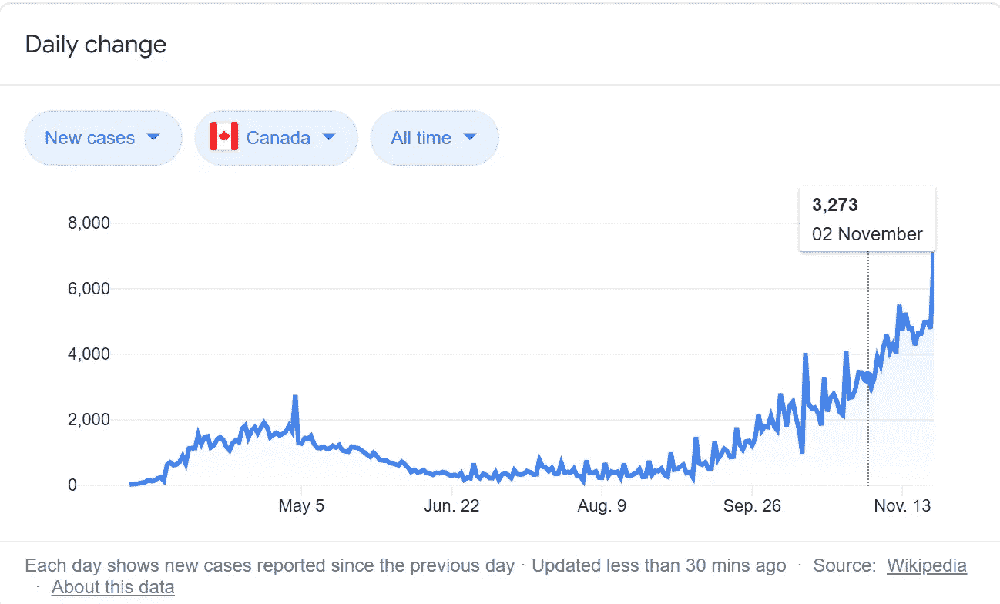
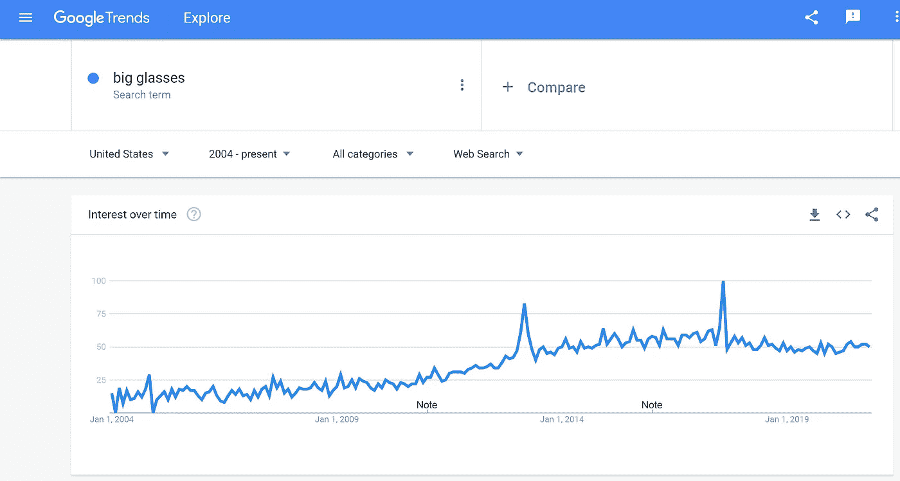
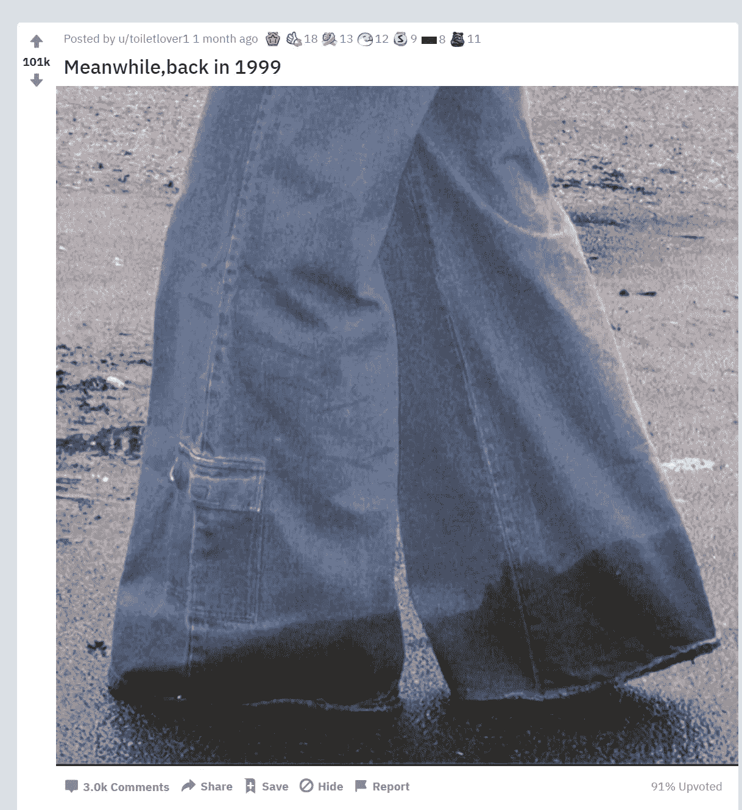
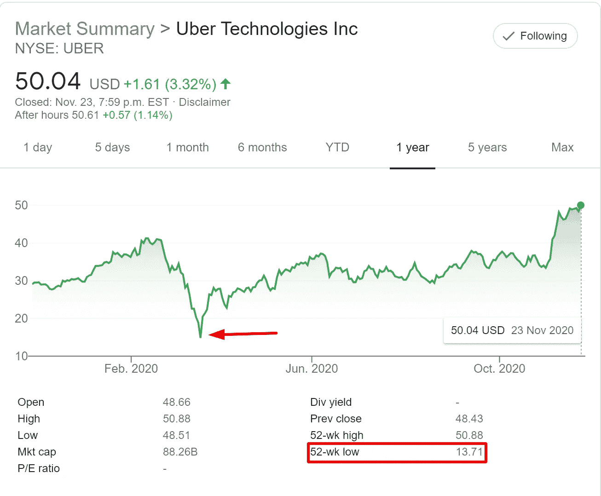
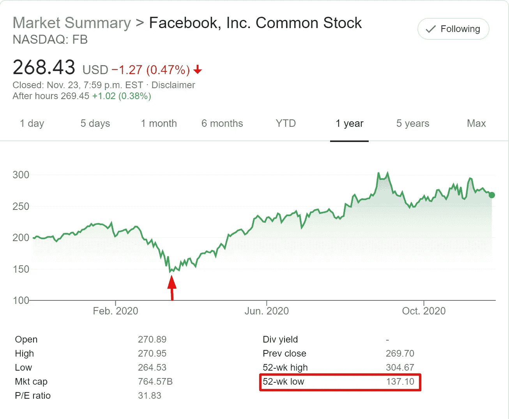
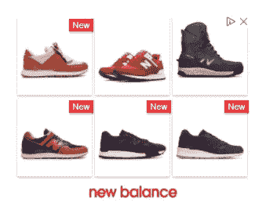
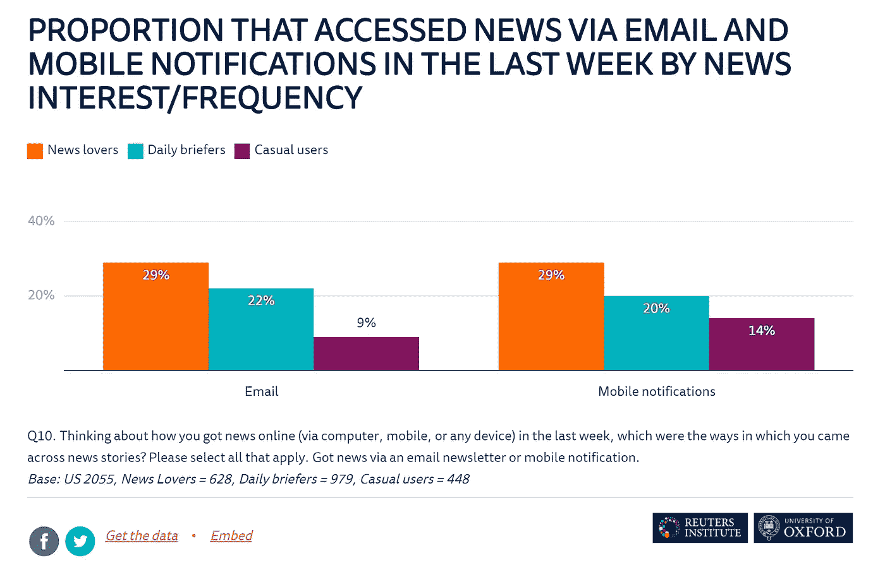
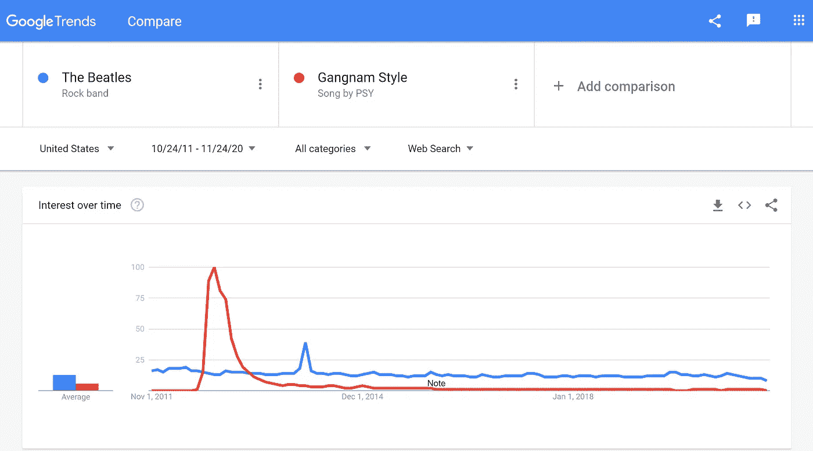

# 因果报应(趋势)

> 原文：<https://medium.datadriveninvestor.com/what-goes-around-comes-around-trends-2b150e9dcac0?source=collection_archive---------10----------------------->

时尚、商业、营销，甚至病毒

***“转来转去，转来转去
一路转回来。”*贾斯汀·汀布莱克**

几天前我和一个女孩聊天(她很漂亮，显然不是单身)，我给她发了一个 Reddit 帖子，这是我在数小时的浏览后看到的。这让我思考那些会回来的好趋势，以及那些不会回来的趋势。

看看 COVID 就知道了。早在 5 月份，它在大多数国家首次达到峰值。然后，在 6 月和 7 月有所下降，然后，报告的病例又开始上升。虽然，这似乎是一种“周而复始”的趋势，但我相信 COVID 是一种无法长期持续的东西。生活会变得更好，慢慢地，我们会忘记它(在全球范围内接种疫苗后)。它迟早会消失的。

Covid cases in Canada. Source: Wikipedia.

然而，有时候，即使是好的东西和好的趋势也会在时间中迷失，但最终，慢慢地，它们会找到回到这个世界的路。让我们来看看这些趋势，它们来了，征服了，遭受了打击，然后又回来了。

# **时尚**

一篇围绕“恶有恶报”的文章不得不谈到时尚。想一想；你有没有遇到过，你过去绝对鄙视某个时尚潮流或配饰，然后，因为它突然变得“新潮”而最终用上了？

个人认为，发生在我身上的有**【大眼镜】**。当我 8 岁的时候，我爷爷经常戴着大屁股全框眼镜。我(根本)不喜欢他们的样子。8 年过去了，突然间，每个人都开始谈论他们。超大的眼镜会一直留在那里。

Source: Google Trend. Breakout in 2013 for our search term.

同样，宽牛仔裤的时尚也从来没有真正过时过(不像极度超大的 rap-fashion-服装。还记得 Soulja Boys 吗？).我的意思是，当然，有某些起伏，某些打嗝，但通常，总会有一些东西永远不会过时。而且，如果它们真的过时了，它们会重新回到我们的生活中。

Reddit post that I shared with a friend

匡威全明星永远不会过时。经典的面包车将永远是时尚的。模拟手表、非品牌 t 恤、黑色牛仔裤，还有很多。一些服装和配饰经得起时间的考验。它们简单明了，但仍然有效。他们的优雅和时尚在于他们提供的简单。

它们可能在外观上很普通，但在功能上却不一样。可用性和有效性不容置疑的这些东西打败了世俗的东西(即使在某种程度上它们本身可能是世俗的)，因此，它们以某种方式存在。

# 商业

就像一些时尚配饰一样，也有一些商家只是**停留**。无论如何，他们的基础是如此强大，以至于每个人都知道这些公司将会胜出。

你从来不谈论谷歌或苹果被取代，或者麦当劳不能卖汉堡，或者耐克发现很难赞助顶级人才。你永远不会听到这样的事情(至少在你有生之年不会)。

 [## 商务沟通不畅是网络安全问题的 5 个原因|数据驱动型投资者

### 沟通是商业的命脉。没有协作就不会有想法，没有合作就不会有交易

www.datadriveninvestor.com](https://www.datadriveninvestor.com/2020/09/01/5-reasons-why-poor-business-communication-is-a-cybersecurity-issue/) 

废话少说，让我们来看看一些在商业领域比较安全的公司。在这些公司的旅程中，曾经有一段时间，人们开始评判它们的基础，但它们反弹了。

看看优步吧。

Uber stock price (1 year)

看看现在的脸书。

Facebook stock price (1 year)

当新冠肺炎受到冲击时，脸书和优步的股票价格暴跌(和许多其他公司一样)。在那段时间里，可能有两种人。极度恐惧和厌恶风险的人，以及能够区分永久趋势和暂时趋势的人。能做到后者的人可能会赚很多钱。

这些公司注定会复苏。他们的股票下跌，在地板上停留了一段时间，但最终又上涨了。为什么？好的基础支撑的好的商业模式。当你把事情做对了，就会有好报，嗯？

基本上，我试图暗示，在这个例子中，优步和 FB 在疫情之前都做得很好，然后一些不确定性以 COVID 的形式出现，但最终，股价恢复到正常水平(甚至高于疫情之前的平均水平)。有些趋势是好的。他们回来了。

# 营销

文章最喜欢的部分(很明显)。

很久以前，市场营销曾经完全基于许可。然后，互联网时代来了，我们专注于打断潜在客户。营销变成了一场激烈的竞争，当这种情况发生时，会有很多混乱。杂乱的一个大问题是它不是个性化的。感觉不像人类，因为每个人都在用同样的方式做这件事。

## 1.个性化营销-动态再营销

为了脱颖而出，企业正在回归更个性化的营销方式。个性化给营销信息带来了一种感觉良好的因素。尽管大部分工作是通过电子邮件完成的，**动态再销售的某些部分也可以(并且应该)被标记为“个性化的”**。

它是相关的，并为每个客户量身定制。它只显示你可能感兴趣的产品/服务。

以下是谷歌对此的看法:

> “动态再营销更进了一步，让你向以前的访问者展示包含他们在你的网站上浏览过的产品和服务的广告。通过为您的受众量身定制的信息，动态再营销将以前的访问者带回您的网站以完成他们开始的事情，从而帮助您建立线索和销售”(来源:[谷歌支持](https://support.google.com/google-ads/answer/3124536?hl=en)

动态再销售看起来是这样的:

NB dynamic remarketing (Source: [Wordstream](https://www.wordstream.com/blog/ws/2018/01/26/adwords-remarketing-changes))

就像有些东西永远常青一样，动态再营销是一种永远不会过时的策略。它会一直存在。

## 2.电子邮件营销和时事通讯的回归

随着营销领域所有新技术的流行，电子邮件营销似乎有点老派。年轻的公司和创业公司并不热衷于使用电子邮件营销，因为这似乎是一个老生常谈。

剧透:不是。

如果你看看过去 5 年在谷歌趋势上对主题“电子邮件营销”的搜索，你会发现 2018 年 12 月出现了一次不寻常的下降，然而，正如我多次说过的那样，这些下降并没有给你更大的画面。

电子邮件营销一直非常有效，因为:

1.  是最个性化的营销方式。
2.  它是所有渠道中转化率最高的
3.  这是一种基于许可的营销形式，因为人们选择接收促销信息和优惠
4.  92%的互联网用户至少有一个电子邮件账户

根据麦肯锡进行的一项研究，**电子邮件营销的效率是社交媒体的 40 倍。同一项研究还显示，**购买过程比社交媒体**(来源:[数字代理网络)](https://digitalagencynetwork.com/email-marketing-still-effective-strategy/#:~:text=Email%20marketing%20is%20up%20to,faster%20than%20in%20social%20media.&text=According%20to%20the%20Fourth%20Source,at%20least%20one%20email%20account.)快 3 倍。甚至以我的经验来看，**一个电子邮件活动能产生最高的$$$** 。**

同样，愿意阅读时事通讯的人也在增加。这也是我开始写一本的原因。我是一名营销人员，我注意趋势。

电子邮件简讯被认为是一种老式的与人建立关系的方式，然而，老式的东西是老式的永远不会过时。非品牌 t 恤？模拟手表？).

路透社新闻研究所 做了一项关于“**”的研究。**

****时事通讯提供了一种阅读精彩文章/博客和接收他们感兴趣话题的新闻的方式。****

****

**Emails are a great source for news lovers and daily briefers. (Source: Digitalnewsreport.org)**

****它提供了一种不杂乱、相关、干扰少的阅读方式**。这比浏览网站和博客，却被网页上发生的无数其他事情(比如广告)分散注意力要好。**

**电子邮件对于新闻爱好者和每日简报者来说很棒，但对于临时用户来说就不那么好了。难怪**《每日邮报》****《纽约时报》**都有电子邮件简讯。难怪 [**Substack**](https://substack.com/) 这种帮你开简讯的公司估值不断上涨。难怪 **Insider Inc.** 以大约**7500 万**美元收购了一份名为 [**Morning Brew**](https://www.morningbrew.com/) 的电子邮件简讯。**

**所有这些都是趋势。我相信这种趋势会持续下去。就像人工智能聊天机器人永远无法完全取代客服代表一样，一些趋势永远不会被取代。**

**人们喜欢简单。简单就是优雅。简单是人道的。人们喜欢人情味(这也是新冠肺炎反击的原因)。**任何简单有效的东西都不可能过时，即使过时了，它也会(再次)回来**。**

**有时候在商业世界里，退一步回到基础是一个有效的策略。听说过品牌重新推出他们的旧风格吗(比如大众重新推出他们标志性的甲壳虫)。 ***恶有恶报，恶有恶报。*****

**想成为《江南 Style》的潮流或者披头士，就看你自己了。**

****

**Gagnam Style vs. The Beatles**

## **访问专家视图— [订阅 DDI 英特尔](https://datadriveninvestor.com/ddi-intel)**