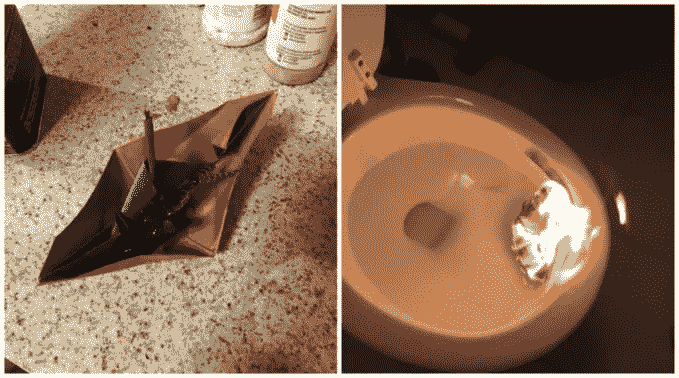

# 关于扼杀创新项目，金鱼能教会我们什么

> 原文：<https://medium.datadriveninvestor.com/what-goldfish-can-teach-us-about-killing-innovation-projects-2bcfdca7bad2?source=collection_archive---------30----------------------->

**“我们不擅长扼杀创新项目”**

在过去的两天里，跨越两个不同行业的两家不同公司的三个人对我说了这些确切的话。

如果解决问题的第一步是承认你有问题，那么我的客户应该对取得进展感觉良好。

但是第二步是什么？

“扼杀项目”是一个明显且根本无益的答案。但是在我们找到不太明显且有助于行动的答案之前，我们需要承认一个关于人类的事实

## **我们用心决定，用头脑证明，需要勇气去行动。**

尽管我们愿意相信，作为人类，我们是有逻辑的，以事实为导向的，但事实并非如此。如果是的话，我们就不会被品牌所左右，我们会在最佳餐厅、音乐和政治候选人上达成一致。

信念、价值观、情感和联系(我们的心)驱动着我们的行为。我们选择有助于我们以某种方式感受、创造某种感知或表明我们属于某个群体的事物。正如克莱·克里斯腾森所说，我们选择解决情感和社会问题的事情去做。

然后，我们发现或寻求事实和证据来证明我们内心所做的决定是正确的。我们希望变得合乎逻辑和理性，做出“最佳选择”，并且能够用我们的观点来影响人们。我们用头脑来证明我们的心。

但仅此还不够。我们不做我们知道应该做的事情(使用牙线、吃蔬菜、保持对创新的长期投资)。我们做我们想做的事情，即使我们知道我们不应该这样做(吃很多糖，喝很多酒，狂看任何以“真实家庭主妇”开头的东西)。

我们需要动力和勇气(胆量)来将我们的需求和想法转化为行动。也许，更重要的是，当我们的头脑和我们的内心不一致时，我们需要勇气来做出决定并采取行动。

因为没有勇气，当头脑和心灵不一致时，心灵总是胜利的。

## **这就是为什么你不擅长扼杀项目。**

这里有一个常见的场景:在一个新产品上工作了几年后，你得到的数据显示它不会“工作”

也许是临床数据表明该产品没有提供所需的功效。或者市场数据显示，客户不愿意以当前价格购买产品，也不愿意购买预期数量的产品来证明投资的合理性。或者基准数据估计你的产品将会在你公司推出的产品中排在最后 5%的位置。

不管它是什么，它不是好的，数据和逻辑都表明这个项目应该被扼杀。

相反，你认为它是“战略性的”,并继续努力。

这是因为，在你心里，你相信这个项目。你是创造它的一部分。你从概念到具体培育它，引导它经历濒死体验，并庆祝它的成功。你喜欢这个项目。

你的心说“继续前进”，而你的头脑说“让它停下来。”

你需要勇气来做决定。

## 这很难决定，但是第二步让它变得简单了。

如果第一步是在你的头脑中知道这个项目是不可行的，无论你做什么都不会达到预期，第二步是找到勇气抵制你的每一个本能，并做出有利于你的头脑的决定。

要找到打电话的勇气，你需要承认你的心，以及激励你再尝试一件事的感觉、情感和信念。

(如果你是一个非常严肃的商业人士，被最后一句话吓坏了，想象一下我写道，“你需要承认你的认知偏差，比如沉没成本谬误，而不是这里发明的偏差，或者[宜家效应](https://www.milezero.io/2020/10/26/ikea-effect-is-creating-zombies-fight-them/)，然后继续读下去)

## **要承认你的内心并赋予你勇气，你需要说再见并创造终结。**

如何有效地做到这一点是由团队和公司的文化决定的，但这里有一些我见过并参与其中的例子:

*   写项目的悼词
*   举行葬礼(传统、新奥尔良、爱尔兰或维京都可以)
*   进行一次“遗嘱阅读”,项目将纪念品和愚蠢的奖励留给团队成员
*   创建一个纪念碑，比如种一棵树，或者借鉴本和杰里的做法，建一个墓地
*   设立一个以其名字命名的奖项，每年颁发给一个有勇气保存并有智慧知道何时放弃的人

是的，我知道这听起来很傻，但是为金鱼举行葬礼也很傻，我们就是这么做的。我们这样做的原因和我们努力扼杀这个项目的原因一样——因为我们热爱它，我们会怀念它。

就像我们感到非常难过，但知道我们在冲洗金鱼时做了正确的事情一样，当你取消这个项目时，你也会感到难过，但知道你做了正确的事情。

虽然这永远不会容易，但它会变得越来越容易，你会越来越擅长扼杀项目(就像我在大学高年级经历了 23 条金鱼后所做的那样)。

*原载于 2020 年 11 月 11 日*[*https://www . mile zero . io*](https://www.milezero.io/2020/11/11/what-goldfish-can-teach-us-about-killing-innovation-projects/)*。*