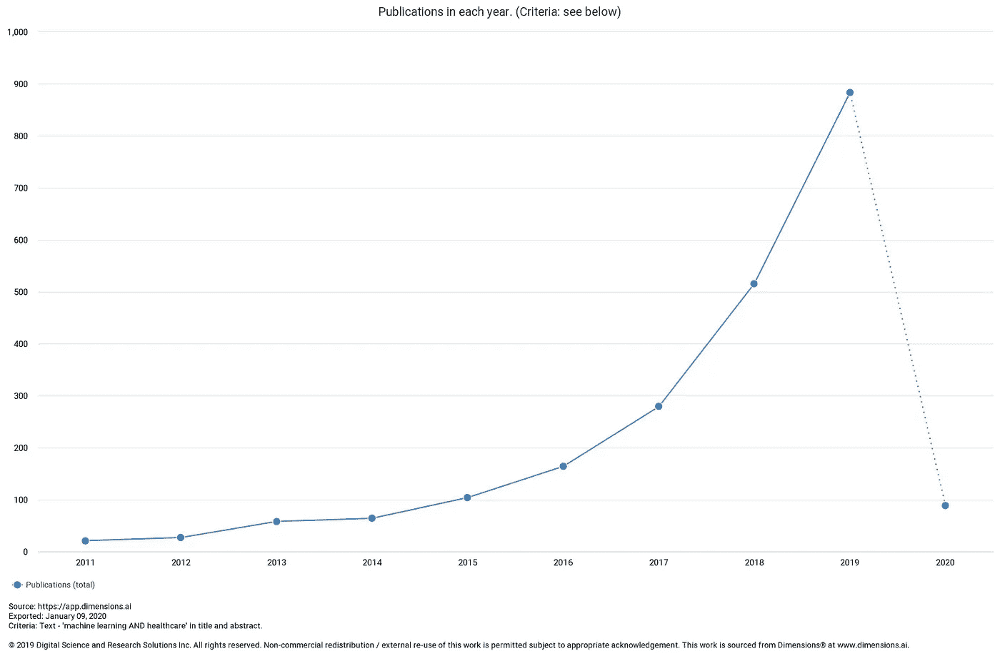
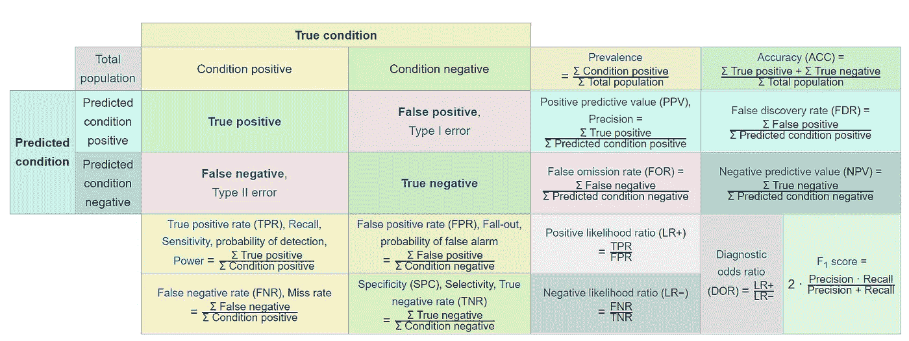
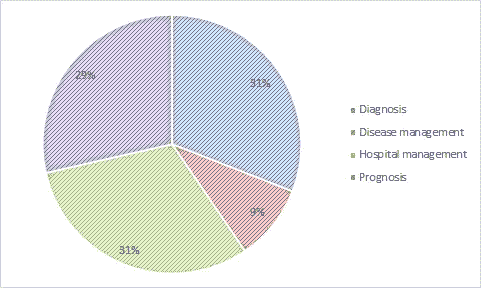
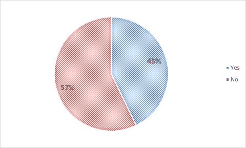
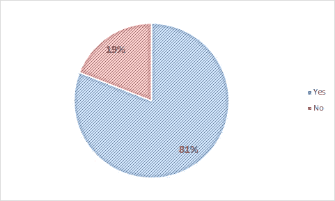
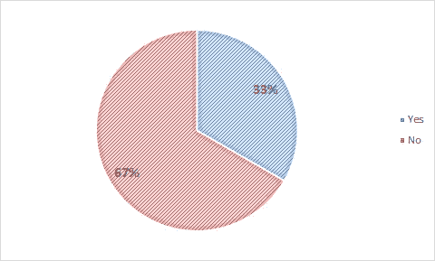
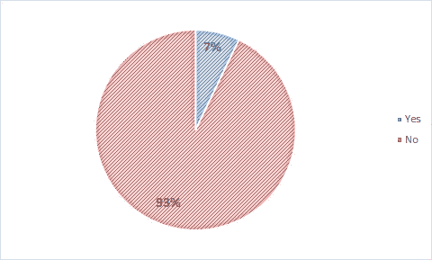

# 2019 年在医疗保健 ML 研究中发表了什么？

> 原文：<https://medium.datadriveninvestor.com/what-got-published-in-2019-in-healthcare-ml-research-bc50e914c3c3?source=collection_archive---------2----------------------->

数据分析是企业界几乎所有领域和学科的新流行语。从战略咨询、盈利电话和会议演讲中，关于数据分析、人工智能和机器学习的提及率一直高居榜首。医疗保健行业作为一个整体对这场派对来说有点晚，主要是因为复杂、分散的医疗保健数据世界。然而，随着电子健康记录(EHR)在世界许多地方的应用，以及移动技术和各种传感器的广泛使用，医疗保健中的数据可用性已经得到了多方面的提高。

这导致了该领域更多的研究兴趣。简单的趋势分析显示，过去几年中，关于机器学习和医疗保健的研究出版物呈爆炸式增长。

Almost 3 articles were published every day on Machine Learning in Healthcare!

由于如此高的出版率和该领域的新生性质，显而易见的问题是许多这些出版物的质量有问题。在这篇文章中，我解释了如何阅读这些文献和常用于评估机器学习算法结果的指标的初级读本，正如 2019 年发表的三篇优秀文章所推荐的那样。随后，我根据这些标准对今年的出版物样本进行了定性审查。

 [## 医疗保健的未来正在被一场大型技术入侵所塑造|数据驱动型投资者

### 过去十年，全球经济的所有部门都经历了大规模的数字颠覆，而卫生部门现在…

www.datadriveninvestor.com](https://www.datadriveninvestor.com/2018/11/02/the-future-of-healthcare-is-being-shaped-by-a-big-tech-invasion/) 

## 如何阅读使用机器学习的文章

这篇由刘等人在《美国医学杂志》上撰写的阅读指南很好地概述了在任何使用机器学习方法的文献来源中应该寻找什么。这些可以大致分为四类，每一类都有助于我们理解研究质量的不同方面

*   **机器学习方法论**:具体方法是怎么选择的？为什么会被选中？这篇文章中有提到这些问题吗？
*   **数据来源和质量**:数据来源是什么？这是疾病区域的代表吗？如果不是，文章中是否指出这是一种限制？研究人员是如何处理缺失数据的？由于数据准备的任何步骤，是否有可能过度拟合？
*   **结果和绩效**:描述了哪种绩效评估？是结果出乎意料还是太好看了？文章是否描述了独立验证，可能是在前瞻性研究中？
*   **临床含义**:这样一个 ML 模型将如何在现实世界的临床环境中实施？如何测量和监控临床效果？

正如你所看到的，这些主题中的每一个都会让我们更好地理解所使用的方法，从而帮助我们以批判的方式阅读这篇文章。

伴随这本精彩指南的是终曲多什-瓦雷兹和罗伊·H·珀利斯的评论，同样重要。

## 评测机器学习文章

Doshi-Valez 和 Perlis 重申了使用机器学习的基础——潜在的假设、模型属性、优化、策略和限制。有必要了解用于验证结果的数据源和正则化技术。

他们还增加了一些考虑因素-

*   **子群**:在算法世界的其他地方，包括医疗保健算法，已经有足够多关于固有种族和性别偏见的辩论。由于算法的复杂性，可能存在隐藏的系统误差，因此任何提供不同亚组结果详细分析的研究文献对于理解训练参数都是至关重要的。
*   **越大不一定越好**:由于数据来源的固有偏差以及所使用的数据准备技术，我们需要小心不要将大验证集等同于更好的模型。
*   临床环境:对于以回顾性研究开始并暗示在临床环境中以前瞻性方式使用的模型，需要进行更严格的审查。在我们开始将它们应用于现实世界之前，了解哪些特征推动了结果，以及它们如何与我们已知的临床/医学知识联系起来，这一点非常重要。

最后一篇文章(M Yu 等人)帮助我们进行了更技术性的评估；关于常用性能评估参数的定义，请参考本[详细介绍此类文献中常用的不同衡量标准](https://bmcgenomics.biomedcentral.com/articles/10.1186/1471-2164-13-S4-S2)。下面的信息图总结了这些术语中的大部分。

From Wikipedia

## 医疗保健中深度学习算法的报告30132-3.pdf)

ML 文献中最常用的性能评估是受试者操作特征(AUROC)、灵敏度(真阳性率/召回率)和特异性(真阴性率)下的面积。AUROC 是通过绘制灵敏度(真阳性率)对假阳性率而获得的。作者正确地指出了这种方法的局限性。通过改变分类阈值，灵敏度、特异性、阳性预测值和阴性预测值将会改变。通常选择分类阈值以最大化信息量，如由 Youden 指数测量的，这是敏感性和特异性的平衡最大化。当出现不平衡数据集时，仅基于 AUROC、灵敏度和特异性的算法性能评估具有局限性。因此，他们根据数据集的性质(即，大量或少量病例)和评估的目的(即，除了检测性能的一般评估之外)，推荐 AUPRC、阳性预测值和阴性预测值作为有用的补充评估。

看完这些指南后，我决定查看一份使用机器学习技术的原始研究文章样本，并应用指南中提出的标准。我在谷歌学术搜索后随机选择了 50 篇文章，对 2019 年发表的所有文章中的“机器学习”和“医疗保健”进行了限制。我只选择了原创研究文章，没有考虑综述文章和荟萃分析。以下是这项工作的结果。

## 应用类型

Articles by Application

这张图表显示了我所分析的研究的范围。诊断(例如，疾病存在是/否)、预后(例如，预测疾病进展)和医院管理(例如，预测资源利用)研究的分布几乎相等。临床决策/疾病管理研究的代表性很低。

## 验证集的使用和选择

Articles by use of independent validation set

令人惊讶的是，57%的研究没有使用独立的验证集。其中，一些研究根本没有指定验证集的使用；一些人随机选择了验证集或者用交叉验证(在训练集中验证)来代替。众所周知，交叉验证在现实世界的“生产”场景中可能不起作用，因此这可能是一个主要缺点。

## 提及你自己研究的局限性

Articles by limitations mentioned

大约 80%的文章都提到了它们的局限性，这是一个好现象。最常提到的限制是，该模型是在单个医院/医疗保健系统内的单个数据集上生成和评估的；这显然会限制其更广泛应用的能力。缺乏更广泛的应用导致了下一个限制，即在大多数情况下缺乏直接的临床应用。一些研究人员对这种局限性直言不讳，但许多人没有明确指出这一点。

Articles by clinical implications in real world setting

大多数文章也没有报道分类为**亚组**的进一步细节。如上所述，通过人口统计学数据和错误率显示结果的亚组分析是模型性能的重要标准。

Articles presenting results/performance in subgroups

在模型性能方面，只有 48%的文章使用了额外的性能指标，如 PPV、NPV 和 F1 值。大约 15%的文章没有提到任何一套完整的度量标准(即只提到了以下一项-敏感性、特异性、准确性)。另一个奇怪的方面是，大多数文章没有报告评估标准的置信区间。虽然计算机器学习算法的置信区间可能很复杂，但它仍然增加了性能评估的价值，因此 Yu 等人都建议增加这些限制。

总之，当我们阅读医疗保健中机器学习的新研究时，查看上面提到的细节并使用用于模型性能的代表性数据和评估参数来评估模型将是至关重要的。最后，最复杂也是最难满足的需求是考虑现实生活中的应用。在缺乏对模型的真正验证和预期使用的情况下，重新分析结果并进一步验证真实世界的设置，这样的研究将没有实际应用。

如果没有这些，大多数机器学习练习都会像这幅漫画一样！

(The pile gets soaked with data and starts to get mushy over time, so its technically recurrent; XKCD 1838)

【https://imgs.xkcd.com/comics/machine_learning.png 号

我很高兴听到你对这个话题的看法，通过对这篇文章的评论。