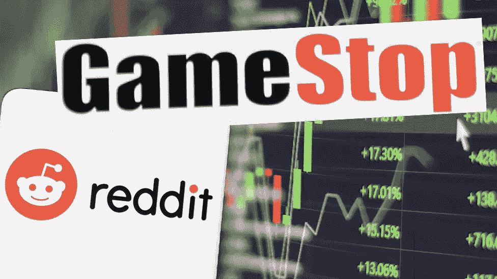
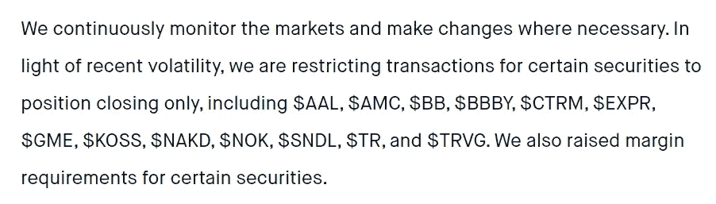

# GameStop 事件背后更大的问题是

> 原文：<https://medium.datadriveninvestor.com/what-happened-with-gamestop-showed-who-really-controls-the-markets-53718af8881d?source=collection_archive---------15----------------------->

我们只是生活在模拟中。

Photo from [BBC](https://www.bbc.com/news/newsbeat-55841719)

## 背后的故事。

在过去的两周里，GameStop 的股票上涨了 2000%以上。这在价值数十亿美元的公司市场上通常不会发生。

这个传奇故事始于 Reddit 上的 450 万名成员，即华尔街赌注。请注意，这个小组中的大多数成员都不是专业认可的投资者。他们大多由热衷于开金融市场玩笑的狂热分子和千禧一代组成。

这些华尔街赌注的一些成员注意到，GameStop(GME)的交易价格低于他们的预期。他们认为这有一些好处。尽管他们不一定是对的，这些成员购买了一些股票，然后开始向社区的其他成员宣布。

从那里，这个过程开始加速。社区的其他成员开始购买股票，因为炒作，他们相信股票真的可以上涨得多。很有趣。但他们没有意识到的是，这只股票有非常大的空头利益。

> [**卖空**](https://www.disnat.com/en/learning/trading-basics/short-selling/what-is-short-selling#:~:text=Short%20selling%20is%20the%20selling,the%20seller%20doesn't%20own.&text=Sooner%20or%20later%20you%20must,a%20profit%20on%20the%20difference.) 就是**卖出**卖方不拥有的股票。迟早，你必须通过回购相同数量的股票(称为“回补”)并将其返还给你的经纪人，来“平仓”卖空**。如果价格下跌，你可以用更低的价格回购股票，并从中赚取差价。**
> 
> **[**空头权益**](https://www.investopedia.com/terms/s/shortinterest.asp) 是已经卖出**空头**但尚未回补或平仓的股票数量**

**这种做空兴趣不仅仅来自一些老练的散户交易者。是对冲基金。我们都知道对冲基金的赌注至少值几百万美元。**

**在 8 月份之前，GME 美元数年来一直呈下降趋势。这意味着所有这些对冲基金都持有美元空头头寸，GME 在这只股票上获得了一些未实现的利润。**

**保持这种想法。短期兴趣不仅仅来自这些对冲基金。还有一家名为 Citron Research 的分析公司对 GameStop 进行了彻底的研究。他们在推特上说，在飙升的头几天，该股被高估了很多。他们甚至宣布，他们有一个相当大的股票空头头寸。**

**所有这些事件都增加了交易的一面。短边。**

**既然该股已经大幅上涨，所有这些卖空者现在都在屏幕上看到红色数字。他们持有数百万美元的未实现损失。但是股票并没有停止上涨。他们的损失越来越大。在某个时候，无论他们喜欢与否，他们都将被迫承担损失。要退出他们的空头头寸，他们必须点击买入按钮，以便“[回补](https://www.investopedia.com/terms/b/buytocover.asp)”。**

**所有这些拥有数百万美元资金的对冲基金同时按下买入按钮，将不可避免地导致市场股价的又一次飙升。这就是这只股票如何在短短几天内从大约 20 美元涨到 513 美元的原因。**

## **这有什么不好？**

**由于所有相关方的参与，导致自由佣金交易时代的著名经纪公司 Robinhood 决定限制某些证券的交易。**

***查看公告*[此处](https://blog.robinhood.com/news/2021/1/28/keeping-customers-informed-through-market-volatility) *。***

****

**Screenshot from [Robinhood](https://blog.robinhood.com/news/2021/1/28/keeping-customers-informed-through-market-volatility)**

**这是完全不可接受的，因为这不是自由市场应该有的样子。股票市场应该允许任何人做他们喜欢的任何事情。这包括以超高的价格购买股票。**

**Robinhood 声称他们这样做的原因是为了保护公司和顾客。他们表示，他们的一些客户已经承受了巨大的损失，由于损失的规模，他们不太可能偿还。如果是这样的话，经纪人将不得不承担这些损失。在这一点上没有透露太多，但这似乎是一个体面的理由。**

**然而，对冲基金仍然可以自由交易他们认为合适的头寸。众议员亚历山大奥卡西奥-科尔特斯甚至提到，这种情况是非常不公平的，显然偏向于保护对冲基金。**

**想想看，如果散户和投资者继续买入美元 GME，这些对冲基金的损失只会越来越大。那么，他们可以采取哪些措施来降低风险呢？限制零售购买，只允许零售销售。一旦股价下跌，对冲基金至少可以将损失降至最低。**

**由于购买限制，GME 在大约一小时内从大约 480 美元涨到 115 美元。就个人而言，没有任何术语可以将这种情况描述为操纵和偏向拥有大量资本的玩家。**

## **下一步是什么？**

**在撰写本文的时候，还没有任何关于对冲基金在这一事件中损失了多少的消息，但我确信这个数字并不漂亮。以下是一些对冲基金，据报道，他们持有 GME 美元的空头头寸:**

*   **第 72 点资产管理**
*   **安德鲁·莱福特的香橼之都**
*   **梅尔文资本**
*   **D1 资本合伙人公司**
*   **Maplelane 资本**
*   **烛台资本管理公司**

**最重要的是，Robinhood 肯定会面临某种诉讼，限制客户购买股票的权利，而对冲基金可以自由交易。一些对冲基金甚至可能申请破产，其行为的影响可能会让一些投资者损失惨重。**

**如果你在这次做空中赚了钱，确保尽你所能保护好它。不要太贪心，因为这些事件只有在星星完美排列时才会发生。没有人知道下一次严重的资金短缺何时会到来。**

**如果你使用 Robinhood 或者某个限制自由交易的经纪人，我会建议你寻找其他选择，因为他们很可能别有用心，而不是保护他们的客户。**

**就我个人而言，我了解到，作为散户；我们有责任保护自己的首都。即使对冲基金拥有世界上最聪明的交易者，他们多年的努力也可能在几天内化为乌有。**

**这一事件表明了一个更大的问题，向我们展示了谁真正有权力影响价格，以及经纪人的真正兴趣所在。理性地说，对经纪人来说，这只是生意，与个人无关。但从道德上讲，经纪人在为大玩家操纵股市，同时剥夺了散户的自由。**

**这就是我们所知道的自由市场，它与过去不同了。这一事件甚至是不可避免的。作为散户，我们所能做的就是学习和适应。**

***嘿，既然你在这里，为什么不加入我的* [***邮件列表***](https://marcuschan.ck.page/76504d9d12)**来看看你收件箱里偶尔出现的精彩故事，或者考虑成为会员***来阅读我所有的故事！☺*****