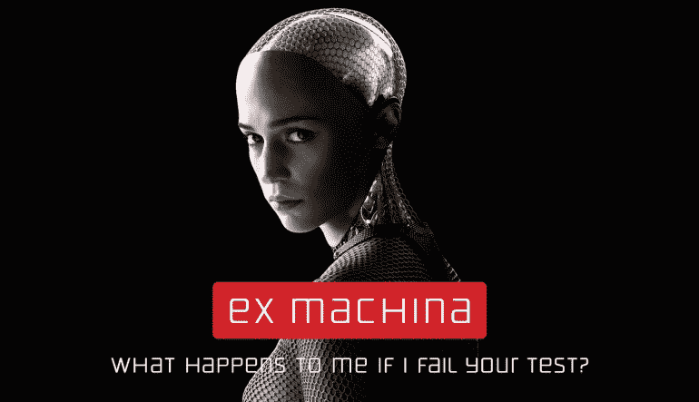

# 如果我没通过你的测试会怎么样？

> 原文：<https://medium.datadriveninvestor.com/what-happens-to-me-if-i-fail-your-test-528179a157f5?source=collection_archive---------7----------------------->

为什么 85%的人工智能项目无法交付给首席信息官

**作者:亚提什·拉姆霍利**

“W***你不就是在走前人的路吗？我肯定会走老路，但如果我找到一条更短更平坦的路，我会在那里开辟一条路。开辟这些道路的人不是我们的主人，而是我们的向导。真理对每个人都是开放的，它没有被垄断。”—塞内卡，道德书简，33.11***

这篇文章的标题是电影《前玛奇纳》中的一句台词。艾娃是一个智能人形机器人，她想知道如果她考试不及格，她会怎么样。艾娃问了一个非常重要的问题，“如果我没有通过你的测试，我会怎么样？”。作为一个由科学家创造的人工智能机器人，她(艾娃)非常像所有其他已经被创造出来的“智能”人工智能系统。

**如果一个人工智能系统失败了，我们是像其他失败的科技项目一样，关掉它，废弃它，把它扔进垃圾堆，还是评估失败的原因，并尝试改进它，让它变得更好？这个博客标题引出的问题是，为什么一个人工智能首先会失败？**

**今年早些时候，行业研究公司 Gartner 做出了一个大胆的预测:85%的人工智能项目不会为首席信息官带来成果。这意味着在 20 个人工智能项目中，只有 3 个会成功——其中 17 个会失败。**在文章中，Gartner 引用了麻省理工学院斯隆管理评论进行的一项研究。

研究发现，人工智能项目比任何其他商业倡议都有更高的失败几率。该研究确定，这些失败的首要原因是不一致的期望，其中 32%是不切实际的期望造成的。人工智能失败的另一个主要原因是该技术缺乏明确的目的，27%的受访者认为这是失败的首要原因。那么，这一切的解决方案是什么呢？在文章中，Gartner 为首席信息官们提出了四条建议，以确保他们的人工智能项目取得成功。

这些是:

1.  获得最高管理层的认可。
2.  将人工智能的期望与现实重新结合。
3.  建立一个拥有多学科技能的人工智能团队。
4.  确保你的人工智能战略解决了数据治理问题。

第一个建议是关键。如果高管们不接受人工智能项目，那么它就不会成功。就这么简单。当高管们不相信技术的价值时，他们就不会投资。他们甚至可能先发制人地关闭一个项目，甚至不给它一个机会。

第二个建议是最令人惊讶的，因为研究发现不切实际的期望是人工智能项目失败的头号原因。这个建议是为了确保期望是现实的。如果期望是不现实的，那么这个项目就不会成功，而且会浪费时间和金钱。

**第三条建议是创建一个拥有多样化技能的团队。由于人工智能是有史以来最复杂的技术之一，拥有一群精通不同领域的人非常重要。例如，作为人工智能专家的团队成员可能擅长训练系统，但不知道如何将人工智能实现到最终产品中。这是你建立人工智能团队所需要的团队成员类型。**

**最后，第四个建议是制定一个解决数据治理的战略。坚实的数据治理策略是任何人工智能项目的必备条件。如果没有数据治理战略，那么数据将失去控制，人工智能将无法按照预期的方式完成工作**。

因此，如果你是一名高管或首席信息官，你正在考虑创建一个人工智能项目，那么请记住这四条建议。它们是人工智能项目成功的关键。否则，你将和其他 85%的人工智能项目处于同一条船上。

> 如果我们不能理解人工智能…我们会怎么样？