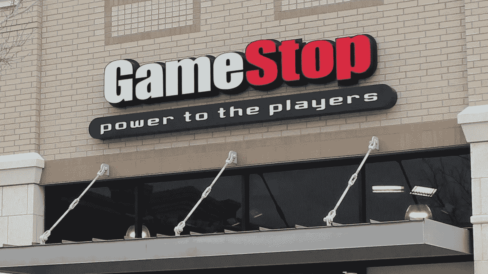
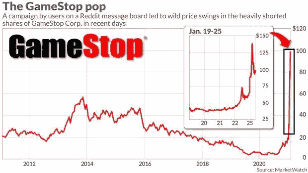

# Gamestop 股票崩盘会怎样？

> 原文：<https://medium.datadriveninvestor.com/what-happens-when-gamestop-stocks-crash-b40843f7945d?source=collection_archive---------14----------------------->

在某个时候，许多年轻的千禧一代可能会想起走进 GameStop 用一张盘换几分钱，或者只是在商场路过它。到目前为止，股票价格大幅上涨已经不是什么秘密了，但是…为什么呢？

随着亚马逊这样的公司和沃尔玛、塔吉特等大型零售店的网购增多，Gamestop 的存在感开始落后，随着时间的推移变得越来越无关紧要。不管怎样，一个疯狂的、非常幸运的投资者开始将数千美元投入这家倒闭公司的股票市场，就在它处于最低点的时候。然后，在 2019 年，一位知名投资者也开始投资，因为他也看到了价值。他看到这一价值是因为微软和索尼正在发布下一代游戏机，它带来了磁盘视频游戏机的重生。众所周知，磁盘是 GameStop 蓬勃发展的领域。但是，在 2020 年，随着许多商店因 covid 而关闭，GameStop 发现自己的在线销售额增长了 519%。后来，在 8 月份，Chewy(在线宠物食品)的创始人获得了该公司 9%的股份，并宣布他将努力将其变成亚马逊的竞争对手。然后，似乎事情还不够疯狂，微软和 Gamestop 宣布了多年的合作伙伴关系。很快，数字销售开始上升，因此瑞安·科恩(Chewy 的创始人)将他的股份增加到 13%。但是，不管怎样，卖空的股票比市场上实际存在的要多。最重要的是，90%的股东认为股票会下跌。但是，他们错了。这种组合基本上是一个完美的风暴，只要有任何好消息出来，股票价值就会成倍增长。这是一个被称为空头挤压的术语，是指“主要由于市场中的技术因素而不是潜在的基本面因素导致的股票价格的快速上涨。”因为每个人都认为公司正处于水深火热之中，一旦好消息出来，这就迫使“卖空者”(当投资者借入一种证券并在公开市场上出售，计划以后以更低的价格回购时)以更高的价格回购他们的股票。在你知道之前，每个人都在做同样的事情，这使得 GameStop 的价格飙升。现在，卖空者实际上找不到任何想要出售股票的人，因为买家知道他们坚持的时间越长，他们赚的钱就越多。这也导致卖空者损失数千，甚至数百万。

所以，我们在开始谈到的疯狂投资者，现在沐浴在金钱中，因为他的股票价值约 2200 万美元。不管怎样，现在发生的事情是疯狂的，你可能赚几百万，也可能损失几十亿。这是一场巨大的赌博，我个人不愿意冒这个险。