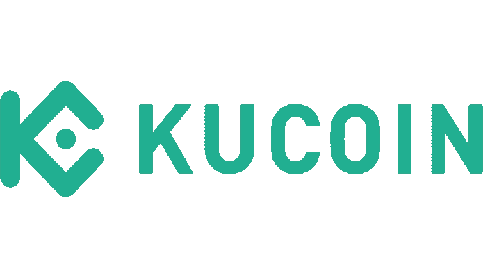
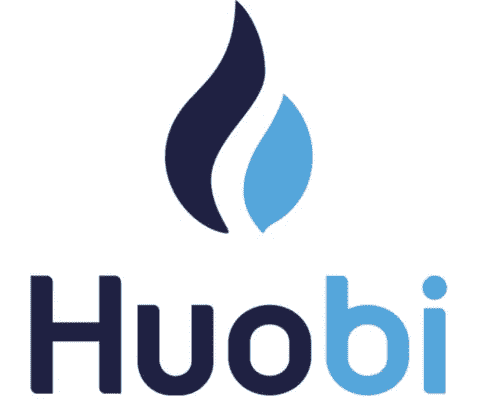

# 当数百万加密用户面对数字×娱乐的未来会发生什么？

> 原文：<https://medium.datadriveninvestor.com/what-happens-when-millions-of-crypto-users-meet-the-future-of-digital-entertainment-5fb7658ea79a?source=collection_archive---------13----------------------->

Photo by [Maria Teneva](https://unsplash.com/@miteneva?utm_source=unsplash&utm_medium=referral&utm_content=creditCopyText) on [Unsplash](https://unsplash.com/s/photos/future-text?utm_source=unsplash&utm_medium=referral&utm_content=creditCopyText)

***惊人之事！***

几天前，我写了一篇关于“[区块链游戏如何成为 Crypto 的第一个游戏改变者](https://medium.com/@mondreandrews666/this-blockchain-linked-game-could-be-cryptos-first-game-changer-efc8009e52c9)的文章，因为我想成为他们更大使命的一部分，从传统游戏行业传播金钱自由。今天，数字游戏占该行业 1089 亿美元年收入的 87%。然而，随着数字颠覆的继续，我相信“*旨在通过在游戏行业和金融界制造轰动来彻底改变规则的游戏*将会显著繁荣。

# **重新定义自己喜欢的东西的价值**

在推出的几个月内， [DEA 项目](https://dea.sg/)一直在创建一个全新的货币化方案，以吸引尽可能多的用户，这主要归功于其高度创新的 [PlayMining 平台](https://dea.sg/service/)，该平台利用了区块链技术。 [DEAPcoin](https://coinmarketcap.com/currencies/deapcoin/) 是由 DEA Project 发行的专有公用事业令牌，从连续上市到 Bittrex Global、Bithumb Global 和 OKEx 等几家知名交易所，发展迅猛。

 [## 加密货币行业是死是活？数据驱动的投资者

### 九月初，我们在 X-Order 内部就代币市场的未来进行了一场辩论。有趣的是，我们的观点是…

www.datadriveninvestor.com](https://www.datadriveninvestor.com/2019/12/12/will-the-cryptocurrency-industry-be-dead-or-alive/) 

正如我在上一篇文章中提到的，在西方/亚洲投资者和交易者之间增加了额外的入口，我认为该项目可以真正增加他们的全球覆盖面，因为这两个地区都有巨大的游戏社区。该项目的独特目标是提供一个前所未有的生态系统和世界概念，用户可以通过玩游戏和阅读漫画来赚钱(加密货币)，也许非常面向美洲/亚洲市场的知名加密货币交易所会毫不犹豫地将 DEAPcoin (DEP)列入名单。

Image from [KuCoin Exchange](https://www.kucoin.com/)

从一个简单的现货交易所到成为一个专业化的交易所，KuCoin 是使用最多的全球交易所之一，拥有来自 207 个国家和地区的 500 万用户。它已经发展成为一个全面的金融服务平台，提供一系列金融服务，如菲亚特到加密、加密到加密、期货、赌注、借贷、代币发行等。我认为库科恩在所有方面都做得很好，并且一直保持低调和谦虚。在定义交易所的合规性和能力方面，它在全球化、交易量和对、安全性、技术和声誉方面享有盛誉。举个例子，它最近推出了第六个聚焦项目——**卢克斯特**。

[LUKSO](https://www.lukso.network/) ，由以太坊的教父 ICO Fabian Vogelsteller 创立，尽管他们对首次上市的地点非常挑剔，[委托 KuCoin 作为 IEO 的完美地点](https://www.publish0x.com/first-token-sale-of-his-new-project-lukso-lyxe/the-godfather-of-ethereum-icos-chooses-kucoin-spotlight-to-b-xkkknkn)。尽管 IEOs 在整体历史上的表现平平，而且该交易所最近遇到了域名障碍，但该平台仍然认为 KuCoin 是最可靠和最强大的交易所之一。

Image from [Huobi Global](https://www.huobi.com/en-us/)

Huobi 已经取得了长足的进步，为其网络用户带来了一个优秀的产品，用于菲亚特，现货和合约交易。自 2013 年以来，Huobi 一直是主要的加密货币交易所之一，并在此期间建立了良好的记录。作为全球最大的数字资产交易平台之一，我认为火币是高交易量交易者的首选。霍碧的表现一般，由于指控多；尽管如此，它们确实成功地吸引了大量的交易量到它们的平台上，而且与其他交易所相比，它们的许多交易对提供了很高的交易活跃度。

此外，由于交易所正在加大努力，进一步发展 HT([火币令牌](https://coinmarketcap.com/currencies/huobi-token/))在交易所生态系统之外的用途，该令牌已成为日本(FSA) 授权的第一个国际交易所令牌[。由于日本被视为促进加密货币环境发展的最严格、最勤奋的监管机构之一，此次批准或许代表着 Huobi 不断努力实现全球合规性和竞争力的又一个重要里程碑。](https://cointelegraph.com/news/huobi-token-approved-in-japan-as-regulators-improve-protections)

Photo by [Tim Mossholder](https://www.pexels.com/@timmossholder?utm_content=attributionCopyText&utm_medium=referral&utm_source=pexels) from [Pexels](https://www.pexels.com/photo/photo-of-led-signage-on-the-wall-942317/?utm_content=attributionCopyText&utm_medium=referral&utm_source=pexels)

DEA 再次试图推翻旧的先入为主的“P2W”，因为它通过使用游戏和其他娱乐媒体建立了一个基于“赚钱的同时享受乐趣”原则的平台。老实说，这是我发现的唯一一个比使用简单的数据库设置或其他现有解决方案更好地利用区块链的游戏。我只是认为这种扩展平台存在的方法，无论是在技术上还是商业上，总是有助于吸引更多的用户牵引力，最终将导致根本性的改善。谁知道呢？我们可能会比预期更快地看到那里的巨大增长。