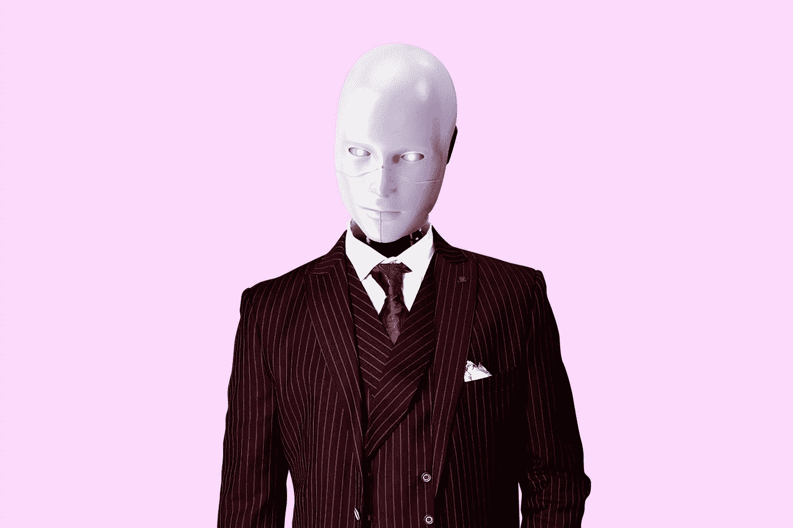

# 当我们都成为上帝时会发生什么？

> 原文：<https://medium.datadriveninvestor.com/what-happens-when-we-all-become-god-293c847ae23b?source=collection_archive---------23----------------------->

## 人工智能和曼哈顿博士范式

Photo by [Matheus Ferrero](https://unsplash.com/@matheusferrero?utm_source=medium&utm_medium=referral) on [Unsplash](https://unsplash.com?utm_source=medium&utm_medium=referral)

曾经只存在于科幻小说中的东西现在正在成为我们现实的一部分。我们越来越多的日常生活被技术和它带给我们的便利和简单所侵蚀。

《卫报》最近发布了一篇由人工智能撰写的文章——[*“一个机器人写了整篇文章。你害怕了吗，人类？*GPT-3](http://A robot wrote this entire article. Are you scared yet, human? GPT-3)。在人类历史的这个非常时刻，一些最优秀、最聪明的人正致力于开发治疗大脑疾病的电极。隆·马斯克和他的神经技术公司 Neuralink 已经开始在动物和人类身上测试这些电极。

据马斯克自己说，他相信在不太遥远的将来，我们将能够进行大脑与大脑之间的交流，因此不再需要口语，因此，一种通用语言将会出现。

如果科学界有一件事是肯定的，那就是进步永远不会停止，由于这种不可避免性，最终将有能力完全把人脑从本质上变成一个计算机界面，轻松地思考就可以获得所有知识。

## 那么当我们成为上帝时会发生什么呢？

> “我目睹了如此微小和如此迅速的事件，它们几乎不能说是发生了。但是你艾利安你只是个普通人。世界上最聪明的人对我的威胁不比它最聪明的白蚁多。”曼哈顿博士。阿兰·穆尔的《守望者》。

利用必然性的原则，最终会有一天，无论出于何种目的，现代亚历山大图书馆的内容都能够通过这些神经电极在纳秒内植入和回忆，从而创造出超人或活着的上帝。

 [## AI 和医学影像创业公司？6 大趋势|数据驱动的投资者

### “IBM Watson 健康成像”是医疗保健的未来吗？谷歌详细说明了人工智能对胸部 x 光的分类…

www.datadriveninvestor.com](https://www.datadriveninvestor.com/2020/08/30/ai-and-medical-imaging-startups-6-key-trends/) 

这当然会贵得离谱，只有世界上最富有的人才能负担得起，至少在最初阶段是这样。因此，那些已经处于有利地位的人将能够进入一个更有利的位置，从而扩大了增强者和那些仍然受基因、经验和努力支配的人之间的差距。

## novo-intelligente*是否也有外交能力和远见来弥合这一差距？我们会变成仁慈的上帝还是无所不知的恶魔？*

> “我越来越倾向于认为，应该有一些监管监督，也许是在国家和国际层面，只是为了确保我们不会做一些非常愚蠢的事情。我的意思是用人工智能来召唤恶魔。”—埃隆·马斯克

作为人类，我们是否足够聪明，能够开发出真正的人工智能？如果没有，我们能安全地创造出我们所缺乏的东西吗？我们会试图创造一个上帝，而不是释放恶魔吗？

一个人是否有足够的智慧去坚持和发展它，是否有足够的责任感去信任它；还是像人类习惯的那样屈服于自己的缺陷？就像一个作家的话会集中地荡漾开来，任何人都可以以任何他们认为真实正确的方式来解释和应用它们，无论与最初的意图有多远，人工智能革命的涟漪也可以很容易地从温和的涟漪转变为误解或误用的暴力海啸。

## 我们是在复活时代的神，还是在召唤恶魔，从而创造我们自己的毁灭？

Photo by [Morning Brew](https://unsplash.com/@morningbrew?utm_source=medium&utm_medium=referral) on [Unsplash](https://unsplash.com?utm_source=medium&utm_medium=referral)

> “人工智能很可能会导致世界末日，但同时也会有伟大的公司出现。”山姆·奥特曼

古往今来，每一种伟大的文化都带来了自己的灭亡，因此，超科技将是我们世界的毁灭者，这是有道理的。

在过去的几代人当中，人们对原子能充满了恐惧，尽管这仍然是一个非常可怕的命题，但我觉得人们已经意识到了这种危险，至少在很大程度上。然而，技术和人工智能如此容易地进入我们生活的每一个部分，以至于它很可能成为杀死人的解药。我们现在都在火车上，我们只能相信列车员随时都很清楚，能安全地把我们送到目的地。

我们生活在如此先进的时代，但具有讽刺意味的是，我们生活得如此原始，任何人工智能都无法改变这一点，因为从根本上讲，人类的状况植根于经验和仪式。我们存在是因为我们已经生存了几百万年。我们战胜了食肉动物、瘟疫、自然灾害和战争。如果我们成为一个复仇的上帝，那么让崇拜者不要相信，因为不信会消除上帝的力量。

⬇️留下评论，让我们不带偏见地讨论生活的神秘和世俗。跟我来 JMN。

**一定要看看我最近的另一篇文章:**

*   [不要挣扎，你只会沉得更快。](https://medium.com/@jmnzenwriter/dont-struggle-you-ll-only-sink-faster-dbe64cee7d16)荷马·辛普森的禅宗反建议。

**进入专家视角—** [**订阅 DDI 英特尔**](https://datadriveninvestor.com/ddi-intel)