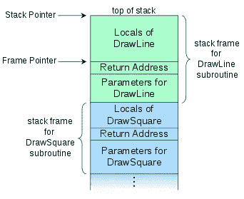
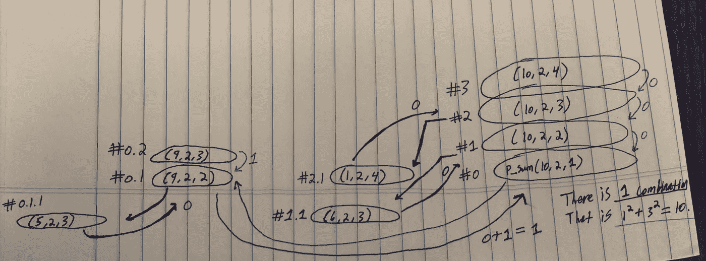

# 当你调用一个函数时会发生什么？

> 原文：<https://medium.datadriveninvestor.com/what-happens-when-you-call-a-function-3ef37f891175?source=collection_archive---------0----------------------->

当一个函数调用另一个函数时会发生什么？

首先，理解堆栈帧很重要。每个函数都有一个堆栈框架。堆栈帧是“与子程序调用相关的数据集合”([www.cs.uwm.edu](http://www.cs.uwm.edu/))。堆栈帧的大小和结构变化很大，并且是在编译时确定的。我们称这个数据集合为“堆栈框架”，因为我们在堆栈数据结构中组织每个子程序调用。这意味着压入调用堆栈的第一个子程序调用(数据收集)将是最后一个要解析(终止)的堆栈帧。下面是如何构建调用堆栈以及如何执行调用堆栈的逐步分解:

1.  函数期望的任何参数都被推送到堆栈框架上。它们按与在被调用函数参数列表中声明的顺序相反的顺序被推送到堆栈框架上。
2.  调用函数的返回地址被推送到堆栈上。这将用于稍后在被调用函数终止后将控制返回给调用函数。
3.  现在被调用的函数处于控制中。被调用函数中定义的任何局部变量也将被推送到堆栈上。
4.  步骤 1–3 为被调用的函数组成被认为是“堆栈框架”的东西。被调用的函数可以遍历堆栈帧来获取它需要的任何数据。现在让我们来看看一旦被调用函数终止，它是如何将控制权返回给调用函数的。

3.被调用函数中的任何局部变量都被弹出堆栈。

2.被调用函数通过我们推到堆栈上的调用函数的返回地址将控制权返回给调用函数。

1.  调用函数(在本例中并不总是)负责清理堆栈的其余部分——被调用函数所期望的参数。

0.被调用的函数现在再次处于控制中。将对创建的堆栈帧重复步骤 3-1，直到堆栈清空。

帧指针通常表示堆栈帧的底部(最高地址，因为堆栈在视觉上是朝着较低的内存增长的)。堆栈指针通常表示堆栈的顶部(最低地址)。框架指针和堆栈指针之间的字节差由编译器决定，代表堆栈框架的大小。

The call stack holding multiple subroutine calls

让我们在一个叫做“[幂和](https://www.hackerrank.com/challenges/the-power-sum/problem)”的棘手递归算法问题的上下文中检查堆栈帧会发生什么

 [## 软件开发过程:如何选择正确的过程？数据驱动的投资者

### 软件是任何企业组织成功的生命线。没有软件的帮助，一个…

www.datadriveninvestor.com](https://www.datadriveninvestor.com/2020/01/16/software-development-process-how-to-pick-the-right-process/) 

幂和问题给你两个整数 X 和 N 作为输入。它要求你“找出一个给定的整数 X 可以用唯一自然数的幂的和来表示的方法。”

**例如:**

X = 100

N = 2

我们需要找出平方和为 100 的唯一数字的组合数。

在这种情况下，答案是 3:

1.  10² = 100
2.  6² + 8² = 100
3.  1² + 3² + 4² + 5² + 7² = 100

让我们快速解决这个问题。我们将使用 X = 10 和 N = 2 来使事情更容易管理。

首先，我们需要从用户那里获取命令行参数来获得 X 和 n。然后我们需要用三个参数调用我们的函数 p _ sum():X、N 和 num。对于我们的第一个调用，num 将被设置为 1。num 有什么意义？

好吧，我们需要找到所有的数字组合，当它们被提升到 N 时，等于 x。我们将告诉我们的 p_sum()函数期待另一个参数 num，我们将开始提升它的 N 次幂，并查看结果是大于、等于还是小于我们的目标 x。

下面是一些伪代码，希望能让这一点更清楚:

1.  接受 main()中的命令行参数，用 X、N 和 num 调用 p_sum()

注意:现在我们在 p_sum()中

1.  检查是否 pow(num，N)< X

*   If num raised to the N is less than X, we can make another recursive call to p_sum() but this time with num+1.

jump to instruction #2.

*   In the second recursive call, we are searching for the number squared that will make up the difference from whatever we generated in the first recursive call minus X. That is, we want to call p_sum() again with (X-pow(num, N), N, num+1).

2\. If pow(num, N) is not less than X, we should check if pow(num, N) == X. This is a base case and we would return 1.

3\. If pow(num, N) is not less than or equal to X it must be greater than X. This is also a base case and we would just return 0.

Let’s assume that either base case #2 or #3 hit. We will return either 0 or 1 and terminate the current stack frame. Now we’d need to jump back to the second bullet point and make the next recursive call in the previous stack frame.

Now let’s take a look at a C implementation of the above pseudo-code (this code was largely inspired by @sourabhsingh’s implementation on HackerRank:

#include <stdio.h># include<math . h>
# include<stdlib . h></stdio.h>

int p_sum(int X，int N，int num)
{
if (pow(num，N) < X)
return p_sum(X，N，num+1) + p_sum(X-pow(num，N)，N，num+1)；
else if (pow(num，N) == X)
返回 1；
否则
返回 0；
}

int main(int argc，char* argv[])
{
int X，N，ans

if (argc < 3)
返回 1；

x = atoi(argv[1])；
N = atoi(argv[2])；

ans = p_sum(X，N，1)；
printf("ans is: %d\n "，ans)；

返回 ans
}

Visual of the call stack executing. Start at frame #0.

我上面的调用堆栈执行的视觉效果可能看起来令人不知所措/混乱不堪。我强烈建议你自己去追查。Python Tutor(可以处理许多其他语言)也是可视化栈如何变化的一个很好的资源。

让我们简单地看一下当我们从 main()的第 0 帧开始递归调用 p_sum()时发生了什么:

1.  p_sum()的参数按它们在参数列表中列出的相反顺序压入堆栈。
2.  main()函数的返回地址被推送到堆栈上，所以 p_sum()将知道一旦它完成执行，将控制返回到哪里。控制权现在转移到 p_sum()。
3.  p_sum()中定义的任何局部变量都被推送到堆栈框架上。

重复相同的过程(使用更新的值),直到达到基本情况，帧开始弹出堆栈:

3.从堆栈框架中弹出局部变量。

2.控制返回到先前的堆栈帧，返回地址从堆栈帧中弹出。

1.  用于调用刚刚终止的函数的参数被弹出堆栈框架。

0.堆栈框架现在是空的，并从堆栈中弹出。

希望您更清楚在调用函数时调用堆栈上实际发生了什么。这将使您更好地处理递归，并使调试递归程序更容易。