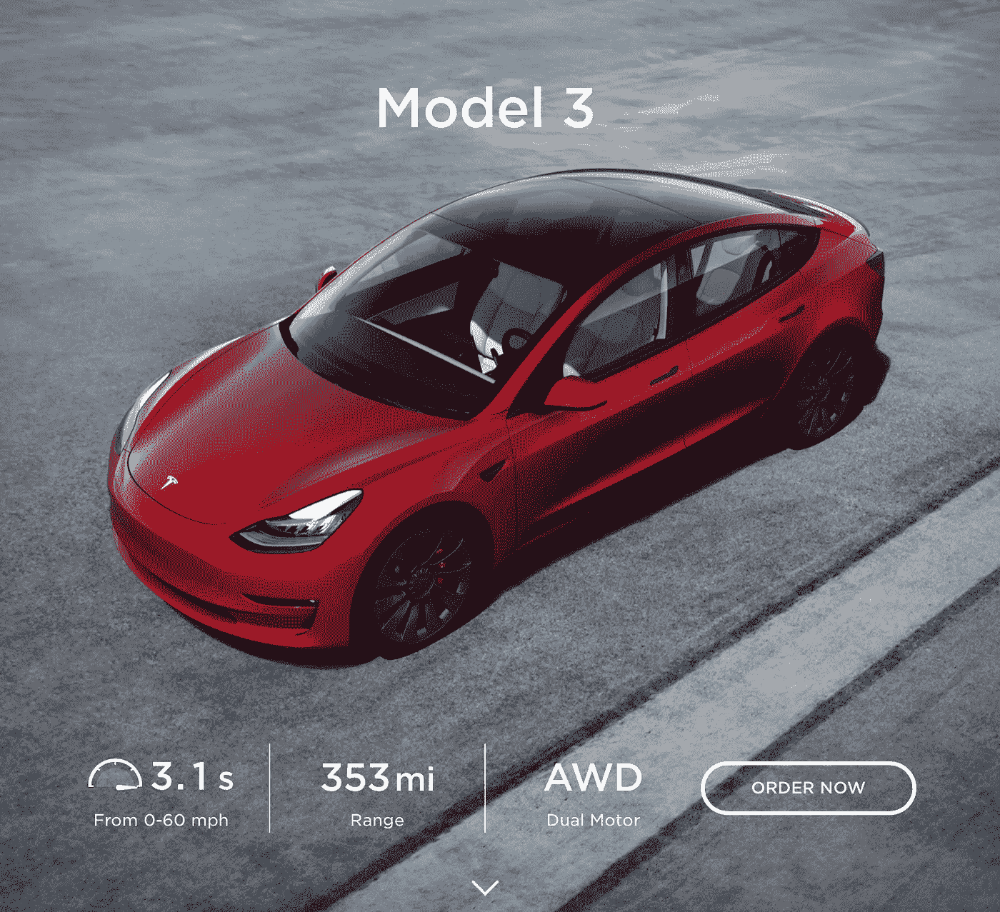
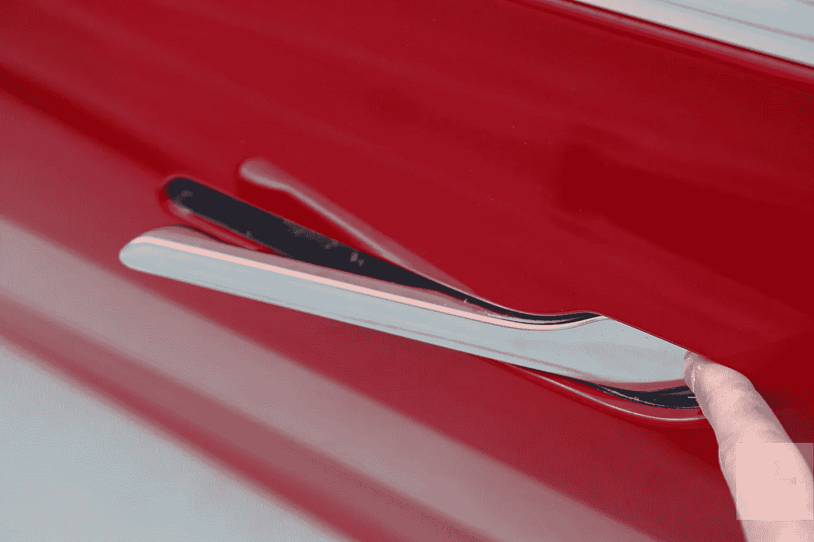
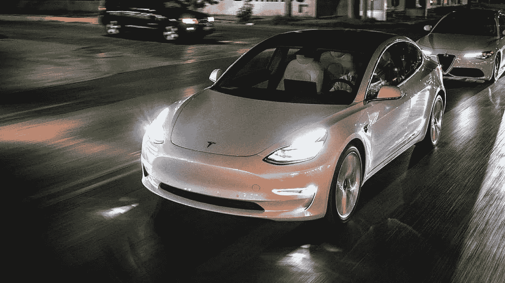
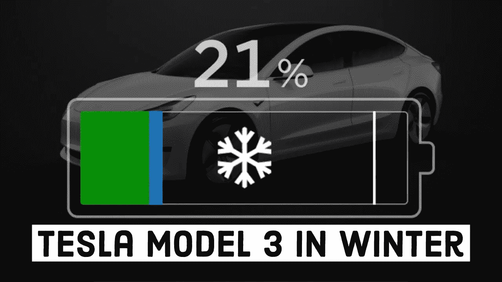

# 我讨厌我的特斯拉 Model 3

> 原文：<https://medium.datadriveninvestor.com/what-i-hate-about-my-tesla-model-3-5af6648f6b21?source=collection_archive---------6----------------------->

Tesla Model 3 Via Tesla.com

“普通汽车只是感觉很蠢”——乔·罗根

当乔·罗根(Joe Rogan)让埃隆·马斯克(Elon Musk)出现在他的播客中的一集时，我立刻就看了。埃隆·马斯克在我眼里基本上是个天才。当然，他利用工程师的智慧建立了自己的帝国，但他的眼光非同寻常。

特斯拉成立于 2003 年 7 月，但在开始吸引投资者、消费者和其他汽车公司的目光之前，它在雷达下飞行了相当长一段时间。大多数人嘲笑埃隆·马斯克和特斯拉试图做一些看起来不可能的事情。

在 Model 3 发布之前和发布期间，特斯拉几周前就申请破产了。现在，拥有全球“最有价值汽车公司”的头衔，超过了丰田。

2020 年 9 月，我决定买一辆新车，我厌倦了我的吉普牧马人，想要一辆开起来更舒服的车。对我来说，作为一名自由职业者和在家工作，一辆车对我来说更是一种奢侈，它不一定是实用的。

我想过买一辆雷克萨斯 F Sport，直到我意识到 25 岁以下的人的保险价格。我想买一辆丰田 4Runner，因为它很像吉普牧马人，但有更多的功能。

我四处购物，寻找交易和可用的东西，因为汽车短缺正影响着市场，就像我们今年经历的住房短缺一样。

我们去了当地一家有特斯拉经销商的商场，我过去看过他们，但从未想过。我真的只是想看看乔·罗根到底在说什么，当他说开了特斯拉后，普通车感觉很蠢。

Tesla Model 3 — Tesla.com

我们跳上车，去起飞，停在一个红灯前，让我的脚离开油门，希望开始滑行到灯和繁荣，我们停下来。特斯拉有一个叫做再生制动的功能，所以每次你放开油门，它就会开始减速&制动来帮助电池充电，以延长你的里程。

试驾特斯拉大约 20 分钟后，我知道这就是那辆车。它速度快，有趣，有大量的功能，而且没有讨价还价。我们在一个周六进行了试驾，在大约 10 分钟内填写了我的申请，获得了批准，然后离开了经销商。第二天早上我回来取我全新的特斯拉 Model 3。签了几张纸，收了一个小包，就上路了。

从开始到结束，包括 20 分钟的试驾，我在经销店花的时间不超过 45-50 分钟。那就是文书工作、批准、学习那辆车和试驾它。这种体验与众不同。当我们去年买我妻子的车时，我们在经销店待了 4 个多小时，光是坐在那里等就很痛苦。埃隆·马斯克和特斯拉总能找出做任何事情的最有效方法，果然，他们用购物经验做到了。

在拥有特斯拉 3 个多月之后，有一些小事情我真的不喜欢。都是些很小的，我不常想的事情，但是烦到可以加到文章里。

在我们陷入负面情绪之前，我想说我非常感激能在如此年轻的时候就处在这个位置上。我非常爱我的车&享受驾驶它的乐趣。清单上的货物比货物多 100 倍。我不希望任何人认为“看看这个固执的孩子在抱怨不重要的事情”。我还将写下我最喜欢我的车的地方，因为每次我坐进车里，它都会让我激动不已！

# ***坏:***

1.  ***门把手:***

Image Via: [Digital Trends](https://www.digitaltrends.com/cars/tesla-model-3-handles-freeze/)

特斯拉 model 3 上的门把手没有从车门中伸出来，它们是扁平而光滑的。你只需推把手的后面，前面就弹出来了&你拉它。它工作起来很棒，感觉很棒，而且看起来很棒，没有门把手伸出来。

但是…

住在美国中西部的一个州，天气变冷了，还会下雪。当冰雪开始粘在汽车上时，把手开始冻结&变得非常难以打开，你基本上必须将把手的后部压入车内才能打开。

我通常把车停在我们的车库里，所以这通常不是问题。在过去的一周里，我们有大约 6 英寸厚的雪，当我们外出、购物，汽车被雪覆盖时，我意识到这有多烦人。

*解决方案:*手柄后面的小发热元件。对于特斯拉来说，在车上安装加热元件非常容易，因为车上已经安装了其他加热元件。

2. ***自动远光灯***

Image Source: [Teslarati](https://www.teslarati.com/tesla-model-3-best-headlights-iihs/)

车头灯棒极了，它们很亮，照亮了道路&远光灯让它看起来像是白天。特斯拉被一些不同的评论网站认为是汽车中前灯最好的。它们非常棒，提供自动远光灯功能，当另一辆车在范围内时，它会关闭你的远光灯。

问题:他们用来决定远光灯什么时候亮，什么时候灭的摄像头和传感器(汽车被它们覆盖)需要一些调整。关于特斯拉的一切都是基于编码和软件的，所以很容易做到。在我看来，他们需要增加汽车远光灯的灵敏度。

*解决方案:*调整编码中关于远光灯何时点亮&熄灭的灵敏度。我很少发现自己不得不手动关闭它们，但这确实时有发生。

 [## 移动网络 O2 发布英国首个无人驾驶汽车实验室测试使用 5G 和…

### 随着时间的推移，技术越来越强大。我们不仅成功地登上了月球，我们现在…

www.datadriveninvestor.com](https://www.datadriveninvestor.com/2020/11/24/mobile-network-o2-launch-uks-first-driverless-car-lab-testing-driverless-cars-using-5g-and-satellite-technology/) 

3. ***电池寿命遇冷***

Image Source: [Youtube](https://www.youtube.com/watch?v=3s03FXxKhH4)

电池在寒冷的环境下表现不好，这是一个已经证明的事实。但是生活在寒冷的天气会影响你每次充电的里程。最近，我们晚上的里程数下降到了十几英里&第二天，我的电池会比前一天晚上少跑 10-15 英里。很明显很糟糕。

在寒冷的天气里，你不仅会失去电池寿命，如果电池不热，你也会充电缓慢。幸运的是，我有一个增压器，离我家大约 10 分钟的路程，所以我希望在车上，告诉汽车我正在前往增压器&当我到达那里时，电池足够热，可以以每小时近 500 英里的速度充电。

*解决方案:*特斯拉 Model S & Model X 都有专用的电池加热器，可以为你的电池保温。Model 3 使用电机来加热电池，所以除非你在开车，否则你的电池是冷的。增加一个像 S & X 那样的简单的电池加热器可以缓解这个问题。

4. ***增压站:***

Image Source: [Tesla.com](https://www.tesla.com/supercharger)

特斯拉增压器速度很快，我的意思是快得令人难以置信。我以超过 600 英里每小时的速度观看汽车充电器的事实是疯狂的。在我的城市周围，有 5 个不同的超级充电站&数百个你可以使用的其他电动汽车充电器。

其他收费的唯一问题是收费率。使用不是特斯拉超级充电器的充电器在紧急情况下效果很好，但它们通常只能以每小时 10-15 英里的速度充电。

有一次我们去了一家商场，我意识到我的里程数很低，所以我用了商场在停车场提供的充电器。我们去购物，吃午饭，在购物中心花了几个小时回到我的车上，只比我们到达那里时多开了 24 英里。虽然它是免费的&很棒，但如果我把我的特斯拉插上增压器，它就会在同一时间内充满电。

我对特斯拉增压器的问题是电线是如何悬挂的。当你把电线插入你的汽车时，它是紧的，舒适的，不会移动任何东西。当你把悬挂在增压器上的电线放回原处时，它会不断地掉下来。如果电线没有被推回到非常松的固定器上，它会掉下来&我已经让它撞到我的车上很多次了。

*解决方案*:更好的云台装置。如果特斯拉将增压器上的插头固定器更新为与汽车上相同的样式，充电器将永远不会掉出，从而避免您的汽车被沉重的&硬塑料片击中。

***概述:***

我非常喜欢我的车，每个人都不停地问我是否有不喜欢的地方。我一直在检查赛车，试图找到我不喜欢的问题，这是非常困难的。我喜欢的功能远远超过我的一些问题。

总的来说，特斯拉充满了各种功能，购买体验非常好，这是迄今为止我在汽车中拥有的最好的驾驶体验。

我非常感谢与你分享我的想法和意见。请务必关注本周即将发布的我最喜欢的功能。这本书要长得多，里面有一些我保证你不知道的东西。

## 访问专家视图— [订阅 DDI 英特尔](https://datadriveninvestor.com/ddi-intel)