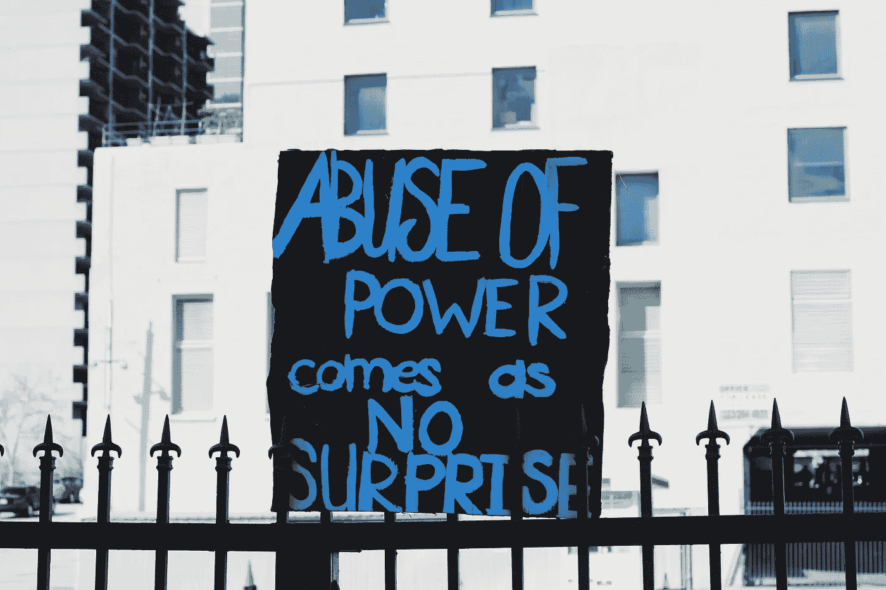

# 我讨厌政治的地方

> 原文：<https://medium.datadriveninvestor.com/what-i-hate-about-politics-2e92a558e452?source=collection_archive---------11----------------------->

## 这不是特定的政党，我都不喜欢它

Photo by [Samantha Sophia](https://unsplash.com/@samanthasophia?utm_source=unsplash&utm_medium=referral&utm_content=creditCopyText) on [Unsplash](https://unsplash.com/s/photos/politics?utm_source=unsplash&utm_medium=referral&utm_content=creditCopyText)

我今天早些时候登记投票了。虽然我登记为民主党人，但我不是。它比共和党这个词更接近我是谁和我是什么。我会告诉你为什么我注册为民主党人，但是当你在 Medium——一个毫无疑问是左派的友好平台——上阅读这篇文章时，我可能不需要这么做。这不是因为我爱乔·拜登，而是因为我已经厌倦了在日常生活中看到唐纳德·特朗普的名字和面孔。

我唯一可能不像特朗普那样关心的政治家是参议院多数党领袖米奇·麦康奈尔。你可以看看他们俩，就知道他们有多不关心美国人民，尤其是黑人和棕色人种。在任何时候，他们脸上忧郁的表情都表明他们有多在乎除了自己以外的任何人。

但是没有必要用更多的相同来对抗偏见，所以让我们超越他们种族主义和厌恶女性的面孔，看看他们作为人和政治家，好吗？

## 伪君子之家

在大萧条以来最严重的经济衰退之一——实际上是最严重的——期间，米奇·麦康奈尔(Mitch McConnell)被引述说，他和共和党控制的参议院将延长 600 美元的联邦失业补助，“除非他死了”。

同一个参议院在没有与众议院达成第二项刺激协议的情况下，收拾行李，离开去“夏季休会”。两人组成了国会众议院，但数月后，众议院仍无法搁置个人分歧，就一项为美国人民提供急需的经济救助的协议达成一致。

在疫情冠状病毒肆虐期间，国会休会两周，没有达成任何协议，这一事实表明我们的政府有多关心美国人民。众议院和参议院的行动完美地表明，整个美国政府除了他们自己的利益和底线之外，对任何事情都漠不关心。

## 本地终生骗子

吉姆·肯尼，民主党人，被认为是我所在城市费城的极左派市长，最近被摄像机拍到在马里兰州室内用餐时没有戴口罩。与此同时，在费城，根据他的命令，我们不允许在室内吃喝。虽然我理解他处于不同的状态，但这往好里说是一副糟糕的表情，往坏里说是虚伪。

他下令将前市长弗兰克·里索的雕像从市政厅前移走，因为他的政策经常引起争议，并被视为种族主义者，这座雕像遭到抗议者的破坏。请记住，只是在当地的自由主义者对此大吵大闹之后，肯尼才将其移除，甚至考虑过这么做。

后来，他发表了一份声明，基本上宽恕了破坏行为，并赞扬了他自己的行为——但他没有提到的是，20 多年前是他 决定了这座雕像将被安放在哪里。

虚伪一直是我对政治最大的问题。政客们的整个人格是多么的虚伪和虚伪。他们总有一天会说一件事，但一旦对他们有利，他们就会完全反驳。就像吉姆·肯尼在弗兰克·里佐上楼的时候称赞他一样，到了那里就避开他。他们都是伪君子和骗子，我这次投票的唯一原因是把我在政治内外遇到的最大的伪君子和骗子赶出白宫。

## 分裂我们会倒下

除了谎言和虚伪，政治最糟糕的部分是它导致人们之间的分裂。在这个时候，我们应该作为一个国家团结起来，作为一个团结的力量，努力抗击冠状病毒，我们从未如此疏远。看到二十多年的朋友和血亲在 ***政治*** 问题上不再说话，我感到沮丧、愤怒和悲伤。

政府不希望我们被固化，因为那样我们太强大了，不可控。它想让我们相信，我们中的一半人是同一个政党的一部分，他们中的一半是，我们中的另一半是他们的。别说了。没有什么比事实更离谱的了，我们和你不一样。

当我们谈论白人特权时，我们谈论的是你——讽刺的是，即使是对那些有权力的有色人种。但是，普通的苦苦挣扎的白人听到这个词，会想出一个像“所有生命都很重要”一样分裂和麻木不仁的词，无知地试图回应他们认为是对他们的攻击。

从那里开始，当权者就把我们控制在他们想要的地方，他们在安全的距离之外兑现支票或下令向某个地方的小村庄投掷炸弹。

## 左边也不对

那些声称只关心进步和正义的民主党政客们，也是你的普通美国家庭现在得不到帮助的同谋。就像另一方一样，他们在玩党派政治，而他们应该代表美国公民进行谈判。

极左派呼吁废除警察，并以“正义”的名义连续数周劫持多个城市街区。这是同一批人，他们似乎动不动就感到愤怒，并把他们的愤怒发泄到网上，同时错误地认为他们实际上是在做好事，他们所做的事很重要。这和前面提到的任何事情一样会引起分歧。如果我们继续这样下去，分裂将是我们的末日。

左派和右派一样对美国的分裂负有责任。他们通常和另一方一样思想狭隘，不愿意倾听或改变自己的立场，只是现在美国的生计岌岌可危。不愿以文明的方式倾听和讨论分歧的时代必须结束——在我们结束之前。

## 没有简单的答案或简单的解决方案

我常常忍不住想，我们之间有这么多的分歧，因为我们没有人有任何可行的建议或解决方案来解决任何问题或实施真正的变革。左边、右边还是中间——没人知道从哪里开始。或者，如果他们认为他们可能，他们害怕建议，因为它可能会冒犯谁，或者因为厌恶女人或种族主义而失去工作，尽管他们所说的与性别或种族无关。

我也好不到哪里去。我们大多数人有分歧的许多问题是复杂和根深蒂固的。它们并不容易解决，而且在很大程度上，我也没有解决方案。但问题是，有些人可能会这么做，但我们没有开诚布公地去倾听他们的心声。

我们必须开始让它不仅仅是关于我们个人，而是关于我们整个人类。我们应该少关注一点感觉，多关注一点事实——同时仍然考虑到其他人的感受。

政治可能永远不会道歉和残酷——但我们不必如此。