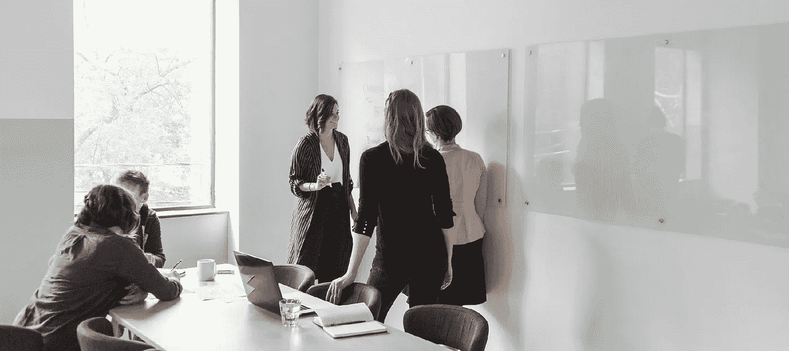

# 创建 3 家公司后我学到了什么

> 原文：<https://medium.datadriveninvestor.com/what-i-have-learned-after-creating-3-companies-dea5a238cbbd?source=collection_archive---------36----------------------->

不要等待最佳时机，去做吧。现在。

Photo by [Burst](https://burst.shopify.com/)

不管你有多成功，也不管你的银行账户里存了多少钱，生活中有两个主要因素会真正产生影响。快乐和幸福。

即使在困难条件的影响下，我们都可以从日常小事中体验快乐。快乐和幸福是一种影响我们一生的精神状态。

我个人一直坚信，最小的事情也能对我们的生活产生最大的影响。一句亲切的话，一个温暖的微笑，一个温柔的眼神，一个优雅的沉默，一杯你喜欢的茶，一个“嗨-想念-你”的快速电话，一个令人惊讶的愚蠢但有趣的礼物等等，可以在一秒钟内扭转局面，并可能有助于在任何给定的时间逃离担忧或问题。

成为一个成年人需要在许多不同的领域付出巨大的努力，但是…我们都可以选择如何应对和处理生活中的不确定性。正如宝贵的生命一样，有时早上醒来脸上带着灿烂的笑容并不容易。

我们只需要注意那些战略性地构成我们生活质量的小细节。与我们一起工作的人和分享我们个人生活的人同样重要。此外，我们的日常生活应该带回兴奋的火花，而不是无聊。

 [## 在家工作如何提高我的工作效率|数据驱动型投资者

### 在家工作确实激发了我最大的潜能，让我更有效率。因为在家工作给了我…

www.datadriveninvestor.com](https://www.datadriveninvestor.com/2020/07/29/how-working-from-home-increased-my-productivity/) 

# 人类的生命短暂

永远不要忘记，每一秒钟，一切都在变化。

当我们开始更加重视这些小事时，它们就会逐渐形成一个新的模式让我们行走。你有没有注意到当你最喜欢的咖啡不再供应时会发生什么？你会感到沮丧。当这些小事情突然从我们的日常生活中消失时，会留下一种空虚感。

用正念对抗空虚。明智地选择和谁在一起，为什么和你在一起。商业选择对我们的自我提升和业务增长同样重要。很多人喜欢把自己的存在分成两种甚至三种人格。私人自我、商业自我和秘密自我。

嗯，足够勇敢的把这三者结合起来，作为一个完整的人类行走，可以让你无所畏惧。在生活和商业世界中。想要变得可爱不会是你主要关心的事情。内心的平静被证明是世界上最强大的药物…一旦你踏上了通往它的道路，没有什么能让你分心去创造自己的道路。

# 不求认同。只管去做吧！

当我创办第一家公司时，我周围的每个人都试图让我相信，我想建立自己的品牌是多么愚蠢。早在 1991 年，在科技界做一名年轻女性并不常见。尤其是如果没有男性支持我的计划。甚至我的父母都认为我想创建一个网上企业是疯了。

但我做到了。两年后以非常好的价格卖掉了我的第一家公司。一年后，一个朋友让我帮他一个忙，重新设计他的网站。同年，我的下一家公司开始为小型企业提供网页设计服务。

> 沉默是金。让你的行动比言语更响亮。

# 选择你的战斗

每次和客户开会的时候，他们都坚持要等老板来了之后，我们才开始做报告。很有趣，对吧？他们只是不能接受老板坐在他们前面，而她却穿着裙子。

在商业中，数字有办法让人们相信什么对他们的公司最有利。我们的数字令人着迷。我们客户的财务成功引领我们在接下来的几年里走向市场的顶端。我又一次把我的第二家公司卖给了一个美国的网页设计师。

# 事情就是这样

回到 2000 年，我的第三家公司开始了它的旅程。我们有起有落，但它仍然通过不断的变化而蓬勃发展。生活中所有的重大决定都是由接受一切都会结束而引发的。我以前的公司在某种程度上对我很有帮助。然后合适的时机到了，让他们走，进入下一步。

毕竟，你拥有的不是你自己！当我们准备好放下熟悉的事物，为自己创造新的篇章时，我们就会在未知的荒野中敞开心扉。这是保持我们心理健康的原因。只有健康的头脑才能表现出善良和慷慨。

> 慷慨地给予你关心的关注，你会惊奇地发现快乐和幸福是如何回到你身边的。

几年前，我最好的朋友给了我这个牌子挂在我的书桌上。老实说，它多次激励我建立自己的公司，并找到改变生活的力量:**一切皆有可能！**

# 想和做是不一样的

现实生活中没有完美的故事，只有不完美的人有时敢于走出自己的舒适区。接受这样一个事实:我们过着自己创造的生活，而某种失败总是会发生。一旦你学会如何优雅地站起来，你就会正式发现成年期最美好的部分。生活还要继续。

**附言**请不要因为你的选择而责怪别人。生活中没有人欠你什么。

**访问专家视图—** [**订阅 DDI 英特尔**](https://datadriveninvestor.com/ddi-intel)