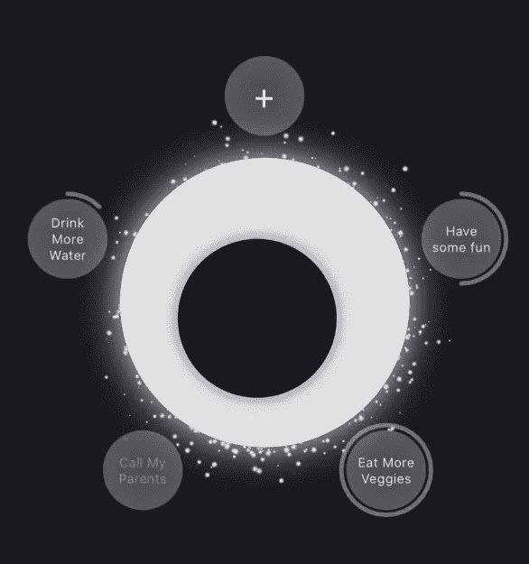
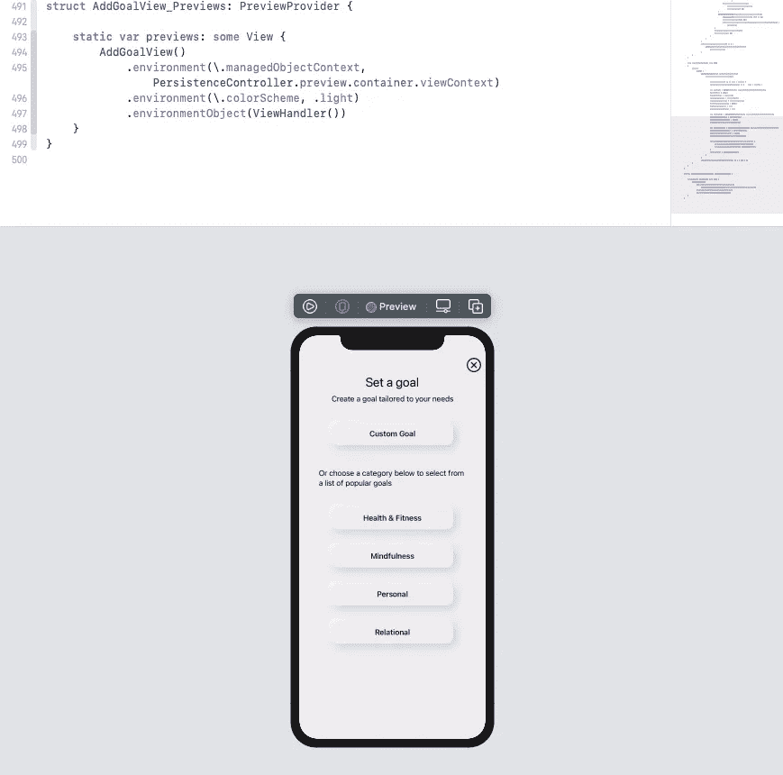

# 我从构建我的第一个 SwiftUI 应用程序中学到了什么

> 原文：<https://medium.datadriveninvestor.com/what-i-learned-from-building-my-first-swiftui-app-293b6a56cfb5?source=collection_archive---------12----------------------->

在多年使用各种跨平台框架向苹果的 AppStore 发布游戏和应用程序之后，我决定为我的下一个应用程序 [Apoklisi](https://apps.apple.com/app/apoklisi-daily-goal-tracker/id1527930366) ，我将切换到一种本地方法。SwiftUI 看起来很有前途，所以我决定试一试。Apoklisi 是一个每日目标和习惯追踪器。这个概念很简单，但是[界面非常独特](https://medium.com/datadriveninvestor/this-app-solves-the-biggest-problem-with-apple-watchs-rings-using-tech-from-westworld-28954480612b)，我知道会有一些障碍。

与其他习惯追踪器不同，Apoklisi 使用日蚀来显示你的进展。一次全食意味着你正在实现你的目标。错过这些目标会导致月球偏离太阳。也有粒子和特效用来描绘这种混乱。我不确定 SwiftUI 是否足够成熟来处理它。

Apoklisi was built entirely using SwiftUI

我应该指出的是，虽然我以前发布过 AppStore，但 Xcode 对我来说还是陌生的。在 Apoklisi 之前，我从未直接在 Swift 中编码或利用任何 API。

# SwiftUI 和我以前用过的任何东西都不一样

我来自 MVC 背景，在那里我习惯于控制器接收输入，输入由模型处理，输出被发送到视图进行渲染。SwiftUI 是一个声明性的、基于状态的框架，一切都发生在一个视图中。它由苹果的 Combine 框架提供支持。花些时间去适应是一种保守的说法。如何在视图中操作输入，以及如何实时运行复杂的算法，并不总是显而易见的。更复杂项目的学习曲线相当陡峭。这主要归功于下一点。

# **文档质量差**

我们目前处于 SwiftUI 的第二次迭代中。虽然苹果在其开发者网站上有一些很棒的教程和这些教程的支持文档，但实际上也仅此而已。一旦你在地面上运行，缺乏额外的文件是一个很大的挫折。我不得不通过反复试验和大量的调试来解决很多问题。我花了几个小时，甚至几天的时间，在互联网的深处寻找能帮我的微小信息。一些关于如何做某些事情的非常基本的信息隐藏在 WWDC 的视频中，或者在旧的过时的非 SwiftUI 文档中，这只是如果你幸运的话，它存在。很多次，我登陆苹果文档网站寻找某个功能，却发现它只是一个存根，没有进一步的信息。这是一次多么可怕的经历，我怎么强调都不为过。

# 即使是最困难的任务也只需要一小部分代码

虽然 SwiftUI 仍处于起步阶段，但苹果的生态系统及其 API 并非如此。很多时候，我预计我的应用程序的某些部分需要几天才能实现，结果却发现我需要的东西可以通过一行简单的代码来完成。我最喜欢的东西之一是 NSPersistentCloudKitContainer，它允许你将数据本地存储到数据库中，并通过 iCloud 自动在设备之间同步数据。这意味着我可以在手表上跟踪我的活动，并且在几秒钟内就可以在手机上看到结果，而无需点击任何东西。这让我耳目一新，改变了我的游戏规则。在我最好的估计中，如果我没有使用 SwiftUI，Apoklisi 至少需要二十倍以上的代码来完成我的工作。它是如此之轻，以至于即使有 iCloud 和数据库支持、小工具、黑暗模式和所有其他功能，最终产品的重量也只有 1.5MB。相比之下，当我使用 Unity 时，一块空白画布的时钟超过 35MB。

> 在我最好的估计中，如果我没有使用 SwiftUI，Apoklisi 至少需要二十倍以上的代码来完成我的工作。

# **SwiftUI 还不够成熟**

我前面提到的 NSPersistentCloudKitContainer 方法有一个未记录的警告。只有当应用程序在前台时，数据才会同步。我有一个边缘情况下，我需要它在后台同步。苹果告诉我，如果没有复杂的解决方案，目前这是不可能的。早期采用者的风险，对吗？还有一些其他的例子，我不能很容易地做我想做的事情，因为框架还没有完全到位。凡事都有解决方案，但它们没有 SwiftUI 所倡导的便捷性。

# **测试异常困难**

让我们面对现实吧，很多时候，开发人员会跳过测试，因为它太复杂或者会给项目增加太多时间。总的来说，测试有点痛苦。SwiftUI 更上一层楼。苹果网站上没有如何测试 SwiftUI 的例子。苹果似乎希望你通过预览功能来测试你的观点。当你有几个视图时，这很好，但是随着复杂性的增加，这是不可持续的。幸运的是，单元测试您的逻辑非常简单。当涉及到测试你的观点时，它还不存在。

# **预览，在大多数情况下，工作真的很好**

SwiftUI 最大的卖点之一是能够实时看到视图的更新。这种方法有一些注意事项。你确实可以在预览中看到代码的变化，这太棒了。当你组装一个由一堆子视图组成的主视图时，事情开始变得棘手。很多时候，这需要您重新构建应用程序来查看更改，尤其是在更改子视图时。这不是一次可怕的经历，只是没有想象中那么美好。某些功能在预览中也不起作用，例如 iCloud。不过没关系，预告片不是为了这个。

# 作为一个优秀的编辑器，Xcode 落后了

这和 SwiftUI 有什么关系？如果你想使用预览功能，你需要使用 Xcode。不幸的是，Xcode 不是一个很好的编码编辑器。它很好，但是它开始显示它的年龄。过去几年我一直在使用 Visual Studio 代码，很多自动化和快捷方式在 Xcode 中是不可能重现的。Xcode 中的格式也很原始。有插件可以帮忙，但它们通常只在编译后执行，对我来说已经太晚了。

# **当 SwiftUI 正常工作的时候，感觉就像变魔术一样**

一旦你克服了我提到的所有障碍，你就有了一个框架，这显然是应用程序开发的未来。应用程序开发中的许多繁重工作已经为您完成了。你只需要专注于构建一个令人惊叹的应用程序，而不是细节。当它起作用时，真的感觉像魔术一样，而且在大多数情况下，它确实工作得很好。这意味着您可以立即启动并运行您的应用程序，让您可以专注于轻松添加更高级的 API，如机器学习。SwiftUI 还与整个苹果生态系统跨平台，因此您可以在 iOS、iPadOS、watchOS、tvOS 和 macOS 上发布基本相同的代码。

# **结论**

我喜欢 SwiftUI 吗？绝对的。我推荐吗？带着一些犹豫。我认为在两年的时间里，SwiftUI 将成为一个令人难以置信的框架，让编码变得轻而易举。不幸的是，如果你正在做一个比原型更复杂的东西，文档的缺乏会让你很难进入。虽然它可能还不够成熟，但我确实使用 SwiftUI 为 iPhone 和 Apple Watch 推出了 Apoklisi，它做了它应该做的事情。

如果你想了解 Apoklisi，你可以在 AppStore 中找到它。如果你喜欢这篇文章，请随意鼓掌或发表评论。编码快乐！