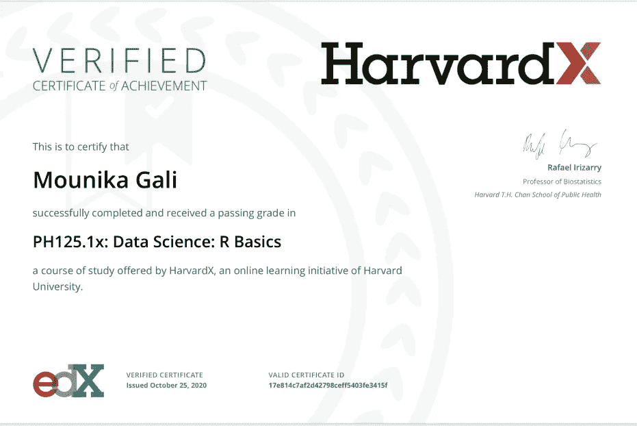

# 我从哈佛的数据科学基础课程中学到了什么

> 原文：<https://medium.datadriveninvestor.com/what-i-learned-from-harvards-data-science-r-basics-course-6a1689f06fbb?source=collection_archive---------7----------------------->

数据只是一个数字的集合，直到你把它转换成一个有影响力的故事。一旦你理解了这些数据，你就能做出更好的决策。

我一直对数据的力量着迷，这促使我报名参加了哈佛大学提供的在线数据科学项目。为了获得这一数据科学专业证书，您需要完成 9 门课程，包括一个顶点项目。

最近，我成功地完成了这个名为“数据科学:R 基础知识”的数据科学项目的第一门课程。这是我第一份常春藤联盟学校的证书。所以，耶！

**课程结构**

我在这里分享一个高层次的课程概述，给那些可能有兴趣学习这门课程的人。本课程分为 4 个部分:

*   第 1 部分:R 基础知识、函数和数据类型
*   第 2 部分:向量，排序
*   第 3 部分:索引、数据争论、绘图
*   第 4 部分:编程基础

第 1 节向您介绍 R (R 是一种开源编程语言，类似于 Python)。本节涵盖了所有基础知识，包括如何安装 R 和 RStudio。

第 2 节向您介绍向量和函数，如排序。您将学习创建数字和字符向量，排序向量和执行向量之间的算术运算。

第 3 节介绍 R 命令和技术，帮助您讨论、分析和可视化数据。您将了解如何过滤数据集、创建数据框、修改数据表、使用 dplyr 处理数据以及使用箱线图、直方图和散点图可视化数据。

第 4 节关注基本的编程概念，如“if-else”和“for-loop”命令。每个部分都有多项评估，以确保您理解这些概念。你需要获得及格分数才能获得课程结业证书。

总的来说，这是一次很好的学习经历。在选修这门课之前，我有过一些与 R 打交道的经验。然而，我不认为完成这个课程需要预先的编程知识。

我已经在我的数据之旅中迈出了下一步，也许，你也应该，在我们今天生活的日益数据驱动的世界中保持领先！