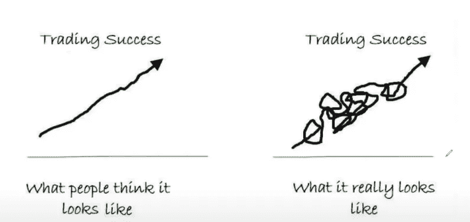

# 我从日内交易中每月赚 174，083 美元学到了什么

> 原文：<https://medium.datadriveninvestor.com/what-i-learned-from-making-174-083-a-month-from-day-trading-911f447e542f?source=collection_archive---------7----------------------->

source: pixabay.com

我从日内交易中每月赚 174，083 美元学到了什么？我登录了我的交易账户，显示我这一年的利润，略高于 200 万美元。建立之后，许多人开始给我发信息，打电话给我，问我，你能和我们分享一些东西吗？你学到了一些东西，可以给我们指明正确的方向，告诉我们如何达到某个水平？从一年的交易中赚一百万、两百万、三百万或者其他什么需要什么？所以我像你一样。我写了这篇文章。

首先，我想澄清每月 172 000 这个数字。我想把重点放在每月 172，000 美元的交易上。我想让你明白，你不打算做的交易会持续几个月。是的，在标题中，它说我如何每月挣 172000 美元。老实说，我一个月挣不到 172 000 英镑。我有几个月赚了 30000 到 400 000 美元。我有几个月赚了 5 万美元。我已经有几个月每月挣 25 000 美元了。到年底，相当于 200 万左右。但是每个月是 172 000 美元。

我的观点是，作为一个交易者，你不会有连续几个月的日内交易，就像我从没见过任何人这样做，我也没遇到过这种情况。也许有人在日内交易中赚了数百万美元，但他们永远不会分享他们的策略。也许有人一个月挣 10，20，30，000 美元，但对我来说。我没看过。所以，我在交易中所看到的是我希望你们在进入我想关注的四个话题之前首先理解的，第一个。你不会有持续的 10k 20k，就像交易不是那种你可以按比例调整的业务，你会有一个月赚 10k，然后你会想下个月我想赚 20，然后我想赚 30，然后我想赚 40。交易看起来不像。我从来没有见过任何人的股票曲线是这样的，我的意思是，作为一个交易者，你首先要明白的是，你不会从市场中获得一致性。我认为这是让许多交易者心理混乱的一件事，这是一件事。我想让你们明白。

# 贸易之旅

对于所有刚开始的交易者，你必须明白你的交易成功是这样的。

Source: image by author

甚至我也遵循了今年的 2 号图表。你知道，我在几个月里觉得自己什么都知道，然后在几个月里觉得自己没有信心，事情变得不对劲。但是你必须明白，交易是一个你不断学习的游戏，要想有高水平的表现，你必须不断调整，在游戏中处于领先地位。如果你不在游戏的顶端，你不经常调整，作为一个交易者，你会开始有很大的问题，对吧，你必须明白，你会经历这样的情况，你有两个星期合适的交易，然后一个打嗝。现在，当这种情况发生时，你需要非常清楚发生了什么，你必须能够重新振作起来，根据市场进行调整和调整，今年我在自己身上也看到了这种情况。我会有一个很棒的一周，一个很棒的一个月，需求会发生变化，也许我的个人生活会发生变化，也许一些事情会开始影响我的交易，如果你没有足够快地意识到这一点，从你的心理角度来看，你的交易会开始受到打击，一旦你的交易开始受到打击。如果你不休息一下，如果你不花足够的时间让自己恢复，你将会毁掉你的整个账户。所以这是理解交易者旅程的一个重要部分，无论你在交易者的旅程中如何，人们永远不会结束，就像永远不会结束一样。我还在努力。交易 30 年的人还在。没关系。你必须明白这个旅程需要时间，而且你必须不断地这样做。就像交易不会是一场简单的游戏，就像那不会发生一样。你会打嗝的。当你在中间变得混乱的时候，当你已经钻孔的时候，你将已经击中。学会重新振作起来；学会休息。有时候休息一下是你作为交易者能为自己做的最好的事情之一。

> 就像交易不会是一场简单的游戏那样不会发生你会打嗝当你有击打的时候你会击打当中间变得混乱的时候学会振作起来学会休息有时候休息是你作为交易者能为自己做的最好的事情之一。

# 像做生意一样对待交易:

当你像做生意一样对待交易时，那么需要遵循一些步骤:

1.  **选择潜在市场。**

今天几乎可以交易任何东西。这就是为什么我建议关注你最了解的市场。你在 IT 部门工作吗？然后查看你非常了解的 IT 公司的股票价格。如果你的工作与任何可交易的东西无关怎么办？然后你就可以随时交易你国家的经济甚至货币。

2.**想出一个计划**

如果你有计划，一切都会变得更好。日内交易可能对你有效，也可能无效。然而，你应该分配一些时间和资金来进行测试。万一你的测试失败了——继续前进，尝试不同的东西。我建议每个人投资不少于 1000 小时的日内交易，然后再决定是否去做。你的资金规模通常取决于市场，但我认为这并不重要。选择你能承受的损失金额。

**3。尝试我们不同的策略**

谈到日内交易，你可以使用很多策略。你可以试试技术分析，基本面分析，波浪分析，各种交易机器人，自定义指标。本质上，日内交易获得好的结果只是一个试错的过程。你需要选择最符合你心态的策略，然后看看你是否能适应不断变化的市场条件。

*   在你下挂单之前，知道你将在哪里出场(在什么价位)。
*   头寸规模，这样损失不会超过你账户的预定百分比。这个百分比应该是这样的，即使出现缺口，也不会对你有太大影响。
*   随时控制损失。利润会自己照顾自己。
*   确保风险回报比令人满意，你的交易系统有优势。这可以通过你的回溯测试结果来衡量。
*   回溯测试和更多的回溯测试。如果一个交易想法在后验测试中取得了很好的结果，并不意味着它在实时交易中也会表现很好。但是如果一个交易想法在回溯测试中没有给出好的结果，它在现实中就不值得交易。回溯测试不是为了选择一个好的策略。这是为了拒绝不太好的。
*   制定策略时避免过度适应。如果一个规则没有任何理论支撑，那么你就是过度拟合了。并且不要有超过 2 或 3 个独立度。
*   从小规模开始，稳步增加账户规模。
*   找到交易之外的生活，享受生活。让场外交易变得有价值、有意义。你在交易室外的生活和你的交易一样重要。

**4。多多练习**

> 熟能生巧。经过长时间的练习，我们的工作会变得自然、熟练、迅捷、稳定。

如果你在一周甚至一个月内获得非常积极的结果，这可能并不意味着交易真正资金的时机已经到来。总要让自己在虚拟账号上有一些像样的练习。尽管如此，你交易真实资金和虚拟资金的感受是完全不同的。因此，如果你永久地转移到一个真实的账户会有所帮助，但你必须从一点余额开始。

# 推荐文章:

 [## 改善市场策略的五大交易书籍

### 市场心理学书籍可以改善你的交易策略

medium.com](https://medium.com/datadriveninvestor/top-5-trading-books-to-improve-market-strategies-76c318d90482)  [## 为什么你应该在日内交易时忽略基本面

### 无论你是交易外汇、股票还是期货，不要被基本面分析分散注意力。而基本面是…

medium.com](https://medium.com/datadriveninvestor/why-you-should-ignore-fundamentals-when-day-trading-23a3874cd6b0)