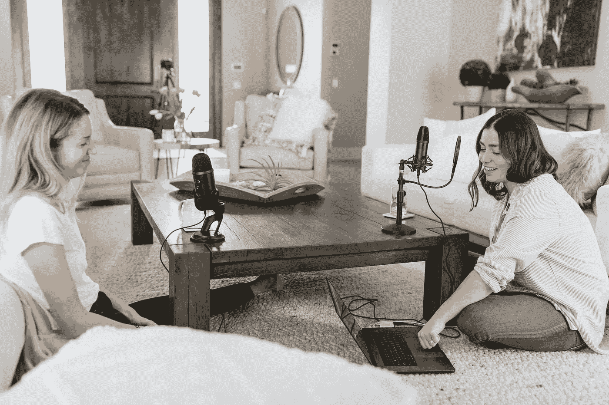

# 我从我的前三个播客中学到了什么

> 原文：<https://medium.datadriveninvestor.com/what-i-learned-from-my-first-three-podcasts-56dbf7392807?source=collection_archive---------28----------------------->

## 不要为了钱而加入。

Photo by [Kate Oseen](https://unsplash.com/@kateoseen?utm_source=unsplash&utm_medium=referral&utm_content=creditCopyText) on [Unsplash](https://unsplash.com/s/photos/podcast?utm_source=unsplash&utm_medium=referral&utm_content=creditCopyText)

我坐在宿舍里和男朋友打电话。突然，我想到了一个主意。马上，我知道我必须这样做。我有一个很棒的名字，一个很棒的概念，和一个很棒的态度——这是一个女孩真正需要的。

 [## 健身房 10 年的 10 条人生经验|数据驱动的投资者

### 走错一步，他们就会掉下去。两位登山者优雅地回到了地面。他们在那里…

www.datadriveninvestor.com](https://www.datadriveninvestor.com/2020/02/03/10-life-lessons-from-10-years-in-the-gym/) 

四周后，三个播客发表了，我有了五个剧本。而且我很确定大部分都是我和我男朋友发的。有些人会气馁，但我觉得解放了。原因如下:

播客让我重拾声音。是的，我每天都在 Medium 上写文章，表达想法和观点。但是播客给了我一个在数字时代分享我的想法的新视角。感觉就像是一场我可以自由真实的对话。

我在播客中的真实性为我的创造力提供了一个新的出口。因为我进入播客不是为了钱或名声，我觉得我完全可以控制我想说的话和我想让我的“品牌”看起来像什么。不像《灵媒》,我不觉得有聚焦观众的压力。我觉得我这辈子终于可以走出盒子了。

现在，我正处于充满希望的阶段，在这个阶段，我可以完全控制我的信息和形象。我不觉得有必要努力成为除我之外的任何人。通过不追求成功的理想(财富和名誉)，我找到了自由。我发现了一个有趣的爱好，可以和别人互动。

慢慢地，我试图建立我想要的播客的中心主题。目前，我的播客关注我的生活和心理健康。这使得播客也成为我的情感出口。我希望分享我的想法能帮助其他人。

我可能和*叫她爸爸*不在一个层次上，但是，嘿，也许我会到那一步。

*如果你有兴趣看看我的播客，你可以在 Spotify、Anchor 等网站上找到 TraumaTastic。你可以在这里找到最新一集* [*。*](https://anchor.fm/abigail-peeleryoung/episodes/Self-Care-Versus-Self-Destruction-ekmdue)

## 访问专家视图— [订阅 DDI 英特尔](https://datadriveninvestor.com/ddi-intel)