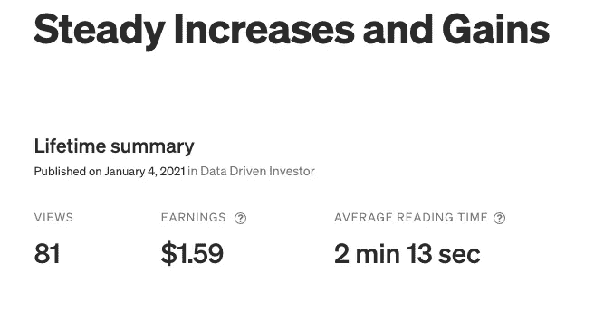
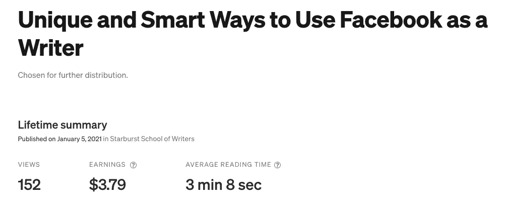
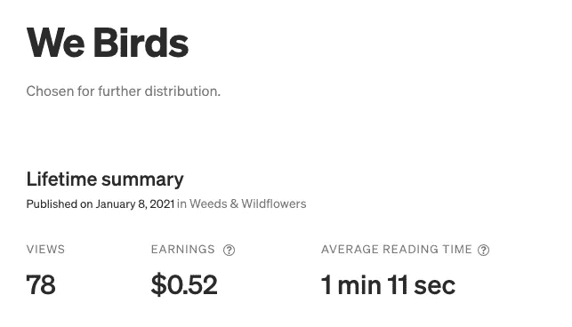
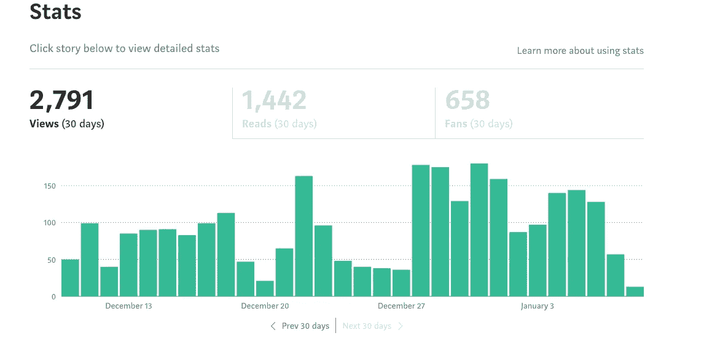

# 我学到的是在 5 天内赚 19.20 美元

> 原文：<https://medium.datadriveninvestor.com/what-i-learned-making-19-20-in-5-days-on-medium-52eaf969dca6?source=collection_archive---------10----------------------->

## 我只发表了 4 个故事，在网站上花了不到 5 个小时就做到了这一点。

Photo Credit: By author Aigner Loren Wilson

在我进入实质性问题之前，我想向那些没有跟随我的旅程在媒体上获得被动收入的人介绍一下我自己。

以下是本系列之前的文章，供那些希望绘制图表并看到上升趋势的作者参考。

第一周:

 [## 通往 100 美元一天的路

### 实际上，每天写一篇高质量的故事，并与其他作家互动，会让你在媒体上赚很多钱吗？

aignerloren.medium.com](https://aignerloren.medium.com/road-to-100-a-day-a6639624eab2) 

第二周:

 [## 参与、传播和调整

### 我从 5 天内策划了 7 件作品而没有写任何新内容中学到了什么。

aignerloren.medium.com](https://aignerloren.medium.com/engagement-spread-and-tweaking-650ef9be1fc3) 

第三周:

 [## 抽身反思

### 如何以有意义的方式参与和写作，从而获得更大的成功。

aignerloren.medium.com](https://aignerloren.medium.com/pull-back-and-reflect-3be407367ce) 

第四周:

 [## 稳定的增长和收益

### 在我达到 100 美元/天的旅程中，最大的收获是忠诚的读者，良好的阅读和每日增长。

medium.com](https://medium.com/datadriveninvestor/steady-increases-and-gains-a3aced2e13ee) 

对于不关心旅程的人，快速回顾一下:

我是一名专业作家，在 Rue Morgue、Terraform、Discover Pods 等网站都有作品。我也为作者和出版物做专业编辑。所以，我擅长写作，有扎实的实践，我来这里是为了看看媒体到底是什么。

上个月是我在 Medium 上的第一个整月，我赚了不到 40 美元。你可以在上面列出的我以前的文章中读到更多。我一月份的目标是每天赚 93 美元或 3 美元。

## 5 天内赚了 19.20 美元

在上周的帖子中，我让读者和关注者知道，我将每天多次退出发布。我的重点将转移到阅读更多内容，并与平台上的其他作者和读者互动。

这一新转变背后的想法是，通过把我的时间给别人，我将为别人打开大门，让他们对我的工作做同样的事情。虽然在不到一周的时间里赚到不到 20 美元是很多作家都想实现的目标，但当我看到我计算出的一周收入时，我的直觉下降了。

> 我怎么可能只在花时间阅读别人的作品和发表 4 篇高质量的文章时取得了这些成就，其中大部分都是策划好的？

我的统计数据变得更糟了。在我看来，我并没有通过新策略赚更多的钱，而是更少了。上周的帖子都是我认为会做得很好的，从技术上来说，他们做得很好，只是我不喜欢。

自己看:

 [## 稳定的增长和收益

### 在我达到 100 美元/天的旅程中，最大的收获是忠诚的读者，良好的阅读和每日增长。

medium.com](https://medium.com/datadriveninvestor/steady-increases-and-gains-a3aced2e13ee) 

Screenshot by author

 [## 独特和聪明的方式使用脸书作为一个作家

### 作为一名作家，如何利用脸书来扩大你的读者群和人脉。

medium.com](https://medium.com/starburst-school-of-writers/using-facebook-as-a-writer-6e88d5f41c78) 

Screenshot by author

 [## 展示你小说中人物发展的 8 个对话技巧

### 不要用生硬或陈腐的对话让你的读者厌烦，开始像专业人士一样写作吧。

medium.com](https://medium.com/starburst-school-of-writers/8-dialogue-hacks-to-show-character-development-in-your-fiction-9923356c7669) 

Screenshot by author

 [## 我们鸟类

### 你是否曾经是那种当星星死去，太阳和月亮熄灭时，在鸟儿中漫步的人？

medium.com](https://medium.com/weeds-wildflowers/we-birds-9ba53f4946dd) 

Screenshot by author

## 我学到了什么

即使是中等收入的高收入者也不会花时间在这个网站上阅读别人的作品。我在这个网站上 1%的高收入作者接触的地方制造了足够多的轰动。

我从与他们的交谈中了解到，他们不阅读或接触其他作家。他们专注于与同级别或比他们高的其他专业人士交流。参与对他们来说是一个眼球转动的话题。

> 对高收入者来说，这一切都是为了策展和出版。

我最近试图更多地关注参与，而不是出版，这证明了他们是对的。事实上，媒体上的 1%收入者很少分享或参与面向媒体作者的 Facebooks。那些松散地活跃在这些页面上的人不会阅读你的作品。

他们浏览了一下，突出了一个随机的短语，留下了一些掌声。就是这样。仅仅一分钟花在你的故事上，他们就在这个网站上赚了数千美元。他们甚至不回应评论。

我不想成为那些不与读者联系的作家之一，他们与读者的距离如此之远，他们听起来就像一个机器人在重复 SEO 关键词和短语。

但我想看看我是否能摆脱这种对我的作家和读者同伴的漠视。过去一周，我写了一些关于脸书和性格发展的顶级文章，我试着做了一些高收入者的策略。

这两个是我本周和有史以来收入较高的，因为他们在第一天就有很多阅读量，读者在他们身上花的时间超过一分钟，并有望在未来继续赚钱。

然而，我失去的是追随者的参与，电子邮件注册，以及我自己与媒体及其作者联系的意识。我没有压碎它。我是假装的。

所以，我停下来了。快到周末的时候，我开始参与并再次发帖。这让我的数据从 80 多回到了几百。越来越多的人开始关注我，我有望在月底前突破 1000 名粉丝。

仅仅是参与就伤害了我的分数。仅仅是出版帮助不大。这两者结合在一起才是真正适合我的。

是的，你可以在这个网站上发表大量文章，不与任何人接触，赚些钱。但是我不想只是为了赚钱。我想:

*   发展追随者
*   获得忠实用户
*   构建我的网络

我明白了，要做到这一点，你必须两者兼顾。

## 走向

在 12 月份，我每周至少发表 5 篇文章，并且经常会超出两倍或三倍。不过，我想退出，因为我觉得我的一些作品在我所有出版的乌合之众中迷失了。

到上个月底，我已经发表了 60 篇文章，拥有 700 名粉丝。我的上升趋势让我兴奋得晕船。

这个月，这种晕船已经转变了。

像任何优秀的创造者或商人一样，我不会让这个小小的挫折打击我的毅力或信心，我会改变我的做法。

在过去的 5 周里，我已经多次改变了我的策略，并且明确了哪些策略有效，哪些策略无效。考虑到这一点，我的新策略是从这个网站上我最喜欢的作家之一 [Christopher Kokoski](https://medium.com/u/7479aefa2a62?source=post_page-----52eaf969dca6--------------------------------) 那里偷来的。

克里斯托弗是一个新的作家谁赚取和从事。他努力工作，在每个岗位上都做得更好。

他最近写的本月到目前为止赚了 50 美元:

 [## 我在 Medium 上的收入又翻了一倍——下面是成功的例子

### 里程碑、见解以及如何“窃取”我的方法

medium.com](https://medium.com/writers-blokke/my-earnings-on-medium-doubled-again-heres-what-worked-ff242f56d010) 

我将在一周内每天发布两次，早上一次，晚上一次。我仍然会在网站上阅读并与关注我和我所关注的作者交流。我的目标是坚持在出版物上发表文章，同时为自己的出版物专门撰写几篇文章:

 [## 星爆派作家

### 一个创造性的写作工艺的出版物，为作家谁想要成为他们的艺术大师，并吸引他们的读者…

medium.com](https://medium.com/starburst-school-of-writers) 

## 你的外卖

***如果不看别的，看这个:***

中等收入可归结为:

*   每天发布多次
*   通过在出版物上发表来获得更多的观点

然而，发展你的职业和观众需要:

*   每天发布多次
*   通过在出版物上发表来获得更多的观点

和

*   与你所在领域的作家和读者互动
*   撰写旨在改善他人的知识内容

[*艾格纳·洛伦·威尔逊*](https://mailchi.mp/96c4fc187b6d/y3g98x12da) *是一位酷儿黑人 SFWA、HWA 和抄本作家。她被列入 2019 年其他奖学金的荣誉名单。她的作品出现在 Tor Nightfire，Rue Morgue，Terraform 等。她提供了一个* [*写作工艺简讯*](https://mailchi.mp/daa8adde6fec/d07l8sg9s6) *给那些想成为更好的作家和出版高质量作品的人。*