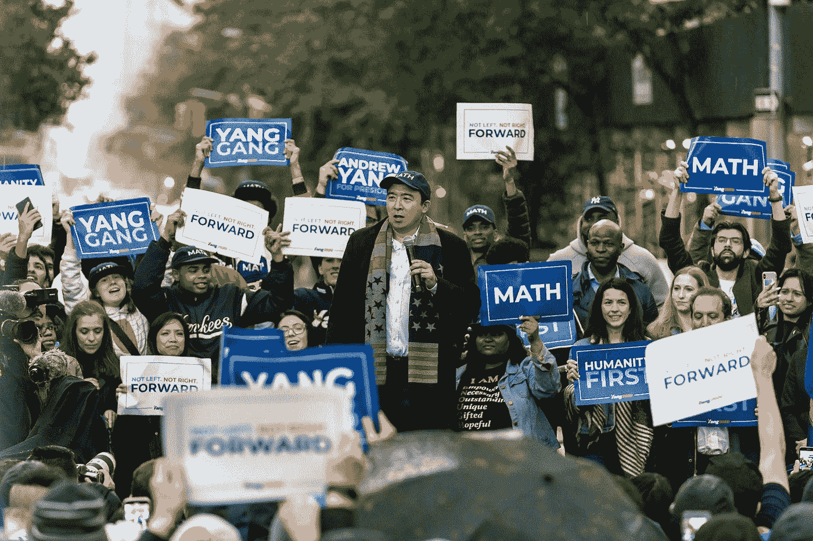

# 我喜欢杨安泽的地方

> 原文：<https://medium.datadriveninvestor.com/what-i-like-about-andrew-yang-4b7588daa3f8?source=collection_archive---------17----------------------->

## 自由主义者的观点

Photo taken from his campaign’s [Facebook Page](https://www.facebook.com/andrewyang2020/)

像我这样相信自由意志主义是支撑所有人类相互交往的理想核心基础的人，2020 年的民主党候选人还有很多需要改进的地方。我相信个人权利胜过国家干涉。因此，读者不可能将这篇文章解读为对杨安泽的支持。但如果你真的这么想，我想写一份免责声明:

> “这篇文章不是对杨安泽的支持，我也不想就他的个人政策展开辩论。我只是喜欢他在竞选中选择做的一些事情，并愿意谈论它们。”

Photo by [David Travis](https://unsplash.com/@dtravisphd?utm_source=medium&utm_medium=referral) on [Unsplash](https://unsplash.com?utm_source=medium&utm_medium=referral)

# 清楚

杨安泽，也许不同于历史上任何一位候选人，他在所有“热点”问题上都表明了自己的立场。他还通过自己网站的[政策部分](https://www.yang2020.com/policies/)公开了这些信息。在这里，他谈到了从堕胎到核能的每一个问题。如果你懒得在他的网站上浏览他的政策，而是想快速总结一下他对最具“争议性”话题的清晰观点:

## 福利

他提议巩固一些福利项目，并将增值税提高 10%，为“自由红利”提供资金，这将为每个 18 岁或以上的美国公民每月提供 1000 美元。

## 气候变化

就像其他民主党候选人一样，他在气候变化问题上的立场很强硬，但他的不同之处在于，他认为核能是一个有效的短期解决方案，并愿意投资于此。

## 投票改革

杨提议对投票进行一些激进的改革。他提议:

*   投票年龄降低到 16 岁
*   禁止选民身份证法
*   **排名投票；**每个人可以选择他们最喜欢的 3 名候选人，并从 1 到 3 进行排名

## 刑事司法改革

他计划使大麻合法化。这不像十年前那样有争议，但他真正突出的地方是他对阿片类药物的政策。他计划将阿片类药物非刑罪化，并为小罪犯提供治疗，而不是通过司法系统惩罚他们。为了增加透明度，他希望每个警察在执勤时都有一个摄像头。

## 枪支政策

与其他民主党候选人相比，他在枪支政策上更加温和。虽然有些人主张禁止枪支，但他计划为希望购买枪支的人增加更多的预防措施和筛选程序。

## 健康政策

像其他几位民主党人一样，他相信“全民医保”。此外，他打算资助更多的医疗技术创新。

## 教育政策

他的教育政策是非常标准的民主党政策，他打算帮助减少大学贷款负担，旨在降低大学费用。他的不同之处在于，他还打算在所有高中进行“生活技能”教育。

## 移居

像其他几位候选人一样，他想给美国现有的非法移民一个成为合法公民的机会。他的不同之处在于，他支持加强南部边境安全以减少非法移民，但同时也支持为那些需要庇护的人提供庇护。

## 免费咨询

他赞成向有需要的人提供免费的财务和婚姻咨询。即使对民主党人来说，这也是独一无二的。

Photo by [M. B. M.](https://unsplash.com/@m_b_m?utm_source=medium&utm_medium=referral) on [Unsplash](https://unsplash.com?utm_source=medium&utm_medium=referral)

# 展望未来

尽管大多数民主党候选人都专注于美国现有的问题，并找到扳倒特朗普的论点，而不仅仅是专注于这些话题，但杨也在解决我们在不久的将来必须解决的问题。

## 秘密党员

他意识到，美国在加密投资方面落后，其中一个很大的原因是他们的监管框架存在很多不确定性。他在这里就一个其他政客忽视的话题展开了讨论。他在自己的[网站](https://www.yang2020.com/policies/digital-asset-regulation/)上发布了:

> 作为总统，我会…
> 
> 通过以下方式促进立法，以明确加密货币/数字资产市场空间:
> 
> 定义什么是代币，何时是证券(例如，识别“实用代币”)
> 
> 定义哪些联邦机构对加密/数字资产领域拥有监管权
> 
> 在空间中提供消费者保护
> 
> 澄清拥有、出售和交易数字资产的税务影响
> 
> 促进全国范围内对 a 系列有限责任公司提供的保护的认可
> 
> 在可能的情况下，先发制人制定州法规，建立一个全国性的框架

## 数据保密

数据已经作为商品出售。杨是前瞻性的，他着眼于解决问题，而不是抵制这种商业趋势。他更倾向于建议用户从使用他们数据的公司获得利润分成。

## 技术部

杨计划创建一个新的执行部门，名为“技术部”，对人工智能等新兴技术进行风险评估，并根据需要进行监管。

 [## 保护主义、政治和经济动荡|数据驱动的投资者

### 美国股市昨日出现 400 多点的大幅反转，为未来的事情发出了警告信号。市场…

www.datadriveninvestor.com](https://www.datadriveninvestor.com/2018/06/28/protectionism-politics-economic-turmoil/) 

虽然我不同意其中的许多政策，但很高兴看到他不害怕在所有其他政客都在床底下清扫的新兴技术相关问题上采取立场，同时知道床底下的恶魔一直在这些问题上滋生，我们迟早都要处理这些问题。

作为一个主要写技术的博客作者，这种对新兴技术的共同兴趣是我不得不写杨安泽的原因之一。我写了一些关于这个话题的实验，但是我喜欢研究他的政策。如果你在我的逻辑推理中看到了一些意义，并且想阅读我对其他话题的想法，请关注我的媒体。