# 我喜欢特斯拉 Model 3 的地方是

> 原文：<https://medium.datadriveninvestor.com/what-i-love-about-my-tesla-model-3-4656adebf585?source=collection_archive---------2----------------------->

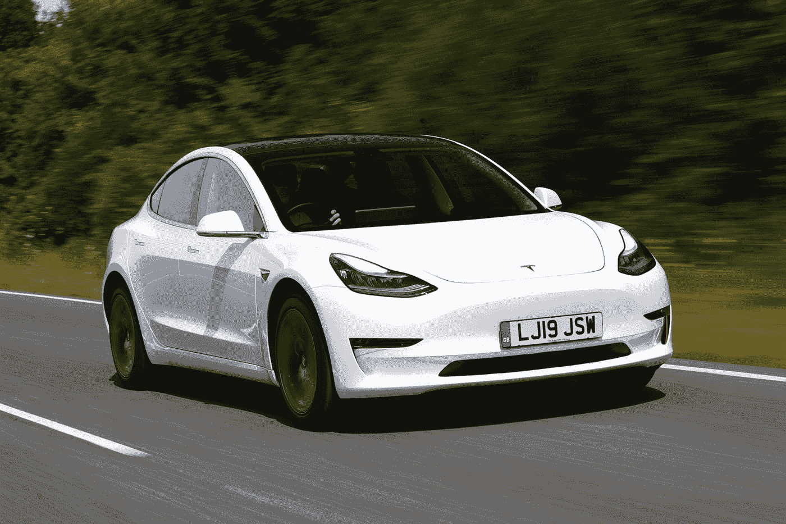

Image Source: Auto Express

埃隆·马斯克简直就是天才……

几天前，我写了一些我讨厌我的特斯拉 Model 3 的事情。这实际上是我决定要写的最难的文章之一。我真的用尽了所有可能的方法，试图找到足够的内容，把它变成一篇值得一读的文章。

关于这辆车，只有四件事让我“烦恼”。我对这辆车的所有四个问题都很小，从来没有真正困扰过我，但每个人都不停地问我迄今为止是否发现了任何我不喜欢这辆车的地方。

> ***看我上一篇:*** [关于我的特斯拉 Model 3 我讨厌的事情](https://medium.com/datadriveninvestor/what-i-hate-about-my-tesla-model-3-5af6648f6b21)

说到我喜欢的功能，几乎是说不完的。在软件更新、驾驶体验、用户界面之间，一切都近乎完美。

我可以很容易地把这篇文章变成 30 分钟的阅读，但我决定把它缩小到我最喜欢的 10 个功能。否则我们会整天在这里列出每一个功能。

**闪回:**

我于 2020 年 9 月获得了特斯拉的所有权，并已行驶了约 3000 英里。足够了解它，它是如何处理的，神秘的复活节彩蛋等等。

在我买特斯拉之前，我开了一辆 4 门吉普牧马人，所以从越野 SUV 到豪华轿车是一个巨大的变化。吉普牧马人无论如何都没有平稳的行驶，每加仑只能跑 13-14 英里，最高时速约为 80 英里。

我决定买一辆更舒适、更省油的车。虽然我有了一辆更好的车，但我不再需要去加油站，除了每两周左右给我妻子的车加一次油。

# 优点:

1.  ***简约却强大的内饰:***

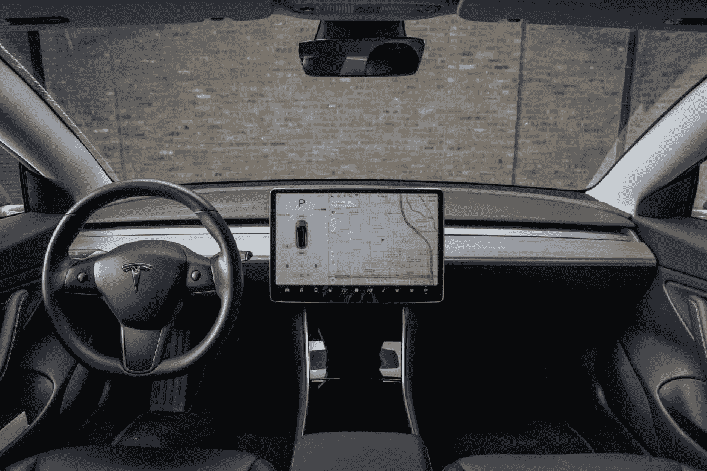

Image Source: Cars.com

Model 3 内部的简约设计可能是我最喜欢的汽车整体“东西”。在你的仪表板中央有一个巨大的显示屏，你可能会认为它会分散注意力，但在驾驶时，我只会看一眼它来检查我的速度或更换电台。

屏幕无所不能。你会注意到仪表板上没有任何按钮或旋钮，一切都是通过屏幕完成的。想调节温度？它在屏幕上。想打开座椅取暖器吗？它在屏幕上。

方向盘上只有两个杠杆。右手边是你的变形人。按下前进档，按下倒档，按下驻车档。左手边有你的亮度(这是自动的)和转向灯，你也可以把它推到挡风玻璃雨刷(也是自动的)。

无论你是想换首歌，调整汽车设置，还是让汽车进入代客模式&设置速度限制，这样代客司机就不能去兜风了，这一切都在屏幕上完成。

***2。只去加油站吃零食:***

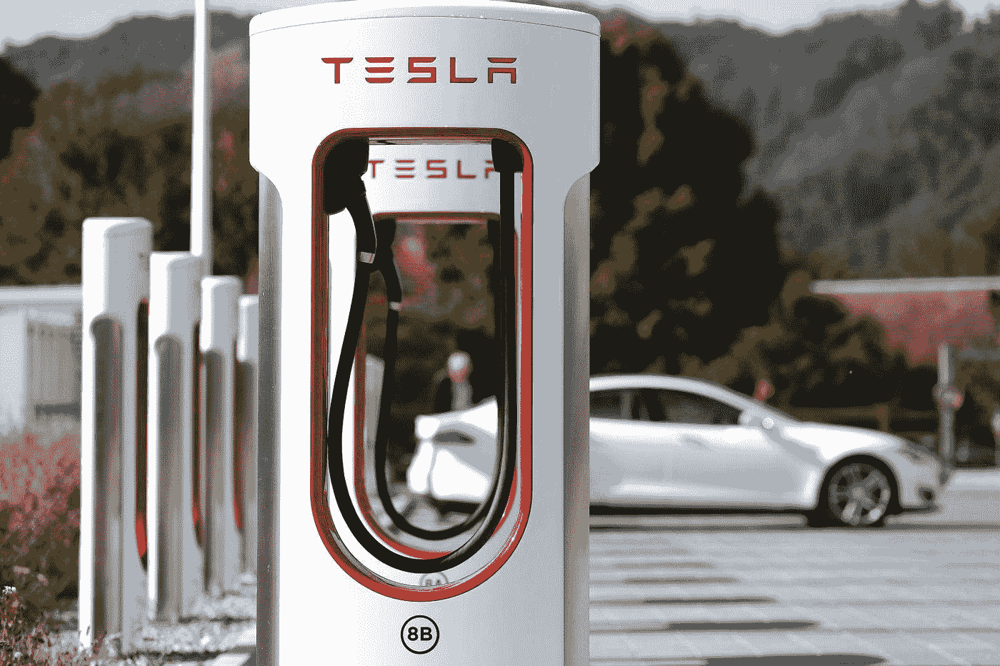

Image Source: Engadget.com

加油站已经是过去的事情了…我现在只在外出时去加油站喝点饮料或吃点小吃，需要一些东西支撑我直到回家。因为特斯拉是一种电动汽车，只是不像一些混合动力车仍然可以加油，我从来不需要去“加油”。

对于我真正驾驶的量来说，电池寿命是惊人的。我是自由职业者，在家工作，所以每次充电大约 300 英里就足够了。

当需要充电的时候，我可以在家里用标准插座插上电源，当我早上醒来时，我会有一个额外的 50 英里的充电量。

很多时候，我会去特斯拉增压器，因为它离我家只有 5 分钟的路程&充电快得离谱。我可以在 10-15 分钟内拉起电线上路，因为它的充电速度是每小时 500-600 英里&我从来没有耗尽我的电池。有人说等上 10-15 分钟才能回到路上可能很烦人，但它完美地引导我们进入下一个功能。

***3。屏幕娱乐:***

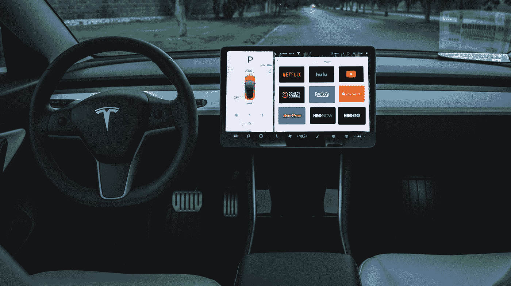

Image Source: Teslarati.com

特斯拉在你的屏幕上开发了一个娱乐标签，包括网飞、Hulu、YouTube、网络浏览器，甚至视频游戏。

因此，坐在那里 10-15 分钟，我可以很容易地打开 YouTube 视频&在视频结束时准备好摇滚，或者打开 Twitch。看一会儿我最喜欢的内容制作软件。

还有许多内置的视频游戏不是额外的升级。像辐射这样的主流游戏已经到了特斯拉&他们甚至有自己版本的马里奥赛车——沙滩车比赛。关于沙滩车比赛，仍然让我印象深刻的是，你实际上是用方向盘来驾驶汽车，加上巨大的显示屏，这是一段有趣的时光。

***4。*向月球爆炸:**

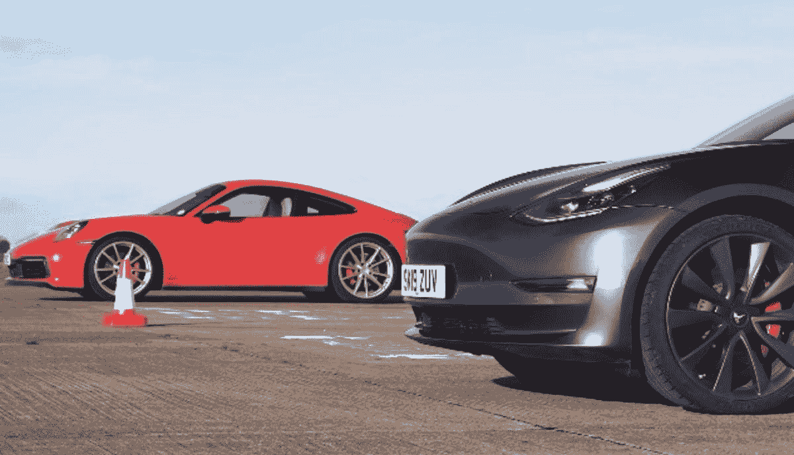

Image Source: Fossbytes.com

特斯拉的速度很快…

当我说快时，最新的车型是世界上最快的量产车。虽然我没有那种速度惊人的车，但当你踩下它时，这辆车仍然会让你感觉像是要起飞了。

特斯拉来自一辆搭载小型 3.6 升 V6 发动机的 Jeep 牧马人，拥有文件柜的空气动力学特性。从挖掘中起飞或不得不在商业道路上行驶从来没有这么容易过，当你一拳打出，你就会倒在座位上。

电动机产生一吨的扭矩，当你踩下油门时，这是一种完全不同于我驾驶或乘坐过的任何其他汽车的感觉。这感觉就像你在一架即将起飞的飞机上，或者在一个快速过山车上起飞。油门响应绝对没有延迟。下一次你在你的车里，踩油门(小心)，你会注意到汽车会降档(正常)，然后开始加速。特斯拉有了电动马达，它就不用换挡了，所以它可以简单地行驶。

***5。*百日咳垫:**

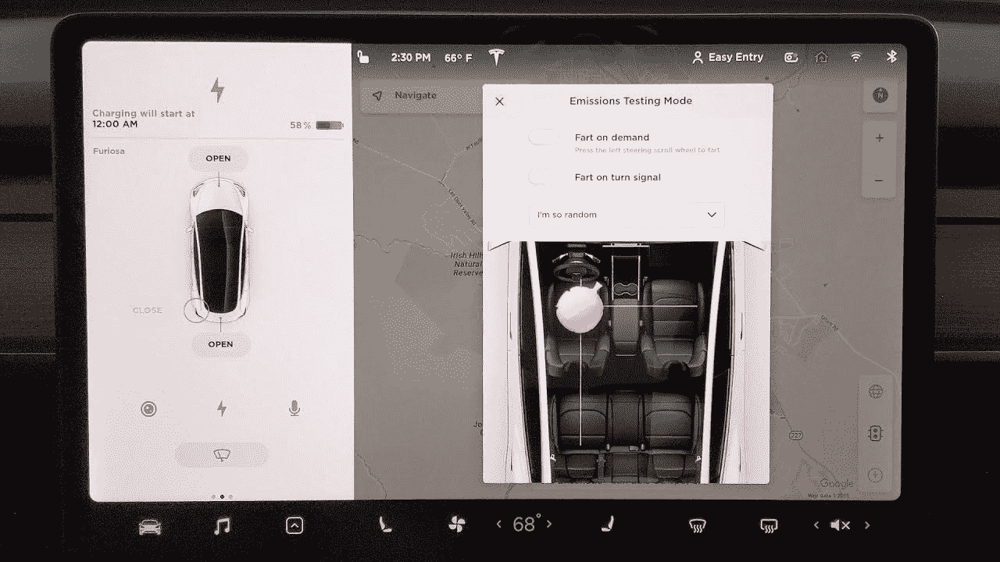

是的，埃隆·马斯克可能是互联网的巨魔和迷因之王。如果你在 Twitter 上关注他，你可能会看到他发布的一些搞笑的推文。“排放测试模式”又被称为放屁坐垫，这只是他让人们在意识到这一功能的作用后开怀大笑的又一次机会。

每当我的侄女上了我的车，她总是开始咯咯地笑，因为她知道在任何时候，听起来就像她刚刚让一个在后座上撕开。虽然我知道不是每个人都会觉得好笑，但她肯定会&她的笑声是有感染力的。

你不仅可以让你的车听起来像有人放屁，你还可以设置左手边的滚轮，在推入时发出放屁的声音。最重要的是，你还可以设置噪音来自哪个座位，这样无论你的受害者在哪里，你都可以给他们加油。

**⑥*。大灯亮得可以看见未来:***

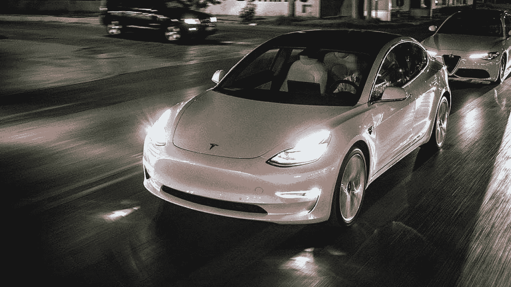

Image Source: Teslarati.com

我敢肯定，在某个时候，开车上路，你会看到一辆吉普牧马人(Jeep Wrangler)用类似聚光灯的东西作为前灯。作为拥有一辆牧马人的一员，我有点担心特斯拉的车头灯能否照亮道路。

设计和风格是圆滑的，但他们也照亮了道路，而没有完全蒙蔽其他司机。我的牧马人的问题是它坐得有多高，即使我开着近光灯，人们还是会以为我开着灯，不停地向我亮灯。有了特斯拉，汽车本身坐得更低，因此亮度是相同的，但你不会让每个路过的人都眼花缭乱。

在“我讨厌我的特斯拉 Model 3 的事情”一文中，我谈到了汽车远光灯有时不够敏感，但总体来说这是一个令人惊叹的功能。每当我晚上跳上我妻子的车，我就打开灯&希望看到车时它会自动关掉灯。我经常发现自己不得不甩开它们。因此，虽然它在极少数情况下令人讨厌，但它只是这辆车的另一个小奖励。

***7。手机 App &键:***

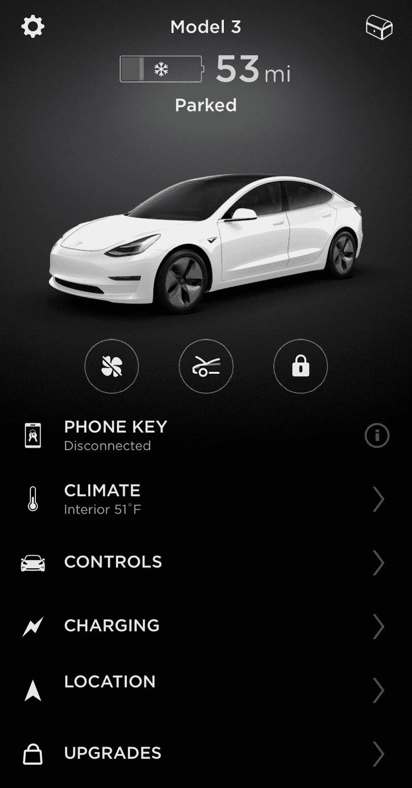

谁需要另一个应用程序…我们的智能手机和设备充满了杂物和垃圾，但移动应用程序是我最喜欢的拥有特斯拉的功能之一。

 [## 移动网络 O2 发布英国首个无人驾驶汽车实验室测试使用 5G 和…

### 随着时间的推移，技术越来越强大。我们不仅成功地登上了月球，我们现在…

www.datadriveninvestor.com](https://www.datadriveninvestor.com/2020/11/24/mobile-network-o2-launch-uks-first-driverless-car-lab-testing-driverless-cars-using-5g-and-satellite-technology/) 

通过手机应用程序，您可以在很大程度上控制整个汽车。无论你是想改变气候&预热你的汽车，打开座椅取暖器，为你的汽车充电做准备，还是打开后备箱，只需点击一个按钮。

但是如果我说你不再需要车钥匙了呢？

是的，你没看错，当我拿起我的特斯拉时，我没有收到一对钥匙，我被告知下载应用程序&有人递给我一张看起来像信用卡的东西。

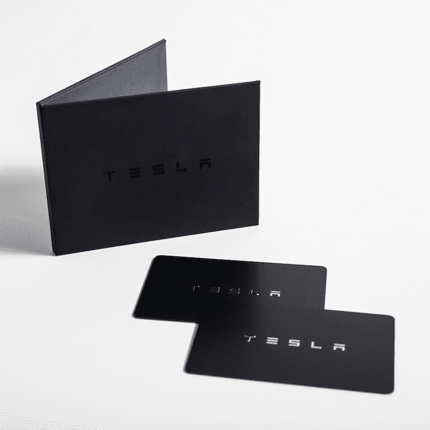

Image Source: Tesla.com

没有车钥匙，它是如何工作的？

你有两个选择。第一个是上面的黑卡。你只需把它对着汽车轻轻一点&它就会解锁，当你进入汽车，你把它放在中控台上，你就可以走了，没有按钮，没有启动汽车，只需把它放在驾驶位&你就可以走了。

第二个选择是手机应用程序，这是我唯一使用的东西。你通过蓝牙连接到你的汽车&它保护连接，当你走向它解锁的汽车时，你进入并离开。当你下车时，你不必锁车，只需走开，它会自动锁定并收起你的后视镜。

我对手机应用程序的唯一问题是我已经习惯了。当我开着我妻子的车时，有无数次我没有熄火就下了车&然后意识到我正在离开。

***8。***

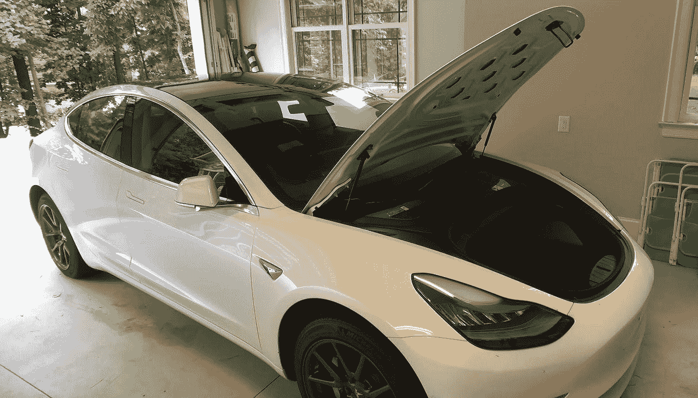

Image Source: Teslarati.com

弗伦克斯，弗伦克斯，弗伦克斯…

我一直认为在车的前部有一个行李箱是只有法拉利和兰博基尼才会有的功能，但是没有引擎意味着额外的存储空间。

拥有这个盒子最好的一点是它的材料。像大多数箱子一样，箱子里铺着地毯，但箱子是塑料的。这样，你就可以将靴子等潮湿多泥的物品放在里面，而不必担心地毯会沾上泥，便于清理。

***9。维护&服务:***

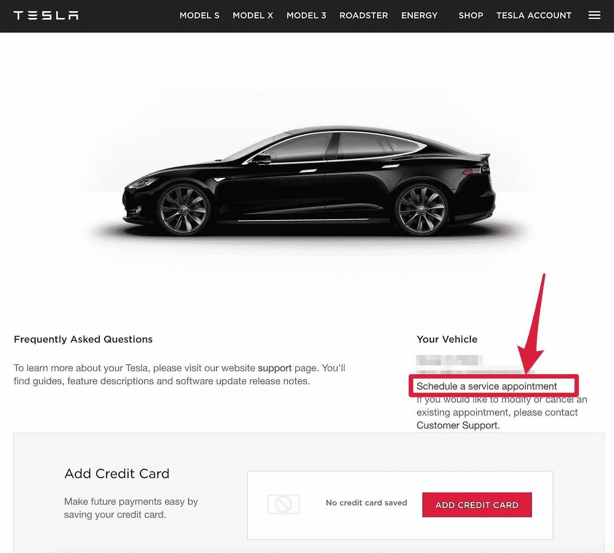

Image Source: Teslarati.com

内燃机车总是需要维修。不管是换油、同步带、刹车还是某个零件坏了。传统发动机上有许多运动部件，大量的石油和天然气经过，随着时间的推移会发生故障，可能会导致一些重大问题。

当我拿起我的特斯拉时，我问服务时间表是什么样的&我必须多长时间把它带进来一次。对于我妻子的车，我们每行驶 4000 英里就要换一次油和其他一些小的服务要求。当我问这个问题时，特斯拉的那个家伙只是笑了笑，停顿了一秒钟。他说每 10，000 英里更换一次轮胎&确保你有挡风玻璃清洗液。这辆车不用油，所以不需要换油&再生制动使刹车通常在磨损前就老化了。大多数人在他们的汽车需要更换刹车片之前已经行驶了大约 20 万英里，这绝对令人震惊。

***10。*驾驶体验:**

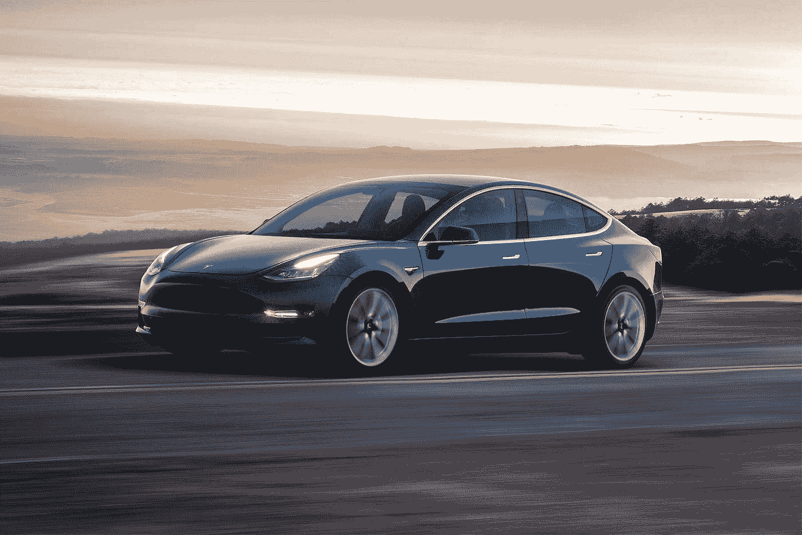

Image Source: Edmunds.com

寂静…没有马达的噪音，没有风的噪音，只有寂静。

在驾驶跑车和具有文件柜空气动力学的牧马人之后，拥有一辆如此安静的车是非常奇怪的。如果你曾经和某人交谈过，而他们正在车里使用蓝牙，你会听到汽车噪音。有一天我和我的阿姨&叔叔通电话，他们不知道我在车里，直到我说了一些事情。

不仅车内静音，车的整体乘坐感觉就像是在漂浮。牧马人的减速带让你感觉像在爬山，而特斯拉的减速带则让你在上面滑行。这辆车的一切都很平稳，加速，驾驶，刹车系统，转向，绝对一切都很完美。

***概述:***

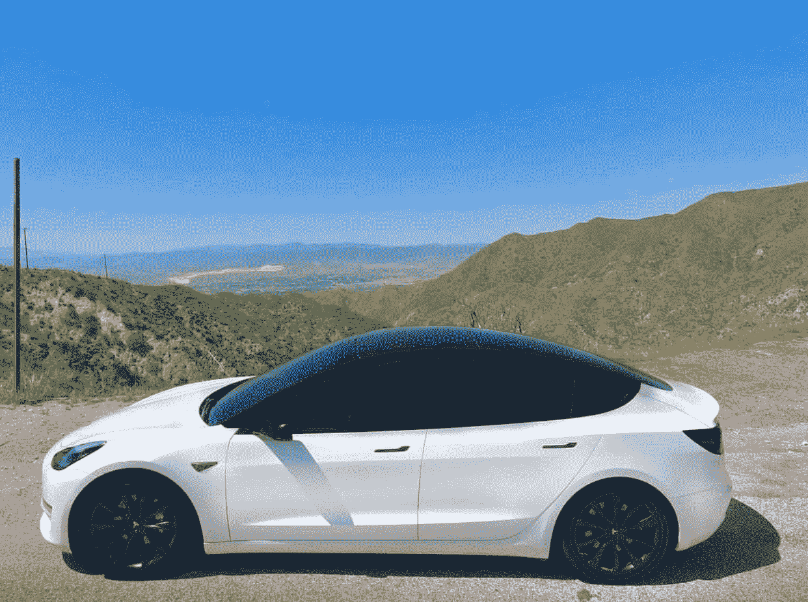

Image Source: Reddit.com

如果你正在购买一辆新车，并且你每天的行驶里程不超过 100 英里，你可能想去试驾一辆特斯拉。不过我要警告你，如果你试驾一辆，你可能会坠入爱河，所以要小心。

在拥有这辆车几个月后，我现在可以说，我怀疑我是否会拥有一个不同的品牌。在此之前，我一直梦想拥有一辆特斯拉，现在，我实现了。我明白为什么特斯拉是世界上最有价值的汽车品牌。质量显示，工程显示，赛车的一切基本上是完美的。有一些小事情我确实会调整，但它们是如此微小，我几乎从来没有想过，嗯，什么车是完美的，每辆车都有一些你希望你可以改变的事情。

**访问专家视图—** [**订阅 DDI 英特尔**](https://datadriveninvestor.com/ddi-intel)