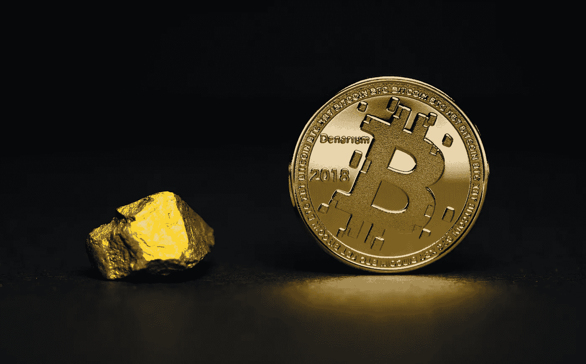
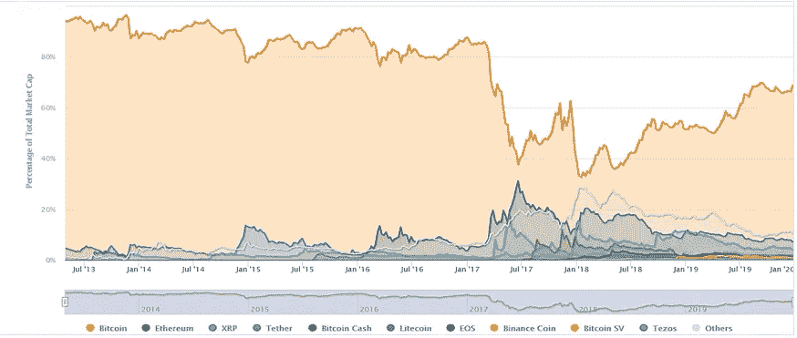
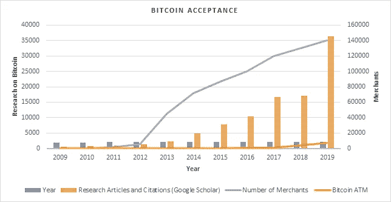
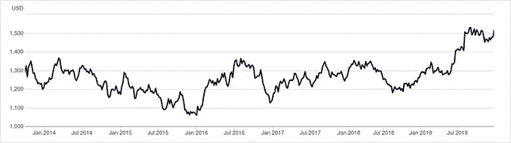
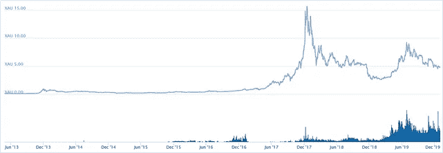
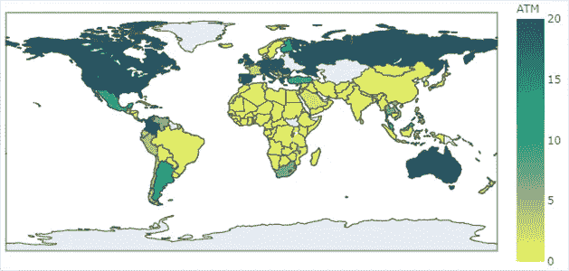
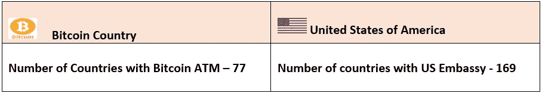
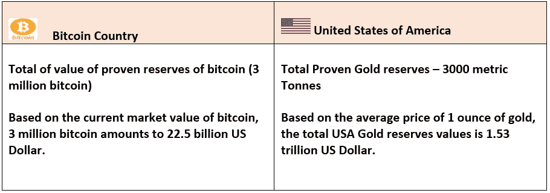
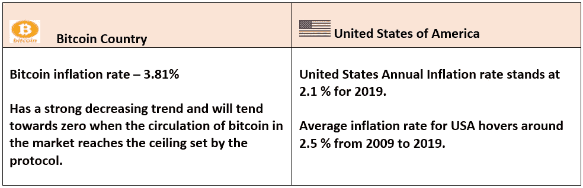
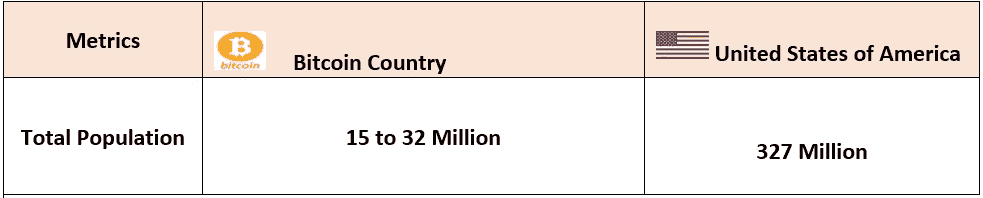

# 如果比特币是一个主权国家会怎样——比较分析

> 原文：<https://medium.datadriveninvestor.com/what-if-bitcoin-is-a-sovereign-country-a-comparative-analysis-51264163e302?source=collection_archive---------11----------------------->

Photo by [Aleksi Räisä](https://unsplash.com/@denarium_bitcoin?utm_source=unsplash&utm_medium=referral&utm_content=creditCopyText) on [Unsplash](https://unsplash.com/s/photos/bitcoin?utm_source=unsplash&utm_medium=referral&utm_content=creditCopyText)

**简介**

比特币于 2009 年作为加密货币推出，是区块链技术的首批成功实施之一。比特币从一开始就在各大洲的大众中引起了广泛的兴趣，我们可以从比特币相对于法定货币的不断升值以及不断增加的投资者群体中看到这一点。比特币技术不需要中央监管机构或第三方来监控和验证世界各地发生的交易。具有工作证明概念的智能对等验证机制能够验证整个比特币区块链的交易。

与法定货币相比，比特币的流通不受物理边界的限制，因为它基于全球区块链网络，它超越了人们可以在世界任何地方购买、出售和开采比特币的边界。这被认为是比特币技术的主要优势之一，因为它可以被视为第一种全球货币。

与其他加密货币相比，Bicton 拥有可观的市场份额，这可能是由于先发优势或专门的技术和社区支持。

Cryptocurrency Market Share (Source — Coinmarketcap.com)

从图表中，我们可以观察到，与其他加密货币相比，比特币一致性拥有更高的市场份额，除了在 2017 年，加密货币投资者试图将投资分散到以太坊等其他主要参与者。

**比特币作为货币单位的内在价值**

与传统货币或黄金、白银或任何其他贵重金属不同，比特币没有任何形式的实体存在。在区块链技术的帮助下，它完全局限于电子格式，可被视为电子交易的全球分类账。这些硬币作为全球货币的效率完全取决于推动它的技术实现，以及分类账交易被跟踪和添加到不断增长的交易区块链中的情况。

 [## 将定义 2020 年就业前景的五大数据科学和机器学习趋势|数据驱动…

### 数据科学和 ML 是 2019 年最受关注的趋势之一，毫无疑问，它们将继续发展…

www.datadriveninvestor.com](https://www.datadriveninvestor.com/2020/02/19/five-data-science-and-machine-learning-trends-that-will-define-job-prospects-in-2020/) 

**比特币的内在价值基于以下因素**

作为一种金融交易模式被全球组织接受

同比价值增值

不断增长的投资者基础

挖掘比特币的能力

**作为一种金融交易模式被全球组织接受**

从一开始，随着公司和政府机构开始允许比特币交易，比特币作为货币单位的可接受性逐渐增加。这些加密货币的力量和稳定性与机构作为货币单位的全球接受度和认可度成正比，这将最终导致这些硬币与法定货币挂钩。

从 2012 年到 2019 年，接受比特币的商家数量呈指数增长，在比特币的研究文章和引文中也可以观察到类似的趋势。这些数字表明，比特币作为执行商业交易的标准货币单位，受到越来越多的关注和接受。

**对比分析比特币作为主权国家与美利坚合众国**

在本节中，将比特币作为一个主权国家与其他真正的主权国家进行假设性比较，以确定比特币对各种参数的全球影响。

**比特币市场价格(美元)对美元**

尽管比特币不与任何法定货币挂钩，但根据市场的需求和供应，它具有与之相关的价值。平均而言，比特币的市值自诞生以来一直在升值，与美元、欧元或日元等稳定货币相比，波动幅度更大。

**Gold vs USD**

从上面的图表中，我们可以观察到美元对每盎司黄金的汇率更加稳定。从 2014 年开始，波动范围在 1100 美元到 1500 美元之间。

**Gold vs Bitcoin**

随着比特币升值超过黄金价值(每盎司)，波动范围扩大。我们可以观察到，到 2017 年 12 月，每比特币的黄金峰值约为 15 盎司，然后下降到 4 到 5 盎司。

Comparative Analysis with USA

**比特币 ATM 设备 vs 美国全球大使馆**

在这个参数中，通过物理实体的比特币全球存在与美国大使馆进行比较。比特币 ATM 设备遍布全球 77 个国家，投资者可以在这些 ATM 机上出售或购买比特币。这些 ATMS 与比特币交易所直接相连，交易通过比特币交易所进行。由于没有银行或任何第三方设施可供比特币投资者使用，这些 ATM 自助终端是他们除互联网交易之外唯一可以与之互动的物理实体。在比较尺度上，ATM 存在与美元的全球大使馆进行比较，以便提供诸如全球存在、东道国接受允许其公民使用比特币 ATM 自助服务机进行交易的信息。这个参数也可以作为多少国家认可比特币的指标。

Countries with Bitcoin ATM

大多数发达国家拥有超过 20 台比特币 ATM，而美国、加拿大、英国等国家拥有超过 100 台比特币 ATM。这也提供了与这些国家的人均收入和比特币消费直接相关的信息。

The United States of America (green) and its diplomatic missions, including embassies (blue), interests’ sections, and other representations (light blue) (Source — Wikipedia)

**采矿和总资源基础:比特币储备 vs 美国金矿**

比特币挖矿是全球个人或矿工团体完成的一项重要活动，通过解决哈希匹配等计算密集型问题，将任何比特币交易与区块对齐。通过这项活动，矿工们帮助建立比特币区块的可靠性，并提供必要的安全措施。如果考虑整个比特币生成过程，可以挖掘的比特币数量是有限制的。这一上限是由比特币协议产生的，该协议规定，每增加 21 万块，奖励将减半。

比特币产生过程的这一特性可以与一个国家日益枯竭的自然资源相提并论。由于比特币的价值和货币属性与黄金价值关系不太密切，因此对比特币的探明储量和美国的探明黄金储量进行了比较。

**观察要点，**

比特币挖矿难度逐年增加。比特币网络有一个全局块难度，这里的难度是指在给定的目标下找到一个散列的难度，以便我可以链接到一个块。

根据比特币协议，流通的比特币总数为 2100 万

从 2009 年到 2019 年，总共已经开采了 1800 万个比特币。

**通货膨胀率**

根据比特币协议，在不久的将来，流通中的比特币总数将会增加。从技术上讲，这将对比特币带来通胀压力，因为预计比特币的供应将超过市场需求。但由于在真实的市场场景中，对比特币的需求高于供应，并且比特币的价值每年都在升值，通货膨胀率将逐渐向零降低。

相反，任何主权国家的通货膨胀率都会因货币贬值、发行量增加和其他自由市场的影响而趋于上升。

**Bitcoin Inflation Rate**

Comparison on Inflation Rate

**人口**

比特币投资者的总数被视为比特币国家的人口。有近 1800 万个比特币在流通，比特币投资者的总数将少于这个数字，因为一个投资者可以持有 1 个以上的比特币。与黄金相比，比特币的投资者数量非常少，因为比特币不是一种大众市场商品。比特币资产的联合所有者也在考虑范围之内

Comparison on Population

**总结**

比特币作为一种密码体制，其市值、投资者数量和全球接受度都在稳步持续增长。由于投资者的看法，比特币的市场价值在最近一段时间经历了短暂的通货膨胀和通货紧缩。由于每枚比特币的价格接近 7500 美元，它被视为投资者投资组合中的一种宝贵资源。全球各大公司和银行都在努力将比特币纳入货币交易。但是，当被挖掘的比特币数量根据固有的协议限制(et 为 2100 万个比特币)减少时，比特币市场将会饱和。除非非官方监管机构或比特币技术创新者带来改变或增强以流通比特币数量为条件的协议，否则比特币的流通将在不久的将来停滞不前。这将影响比特币的市场价格和加密货币的整体流动性。相比之下，以太坊等其他加密货币没有流通硬币数量的上限。

**参考文献**

https://www.blockchain.com/en/charts/total-bitcoins

[https://www . buybitcoinworld wide . com/how-many-bit coins-are-there/](https://www.buybitcoinworldwide.com/how-many-bitcoins-are-there/)

[https://usethebitcoin . com/bit coin-inflation-rate-will-drop-under-2-in-2020-why-do-this-matter/](https://usethebitcoin.com/bitcoin-inflation-rate-will-drop-under-2-in-2020-why-does-this-matter/)

[https://charts.woobull.com/bitcoin-inflation/](https://charts.woobull.com/bitcoin-inflation/)

 [## 所有加密货币| CoinMarketCap

### 查看所有活跃加密货币的完整列表。

coinmarketcap.com](https://coinmarketcap.com/all/views/all/)