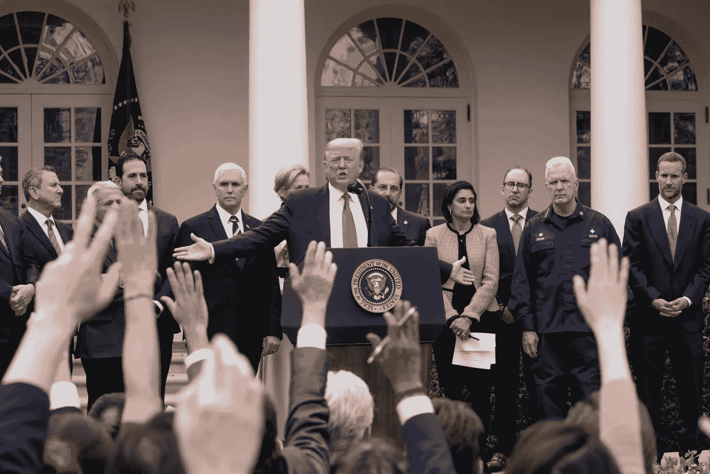
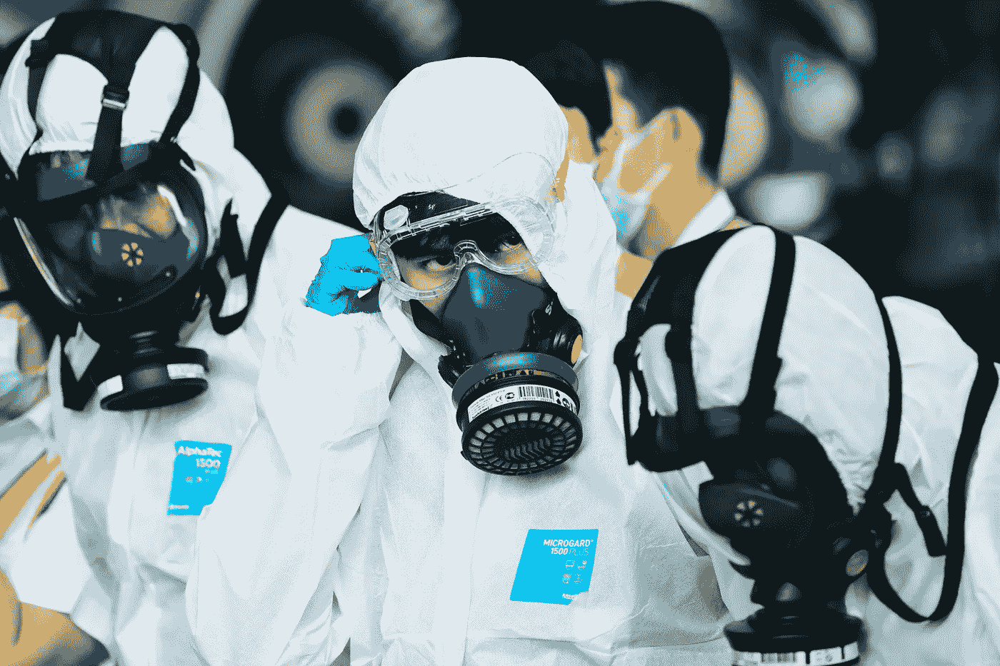
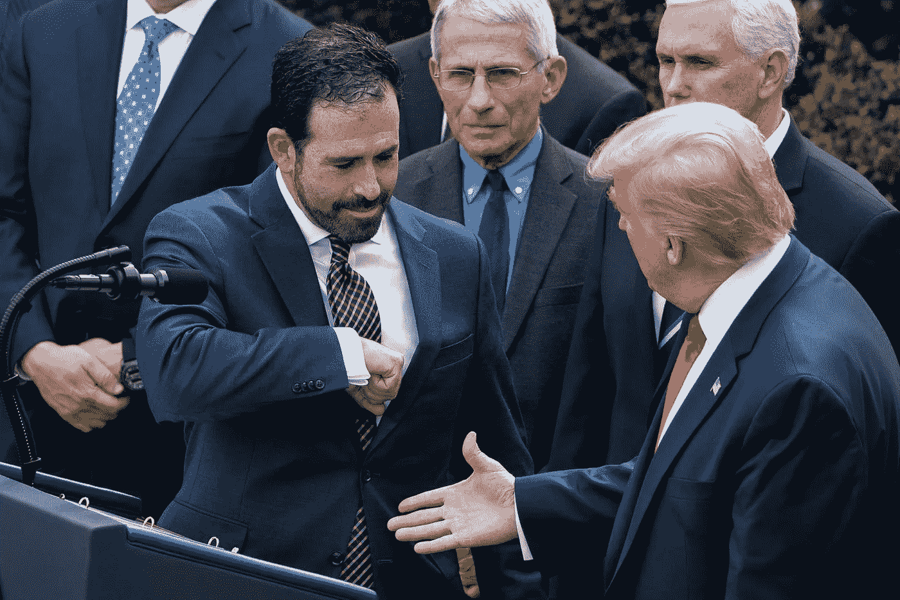

# 如果气候变化是一种病毒呢？

> 原文：<https://medium.datadriveninvestor.com/what-if-climate-change-were-a-virus-615fec57212?source=collection_archive---------8----------------------->

新冠肺炎的威胁比气候变化的威胁更快地改变了美国人的日常生活。为什么？如果你很着急，这里有一个总结:

*   *必须宣布“气候危机”为公共卫生危机，以制造紧迫感。*
*   *当前的疫情告诉我们，我们可以通过假设最坏的情况并现在就做好计划来减轻气候变化的未来风险。*
*   大型组织应该率先行动，通过宣布各自部门进入紧急状态来降低未来风险。

Photo: Anadolu Agency/Anadolu Agency via Getty Images

如果说过去的两周证明了什么的话，那就是当人们想要改变的时候，他们会变得非常快。

市场暴跌。机构关闭。基本主食消失。病毒的威胁导致了这些事情，正如它的实际传播一样。

美国和海外的领导人以不同程度的效率做出了回应。但总的来说，采取激烈的措施似乎很容易。几天后，国家、地区和城市宣布进入紧急状态。

问题是:为什么病毒恐慌比气候恐慌更有效？

简单而愤世嫉俗地说:当风险说话时，钱就走了。消费者恐慌会带来风险，而风险会吓坏投资者。[由于市场心理与消费者心理息息相关](https://www.nytimes.com/2020/03/13/business/stocks-surge-trump-coronavirus-tests.html)，任何一方的剧烈变化都会迫使领导者注意并采取行动。

 [## 气候变化、ESG 和对更好数据的追求|数据驱动的投资者

### 在地球上许多地方经历了另一个令人难以置信的炎热夏季后，来自 S&P 的最新发现…

www.datadriveninvestor.com](https://www.datadriveninvestor.com/2018/08/24/climate-change-esg-and-the-quest-for-better-data/) 

真正的问题是:为什么人们还没有开始对气候感到恐慌？

有很多方法可以回答这个问题，但我们只需要两个:

**1)人在心理上无法对某件事** [**抽象、遥远、缓慢**](https://nymag.com/intelligencer/2017/07/scientist-jim-hansen-the-planet-could-become-ungovernable.html) **感到恐慌。**

> 除了一些突发事件(澳大利亚的森林大火、热带飓风等),我们不断听到的气候危机似乎并不算什么危机。).大多数人经历气候“危机”就像他们会经历永无休止的战争或校园枪击事件一样——这是别人的悲剧，在遥远的地方。

人们被误导了:我们永远也不会重返天堂。

> 我们大多数人相信我们有机会回到“环境”的某种伊甸园状态，在那里我们可以与自然和谐相处。但不会有回报。温室气体的增长正在加速。海平面正在上升。[沿海地区已经定期洪水泛滥](https://www.ucsusa.org/sites/default/files/attach/2017/07/when-rising-seas-hit-home-florida-fact-sheet.pdf)，总有一天这些地区将变得无法治理。21 世纪，是*何时*的问题，而不是*若*的问题。

A rig exploring for oil and gas. (Image courtesy of [The Guardian](https://www.theguardian.com/sustainable-business/2017/jul/10/100-fossil-fuel-companies-investors-responsible-71-global-emissions-cdp-study-climate-change)/Photograph: Dazman/Getty Images/iStockphoto)

像新冠肺炎危机一样，我们已经确定了气候变化的症状和原因。但是，虽然新冠肺炎的传播像气候变化一样是可以预测的，但它对目前正在感染的经济和生态系统的影响仍不清楚。

我们知道的是，当我们宣布紧急状态时，我们的现实发生了变化。资金流动很快。人们的想法和感觉都不一样。最坏的情况是认真对待的。

冠状病毒疫情告诉我们，面对不可阻挡的危机，我们的世界有什么能力。这很有帮助，因为这不是预演。

这是一次排练。

About 700 million years ago, runaway glaciers covered the entire planet in ice, creating a ‘Snowball Earth’. ([Image courtesy of NASA](https://astrobiology.nasa.gov/news/sustaining-aerobic-eukaryotes-on-snowball-earth/))

正如已故的[乔治·卡林](https://www.youtube.com/watch?v=EjmtSkl53h4)曾经劝道:

> “这个星球经历了比我们更糟糕的事情……这个星球不会去任何地方。我们是…所以收拾好你们的东西，伙计们！”

地球总是在再生。它受到撞击——小行星、太阳耀斑、构造变动——然后它就改变了。它在时间尺度上这样做，使我们的个人生活和集体存在相形见绌。

然而，尽管我们的任期相对较短，人类物种已经像一个成功的病毒一样繁殖。在进化的短暂时间里，我们用尽了自然资源，改变了我们的宿主栖息地，并永远改变了这个赋予我们所有生命的元有机体的生态基础。

但我们这样做并没有对环境造成不可挽回的“伤害”。我们只是成为了它自然适应能力的一个限制因素。

像病毒一样，我们抑制了地球的免疫反应。我们利用它的再生潜力。这样做，我们拿自己的生存冒险(除非我们能找到另一个宿主)——而不是地球的。

这似乎是显而易见的。但这是一个我们尚未接受的重要观念转变:人类永远无法“拯救”环境。他们只能自救。

这就是为什么我们必须将“气候”危机重新命名为公共卫生突发事件。这将未来损害的轨迹和焦点从(字面上的)以太中分离出来，并澄清了手头的任务:遏制、损害控制、严格限制和强制行为改变。(听着耳熟？)

如果我们的政府有远见宣布这样一个紧急状态，而不是签署分散注意力的最佳情况目标的“协议”，我们可能有机会克服如此讽刺地定义气候“危机”的缺乏紧迫感。

(Image courtesy of [Wired](https://www.wired.com/story/wuhan-china-coronavirus-global-health-emergency/)/Patipat Janthong/Getty Images)

宣布危机并不能保证知道如何处理它。新冠肺炎疫情揭示了我们一些最基本的社会契约的裂缝:医疗保健、贸易、全球化旅游。它突显出我们作为一个全球组织，在动员起来应对无国界威胁方面准备不足。

这仅仅是开始。正如诺贝尔奖获得者约瑟夫·斯蒂格利茨最近告诉纽约时报的那样，经济冲击往往会导致更大的金融冲击，而且“有充分的理由相信事情会变得更糟。”金融冲击反过来会造成超出我们预测和控制的行为和文化冲击。([争夺卫生纸只是表面现象。](https://www.youtube.com/watch?v=GVHYTdGUAZM))这是一个恶性循环，结束于我们开始的地方:更多的风险。

风险的唯一解药是一个好的计划。

计划的主要好处是通过教育人们来降低风险。它为未来的威胁提供了一种共享的语言和原型。它从直接影响日常生活的角度来看待这些威胁。它改变了文化。

但是，我们能相信谁会代表我们来规划气候变化呢？

在政府缺乏有效的计划来降低风险的情况下，这个疫情告诉我们，我们必须求助于世界上最大的企业来采取行动。[谷歌、亚马逊、微软、罗氏、lab corp](https://nymag.com/intelligencer/2020/03/thanks-to-trump-coronavirus-will-make-some-people-rich.html)——这些都是想成为英雄的人，争先恐后地从他们对冠状病毒的资金不足和准备不足的反应中拯救无能的特朗普主义者。

Trump refuses a ‘corona-bump’ from Bruce Greenstein. ([Image courtesy of Boston Globe](https://www.bostonglobe.com/news/nation/2020/03/13/trump-declares-virus-emergency-pelosi-announces-aid-deal/rAhm6LtvE1unez4w43ocWN/story.html))

就气候变化而言，这并不新鲜。私营部门已经开始努力发挥其在打造 21 世纪可持续经济和基础设施中的作用(联合利华和联合利华就是显著的例子)。就在今年，[贝莱德的拉里·芬克警告说](https://www.cnbc.com/2020/01/14/blackrocks-larry-fink-says-sustainability-is-the-top-investor-issue.html)资本将开始快速流向可持续发展的企业。

这也不仅仅是股东的趋势。企业显然会从降低其商业模式的未来风险中获益。日本制造商理光就是一个很好的例子:他们已经意识到，到 2050 年，他们将负担不起原始原材料的成本，因此他们设定了一个目标，到那时原始资源将减少 87.5%。这可能太少，太晚了，但至少他们有一个积极的计划。

因此，企业有望赢得生产率和效率的长期改善。但是他们也可以作为早期响应者赢得永久的荣誉。

企业可以做以下三件事来引领全球应对气候变化的紧急措施:

*   **迫使“气候危机”成为焦点。**企业在战略上专注于有限的几个行业，因此它们可以将模糊的“气候危机”分解成可理解的次级挑战。想想汽车品牌和温室气体排放或洗涤剂制造商和水资源浪费。战略意味着创造焦点，而焦点有助于管理危机。
*   **对抗“气候沉默”。由于拥有客户关系和庞大的营销预算，企业可以畅所欲言。他们可以对抗政府在气候变化问题上的沉默。想想脸书在与世卫组织合作教育人们洗手方面的作用。制造噪音通知人们，信息有助于使危机合理化。**
*   完全忘记“气候”这个词。由于大公司的规模经营，它们可以在地方和地区层面支持全球事务。比起极地冰盖融化，纽约人更关心曼哈顿下沉。企业能够独一无二地缩小全球危机与其局部影响之间的概念差距。[见上面](https://philanthropynewsdigest.org/news/amazon-offers-to-help-gates-foundation-deliver-covid-19-test-kits)西雅图亚马逊的例子。亲近增加同理心，同理心有助于对抗危机。

如果冠状病毒对未来有什么启示的话，那就是准备工作对于减轻未来风险和在风险不可避免地到来时管理风险都是不可或缺的。

合作也是如此:全球企业可能比政府行动更快，但它们的职责是对股东和所有者，而不是公民。因此，他们的作用应该是向政府施压，而不是取代政府。

当前的疫情还表明，未来气候危机的真正影响，就像当前的疫情对我们施加的限制一样，将是对我们最珍视的东西的检查:有意义的工作、公平的社会和个人实现。

如果企业带头宣布气候变化为紧急事件——无论是内部还是外部——我们可以从这些深刻的人性角度来看待气候危机，同时减轻全球经济未来的风险。

我们所有人都有望赢得的奖项就是领导一场人们真正理解并迫切需要的革命。