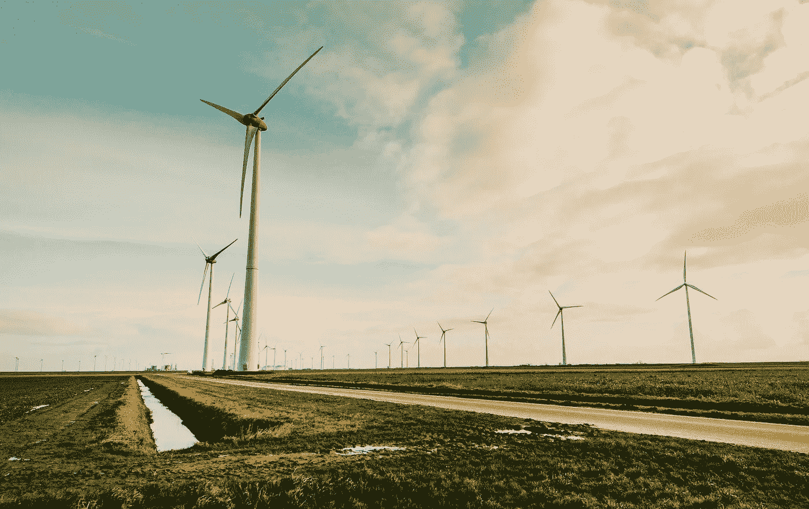
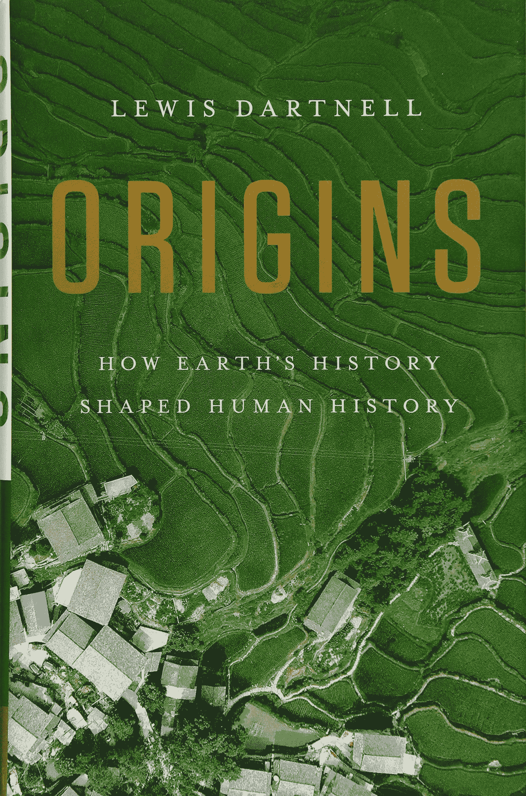
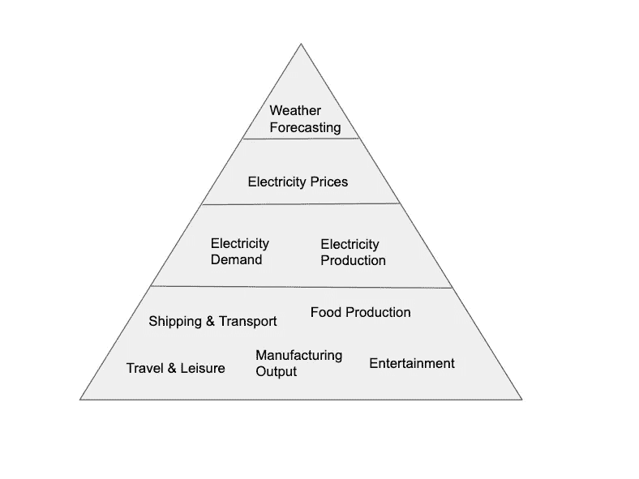

# 如果电价统治世界会怎样？

> 原文：<https://medium.datadriveninvestor.com/what-if-electricity-prices-ruled-the-world-eaf2f3c898fd?source=collection_archive---------5----------------------->

## *设想一个完全可再生的社会*

一个思想实验——让我们想象一下，假设我们没有重大的技术突破，如果世界完全围绕着可再生能源，它会是什么样子。这可能需要几十年的时间，我们甚至可能达不到这种脱碳水平。

为了完成这一壮举，我们有一长串的部门需要去碳化。电力、交通、制造业、供暖——所有这些都需要能源，大多数专家认为，让所有部门去碳化的最佳路线图是让所有东西都电气化，然后用风能、太阳能和水力发电。

令人欣慰的是，太阳能和风能相比化石燃料有更好的经济性，所以我们的趋势是正确的。但是，随着越来越多的人依赖这些资源，我们面临着挑战。解释风能和太阳能是如何*变化的几乎是老生常谈，*意味着电力生产取决于天气，除非储存起来，否则无法随时调用。

 [## 为什么包容性财富指数比 GDP 更能衡量社会进步？|数据驱动…

### 你不需要成为一个经济奇才或金融大师就能知道 GDP 的定义。即使你从未拿过 ECON 奖…

www.datadriveninvestor.com](https://www.datadriveninvestor.com/2019/03/08/why-inclusive-wealth-index-is-a-better-measure-of-societal-progress-than-gdp/) 

现在的问题是，我们没有电池技术来经济地消除这种可变性。长期存储要么受到地理位置的限制，比如抽水蓄能，要么无法实现大规模商业化，比如先进的电池技术。我们已经看到了许多微电网和锂离子电池的仪表部署，但它们的能量密度远远不足以在没有阳光和大风的冬季为工业社会提供动力。它们在削峰填谷和提供辅助服务方面非常出色，但也有不足之处。

那么，如果我们仅仅利用现有电池、太阳能和风能技术的微小进步来为工业社会提供动力——本质上是现状，只是大规模部署而已——会怎么样呢？世界会是什么样子？这看起来很像我们的祖先在工业革命前的生活方式。

# **历史线索**

我是所有将人类历史置于环境科学背景下的“大历史”书籍的忠实粉丝，包括路易斯·达特内尔的《起源》和贾雷德·戴蒙德的《T2 枪支、细菌、钢铁》。这一系列研究记录了自然世界如何塑造了文明的进化，并增加了一系列历史教科书中很少提及的环境和生物物理变量。想想我们现在的文明是多么的随机，这很有趣；如果这里没有板块构造的怪癖，那里没有全球性的自然灾害，你可以描绘出各种各样的进化过程。但从这些书中获得的最有启发性的见解是前工业文明是如何处理能源的。鉴于石油、煤炭的缺乏，钢铁的有限使用等。，它们受到严重的能源约束，仅限于自然地球流，如风力、水力和生物燃料。

现在，当然前工业社会遭受疾病，贫穷，饥饿和无数其他社会挑战，一旦我们采取大跃进，将化石阳光转化为我们的主要能源，这些基本上被根除了。现在我们有了洗碗机、疫苗、汽车、iPhones，平均寿命和生活水平让我们成为祖先眼中的神。但更重要的是，我们可以随时随地使用能源。在《T4 起源》中有一个生动的例子说明香料贸易的季节性，因为从开普敦到印度的船只必须根据季节性季风来选择航行时间。我们今天仍然依赖天气，但程度要小得多。

那么，我们如何回到依靠地球自然流动的能源，同时保持创新和生活方式，使现代如此不可思议？嗯，这意味着我们将不得不把*经济产出*中的大量差异转化为*电力产出的反复无常。*在可再生能源社会中，能源输出的变化取决于天气和季节。由于能源需求的弹性——以及许多其他工业产品——最终将不得不高度依赖于天气，我们需要了解天气预报是如何工作的，以便我们可以开始模拟经济将如何对所述天气做出反应。例如，预测晴天和雨天乘坐电动公交车的费用。电价会如何反应？我们需要模型来解释太阳能输出和水力输出，以便我们能够做出这些明智的生活方式和经济决策。

# **天气预报的艺术和科学**

天气预报融合了气象学、统计学和计算机科学，在过去的五十年里取得了长足的进步。即使在今天，天气预报对我们的能源部门、农业、航空和其他行业也非常重要。它属于一个名为国家气象局的联邦机构的管辖范围，该机构在保持工业经济蓬勃发展方面取得了很大成功。但是，将天气的反复无常纳入一个整洁的七天百分之一概率的盒子，是艺术和科学之间不断的相互作用。

预测天气很难，因为气象系统像自然界中的许多系统一样，是动态的，这意味着系统在某一时间点的行为决定了它在未来的行为。它们也是非线性的，这意味着天气系统在指数关系下运行，而不是线性或累加关系。

气象学家并不总是了解他们试图预测的系统的真实性质。事实上，对其真正数学性质的突破性认识建立了非线性系统科学的全新理论:混沌理论。传说早在 20 世纪 70 年代，当天气预报仍有待改进时，麻省理工学院气象学家 Edward Lorenz 和他的学生正在一台早期的计算机上开发一个天气预报程序，这时它开始产生非常不稳定的结果。他们认为他们运行的是和以前完全一样的数据和代码，但是在一次运行中，计算机会预测晴朗的天空，而在下一次运行中，会预测雷暴。在试图找出代码中的错误两周之后，他们发现助手将输入参数四舍五入到了小数点后第三位——这在大多数模型中是一个非常微不足道的数字，但在那些表现出非线性属性的模型中却不是这样。但从那时起，他们意识到天气预报非常容易受到不准确数据的影响，小的随机事件会对几周前的事件产生巨大的影响。因此，洛伦兹基于蝴蝶扇动翅膀可以影响地球另一端飓风方向的想法，创立了混沌理论。

The famous symbol of Chaos Theory

天气在一定程度上仍然是不可预测的，因为我们最多只能做一个概率评估。明天下雨的概率为 40%,这意味着在 40%的模拟中，暴风雨发生了，而在 60%的模拟中，暴风雨没有发生——只是初始参数略有不同。

天气预报的改进是人类和机器共同努力，尽我们所能去理解我们的大气动力学的一个很好的例子。70 年代中期，国家气象局平均提前 6 度错过了 3 天的高温；现在，NWS 平均只差大约 3 度。这很重要，原因有二。首先，天气预测是电网发电和负荷预测的重要组成部分，我们需要我们可以获得的每一个优势。第二，它表明，稳定地改进复杂系统的预测并把置信区间削减到真正的随机性是可能的。

# **与天气之神达成协议**

那么，如果我们想围绕天气来引导经济和我们的生活，我们还必须做些什么样的持续预测呢？

经济已经表现出季节性，尤其是在我前面提到的行业，比如农业和旅游业。我们不指望冬天会有玉米棒子和新鲜农产品，海滨旅馆也不指望一月份有多少生意。但将其他行业纳入这一季节性范式将更加困难。夏季产生的太阳能最多，因此我们的其他能源密集型产业，如制造业，可能会表现出季节性和季节性变化。我们还必须适应新的地缘经济模式。如果由于新技术的经济效益，我们生产的许多[未来食品是在沙漠中种植的，那么我们将不得不在亚利桑那州建造水培设施。如果我们需要稳定、密集的电力输出来制造重型机械，我们就必须在太平洋西北部建厂。](https://www.theguardian.com/commentisfree/2020/jan/08/lab-grown-food-destroy-farming-save-planet)

因此，生活在一个可再生的社会意味着扩大天气不确定性的深度和广度，意味着更多的行业和我们生活的各个方面在更深和更广的程度上依赖于它。量化这种不确定性，克服它，并围绕它进行规划，将是一项巨大的事业。构建弹性经济和智能解决方案需要对电价和一系列其他辅助经济指标有合理的预期。就像在天气预测中，我们有 40%的机会下雨，在产量预测中，制造商有 50%的机会以有利可图的价格购买能源。

Uncertainty hierarchy in a fully renewable energy society.

把这个经济层级想象成一个金字塔。天气预报在最上面，反过来又是能源生产和能源需求的最大预测器。提高这种响应能力，并围绕这种响应能力调整我们的生活，将需要大量的数据收集、处理和预测。我们不仅要预测天气和能源市场之间的复杂关系，还要预测我们最耗能的商品和服务的生产和消费函数。旅游和制造业等能源密集型活动可能会在能源充足、电价较低的夏季进行，而娱乐活动可能会在冬季进行，那时每个人都可以蹲下来看电视。这种假设的转变类似于熊在能量缺乏时如何冬眠，或者多少哺乳动物在黎明和黄昏进行它们最耗能的活动，此时环境正好适合觅食和狩猎。反映可再生能源的电价将以模仿自然环境的方式塑造我们的经济，或者展示生物仿生。

理想情况下，我们可以通过核能或清洁天然气发电来最大限度地减少我们经济的可变性，或者开发长期储存的新技术，但除非我们让核能在政治上更受欢迎，或者取得一些重大的硬科学突破，否则没有任何保证。我们可以通过其他调整来减少对天气的依赖，比如鼓励不经常扔掉的高质量商品，以降低总需求、浪费和能源消耗。但最终，假设没有技术突破，如果我们依靠纯可再生能源生活，我们将不得不在生活中加入很大程度的不确定性。正如我们有应急计划，根据百分之几的机会或下雨来改变我们的野餐或推迟棒球比赛，我们也需要根据能源的可用性来制定经济活动的应急计划。

希望这个思维实验既能说明我们当前气候技术的局限性，也能说明我们需要在多大程度上根除传统经济体系。我的预测是，我们会折中，发明一些技术，让我们继续工业生活方式，但需要一些天气导向的激励措施来改变我们的行为。