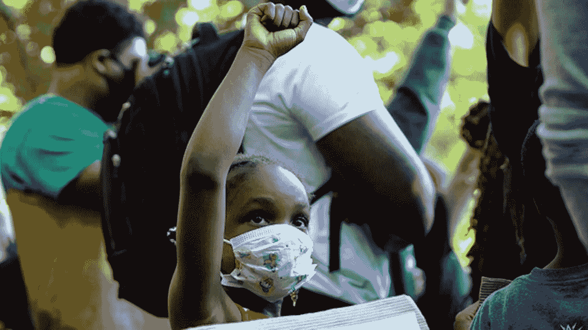
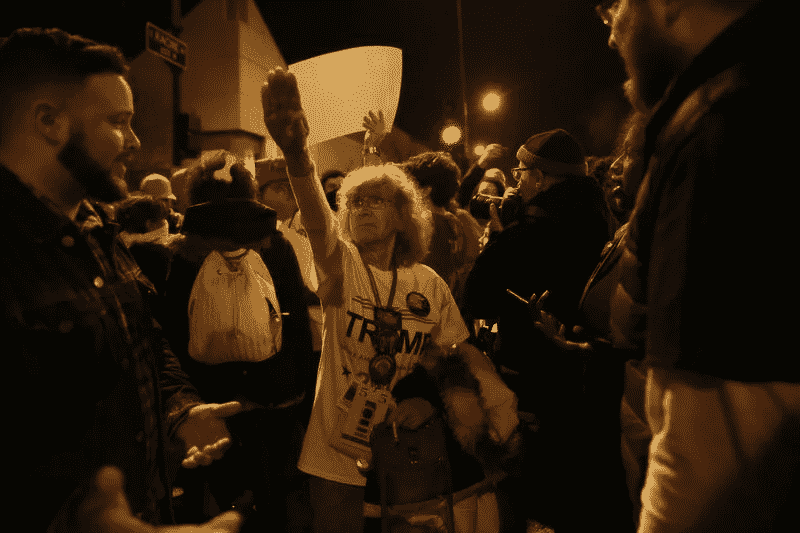
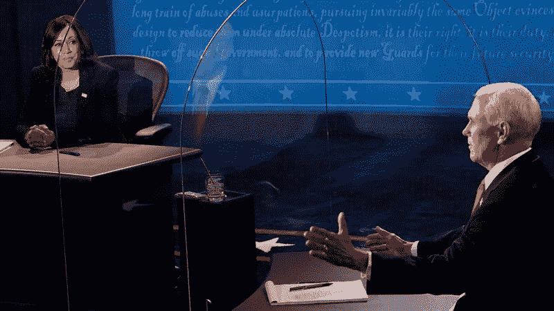
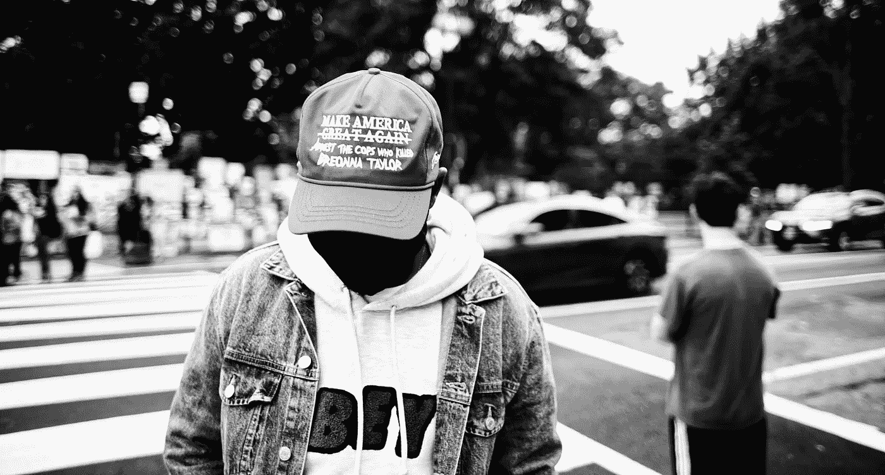
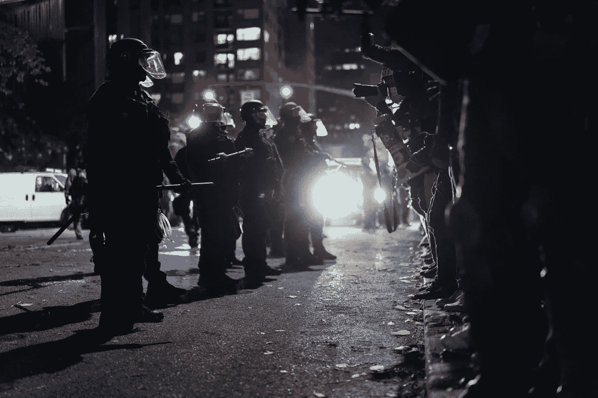

# 如果我在进步之前就死了呢？

> 原文：<https://medium.datadriveninvestor.com/what-if-i-die-before-progress-ea8f0d822bd4?source=collection_archive---------2----------------------->

## 合法黑人解放的机会很低。所以我他妈的到底在争取什么？

Shutterstock

这张照片虽然震撼人心，但应该会让你心碎。

鼓舞人心的黑人女英雄——激进派*一直都是，你应该知道空中的黑色拳头——从零岁开始——是强烈的政治决心的象征。*

*这是对全球体系的威胁。这是一种要求，也是一种祈祷，希望我们黑人的力量能够胜过美国人的无知。尽管有残酷的国家认可的暴力，像这位年轻的革命者这样的黑人孩子不应该向你们展示这样的声明。不再是了。400 年后就不会了。*

*那我们为什么还在做这个？*

*我不禁想知道。考虑到这是我们面临的现实:*

*我一直认为种族主义者不会改变他们的想法。他们的孩子的思想也同样被塑造，然后他们的孩子也跟着他们。即使是好人也要感谢我们发誓要拆除的系统。我们知道，我们施加的压力越大，就会有更多的美国资源被释放出来，来摧毁我们。*

***特朗普是法西斯。假设美国的资源可以拯救他，这场运动(和这个国家)可以期待历史告诉我们的。不管川普是赢是输，川普在他的形象中塑造的白人绝望的时代精神将会挺身而出，而不是袖手旁观，来捍卫他们受伤的自尊。***

*在 20 世纪 30 年代的德国，军事化的警察部队和武装民兵被引导去铲除他们政党的种族和政治对手，以此来捍卫仇外的白人民族主义。他们都获得了攻击他们视为敌人的个人和团体的自由。那是大屠杀的开始。它只是在多年灾难性的痛苦战争后才结束。*

**

*Trump Supporter, 2016 (E. Jason Wambsgans/Chicago Tribune)*

*我不是危言耸听。我没有暴力倾向。*

*但我是一名 24 岁的*士兵*现在在一场争取正义的激进运动中满怀希望，当*持久和平*。*

*这个国家的警察，新邦联 4chan-breitbart-proud-boy-klan 军队在特朗普的命令下准备就绪，白人媒体帝国喜欢耸人听闻地歪曲这场运动勇敢做的事情，数百万普通美国人麻木不仁的抵抗是我们要面对的。*

*我永远不会停止。因为法西斯主义可能会以其他方式出现。因为我爱的人会继续死去*不管*。*

*但是告诉我军事化的警察和武装起来的准军事白人男孩的声音不会与历史产生共鸣。你不能。我身上的伤疤已经开始讲述那个故事了。*

*但是特朗普的棕色(军队剩余)衬衫放在一边…*

*如果明年一切顺利*理论上可能*——如果拜登赢得了一场无争议的选举，川普在被指控犯有大量叛国和欺诈行为*后躲藏起来，美国的基础设施不仅仅是崩溃，而且*这场黑人激进起义没有被民主党领导的威权主义* ***—*** 镇压，即便如此，我真的能指望乔·拜登、**整个**弹性民主党的大多数人、**

**他们中有谁真的会采取必要措施，引导我们远离全球剥削资本主义吗？*黑人会停止死亡吗？他们甚至会 ***尝试*** 阻止黑人死亡吗？***

*在我有生之年？*

*拜登已经明确表示，他不会解除对警方的资助。他实际上是在与我们全国性的反种族主义联盟及其要求保持距离。在对黑人的命也是命同情的指责中，乔·拜登只是口惠而实不至。*

*伯尼·桑德斯的愿景是正确的。但他未能令人信服地展示出对美国资本主义与无处不在的暴力反黑人运动之间不可分割的联系的理解。伯尼和乔对种族一无所知。他们的白人选民很大程度上不在乎事实是否如此。*

*然后是*卡玛拉·哈里斯*……一艘不完美的船，如果曾经有过的话。*

*作为妇女和 BIPOC 的历史人物，她应该得到承认。她告诉我们她是一个进步的改革者，我只希望我能相信她。但是即使那对我来说已经足够好了，不可否认的是她的记录令人失望。可悲的是，在这一点上，一堆吸引苍蝇的福音派蛋黄酱是正确的:*

*哈里斯在她的管辖范围内有增加有色人种社区执法压力的历史。她颁布逃学法，实施扯淡罪，为错误定罪辩护，客观上损害了无辜黑人的生活。*

*她可能没有对加州所有的“法律和秩序”立法负责。但是我们明确告诉你们*——**所有的警察都是坏警察**。**

**拜登的团队怎么会没听到我们？**

****

**[6ABC](https://6abc.com/vice-presidential-debate-2020-winner-kamala-harris-mike-pence/6820636/)**

**但是如果哈里斯总统——我指的是乔·拜登——真的要为黑人的生活做些什么，他们将不得不放弃与白人温和派的恋情。为了我们共同的未来，不要再试图满足美国白人的舒适性，而牺牲民主党内那些有着痛苦必要愿景的人。**

*****解除警戒。拥抱绿色新政。*****

**美国纳税人每天花费近 10 亿美元用于美国的治安。**——*想象一个投资于重新想象我们从根本上分层和压抑的*生活方式的未来。想象一个未来，民主党人站出来反对美国工业，并要求他们接受科学和环境责任，否则将屈从于人民的意志。****

**迄今为止，在我看来，未来不会有拜登或哈里斯掌舵。**

**然而，对我所爱的人来说，它们仍然比橙色的替代品更安全。**

****

**“Make America Arrest the Cops Who Killed Breonna Taylor” Washington, DC. Twitter/[@JohnnySilverClo](https://medium.com/@johnnysilvercloud)**

**这场运动永远改变了我的生活。我自豪地选择成为一名激进分子，站在国家和民族的对立面，心甘情愿地在军事化的警察面前将我的自由和安全置于危险之中，说实话，我已经走得太远了，无法回头。**

**在华盛顿 DC，这个我称之为家的城市和我出生的地方，像我一样的抗议者继续以勇敢激进的激情点燃我童年时代的中产阶级街道。**

**[https://twitter.com/blackhousenew/status/1312500854625247233?s=20](https://twitter.com/blackhousenew/status/1312500854625247233?s=20)**

**最近几周，DC 警方升级了针对我们的策略。在穿过该市刷白的住宅区和餐馆区之后——用令人不安的事实和不屈不挠的精神打破了白色的沉默——MPD 开始诱捕游行队伍后面的和平散兵，或那些在游行自发散去后分裂的人。**

**以这种方式进行示威的人没有受到任何接近合法的指控。他们被抓的唯一目的就是恐吓正义的倡导者。警察恐吓那些敢于威胁美国帝国霸权的人。那是你将 ***永远不会*** 看到的标题，但那是美国人民如此迫切需要的 ***脸*** 。**

**[https://twitter.com/ChuckModi1/status/1313238804384358401?s=20](https://twitter.com/ChuckModi1/status/1313238804384358401?s=20)**

**我们不会停止战斗。尽管我们面临重重困难。**

*****那么为什么呢？*****

**为什么我们——从 DC 到西雅图，从路易斯维尔到波特兰，从纽约到明尼阿波利斯，以及沿着其间的每一条数字路径——为什么积极分子、激进分子、自由思想家、士兵和盟友在面对如此巨大的历史机遇时仍致力于这场运动？**

**在这个国家推进种族公正的负担总是危险的，而且总是要付出生命的代价。问问弗雷德·汉普顿、[纳特·特纳](https://www.britannica.com/biography/Nat-Turner)、阿萨塔·沙库尔，也许还有一两个肯尼迪……**

**只要问问抗议者，他们正盯着部署在他们街道上的身穿制服的恐怖分子的暴动，宣布他们的生命不可争取。然而，燃烧和沉重的是:**

****

**Portland Police (PPD). Alex Wittwer**

*****这个包袱永远值得牺牲。*****

**下一代指望我们尽我们所能给予他们一切，即使我们没有获得解放。为了他们——为了所有已经卷入这场战争的悲惨的鼓舞人心的小革命者，必须接过接力棒。**

**这个体系可能永远不会完全脱离资本主义。当我们为一个我们永远看不到一丝曙光的梦想呐喊时，我和我的同志们可能会受伤，会受到创伤，或者被剥夺自由。**

**但是如果我*死了*或者他们*把我带走了*，我会很高兴知道这从来就不是关于**我 的事情。****

**只是关于指挥棒。这是我们付出汗水和牺牲的目标——在美国帝国的重压向我们袭来之前，尽我们所能把那根该死的指挥棒推得更远。**

**就目前的情况来看，这是我最大的期望。**

**把指挥棒推得远远的，你可以看到我指关节上的*粗糙裂纹*。它们和我祖先的裂缝一样。**

**他们说，该听了。**