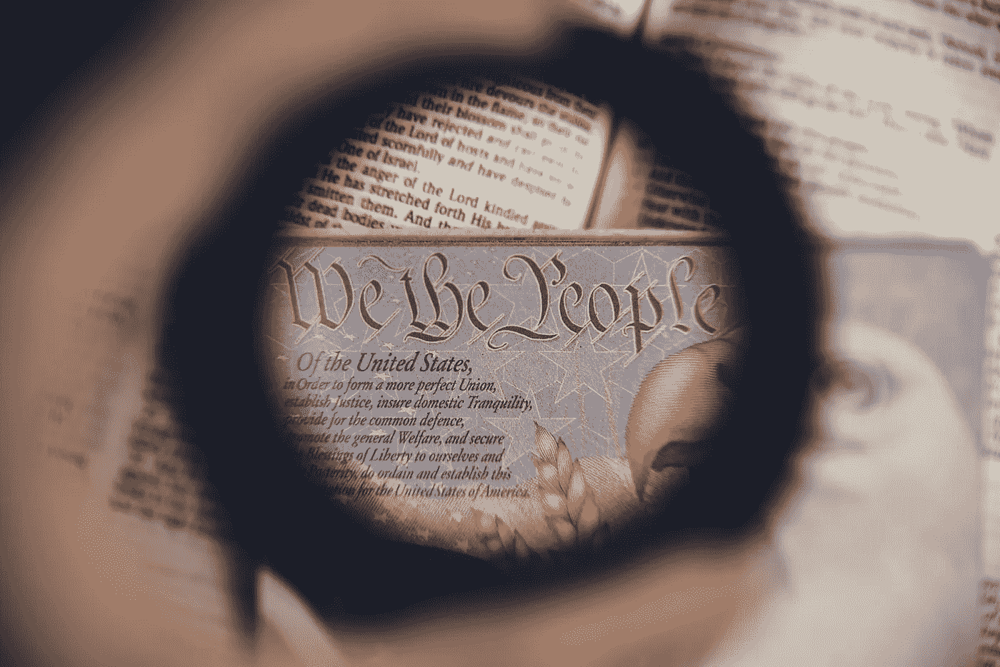

# 如果宪法是今天写的呢？

> 原文：<https://medium.datadriveninvestor.com/what-if-the-constitution-was-written-today-3d7420df3060?source=collection_archive---------2----------------------->

Photo by Anthony Garand on Unsplash

让我们首先承认 1787 年 12 月 7 日批准的文件是有缺陷的。我们可以承认创始人的失败，并根据我们今天掌握的信息做得更好，而不是把他们当作不会犯错的神来崇拜。

我们可以从更好地选择谁在房间里讨论文件开始。在制宪会议上，55 人制定了语言，但只有 39 人签署了协议。所有 55 人都是白人地主。制宪者认为唯一有价值的人。没有女人，没有黑人，没有这个国家最初属于的印第安人。只有有钱的白人，他们创造了一份自然有利于自己的文件。

可以允许序言保持不变。宪法的制定者相当善于使用崇高的词语；他们只是不想让它们适用于所有人。这些词的字典定义会做得很好，而不是那些作者所指的有限版本。

我们美国人民，为了组成一个更完美的联邦，建立正义，确保国内安宁，提供共同防御，促进普遍福利，并确保自由的祝福给我们自己和我们的后代，为美利坚合众国制定并确立这部宪法 

宪法的第一条包含十个部分，其中的几个在今天经不起推敲。第二部分提到“不纳税的印度人”和“所有其他人的五分之三”。这里指的是土著美国人，他们的土地被偷走了，这些以前的居民没有任何权利。由于宽宏大量，他们决定不对那些已经用他们的土地做出了合理贡献的土著美国人征税。所有其他人的五分之三是关于黑人奴隶和契约仆人。他们也没有权利，但需要被部分计算在内，这样人口更多的非奴隶州就不能投票废除那些依赖奴隶制的州的奴隶制。

 [## 政治不正确的毕业典礼演讲|数据驱动的投资者

### 亲爱的 2020 届毕业生:你们已经被所有的仪式和接下来的派对扇了一记耳光…

www.datadriveninvestor.com](https://www.datadriveninvestor.com/2020/06/04/the-politically-incorrect-commencement-speech/) 

第一条，第九部分，需要一些工作。有一部分禁止国会在至少 20 年内禁止国际奴隶贸易。一部分是因为它听起来像。如果没有这种保护，像南卡罗来纳州这样依赖进口非洲奴隶的州永远不会加入联邦。被误解的部分是暗示制宪者在二十年后寻找逐步废除奴隶制的方法。事实上，他们想消除廉价的外国竞争，转而依靠国内生产的奴隶。额外的国内奴隶将来自奴隶繁殖，包括“繁殖者”和“雄鹿”之间的强迫关系，以及主人、其家人和朋友的强奸。

 [## 美国奴隶养殖场的典型模式

### 有历史学家会告诉你，虽然个别种植园“偶尔”有奴隶繁殖…

medium.com](https://medium.com/@williamspivey/the-typical-model-of-an-american-slave-breeding-farm-aa0df279b72b) 

第九节中需要澄清的部分是薪酬条款，这有待解释。现有的语言似乎足够清晰，但它并没有阻止某些人在任职期间接受报酬和出卖我们。

未经国会同意，任何人不得接受任何国王、王子或外国的任何礼物、报酬、职位或头衔 

第二条，第一部分，创造了有问题的选举团。就像五分之三条款一样，选举团也是为了保护奴隶制。它赋予蓄奴州更多的权利，并且是为了防止大多数选民废除奴隶制。这也是为什么我们的总统没有得到最多的选票。选民至少 35 岁的要求也值得关注。在第四部分，我们可能更好地定义“重罪和轻罪”，弹劾的基础。太模糊了。

第二条第二款提到引渡被控犯有叛国罪或重罪的人，这是有道理的。令人担忧的是“其他罪行”，或者那些“逃避正义的人”。当他们谈到在一个州服役的人逃到另一个州时，他们是在提供逃奴法，这是维持奴隶制所需要的。这部分应该删除。

1791 年，宪法的前十项修正案被批准，也就是众所周知的权利法案。第一修正案是好的；言论自由和和平集会的权利是最基本的，尽管现任政府似乎不这么认为。第二修正案是有问题的；这一切都可以追溯到奴隶制，确保奴隶巡逻队可以保护往往寡不敌众的种植园主。这么多人手中有这么多枪，我们是一个更好的国家吗？

我们可能会更认真地对待第五修正案；人们未经指控和正当程序就被关押。第六修正案也是如此，它保证了快速审判。有人是关塔那摩或被关在笼子里的移民吗？第八修正案禁止过度保释，但我们的保释制度意味着双轨司法系统，一个是穷人的，另一个是富人的，他们往往在自己签字后被释放，穷人享受不到这种待遇。

有人主张拿整部宪法来代替它。宪法的某些部分写得很好，尽管它们原本并不打算适用于每个人。它的大部分可以也应该被保留。但是如果一个代表机构由各种肤色的男人和女人来写。有些部分永远不会被包括在内，作为大量系统性种族主义基础的文件将完全不同。

**进入专家视角—** [**订阅 DDI 英特尔**](https://datadriveninvestor.com/ddi-intel)