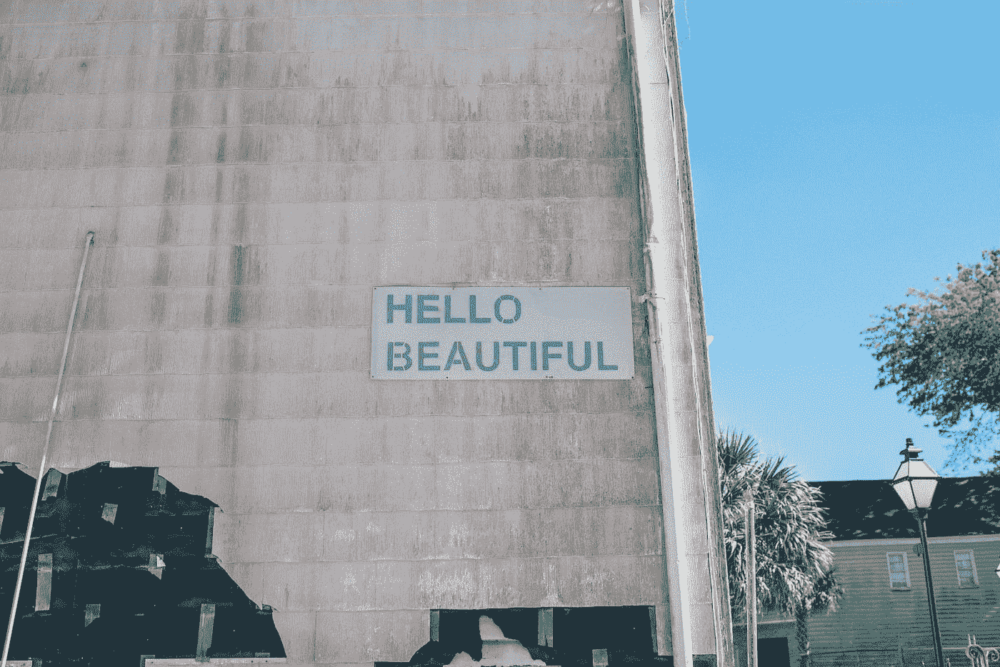

# 如果事情永远不会恢复正常怎么办？

> 原文：<https://medium.datadriveninvestor.com/what-if-things-never-really-get-back-to-normal-af68e0446fee?source=collection_archive---------8----------------------->

## 我对这个疫情的看法完全错了

Photo by [Chris Montgomery](https://unsplash.com/@cwmonty?utm_source=medium&utm_medium=referral) on [Unsplash](https://unsplash.com?utm_source=medium&utm_medium=referral)

“如果事情永远无法恢复正常怎么办？”前几天听到这个问题。这让我吃惊。这是个简单的问题。听起来可能不是特别原创。但在我听到它之前，我并没有认真考虑过“正常”可能一去不复返的可能性。

> 如果所有旧的做事方式都一去不复返了，我需要如何改变？

我认为自己适应性很强，比大多数人更能接受变化。事实是我有些工作要做。

当这个疫情在 3 月份爆发时，我认为我们不可能在 8 月份还在处理企业倒闭和社交疏远的问题。像其他人一样，我也一直伴随着限制和变化。我的想法是蹲下身子挺过去。事情很快就会恢复正常。

他们会吗？在我所在的洛杉矶地区，他们不再那么明显了。仍然有很多企业倒闭。我女儿的学校正在进行秋季远程教育。也没有任何迹象表明我会被允许回到办公室。

 [## 即使在商业领域，一切都是为了重新站起来|数据驱动的投资者

### 有一种说法是关于焦虑的人。虽然他们认为自己很弱，因为他们在一些决赛中失败了…

www.datadriveninvestor.com](https://www.datadriveninvestor.com/2020/07/01/even-in-business-its-all-about-getting-up-again/) 

我的反抗部分想要向前推进，好像什么都没改变。但这是错误的做法，必须停止。

我把这个疫情看作是更好的东西的占位符，这是对我个人成长的欺骗。

不要误解我，我和其他人一样经常打电话。我一直保持乐观的态度，并尽最大努力将我的业务转移到虚拟领域。直到我能再次出现在人们面前。

看到最后那句话的问题了吗？我接受了改变；但只是暂时的。我还没有真正接受它。

从今天开始，我要修正我思维中的这些错误。

我会拥抱新的做事方式；不只是接受它们。

在这种顿悟之后，我有三个立竿见影的改变。

## 拥抱虚拟会议

从三月份“呆在家里”的订单开始，我就明白虚拟会议对我开展业务的能力至关重要。所以我有过很多虚拟会议；WebEx、Skype、Zoom、Facetime 等。我敢肯定，任何读到这篇文章的人都有过无数次虚拟会议。

问题在于我的态度。我认为这些互动是需要面对面的“真正会议”的拙劣替代品。我学会了如何很好地使用它们来主持会议，仅此而已。

展望未来，致力于掌握虚拟会议的使用。这是真正的会议，也是我们现在做事的方式。不要再想它们和面对面的会议有什么不同。他们甚至可能更好。无论如何，我们不会回去，所以让我们掌握虚拟会议。

## 重新设计客户服务交付

我向客户提供服务的方式需要改变。多年来，我的模式一直基于高接触服务。我不必停止提供手把手的指导和建议。

为了适应我们使用的虚拟工具，格式需要修改。当我和某人在房间里时可以得到的交流线索通常在虚拟环境中是得不到的。为了让客户获得最大利益，沟通方式需要改变。

我正在改造我的结构和流程，以便在新模式下更好地与客户沟通。我不会再试图把我的老方法移植到新方法上。结构、内容和流程需要反映不同的沟通风格。

## 拓宽我的地理视野

我确实有一些客户在地理上离我很远。我已经和他们进行了多年的虚拟会议。不过，我把他们作为客户的原因是，他们曾经非常亲密。他们搬走了。既然疫情已经迫使我们接受一种全新的做事方式，那么我们就要想办法把这种改变变成机会。

这对我来说意义重大。

展望未来，我强调虚拟会议和不需要面对面接触的客户服务交付模式。为什么我需要将我的地理焦点限制在我的区域内？由于精通虚拟会议和适合远程的高价值服务模式，我可以为美国任何地方的客户提供服务。

这将从根本上改变我寻找和吸引新客户的方式。它带来了许多我以前没有想到的效率。

# 改变是一件美好的事情。

在这次疫情期间，各行各业都在进行各种巧妙的调整。我对正在发生的所有创新感到惊讶。不可否认，我反应迟钝；我以为我适应得很好。我只是改变了环境迫使我改变的方式。任何人都能做到。

关键是拥抱变化。认识到事情可能永远不会回到以前的样子。

如果不回去是好事呢？

我很慢，但我最终会明白的。我很高兴能加入我开的单子。

我已经找到了很多新的机会。

Photo by [Ian Schneider](https://unsplash.com/@goian?utm_source=medium&utm_medium=referral) on [Unsplash](https://unsplash.com?utm_source=medium&utm_medium=referral)

布伦特·拉普诺是南加州的国际金融理财师和注册退出规划顾问。这里是他其他文章的链接。

**访问专家视图—** [**订阅 DDI 英特尔**](https://datadriveninvestor.com/ddi-intel)