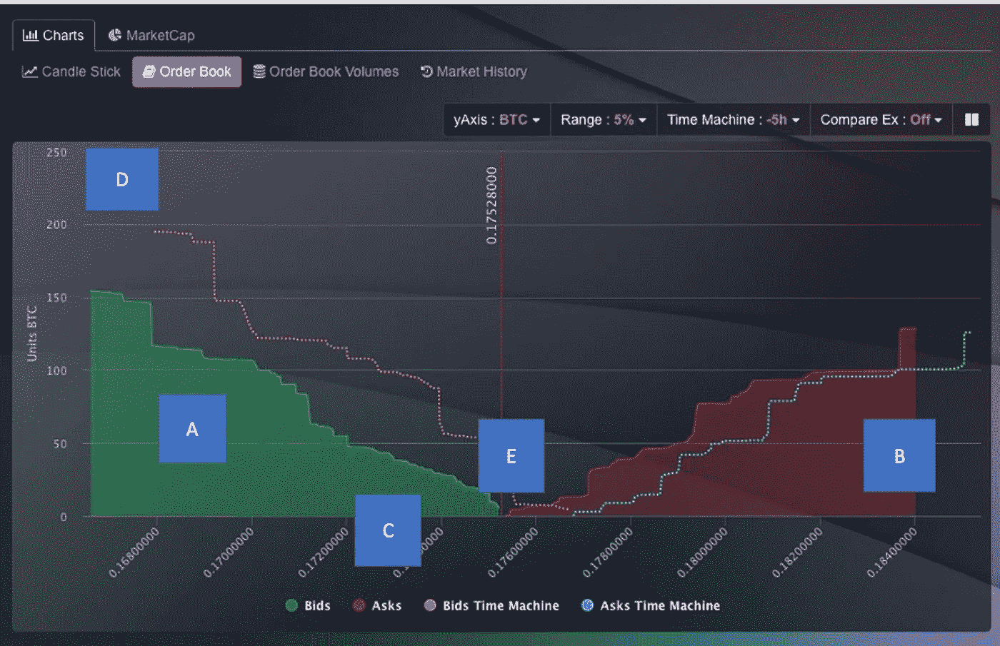
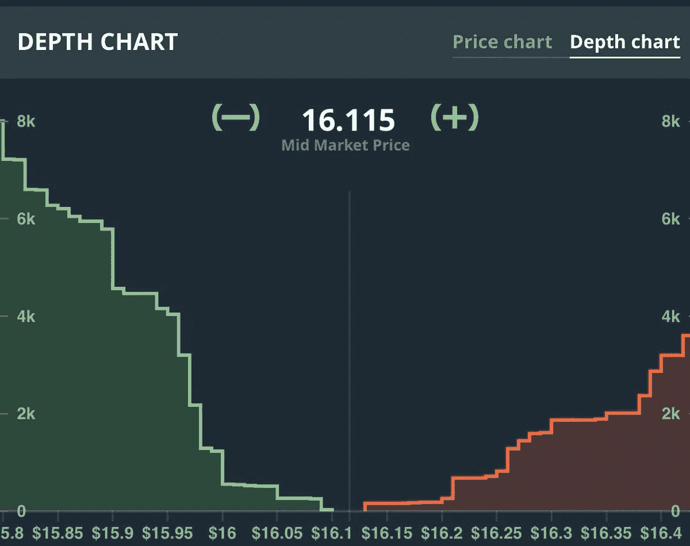
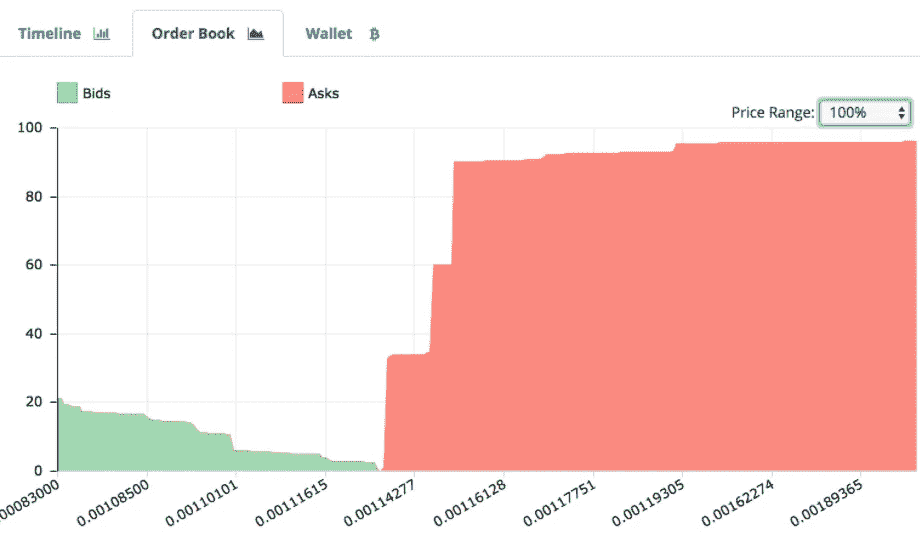

# 在订单簿中可以找到哪些信息？

> 原文：<https://medium.datadriveninvestor.com/what-information-can-be-found-in-the-order-book-of-cryptocurrency-ed417b54230e?source=collection_archive---------5----------------------->

# 什么是订单簿？

订单簿是一个列表，其中可以查看投资者在不同加密货币价格下的购买和销售(订单)。在订单簿中，这些订单相互比较，如果匹配，则自动执行。

例:A 人想拥有 1000 条 Vechain，于是提出要求。现在这个人以 x 的价格买入 1000 条 vechain，B 想卖出 1000 条 Vechain，所以他出价。这个人以相同的价格 X 下了 1000 个 Vechain 的卖出订单，因为订单只以相同的价格执行。然后比较这两个订单，当它们匹配时执行。(理想情况)

但是，经常会出现这两个订单的数量不同的情况。在这种情况下，人 B 只提供了 500 个 Vechain，所以人 A 仍然缺少 500 个 Vechain。现在，在订单簿中搜索更多的人(C，D)或能够履行给定订单的那些订单。在此之前，所下的订单只能部分履行。(部分填充)

# 在订单簿中可以找到哪些信息？

**答:**图表的绿色部分显示了对这种加密货币感兴趣的所有投资者的买入订单，订单是在加密货币的哪个价格，以及这些订单包含多少 BTC——需求——

**B:** 图表的红色部分显示了所有想要出售其财产(或其部分财产)的投资者对该加密货币的卖出指令，并提供了该指令的加密货币价格以及该指令包含多少 BTC。-提议-

**C:** X 轴=加密货币的不同 PTrip

**D:** Y 轴=以给定价格下单的 BTC 总量。

c 和 D 永远是相互依存的。

**E:** 图表绿色部分(需求)和红色部分(供给)交汇的点就是当前价格。价格由供求关系决定并受其影响。

 [## 为什么参与正确的加密交换至关重要|数据驱动型投资者

### 到目前为止，与黄金和美元相比，加密货币，尤其是比特币，已经显示出巨大的增长

www.datadriveninvestor.com](https://www.datadriveninvestor.com/2020/07/16/why-engaging-with-right-crypto-exchange-matters/) 

# 购买墙壁

买入墙是指大部分订单都是绿色的，尤其是当有很多订单以特定价格下单时。如果是这样的话，绿色区域至少有一个大台阶，更确切地说是一堵墙。如果价格跌至买入墙的价值，订单是否被执行，会发生什么？所选加密货币的价格增加。为什么？在买入墙上，市场需求大于供给，需求越大，价格越高。当加密货币被抽取时，购买墙经常发生。

# 购买墙示例

# 出售墙壁

卖出墙是指大部分订单都是红色的，尤其是在给定价格下有很多卖出订单的情况下。卖出墙与买入墙正好相反。h 贪婪是供过于求，所以当达到某个价格时，卖出或卖出订单被填满，账面被分割。投资者展示他们的利润，相应加密货币的价格下降，因为这一次的可用报价高得多。所以你必须记住以下几点:

如果需求大于供给，价格就会上涨！

如果供给大于需求，价格就会下降

# 销售墙示例

我在每月一期的 [**简讯中分享了更多私密的想法，你可以在这里**](https://mailchi.mp/bf8f8e8ed697/keep-in-touch-with-lukas) 查看。请在评论中告诉我，并在各种社交媒体平台上加入我:

[**推特**](https://twitter.com/WiesfleckerL)●[**insta gram**](https://www.instagram.com/lukaswiesflecker/)●[**脸书**](https://www.facebook.com/lukaswiesfleckerr)●[**Snapchat**](https://www.snapchat.com/add/luggooo)**●[**LinkedIn**](https://www.linkedin.com/in/lukas-wiesflecker-1b11251a5/)**

**无论你做什么，都要带着爱和激情去做！**

## **访问专家视图— [订阅 DDI 英特尔](https://datadriveninvestor.com/ddi-intel)**