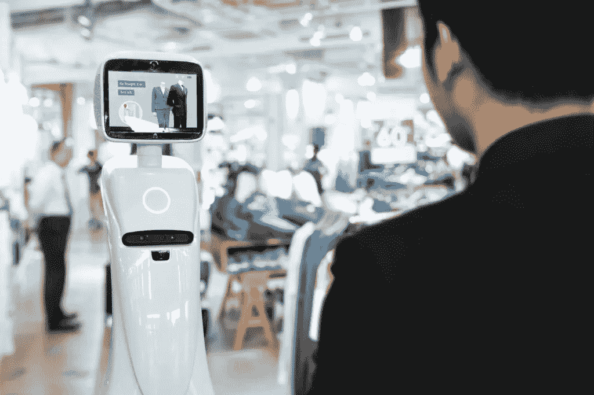
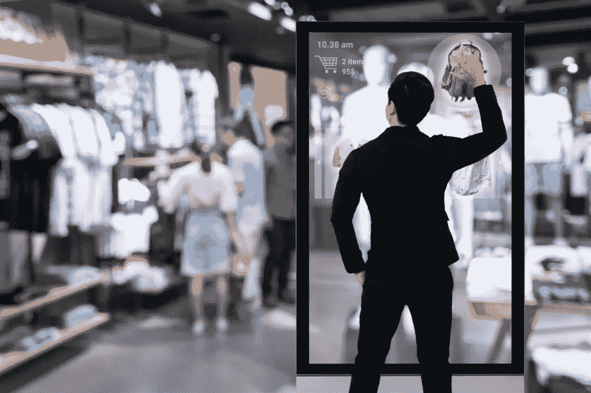
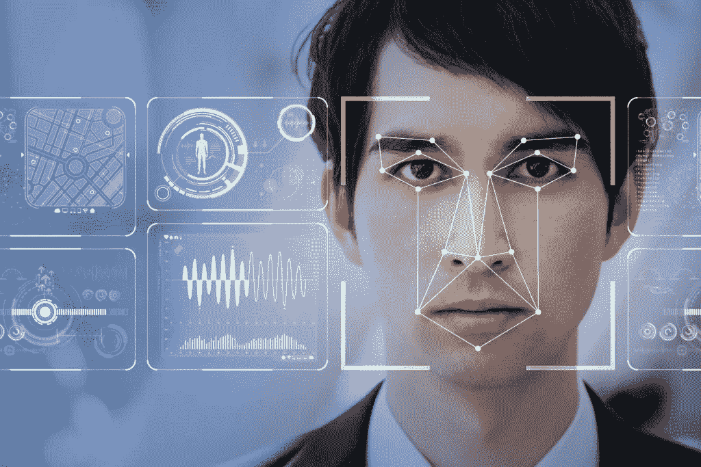
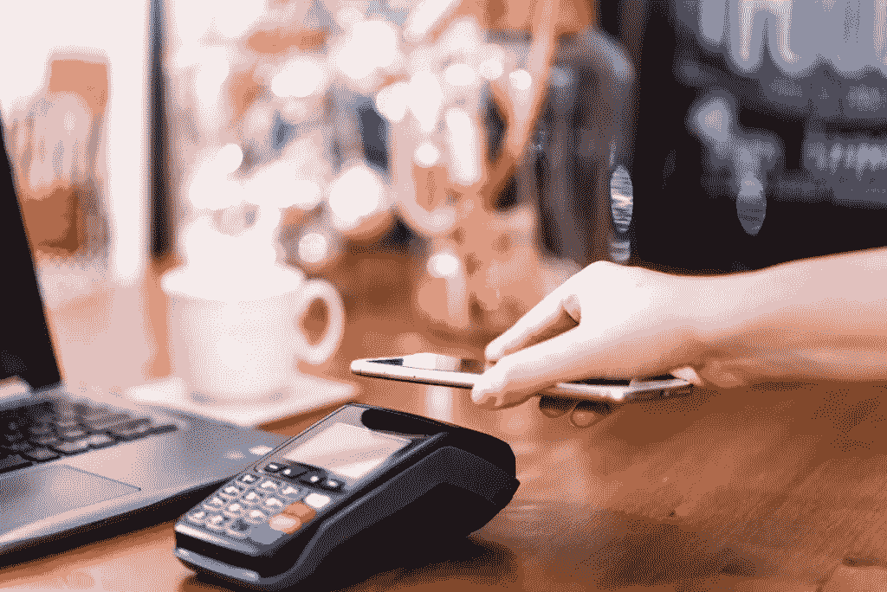

# 商店里在“窥探”什么样的创新零售技术

> 原文：<https://medium.datadriveninvestor.com/what-innovative-retail-technology-is-spying-on-in-stores-d9edf13009f1?source=collection_archive---------9----------------------->

在当今这个充满数据泄露和隐私问题的世界，我们总是有一种被监视的感觉。虽然有些人可能认为这仅仅是猜测，但这种说法有一定的道理，至少在购物方面是如此。商店开始利用技术和他们拥有的关于你的所有数据向你发送个性化的报价，并调整商品的布局以吸引你购买。

实体店不断与网上零售商争夺相同的客户，他们竭尽全力赢得优势。为了让顾客再次光顾，实体店开始依靠创新的零售技术进行创新，重新思考为每位顾客提供便利和定制体验的方式。让我们来看看实体店用来赢得顾客的一些令人兴奋的创新。

# 客户忠诚度应用程序和计划

大多数零售品牌都提供一些忠诚度计划，并利用收集的数据与每位顾客建立更密切的关系。例如，他们会注意到你经常购买某个特定的商品，并会给你发送特价商品来吸引你再次光临。忠诚度应用程序也是通知你的客户正在进行的特定促销活动的好方法。这是欧尚正在做的事情，他们将个性化通知直接发送到顾客的手机上。忠诚度计划解决方案可能会被用来“窥探”您的购物习惯。尽管如此，它们最终还是被公司用来改善他们的服务，为你提供更好的店内体验。

忠诚度应用程序的另一个有趣的用途是通知顾客他们的位置附近有一家商店。很多时候，顾客不知道附近有一家商店，决定去别的地方。这也是欧尚在他们的移动应用中所做的事情，因此，他们能够增加收入。

# 交互式显示器

在橱窗里展示人体模型的日子已经过时，新的交互式展示将取代它们。最受欢迎的解决方案之一是使用虚拟现实向人们展示他们穿着展出的服装会是什么样子。零售领域的创新让品牌可以将整个商店变成信息中心，顾客可以在这里获得关于某一特定商品的任何信息。此外，梅西百货推出了一些有趣的零售创新化妆品亭，名为 Beauty Spot，购物者可以根据自己的肤色收到个性化的建议。这些都是非常有效的与客户互动的方法，以找出他们的偏好，并为他们提供更大的价值。

# RFID 标签

当您拿着购物车中的商品在商店里走来走去时，您甚至不会怀疑它们包含 RFID 标签，这些标签用于将信息传输到位于您周围的视频监视器，以播放有针对性的广告。这种创新的零售解决方案早在 2004 年就被沃尔玛首次采用，现在，它正被世界各地的许多零售店所采用。

# 人体模型中的摄像机

如果你认为商店使用摄像头来阻止潜在的商店扒手，那么你可能会惊讶地发现，它们也被用来捕捉客户数据。事实上，摄像机位于你甚至不会想到的地方:人体模型内部。这些摄像头由[面部识别技术](https://skywell.software/computer-vision-services/)驱动，可以捕捉你的年龄、种族和性别等信息。这种创新的零售概念有一些有趣的实际应用。例如，由于这项技术，一家商店发现他们下午的顾客中几乎有一半是儿童。他们利用这些信息来调整他们的商品，从而相应地提高销售额。所以下一秒你感觉到一个人体模型正在看着你，这很可能是事实。

# 信标技术

每当您在 Google 上搜索某样东西或访问某个特定网站时，您都会收到包含您所搜索的确切项目的定向广告。多亏了 beacon 技术，同样的概念也适用于实体店。例如，假设你走进一家商店，试穿一双鞋。后来，当你在商店里走来走去的时候，你在手机上收到一个通知，说你收到了同一双鞋的个性化折扣。这种技术已经被世界上一些领先的零售商所采用，如梅西百货、Lord & Taylor、Timberland 等。

如果你既有实体店又有网店，信标也是一个有用的工具，因为你可以跟踪顾客在店内的活动，然后在他们访问你的网站时向他们发送有针对性的广告。这种零售营销服务在定制用户体验和提高收入方面非常有效。

# 使用 POS 收集数据

商店里的几乎所有东西都被设计用来收集你的信息，包括销售点(POS)系统本身。有些提供被动的数据收集，这意味着您不需要采取任何行动。这可以是移动 POS 或通过扫描二维码进行的购买。零售商将利用这些信息来了解你的习惯和偏好，向你发送个性化的报价，希望能吸引你再次光临。

# 开始在你的商店中利用这些技术

没有最新的技术，您将很难跟踪用户偏好并相应地调整您的服务。这一点之所以如此重要，是因为消费者要求零售商为他们提供个性化的体验，包括在线和店内体验。没有这些技术，你将很难赢得客户。在当今的零售业中，顾客有各种各样的商店可供选择，他们最有可能选择能为他们提供最佳体验的商店。

*最初发布于*[*https://sky well . software*](https://skywell.software/blog/innovative-retail-technology-spying-in-stores/)*。*