# 当你和聊天机器人交谈时，它到底在想什么

> 原文：<https://medium.datadriveninvestor.com/what-is-a-chatbot-really-thinking-when-youre-talking-with-it-52c2e1b11aff?source=collection_archive---------22----------------------->

高兴，在阿里巴巴的昵称是空谷。

这里有一个奇怪的问题。为什么近年来[聊天机器人](https://www.alibabacloud.com/blog/introduction-to-alibaba-cloud-intelligent-service-robot_593814?spm=a2c41.14065549.0.0)越来越受欢迎？答案很明显。聊天机器人可以帮助企业节省宝贵的时间，提高效率，提供全天候服务，甚至减少服务错误。

但是，再深究一下，聊天机器人的创建涉及到哪些原理和问题呢？另一方面，我们如何提高聊天机器人的效率，以进一步增加它们为企业提供的好处？

好奇想知道答案？今天，在这篇文章中，作为一名来自阿里巴巴的技术专家，我将通过展示在阿里巴巴进行的一项案例研究的结果来尝试解决所有这些问题。

 [## 信息图:云之旅|数据驱动的投资者

### 聪明的企业领导者了解利用云的价值。随着数据存储需求的增长，他们已经…

www.datadriveninvestor.com](https://www.datadriveninvestor.com/2018/09/22/infographic-journey-to-the-clouds/) 

*今天这篇文章的内容是基于在意大利佛罗伦萨举行的* [*ACL 2019*](http://www.acl2019.org/EN/index.xhtml?spm=a2c41.14065549.0.0) *上发表的一篇文章。*

但是，在我们深入了解事情之前，让我们先了解一些基本概念和常识。

根据聊天机器人能够提供的整体解决方案，聊天机器人可以分为两个特定的子类型。有任务机器人，这是聊天机器人，专门用于诸如预订机票或查看天气预报等任务。此外，还有问答机器人，它们唯一的工作就是根据自己的知识库回答问题。

通常，客户服务场景中使用的聊天机器人是 QA 机器人。有三种主要类型的 QAbots，根据它们的知识库格式进行分类。首先，有 doc-QA bot，它们的知识基于一个或多个文档。还有 kg-QA bot，它们从知识图和 faqbots 中获取知识，也称为 FAQ-QA bot，它们的知识来自常见问题(FAQ)的问答对。

对于本文中的讨论，我们将重点关注 FAQbots，它更容易维护，也是当今客户服务场景中聊天机器人解决方案的最重要部分之一。

FAQbot 通过涉及文本分类和文本匹配的过程将查询匹配到问答对。文本分类适用于本质上或多或少稳定的 FAQ。另一方面，文本匹配更适合长尾的 FAQ，或者本质上不太持久、会随时间变化的 FAQ。

阿里巴巴的 [AlimeBot](https://www.alizila.com/alibabas-customer-service-bot-gets-upgrade-ahead-of-11-11/?spm=a2c41.14065549.0.0) 是为阿里巴巴电子商务平台上的商家提供的智能客服解决方案。AlimeBot 的基本功能是根据常见问题回答用户问题。我们在文本分类和文本匹配方面进行了大量的研究和实验。因此，这篇文章将涵盖我们的研究，并侧重于我们在阿里巴巴用于文本匹配的基本模型。

文本匹配是自然语言处理的一个重要研究领域，有着悠久的历史。它被用于许多自然语言处理任务，例如自然语言推理、释义识别和答案选择。

在我们做任何研究之前，当涉及到探索文本匹配时，我们必须问几个关键问题。目前最匹配的模型是什么？这几款搭配的车型有什么区别？这些搭配的车型都有什么问题？通过分析斯坦福自然语言推理(SNLI)列表中给出的模型，我们可以得出以下结论:

*   最佳匹配模型包括五个步骤:嵌入、编码、交互、聚合和预测。交互步骤主要用于句间对齐。
*   交互步骤中的对准过程是复杂的设计。此外，许多模型只包含一个交互步骤。
*   某些具有更深结构的模型可能包含多个句间对齐，但它们受到消失梯度和训练困难的困扰。
*   在参数量和响应时间方面都是如此。因此，这些模型对于像我们的 AlimeBot 这样对实时性能有很高要求的场景来说并不理想。

基于这些结论，我们知道我们需要一个参数更少、结构更简单、推理成本更低的模型。拥有这样一个模型是很重要的，因为它可以确保模型易于训练，并且更好地适应生产环境。除了满足这些先决条件，我们还希望利用深度网络的优势，以便我们可以轻松地深化我们的网络层，并为我们的模型提供更强的表达能力。

# 我们使用的模型

通过总结学术界提出的各种模型，包括可分解的注意力模型，以及 CAFE 和 DIIN，我们为我们的匹配模型设计了五个层:嵌入层、编码器层、交互层、聚集层和预测层。每一层都有不同的设计。我们为匹配模型使用了一个可插拔的框架，并在每一层设计了一个典型的实现。

接下来，为了增强模型的表达能力，我们将编码器和交互层打包到一个块中。通过堆叠多个块和多个句间对齐，我们的模型能够完全理解两个句子之间的匹配。

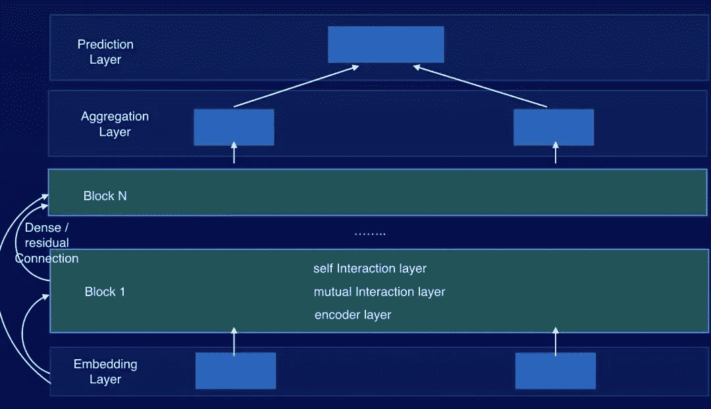

然后，我们基于该框架进行了多次实验，最终得到了模型结构 RE2。该模型可以从各种公共数据集和我们的业务数据中获得最优结果，如下图所示。

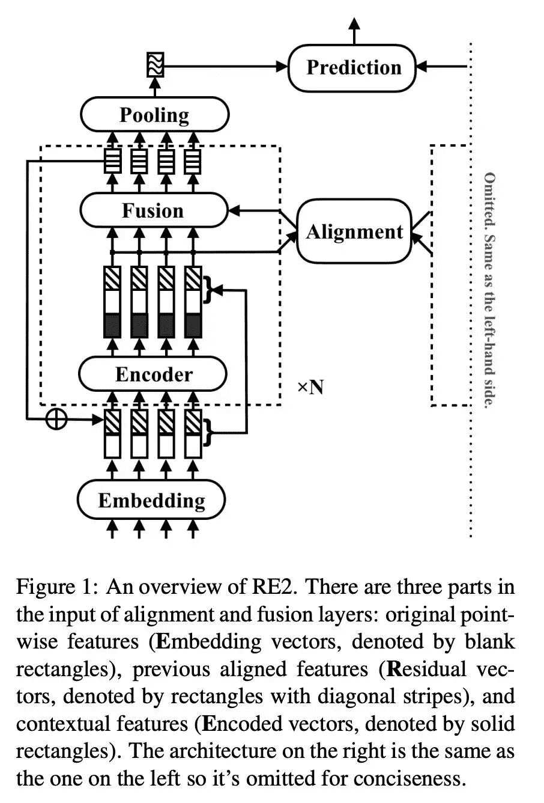

RE2 包括 N 个块，其参数完全独立。在每个块中，编码器生成上下文表示。然后，编码器的输入和输出被连接用于句子间对齐。最后，通过融合获得块的输出。块‘I’的输出通过增广残差连接与该块的输入融合，融合结果作为块 i+1 的输入。

下面，我们详细描述每个涉及的部分。

# 扩充剩余连接

在我们的模型中，连续的块通过增加的剩余连接来连接，因此我们记录在位置 I 的块 n 的输出如下:

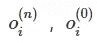

是一个纯零向量。

第一块的输入是

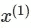

，这是嵌入层的输出。在扩充剩余连接中，块 n 的输入如下:

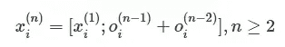

其中，[；]表示串联操作。

在交互层输入三种类型的信息。第一个是原始的逐点信息，这是原始的词向量信息，用于每个块。第二个是从编码器获得的上下文信息。第三个是由前两个模块处理和对齐的信息。这三种类型的信息在最终结果中起着重要的作用，这将在实验分析中得到证明。在我们的模型中，编码器使用两层 CNN(相同的填充)。

# 对准层

在对齐层，我们使用基于可分解注意力模型的对齐机制(Parikh 等人，2016)。

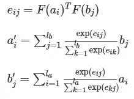

# 融合层

在融合层，我们通过 FM 计算三个标量特征值。这个过程基于 CAFE 中的 concat、multiply 和 sub 操作。对于这三个操作，我们使用三个独立的全连接网络来计算三个向量特征值，然后连接这三个向量用于同时投影。

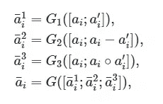

# 预测层

预测层是输出层。对于匹配文本相似性的任务，我们使用以下对称格式:

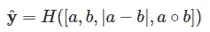

对于文本蕴涵和问答匹配任务，我们使用:

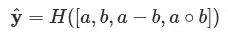

其中，H 表示具有多层的全连接网络。

# 我们的实验

# 数据集

为了验证模型的性能，我们选择了三种类型的自然语言处理任务:自然语言推理、复述识别和问题回答。我们还选择了公共数据集 SNLI、MultiNLI、SciTail、Quora Question Pair 和 Wikiqa。我们决定使用精确度(Acc)作为前两个任务的评估标准，使用平均精确度(MAP)和平均倒数排名(MRR)作为第三个任务的评估标准。

# 我们的实施细节

我们使用 Tensorflow 来实现我们的模型，并使用英伟达 P100 GPU 来训练它。我们还使用自然语言工具包(NLTK)来分离英语数据集，然后将其转换为小写，并以统一的方式删除所有标点符号。我们没有限制序列长度，而是填充一批中每个序列的长度，使其与每批中的最大序列长度相同。我们选择 840B-300d 手套向量作为单词向量，在训练过程中这些向量是固定的。所有不在词汇表中的(OOV)单词被呈现为纯零向量，并且在训练期间不被更新。所有其他参数通过初始化来初始化，然后通过权重归一化来归一化。每个卷积层或完全连接层后面都有一个下降层，保持率设定为 0.8。输出层是一个两层前馈网络。块的数量范围可以从 1 到 5。

在这些公共数据集中，隐藏层的大小被设置为 150，高斯误差线性单位(GeLu)被用作激活函数。Adam 被用作优化算法。学习线性升温，然后指数衰减。初始学习率可以从 1e-4 到 3e-3，批量大小可以从 64 到 512。

# 结果呢

当没有使用 BERT 模型时，我们从所有这些公共数据集获得结果。

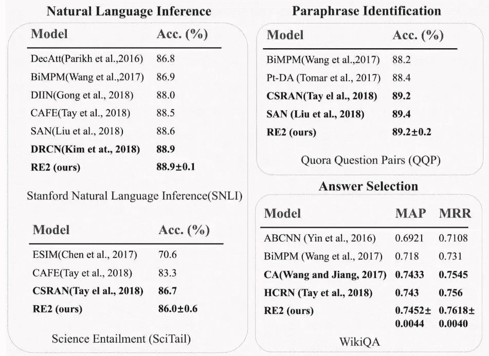

该模型表现出良好的性能，在参数容量和推理速度方面具有很强的竞争力。因此，该模型可以广泛应用于 AlimeBot 等行业场景。它还显著提高了业务指标，如匹配准确性。

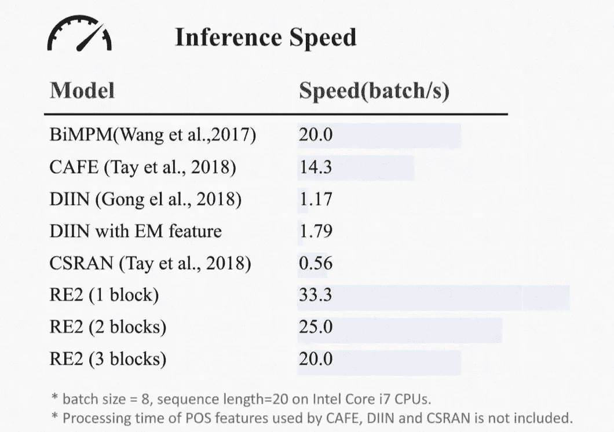

# 分析

## 消融研究

我们构建了以下四个基线模型:

1.  没有 enc-in:在对齐层仅使用编码器输出。
2.  无残留:移除块之间的所有残留连接。
3.  没有 enc-out:所有编码器都被移除，在对准层仅使用块输入。
4.  高速公路:高速公路网络用于融合编码器输入和输出，但不直接连接它们。

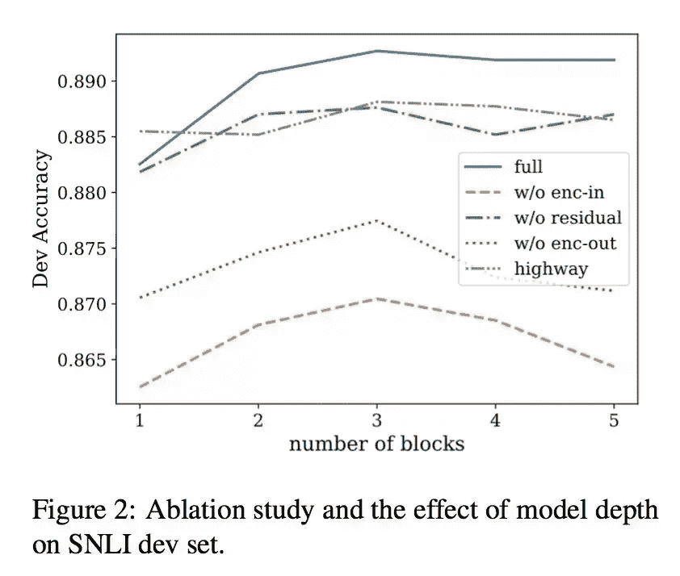

上图显示了基于 SNLI 获得的结果。通过对比模型 1。第三。对于完整的模型，我们发现当在对准层仅使用编码器输入或仅使用编码器输出时，获得的结果较差。这表明原始单词向量信息、由先前块生成的对齐信息以及由当前块中的编码器生成的上下文信息对于更好的结果都是不可或缺的。通过对比模型 2。和完整的模型，我们发现块之间的剩余连接起作用。并且，通过对比模型 4。和完整的模型，我们发现直接连接是一个更好的解决方案。

## 块数的影响

同样，如上图所示，通过增强剩余连接连接的网络更有可能在深度网络中有效，并支持更深的网络层。在其他基准模型中，当块数超过三个时，性能会显著下降。这与更深层模型的应用是不兼容的。

## 遮挡敏感度

对齐层的输入实际上是三种类型信息的串联:原始单词向量信息、由先前块生成的对齐信息以及由当前块中的编码器生成的上下文信息。为了更全面地了解这三类信息对最终结果的影响，我们在机器视觉相关工作的基础上分析了遮挡敏感度。我们使用了一个 RE2 模型，它包含三个 SNLI-dev 数据块。然后，我们在块的对齐层将某些输入特征屏蔽为纯零向量，并观察蕴涵、中性和矛盾类的精度变化。

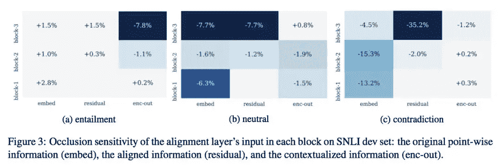

我们得出以下结论:

首先，掩蔽原始词向量信息显著阻碍了识别中性和矛盾类的过程。这表明原始单词向量信息在识别两个句子之间的差异中起着至关重要的作用。

在此之后，由先前块产生的屏蔽对准信息也影响中性和矛盾类。特别地，屏蔽由最后一个块产生的对准信息对最终结果具有更显著的影响。这表明剩余连接使当前块能够更好地关注最重要的事情。

最后，屏蔽编码器输出会影响推论。我们认为这是因为编码器模型使用短语级语义，并且编码器输出有助于识别蕴涵。

## 我们的案例研究

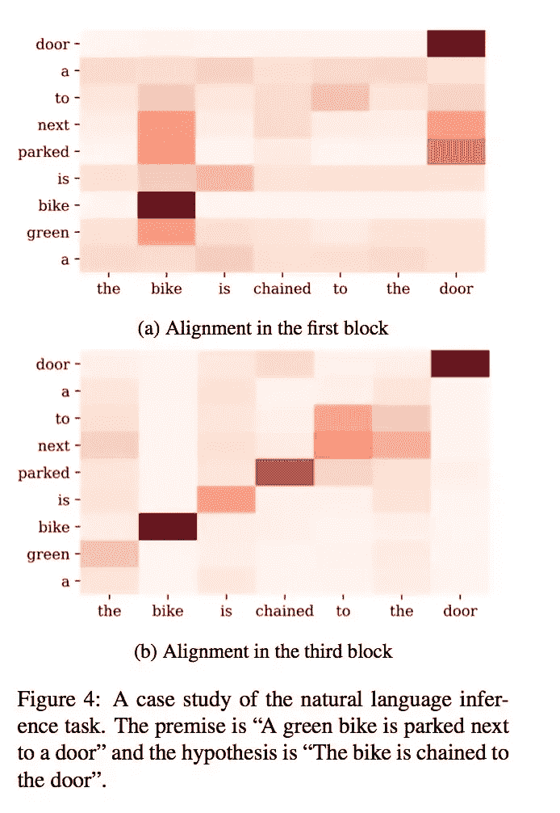

现在，在这一节中，我们将提出一个具体的案例来分析多个块的作用。

考虑一下这两个句子“一辆绿色的自行车停在一扇门旁边”和“自行车被链条拴在门上”。在第一个块中，对齐是在单词或短语级别，在“停靠在旁边”和“链接到”之间只有微弱的联系。在第三个块中，两个句子是对齐的。因此，该模型可以基于“停在旁边”和“链接到”之间的关系来识别两个句子之间的整体语义关系。从这个例子中，我们可以看到，在比对过程中，每个块关注不同的信息。经过多次比对，模型可以更好地理解两个句子之间的语义关系。

# 业务场景中的结果

通过我们的 AlimeBot，商家维护定制知识库，我们提供知识定位解决方案。如果 AlimeBot 无法提供准确的回复，我们推荐相关知识。本文介绍的文本匹配模型用于这两个 AlimeBot 业务模块。我们为服装服饰、美容化妆品、鞋类、家电电器、食品饮料、妇幼保健和数字服务等七大行业创建了优化模型，以及一个基本的仪表盘模型和一个相关知识推荐模型。在保证较高覆盖率的同时，行业模型将准确率从不到 80%提高到 89%以上，基础仪表盘模型将准确率提高到 84%，推荐相关知识的模型将有效点击率从 14%左右提高到 19%以上。

# 摘要

在行业场景中，我们实现了一个简洁且高度表达的模型框架，并基于公共数据集和业务数据集取得了良好的效果。

这个“通用”语义匹配模型已经交付了显著的改进。但是，我们需要继续致力于基于 AlimeBot 的更适合不同行业和场景的解决方案。比如我们可以整合产品、事件知识等外部知识进行文本匹配。

我们还需要专注于改进 FAQbots 背后的技术系统，我们希望改进文本分类和少镜头分类。随着 BERT 模型的出现，各种自然语言处理任务达到了新的 SOTA 水平。然而，BERT 模型太大，需要大量的计算资源。因此，我们希望使用师生框架将 BERT 模型的功能迁移到 RE2 模型。

# 原始来源:

 [## 当你和聊天机器人交谈时，它到底在想什么

### 阿里巴巴 Clouder 年 2 月 14 日 190 由高兴，在阿里巴巴绰号空谷。这里有一个奇怪的问题。为什么…

www.alibabacloud.com](https://www.alibabacloud.com/blog/what-is-a-chatbot-really-thinking-when-youre-talk-with-it_595827?spm=a2c41.14065549.0.0)