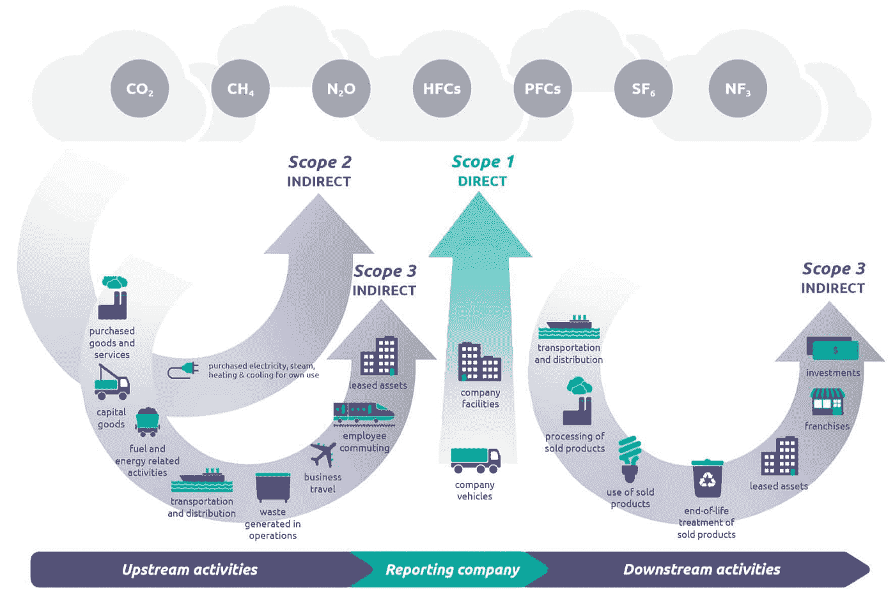
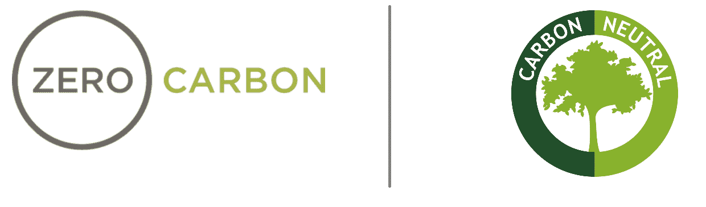

# 什么是低碳转型？基本概念第一部分

> 原文：<https://medium.datadriveninvestor.com/what-is-a-low-carbon-transformation-basic-concepts-part-i-c358bdaf9f6d?source=collection_archive---------28----------------------->

解决气候危机的紧迫性已被世界各国政府、国际组织、各种企业和更广泛的民间社会广泛认识到。2015 年 12 月的巴黎气候大会(COP21)是全球努力解决温室气体(GHG)排放的一个重要里程碑。在该协议中，所有国家都同意将地球温度保持在比工业化前的温度水平低 2°C 的水平，并努力将温度进一步降低至 1.5°C。然而，按照目前的 GHG 排放率，巴黎气候协议将无法在 2100 年前将全球变暖保持在 2°C 以下。2016 年联合国排放差距报告指出，各国的减排承诺仍不足以实现将全球气温上升限制在比工业化前水平高 2℃以下的目标。政府间气候变化专门委员会(IPCC)估计，为了实现这一目标，需要脱碳和负排放。

“按照目前 GHG 的排放速度，巴黎气候协议无法在 2100 年前将全球变暖控制在 2 摄氏度以下。”

气候危机是一个复杂的问题，许多问题肯定会发生作用。一个关键问题是缺乏政治意愿；我们只是不够努力。另一个问题是，理解与气候辩论相关的最重要的基本技术概念对决策者来说是一个挑战。在这篇文章中，我们将触及一些我们认为绝对重要的重要方面。了解这些方面将有助于丰富决策和公共讨论并为其提供信息。

**排放范围**

这个排放范围的概念确定了排放挑战的边界，就像用手环绕一个区域。排放范围是 2016 年由温室气体议定书为建筑物制定的，但是，我们认为它们仍然是一个有用的一般概念，可以扩展到其他领域。除了其他重要方面之外，这些范围还确定了排放的位置。这一点非常重要，因为一些技术倡导者可能会声称，某些地方的某些技术(如氢、电动汽车)不会在消耗能源的地方产生排放，而事实上，使用这些技术不会减少 GHG 的排放。例如，电动汽车或氢燃烧技术正被作为减排技术，然而，使用这种技术可能不会减少排放，因为没有充分考虑排放范围。现在，让我们来探讨发射范围的概念。

**范围 1** 排放是直接排放，如果消费者使用电动汽车，或完全用电加热建筑物，或在工厂用感应电炉炼钢，范围 1(现场排放)为零。考虑到这些排放，零范围 1 排放通常有利于当地的空气质量和人类健康，并有助于减少某些地区的空气污染，但这不一定足以解决气候危机或减少全球 GHG。原因在于，在到达消费场所之前，与能源供应链相关的上游活动可能会产生排放。

这方面最简单的例子是在为电网供电的发电厂烧煤发电，然后用电给电动汽车/公共汽车/火车充电，供消费者使用。虽然现场没有排放，但在本例中，GHG 仍在发电现场释放到大气中，只是消费者没有感受到排放。避免这种误解的一个简单方法是问；“我最初使用的能量来自哪里？”

**范围 2** 排放是与能源消费前的生产和运输相关的间接排放，这里我们开始考虑能源最初来自哪里。使用前面的示例作为参考，范围 2 排放将考虑电动汽车中使用的电力是由煤还是天然气产生的，在这种情况下，即使听起来很奇怪，驾驶电动汽车也可能有与之相关的排放。

**范围 3** 排放是所有其他间接排放，这包括所有与人类活动相关的上游和过去的排放。在考虑建筑物时，这可能被称为隐含排放，可能包括为制造而进行的资源开采中释放的排放，或生产消费产品的制造过程中释放的排放。

Different Emissions Scopes, Ref: compare you footprint

**零碳对碳中性**

理解零碳和碳中和概念之间的区别至关重要。真正的零碳活动不涉及直接或间接排放。这对于直接排放是直接的；在某一地点不燃烧化石燃料，对于间接排放来说，这变得更加复杂，因为在这种情况下，实现零碳排放将涉及确保能源(电力)或零碳燃料(铀、氢)的供应商不在生产地点排放碳(参见上述排放范围)。零碳排放的另一个复杂性是量化制造业或商品和材料的间接排放。一个真正的零碳世界将没有直接或间接的排放，这是减缓气候变化的理想的最佳情况。

另一方面，碳中和意味着排放碳及其等价物 GHG，并以某种方式抵消这些排放的影响。最简单的方法是在以前没有植被的地方种植植物，这些新植物吸收的二氧化碳量抵消了最初排放的碳量。虽然这个概念听起来很简单，但是很难实现、测量和验证。另一个不太容易实现碳中和的方法是通过碳捕获，这发生在排放发生后，这涉及到重新定向排放的 GHG 以防止碳进入大气。虽然这一想法在理论上可行，但尚不清楚这一想法是否能在全球范围内推广并带来经济效益。碳中和的另一个概念是使用可再生燃料，如生物燃料、可再生天然气、生物质，这些燃料仍然排放碳，但据称在它们的生命周期中，生产它们的过程吸收了足够的 GHG 来抵消这些排放。

最重要的问题是:对于零碳排放，间接排放怎么样？对于碳中和，它是如何实现和测量的？

Zero Carbon and Carbon Neutral are two different things

排放范围和零/中性碳概念对任何人来说都是很好的概念，可以理解并与他人进行有根据的讨论。在下一篇文章中，我们将扩展到与可再生能源相关的其他重要概念。

如果你学到了新的东西或者喜欢这个内容，请关注我[这里](https://medium.com/@7asabala)询问问题、表示支持和反馈请联系我[这里](https://mhassaballa.com/contact-me/)

参考

[【1】](https://www.datadriveninvestor.com/2021/02/09/what-is-a-low-carbon-transformation-basic-concepts-part-i/#_ftnref1)《巴黎协定| UNFCCC》。”[https://UNFCCC . int/process-and-meetings/the-Paris-agreement/the-Paris-agreement](https://unfccc.int/process-and-meetings/the-paris-agreement/the-paris-agreement)。于 2020 年 12 月 26 日访问。

[【2】](https://www.datadriveninvestor.com/2021/02/09/what-is-a-low-carbon-transformation-basic-concepts-part-i/#_ftnref2)“2020 年排放差距报告|环境署——联合国环境规划署……”2020 年 12 月 9 日，[https://www.unenvironment.org/emissions-gap-report-2020](https://www.unenvironment.org/emissions-gap-report-2020)。于 2020 年 12 月 26 日访问。

[【3】](https://www.datadriveninvestor.com/2021/02/09/what-is-a-low-carbon-transformation-basic-concepts-part-i/#_ftnref3)《巴黎协定| UNFCCC》。”[https://UNFCCC . int/process-and-meetings/the-Paris-agreement/the-Paris-agreement](https://unfccc.int/process-and-meetings/the-paris-agreement/the-paris-agreement)。于 2020 年 12 月 26 日访问。