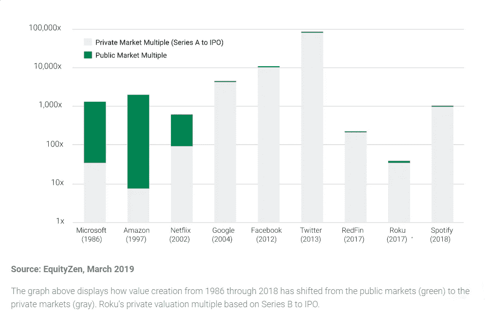
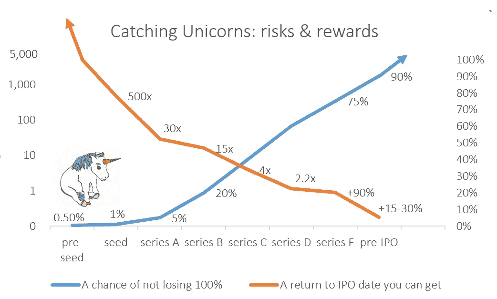
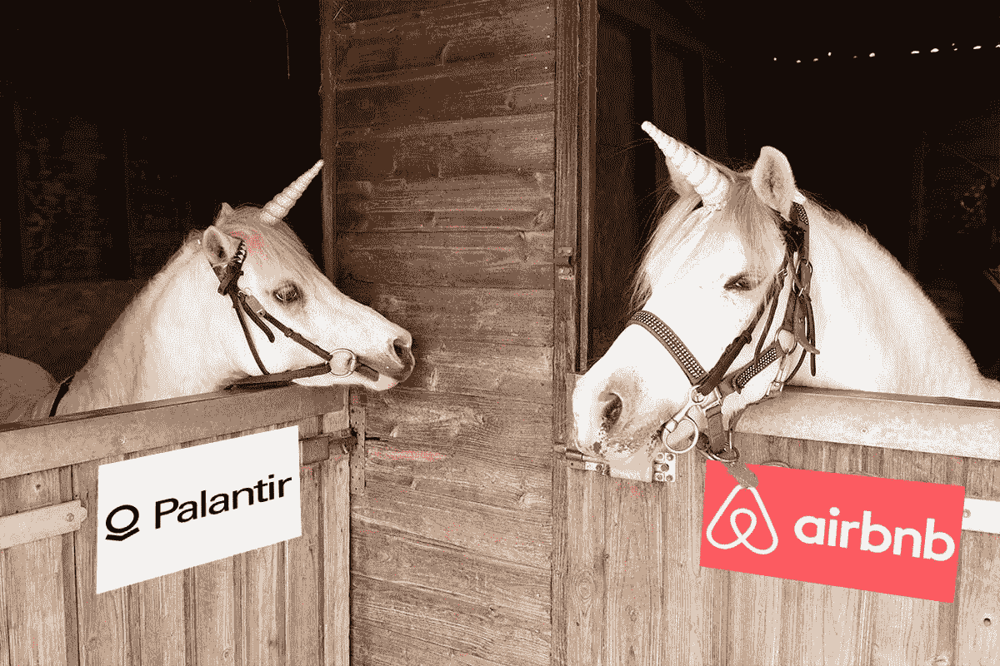

# 什么是预上市，为什么你可能会考虑它？

> 原文：<https://medium.datadriveninvestor.com/what-is-a-pre-ipo-and-why-you-might-want-to-consider-it-b4cf151005f8?source=collection_archive---------5----------------------->

首先，我假设你知道什么是 IPO。IPO——或首次公开发行——是向公众提供私营公司新发行股票的事件和过程。1602 年，荷兰东印度公司首次公开募股——所以社会有足够的时间适应这种现象

# 上市前

那么什么是预上市呢？嗯，这里没有严格的定义。一般来说，上市前发行是指在公司上市前发行公司股票。然而，显然，早期融资从不被称为上市前融资。因此，至少就本文的目的而言，让我们一致认为，上市前是一家公司的股票发行，该公司预计将在不久的将来进行 IPO，并正式为此做准备。

# 我为什么要关心预上市投资？

近年来，IPO 前投资变得越来越热。这有几个原因。

1.  好的公司倾向于比以前保持更长时间的私有。

早在 1994 年，杰夫·贝索斯就成立了一家名为 Cadabra 的公司，不久后更名为 Amazon.com 公司。三年后，该公司以每股 18 美元的价格在纳斯达克上市。剩下的就是历史了——今天一只亚马逊股票价值约 2000 美元。

网飞于 2002 年在成立四年半后在 T2 首次公开募股。

2004 年，Alphabet Inc .(谷歌)在 T4 上市六年后上市。

 [## 算法交易的机器学习|数据驱动的投资者

### 当你的一个朋友在脸书上传你的新海滩照，平台建议给你的脸加上标签，这是…

www.datadriveninvestor.com](https://www.datadriveninvestor.com/2019/01/30/machine-learning-for-stock-market-investing/) 

这看起来有点像一种趋势，不是吗？根据 Jay Ritter 教授的说法，自 1999 年成立以来，科技公司在四年后上市，但在 2014 年，科技公司的平均私有时间为 11 年。

2.由于上述原因，现在私营公司创造的价值比以往任何时候都多。早在 21 世纪初，一家估值在 10 亿美元以上的私人公司(独角兽🦄)是一个独特的发现，2015 年我们在全球有 **74 家独角兽**，而今天有 **452 家独角兽公司**，累计估值 13.3 亿美元。

3.你投资得越早，赚的钱就越多(当然，前提是你选对了公司)

通常情况下，如果投资于一家好公司，你越早投资，获得高回报的机会就越大。天使投资人和风投很早就投资，以获得 100 倍甚至 1000 倍的回报。例如，Airbnb 最早的(种子)投资者仅以 0.02 美元的价格购买了他们的股票，这意味着 10，000 倍以上的回报(考虑到公开配售后股价达到 200 美元以上)。

大多数情况下，非专业投资者无法获得早期投资。由于风险极高，这种进入受到法律限制:当进行种子投资时，损失所有投资资金的可能性超过 90–95%。成功的早期投资需要特殊的技能和极高的运气，才能在即将倒闭的公司中挑选出未来的独角兽。

An approximate risk-to-return profile for private equity investment. Return approximation based on actual Airbnb funding history & prices

但是，上市之前还有后期。它们被称为成长阶段、后期阶段，最后是公共阶段。越晚投资越安全，但与此同时，赚取 10 倍或 100 倍的机会正在飙升。

上市前投资是在公司很明显将很快上市的时候进行的投资。通常，此时公司已经:
🦄可持续的现金流，通常还有利润
🦄成熟的商业模式
🦄拥有大量客户的工作产品(至少对 B2C 公司而言)
🦄说服未来投资者购买股票的有效增长策略

在 IPO 准备期间，公司还会努力实现业绩最大化、成本最优化，并增加媒体曝光率。

因此，在这一点上，我们有一家准备上市的公司，它将在 IPO 日期之前投入所有的营销和管理努力来获得估值，在这个日期之前，你可以以比 IPO 价格低 15%-30%以上的价格获得这家公司的风险敞口。听起来不错，对吧？但在这个世界上，没有额外的风险就没有额外的回报——这就是市场效率的运作方式。

# 上市前特定风险

1.  缺乏流动性
    一旦你购买了一家私人公司的股票，最好做好持有它直到 IPO 的准备，因为找到买家可能很棘手。当然，如果你有个人理财经理，或者是乐于购买你产品的投资者群体的一员，那将是一个选择。但通常情况下，无摩擦退出的最佳方式是等待 IPO。
2.  公开发行可能会被推迟甚至取消。这不是一个常见的场景，然而，这是一个可能的场景——正如去年令人悲伤的 WeWork 故事所展示的。通常，如果上市前公司发生了不好的事情或一些负面信息被披露，就会发生这种情况。再加上流动性不足，这种风险会让你手头的资产变得非常不稳定。
3.  股息稀缺公司通常避免在早期支付高额股息，因为股东更愿意将所有利润再投资于不断增长的业务。尤其是在 IPO 之前，如果全世界都注意到当前股东获得了巨额股息，这不会被视为一个好兆头。
4.  股权结构
    很明显，作为一个自然人，在市场上没有流通股之前，你不可能把股票和 GOOG、AAPL 一起存入你的正规券商账户。因此，这种投资可能是某种 SPV(基金)的股份，持有实际股份，并在 IPO 后将其分配给股东，也可能是没有上市前公司实际股份支持的差价现金(CFD)合约。这两种结构都有风险。差价合约被认为风险特别高，在一些国家被禁止:如果你选择这种投资方式，请格外小心。特殊目的公司/基金结构需要你方的尽职调查:你必须检查你的投资伙伴的可靠性，确保它得到适当的许可，在值得信赖的司法管辖区注册，等等。
    数字资产公司最近开始为上市前零售投资提供自己的解决方案。2019 年，一家名为 [Ambisafe](https://ambisafe.com/blog/uspx-token-tracks-spacex-share-en/) 的公司已经出售了价值 25 万美元的 SpaceX 数字证券，而另一家公司 [Okonto](https://www.okonto.com/blog/gett-preipo-complete/) 已经完成了价值 2000 万美元的由 Gett Taxi 股票支持的数字证券出售。至于数字证券，这里没有太大的区别:可以是差价合约或持有资产的基金份额。因此，需要同样的预防措施和尽职调查程序。
5.  法律风险。如果你直接从所有者(比如说公司员工)那里购买上市前的股票，确保资产购买协议清晰明了，最好给你的律师看一下。公司的股东协议可能会限制向外部所有者出售股份，在这种情况下，您与卖方的协议可能会无效。

# 上市前:拥有独角兽的难得机会🦄

因此，对于一个新手投资者来说，投资上市前的公司并不是一条安全和容易的道路。这并不奇怪，因为小投资者购买上市公司上市前股票的整个能力长期以来都被安全地关闭了，从而保护了投资公司、基金和超级富豪(所谓的高净值个人)的额外收益。2020 年，只有少数公司向散户投资者提供这种机会——谁知道呢，也许我们现在看到了一个新投资时代的开始，任何人都可以享受拥有独角兽的乐趣。

重要提示:投资上市前的科技公司涉及很高的风险。永远不要忘记对你想投资的公司和所有服务提供商，如经纪人、基金、差价合约等进行 DYOR(自己做研究)。

阅读更多相关信息:

[麦肯锡:为什么独角兽保持私有](https://www.mckinsey.com/industries/technology-media-and-telecommunications/our-insights/grow-fast-or-die-slow-why-unicorns-are-staying-private)。

[经济学家:飞翔，坠落，再飞翔](https://www.economist.com/briefing/2015/07/25/to-fly-to-fall-to-fly-again)