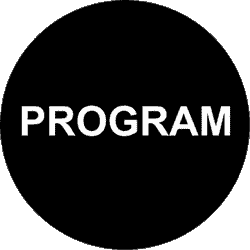

# 什么是通俗易懂的程序？(带音频)

> 原文：<https://medium.datadriveninvestor.com/what-is-a-program-in-laymans-language-62e915702d1?source=collection_archive---------20----------------------->

程序是你给计算机的一组指令，使它能完成特定的任务。

**那么我们为什么需要一个程序呢？**

*   假设我们想把两个数相加，比如 1，2。我们可以很容易地做到这一点，通过使用计算器按 2，然后'+'号，然后按 3，然后' = '号。我们将得到输出为 3。这很简单🙂。
*   但是现在，假设我们要取 10 个数字的平均值。让这些数字是 1，2，3，4，5，6，7，8，9，10。现在的任务比前一个任务更难。我们必须分别按下每个数字，然后按下它们之间的“+”号，以“=”号结束。我们还要把它除以 10。
*   因为计算器不知道如何计算平均值。但就计算机而言，我们可以教它们。因此，我们可以说，计算机是一个可编程的计算设备，它也成为了计算器的延伸。

***以计算机为例，我们可以把所有的步骤一个一个地交给我们的计算机系统来定义一个程序，我们可以称之为程序，系统/CPU/处理器会执行那些指令集。***

在上面的例子中，数字是数据，求平均值的步骤是指令。

***一个程序不过是一组数据和一组对这些数据的操作或指令。***

***编程语言是我们自然语言(英语)和机器语言(二进制)之间的一个中间体。***

希望你喜欢。

希望得到积极的回应。

请关注我的@Medium 简介 [Yash Kamal Chaturvedi](https://yashkamalchaturvedi.medium.com/)