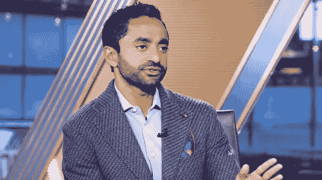

# 什么是特殊目的收购公司？

> 原文：<https://medium.datadriveninvestor.com/what-is-a-spac-5ab4ff102f3?source=collection_archive---------13----------------------->

**为什么 2020 年会有这么多钱涌入？**

Chamath Palihapitiya on CNBC photo via cnbc.com

如果你关注股市，你可能听说过这些股票。这里大概是 2020 年最著名的一个。

查马斯·帕里哈皮提亚是脸书早期的一位高管，也是一个你如今在财经新闻世界里随处可见的人，他与维珍航空公司的创始人理查德·布兰森爵士见了面。查马斯的特殊目的收购公司收购了理查德爵士的新太空探索公司维珍银河。

**特殊目的收购公司到底是什么？**

为了解释什么是特殊目的收购公司，让我们看看它是如何形成的。首先，特殊目的收购公司是一个特殊目的收购公司的缩写。然而，他们经常被简单地称为“空白支票”公司。

玩家:

*   社会资本——这是查马斯的风险投资公司
*   hedosophia——这是另一家风险投资公司，由一位名叫伊恩·奥斯本的先生创办。
*   社会资本 Hedosophia 控股公司(IPOA)——这就是特殊目的收购公司本身

[在 2017 年 9 月特殊目的收购公司的首次公开募股(IPO)中，他们以每股 10 美元的价格出售了 69，000，000 股普通股。融资 6.9 亿美元。在此发生时，特殊目的收购公司没有任何经营或业务。这 6.9 亿美元的目的是走出去进行收购。因此，现在它只是一张等待收购的“空白支票”。](https://www.sec.gov/Archives/edgar/data/1706946/000114420418008162/tv484856_10k.htm)

**那么，如果这一切都发生在 2017 年，为什么我们现在才听到**

嗯，因为查马斯和理查德直到 2019 年才完成交易。

那张“空白支票”就放在查马斯的手中，而他正四处张望，考虑如何花掉他的 6.9 亿美元。

与此同时，股票一直在证券交易所以 IPOA 代码交易。因为没有潜在的业务，股东只持有一股有权获得现金的股票，股价不应该超过 10 美元。事实上，一般来说，这是特殊目的收购公司的股票价格，直到他们进行收购。

所以，给你一个建议。如果你看到一个特殊目的收购公司在他们收购之前卖 15 美元。要知道，如果你买了那只股票，你花了 15 美元买了 10 美元。在我看来没什么大不了。

**特殊目的收购公司的好处是什么**

通过特殊目的收购公司筹集资金是一个相对简单的过程。毕竟，没有什么潜在的业务会让事情变得复杂。

进行首次公开募股并筹集资金的法律和会计障碍是例行公事和老生常谈。SEC 备案以及法律和会计工作都是例行的和可重复的，这一切都导致了更低的成本。

在特殊目的收购公司，支付给律师和会计师等的费用约为 100 万美元。相比之下，变焦支付了 450 万美元，优步支付了 1500 万美元。

作为一个经历过几次 IPO 的人，让我告诉你，这只是支付给第三方的费用。管理层以及各种法律、财务和会计部门所需的内部劳动力也带来了巨大的负担。

因此，基本上特殊目的收购公司的一个巨大好处是，它是一种绕过时间、精力和成本的方式，这是典型的 IPO 过程对公司的要求。

**回到我们的维珍银河故事**

所以，在此期间，维珍银河(SPCE)一直在做他们的事情，没有想过查马斯。实际上，他们是由理查德爵士在 2004 年创建的，从那时起就一直致力于进入太空。他们原定于 2020 年 11 月向太空发射第一架航天飞机，但由于 Covid 的限制而推迟了。但听起来他们很亲近。

查马斯和他的 IPOA·特殊目的收购公司随后来了，用他的空白支票(由于其他公司(波音公司就是其中之一)进一步的资本承诺，到目前为止已经增加到 7 . 2 亿美元)买下了维珍银河。然后他们简单地把股票代码从 IPOA 换成了 SPCE，boom 维珍银河成了一家上市公司。不需要复杂的 IPO。

**越来越多的垃圾邮件**

就在今年秋天，Richard Branson 宣布了他的新的(与维珍银河完全无关的)特殊目的收购公司 VG 收购公司，该公司希望筹集 4 亿美元。

与此同时，Chamath、Social Capital 和 Hedosophia 正在共同建立他们的第四个特殊目的收购公司。这位出价 5 亿美元。

前高盛(Goldman)顾问、前特朗普顾问加里科恩(Gary Cohn)正在成立一个特殊目的收购公司，计划募集 6 亿美元。

著名的讨厌鬼……咳咳，我是说激进投资者比尔·阿克曼已经让他的特殊目的收购公司在 2020 年起飞了。他的特殊目的收购公司仅筹款一项就高达 40 亿美元。

2019 年，创纪录的 59 家 SPACs 成立，融资 136 亿美元。

截至 2020 年 10 月，已经有 165 家 SPACs 成立，募集资金 650 亿美元。11 月份的消息似乎表明，年底将会有大量新的 SPACs 出现。

 [## 这么说一家大型风投基金正在投资你的初创公司？4 实际考虑|数据驱动的投资者

### 首先，恭喜你。融资总是需要努力的，一个大的风险投资基金当然是一个大的…

www.datadriveninvestor.com](https://www.datadriveninvestor.com/2020/08/09/so-a-big-vc-fund-is-investing-in-your-startup-4-practical-considerations/) 

**到底是怎么回事？**

有两个主要因素推动了 SPACs 的繁荣。

1)特殊目的收购公司是新的 IPO。不要误解我的意思，一些保护股东的监管是好事，但当公司需要跳过的监管箍达到一定高度时，他们会找到其他获得资本的方法。首次公开募股已经变成了一个沉重的负担，而且过于昂贵。

2)好吧，那么 IPO 法规大概是 10%**的原因。90%的原因是有大量的钱在寻找一个家。私人股本、风险资本、对冲基金、养老基金、主权财富基金，是的，甚至散户投资者都在试图弄清楚自己的资金投向。当货币供应量达到某一点时，事情就会变得疯狂。

**百分比可能是估计值

 [## 民主党人和共和党人似乎都同意一件事

### 富人的社会主义

davidferrara.medium.com](https://davidferrara.medium.com/the-one-thing-democrats-and-republicans-seem-to-agree-on-b8cbcc69e341) 

**一个推论**

2017 年，孙正义启动了他的 1000 亿美元愿景基金。这在当时令人震惊，因为新基金通常没有这么大。

我记得当时最大的问题不是 Masayoshi 如何筹集到那么多钱。毕竟，Masayoshi 有着令人印象深刻的投资历史，作为雅虎和阿里巴巴等公司的早期投资者，他赚了数十亿美元。所以，他有一个人们信任的记录。

不，问题是他如何找到足够的地方来放他的 1000 亿美元。这个问题被证明是正确的。

当有人让你向他们的公司投资 1，000 美元，而你的总净值是 1，000 美元时，你会花很多时间做尽职调查，以确保你没有浪费你一生的积蓄。

当有人让你向他们的公司投资 1000 美元，而你有 1 亿美元时，我认为你可能没有尽职调查得那么彻底。尤其是，当你不得不为另外的 99999000 美元找一个去处的时候。

这可能就是为什么在过去的几年里，像他们的 WeWork 投资这样的灾难，Vision Fund 一直是一场灾难。如果你没听说，2019 年，软银在 WeWork 计划 IPO 之前以 470 亿美元的估值投资了该公司。[今年春天，软银不得不将其投资的估值下调至 29 亿美元](https://www.cnbc.com/2020/05/18/softbank-ceo-calls-wework-investment-foolish-valuation-falls-to-2point9-billion.html)

软银的其他投资在 2019 年也表现不佳。该基金的总价值减少了 170 亿美元。

**外卖**

我认为软银的 Vision I fund 是一个教训，说明了当太多资金试图寻找投资场所时会发生什么。而特殊目的收购公司只不过是一张“空白支票”，让大量资金寻找投资的地方。

当特殊目的收购公司市场像现在这样崩盘时，我不认为这对股市是个好兆头。SPACs 会拿走我们的钱，用 WeWork 收购软银这样的高价资产，最终会损失一大笔钱。

如何在这一切中成为赢家？

正如我之前写的。不要把这当成市场即将崩溃的信号，卖掉所有的东西。但是你可能会从桌子上拿走一点。

 [## 股市要崩盘了吗？

### 2021 会比 2020 差吗？

davidferrara.medium.com](https://davidferrara.medium.com/is-the-stock-market-about-to-crash-9f0ea38db3b5) 

## 访问专家视图— [订阅 DDI 英特尔](https://datadriveninvestor.com/ddi-intel)