# 什么是创业加速器？2020 年顶级创业加速器研究。

> 原文：<https://medium.datadriveninvestor.com/what-is-a-startup-accelerator-research-on-top-startup-accelerators-2020-ddbc0550f876?source=collection_archive---------5----------------------->

你有没有遇到过这样的情况，当你和一群朋友在讨论某件事情时，聊到了，比方说，一个新的苹果交易。承认自己不在圈子里似乎有点尴尬，所以你只能带着聪明的表情点头，尽量不要表现出你不知道人们在谈论什么。你熟悉吗？

今天，我们想用简单的语言来解释复杂的创业加速器概念，这样即使你的祖父母也能理解。

 [## 2020 年最佳短期投资选择精选资源|数据驱动型投资者

### 投资是增加你净财富的一个好方法。如果你通过遵循一个严格的…

www.datadriveninvestor.com](https://www.datadriveninvestor.com/2020/03/28/handpicked-resources-for-the-best-short-term-investment-options-of-2020/) 

在这篇文章中，我们将讨论创业加速器是如何安排的，以及创业公司必须做些什么才能到达那里。作为奖励，我们分享了 2020 年不同类别的顶级创业加速器的研究。我们向 Taras Tymoshchuk 提出了所有这些问题，Taras Tymoshchuk 是 Geniusee 公司的企业家、商业分析师和首席执行官，该公司与全球各行业的初创公司合作。

# 什么是加速器？

加速器是一个针对初创企业的强化教育项目。它有助于改进产品，并将业务提升到一个全新的水平。这个概念描述了学校和教育项目本身。

典型的加速器为初创企业工作 3-6 个月:它提供培训和导师支持，帮助获得有用的联系(特别是潜在投资者)，在某些情况下为发展提供资金。

当一个团队有了一个想法、一个原型，最好是第一个客户/销售，那么它就有了一条通往加速器的直接路径。这类项目旨在帮助初创公司迅速转变为成熟的企业，而不是在初创公司的墓地中消失。多亏了加速器，团队在几个月内就能取得成果，而不是几年。

# 世界上第一台加速器是什么？

2001 年，第一家使用“加速器”这个词的公司是科罗拉多创业中心。它起源于成立于 1989 年的博尔德科技孵化器。之后，在 2005 年，保罗·格拉厄姆推出了 Y Combinator。

它成为第一家创业公司提供为期三个月的集体培训项目和小额种子资金，而不是长期项目孵化的公司。现在它是世界上最强大的加速器之一，几乎所有的创业公司都梦想进入其中。

在 Y Combinator 之后，这种投资模式开始被积极使用。于是有了众所周知的加速器——即插即用、Techstars 和 Seedcamp 等等。

# 加速器是如何工作的？

加速器计划设计为 3-6 个月。它包括讲座，研讨会，与导师和专家的会议。一些创业加速器还提供工作空间，有时甚至是企业合伙人，他们可以成为潜在的客户。

加速器为团队设定具体的目标。比如增加 5 倍的收入或者找到一个吸引客户的渠道。

加速器为初创企业提供的是:

*   有助于业务发展的知识和关系；
*   投资(对于初创公司，通常从 2 万美元到 25 万美元以上)；
*   访问一个由导师和专家组成的大型社区，他们将帮助快速识别和修复构建业务流程中的错误。

另外，加速器是一种“质量标志”。如果一个好的程序选择了一个创业公司，说明里面有东西。

# 创业加速器与企业孵化器有何不同？

孵化器总是一个特定的物理区域，有团队的企业家被邀请到那里，在那里他们会听到:“伙计们，这是你们的地方。你可以在这里坐一年，两年，三年，每月 500 美元。这里会有一名会计、一名营销人员和一名律师。我们将为您举办各种活动和研讨会。”换句话说，孵化器是一个锅炉，业务在初始阶段已经在其中沸腾了多年。起初它仍然是原始的，然后它要么成为一个独立的业务，要么不会。

创业加速器总是有一个清晰的计划，有明确的目标和期限。你不能走到加速器前说:“我已经坐在这里一年了，四处看看，读读书，参加研讨会，然后思考。”在加速器中，初创公司总是设定具体的目标，并为实现这些目标给出具体的时间。

与传统教育相比，孵化器是学校，加速器是大学。

# 创业公司是如何挑选的？

进入创业加速器的主要因素是一个可行的商业想法，一个进入大市场的机会和征服世界的愿望。

加速器的选择过程始于应用。为此，请填写网站上的表格，并简要介绍项目和团队。如果一家初创公司经过预先筛选，它会被邀请参加面试。加速器专家评估对业务和产品的理解，表达的清晰度和团队合作。

通常他们会选择处于高级阶段的创业公司。理想情况下，团队有产品，有客户，至少有少量收入。但有时他们在构思阶段就组建团队。

对每个人来说，一个普遍的条件是，团队应该提供一种新技术，允许这个计划被认为是一个启动。

相对来说，生产饼干，水管的软管，鹦鹉的食物不会被认为是创业公司。但是，如果你用蚱蜢制作绿色汉堡，用无人机运送它们，并以每月 15 美元的订阅价格出售它们——这是一家初创公司，为此你需要列出一系列假设、想法、假设，对它们进行测试，以便它从初创公司类别转移到商业类别。

# 创业加速器从哪里获得资金来资助创业公司？

除了教育和网络，大约 70%的加速器提供开发投资。为此，他们在生意中分得一杯羹。例如，为了换取 2 万美元或 5 万美元，一家初创公司最多可以放弃 7%的股份。另一种模式是，加速器也在业务中占有份额，但只有在成功完成的情况下。当项目结束时，初创企业已经发展成为成熟的企业，这种模式就能发挥作用。

还有其他融资模式:

*   国家拨款；
*   私人投资者的资金(这就是传说中的加州加速器 YCombinator 的工作方式)；
*   公司部门基金。

# 2020 年顶级加速器。

我们收集了一些 2020 年世界各地顶级创业加速器的信息。因此，让我们看看谁是该领域的全球领导者。

## 2020 年北美顶级创业加速器。

*   [**500 家创业公司**](https://500.co/) **。**

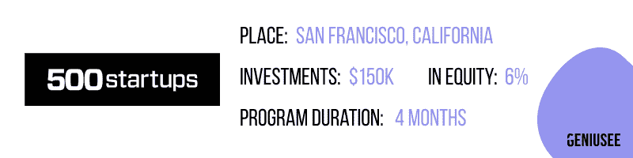

500 Startups 是世界上最著名的创业加速器之一。Twilio、Sendgrid、Grab 等很多你听说过或者用过其产品的公司，都是在这里长大的。500 Startups 是第一个独角兽加速器，它现在的资本总额超过 30 亿美元。该公司向每个初创公司投资 15 万美元，换取 6%的股权。他们收取 37.5 万美元的费用参与该计划，并在旧金山和墨西哥城举行。

*   [alpha lab](https://alphalab.org/)

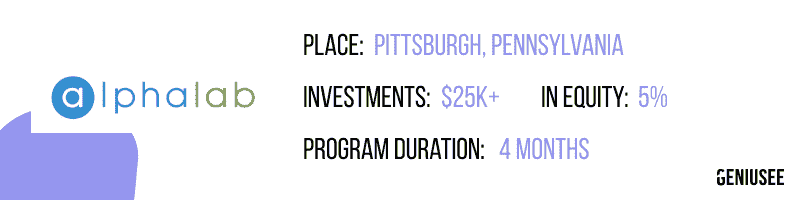

AlphaLab 是匹兹堡一家全国排名的早期创业加速器，专注于帮助创始人实现产品市场匹配和客户牵引。他们帮助初创科技公司快速找到最佳的方式，在为期 4 个月的沉浸式项目中建立和发展，其中包括融资机会。

*   [**XRC 实验室**](https://www.xrclabs.com/)

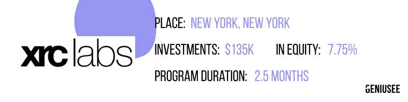

阿尔·桑巴说:“XRC 实验室正在推动一场行业变革，相当于从 19 世纪的普通商店向全国性百货商店的转变。”。对于专注于零售和消费品的初创公司，XRC 实验室在纽约提供了一个创新的、以设计为中心的加速器项目。XRC 实验室每年开展两个为期 10 周的项目。

*   [**群发挑战**](https://masschallenge.org/)

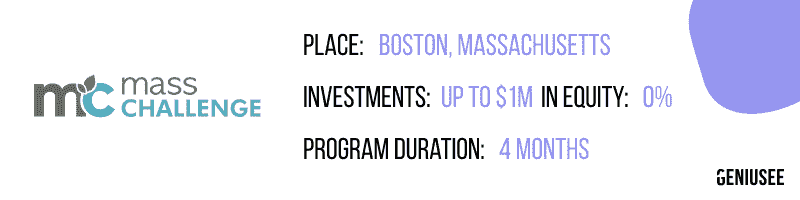

MassChallenge 是一家全球性的零股本创业加速器，拥有超过 10 年的成功创业经验。MassChallenge 总部位于美国波士顿，在以色列、墨西哥、瑞士、德克萨斯州和英国设有分支机构，通过零股本加速所有行业和所有国家的高潜力创业公司，加强全球创新生态系统。

*   [**乐营**](https://lecampquebec.com/)

**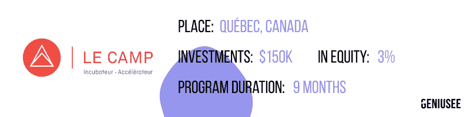**

**Le Camp(加拿大)是一家位于魁北克的孵化器-加速器。致力于科技企业成长和指导的创业加速器。乐营提供适应初创公司发展阶段的多样化服务，从初创前到国际化。他们提供适应公司发展阶段的多样化服务，从创业前到国际化。**

**【2020 年南美顶级创业加速器。**

*   **[**Ventiur Aceleradora**](https://ventiur.net/)**

**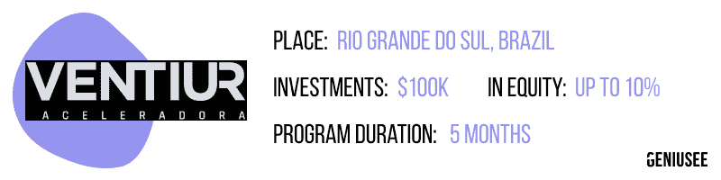**

**Ventiur Aceleradora 是一家巴西风险加速器，投资于种子期、初创期和早期发展阶段的公司。它们吸引了合格的投资者网络，提供了财政资源、企业家支持、指导和业务联系。Ventiur Aceleradora 表示，他们的主要目的是将世界变成一个更好的居住地。**

*   **[**达尔文创业公司**](http://darwinstartups.com/)**

**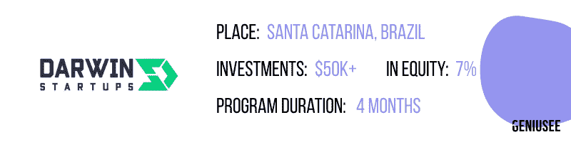**

**达尔文创业公司不仅仅是一个创业加速器。这是一个由企业家、导师和专家组成的巴西社区，为创业成长提供所有支持。Darwin Startups 提供初始投资、可靠的人脉网络和培训，帮助初创公司发展成大公司。**

*   **[**亚马逊**](https://amazonascap.com.br/)**

**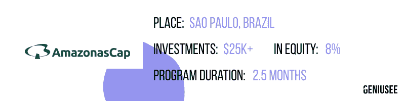**

**AmazonasCap 的提议是，在高水平导师的帮助下，从合作的第一个小时开始，就支持由遴选小组选择的有潜力的初创公司。**

*   **[**UP 创新实验室**](http://www.upinnovationlab.com.br/)**

**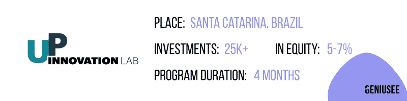**

**UP 创新实验室是为一家产品已经被认可的初创公司而创建的。如果你在 B2B 或 B2B2C 领域，那么这是你展示你的解决方案并与巴西最大的公司合作的机会。**

*   **[**Glocal**](http://www.glocalmanagers.com/en/)**

**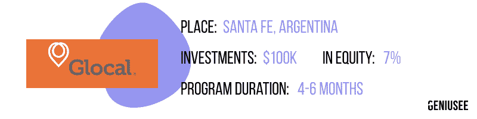**

**Glocal Agrifoodtech 2020 是农业综合企业行业初创公司和中型老牌公司的加速器。它提供了访问 Glocal 的联系网络，该网络与主要行业参与者建立了长期关系，如农民、经纪人、经销商、出口商、工业、贸易商、保险公司、证券交易所、期货交易所和其他连接生产商或农业企业链的其他代理的协会。在过去的一年里，它已经并入了巴西最大的创业市场进入计划。**

**【2020 年欧洲顶级创业加速器。**

*   **[**33 企业家**](http://www.33entrepreneurs.fr/)**

**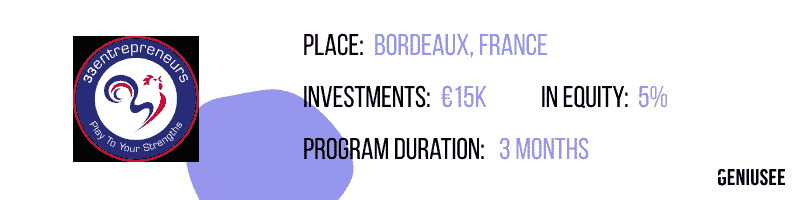**

**33entrepreneurs 是一家总部位于法国的创业加速器。与他们的学术合作伙伴一起，他们开发了一个综合框架来解读创新，这超过了之前所有方法的 10 倍(速度、深度、覆盖范围)。每个被选中的创业公司还有机会获得€1.5 万英镑的资助。**

*   **[**APX**](https://apx.ac/)**

**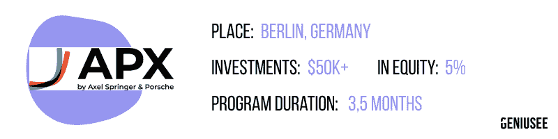**

**APX 是一家总部位于柏林的创业加速器，它有动力、经验和领导力来支持创业者将好想法变成伟大的想法。APX 提供给€ 25，000 英镑作为 5%的资本和 3 个月的培训支持。**

*   **[**巴克莱加速器**](http://www.barclaysaccelerator.com/)**

**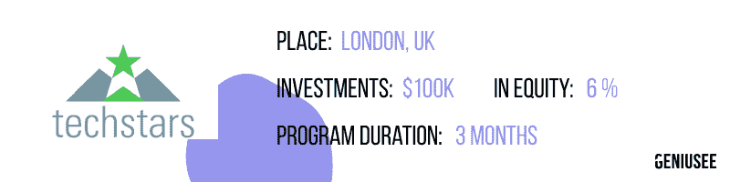**

**Barclays Accelerator 是一家总部位于伦敦的创业加速器，由机会创造者组成，共同帮助初创企业融资。他们的目标是与供应商发展世界级的增值创业伙伴关系，并支持创新的解决方案，将客户和顾客放在每个创业公司的核心位置。他们为初创企业的发展提供高达 12 万美元的资助。**

*   **[**企业家第一**](https://www.joinef.com/)**

**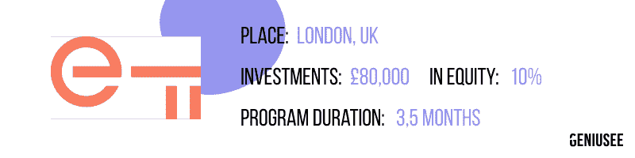**

**企业家第一是世界领先的人才加速器，总部设在伦敦。他们将时间和金钱投入到世界上最有才华和雄心的个人身上，帮助他们找到联合创始人，开发一个想法，并创办一家公司。迄今为止，他们已经帮助 2000 多人创建了 300 多家公司，总价值达 20 亿美元。**

*   **[**叛逆**](https://rebelbio.co/)**

**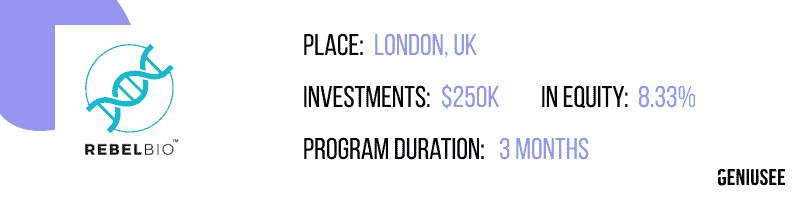**

**RebelBio 是总部位于伦敦的创业加速器，专门从事生物技术、健康技术和生命科学的种子前投资。它广泛投资于以科学为基础、以技术为支撑的早期创业公司。RebelBio 通过其 3 个月的投资计划每年支持 16 家公司。该项目结束后，初创公司可以从 RebelBio 的基金 SOSV 获得后续投资，并在接下来的几年里为其创始人提供支持。**

****2020 年亚洲顶级创业加速器。****

*   **[**部落加速器**](https://tribeaccelerator.co/)**

**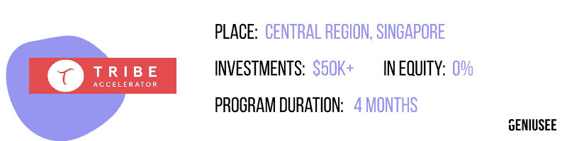**

**Tribe Accelerator 是第一家由新加坡政府支持的区块链加速器，致力于成为一个中立的平台，推动区块链生态系统的合作和发展。创业加速器专注于产品开发，旨在为最有趣的创业公司提供一个超级互联的平台，与他们的全球企业网络、政府机构和区块链领域的顶级公司一起开发创新解决方案。**

*   **[**Brinc 加速器**](https://www.brinc.io/accelerators)**

**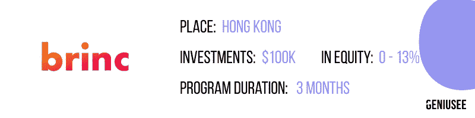**

**Brinc 是一家位于中国的特殊风险投资和创业加速器公司。他们的商业核心是，世界上一些最大的问题可以由企业家来解决，他们“改变游戏”。Brinc startup accelerator 相信，只要给予正确的支持，更多的游戏规则改变者通常可以对世界产生积极的影响。他们支持和指导来自世界各地的初创公司创始人及其团队，并提供投资以帮助他们成长。**

*   **[**开放网络实验室**](https://onlab.jp/en/)**

**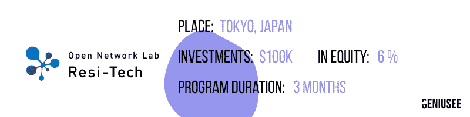**

**开放网络实验室 Resi-Tech 是一个创业加速器项目，由日本一些最大的开发商和建筑公司财团组成。他们通力合作，在全球范围内发现成功的创业公司并与之合作。开放网络实验室团队将作为有兴趣扩展到日本或亚洲的初创公司进入日本市场的渠道，并将在初创公司生态系统中充当 Resi-Tech 合作伙伴。**

*   **[**JGI 零售科技加速器**](http://www.jgiaccelerator.com/)**

**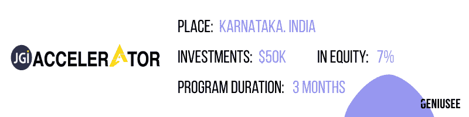**

**JGI 加速器是一个面向科技初创公司的密集和沉浸式项目，旨在通过将多年的学习压缩到短短几个月的执行时间，加速高影响力增长的出现。他们的方法基于创新的发展原则，这些原则在硅谷使用，并在不同国家成功运作。该项目的主要目标是让初创公司启动一个试点项目，并与一家企业客户签订合同。**

*   **[**母猪亚洲**](http://www.sowasia.org/accelerator)**

**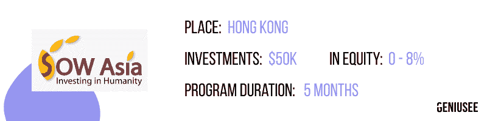**

**Sow Asia Foundation 不仅仅是一个创业加速器，它还是一个由捐赠人支持的慈善组织，总部设在香港，对社会创业公司进行合理的长期投资，以影响积极的社会变革。加速器与理性和有远见的企业家合作，提供资源和有效的商业战略，以帮助减轻贫困，解决医疗保健、教育、环境和其他行业领域的一些世界上最深刻的挑战。**

**【2020 年澳大利亚顶级创业加速器。**

*   **[Startmate](https://startmate.com.au/)**

**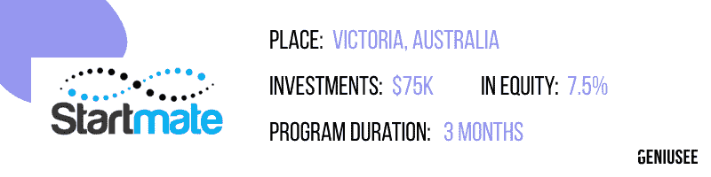**

**这个悉尼创业加速器专注于追逐大市场的科技创业公司。被提议的创业发展项目的特别之处在于，它的前三个月在悉尼进行，剩下的两个月在旧金山进行。专业导师帮助开始寻找商业模式，并赢得第一批客户。该计划结束后，Startmate 仍将与股东接触，并根据需要帮助应对一些挑战，包括去硅谷旅行和介绍许多有用的联系人和网络。**

*   **[**弹弓**](http://www.slingshotters.com/startups/)**

**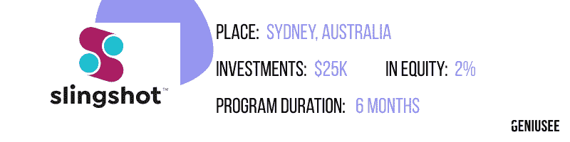**

**Slingshot 的主要目的是为大公司提供世界级的创新项目。该加速器通过提供项目来实现这一目标，这些项目将企业与正在开发创新和潜在市场变化技术的小型初创企业和企业家聚集在一起。换句话说，Slingshot 将企业与为其市场创造改变游戏规则的技术的高端企业家联系起来。每一个合适的创业公司都会得到资金、指导和一个能够激发创造力和生产力的动态工作环境。**

*   **[**iLab**](http://www.ilabaccelerator.com/)**

****

**iLab 由昆士兰州政府于 2000 年建立，旨在支持早期高科技初创企业的最初几年发展。参与该计划的公司在以下方面获得支持:建立企业管理能力，为初创企业创始人培养导师网络，创建投资者准备就绪的公司，以及成功机会增加的毕业公司。**

*   ****

****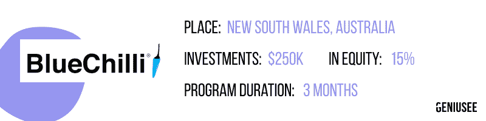****

****BlueChilli 帮助初创公司创始人打造产品、获得投资并建立他们的第一个团队。BlueChilli 是澳大利亚最大的创业加速器之一，成立已超过六年。这个创业加速器为企业家提供了一个工程/开发团队，以建立他们的试点产品来换取股权，通常投资高达 25 万美元。此外，BlueChilli 还通过他们的“156”项目提供培训，该项目由全职企业家团队提供支持。****

*   ****[**mkt place Ventures**](http://www.mktplaceventures.com/)****

****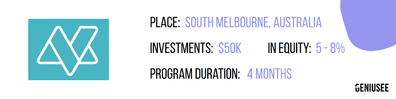****

****Mktplace Ventures 是一家澳大利亚专业的创业公司生态系统加速器。他们与创始人和企业家一起工作，这些人表现出有能力推动他们的技术或软件业务。每个初创企业都可以获得包括各种商业服务在内的支持。加速器的主要重点是确保你从一家初创公司到一家快速增长的公司的巨大转变，以促进投资和资本筹集，实现更大的增长和更快的规模。****

****【2020 年非洲顶级创业加速器。****

*   ****[**非洲**海洋枢纽](http://www.oceanhub.africa/)****

****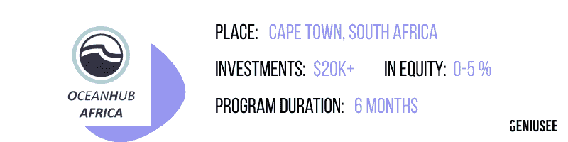****

****位于开普敦的 OceanHub Africa accelerator 在 2020 年 Q1 推出了第一个项目，有六家当地创业公司参与。加速器为初创企业提供工作空间、获得专业指导、商业和科学专业知识和统计数据的机会，以及与市场领导者合作的机会。此外，参与这一项目的初创企业还可以从企业合作伙伴那里获得实践服务。这些服务包括云和 IT 服务，以及访问用于原型制作和测试的工程和软件套件，并支持融资，包括推介和构建交易。****

*   ****[**瓦特布拉科技中心**](https://techhub.vatebra.com/incubation-and-acceleration/)****

****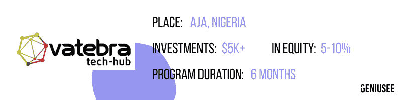****

****位于拉各斯的 Vatebra 技术中心提供了一个为期六个月的孵化项目，涵盖软件和产品开发、销售、营销、金融和法律问题。通过筛选并被该计划接受的初创企业将获得 1 万美元的亚马逊网络服务(AWS)积分。此外，参与者将受益于获得工业银行的资金以及进入国际市场和投资者网络。****

*   ****[**因吉尼**](http://injini.co.za/)****

****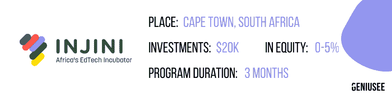****

****Injini startup accelerator 总部位于开普敦，在孵化计划的整个过程中，它为多达 8 家 edtech 初创公司提供资金和咨询资源，孵化计划总是从 3 月持续到 8 月。孵化器与初创公司合作，提供基于证据的解决方案，解决非洲教育部门面临的关键问题，至少提供最低限度的可行产品或原型。****

*   ****[**谷歌非洲 Launchpad 加速器**](https://developers.google.com/programs/launchpad/accelerators/)****

****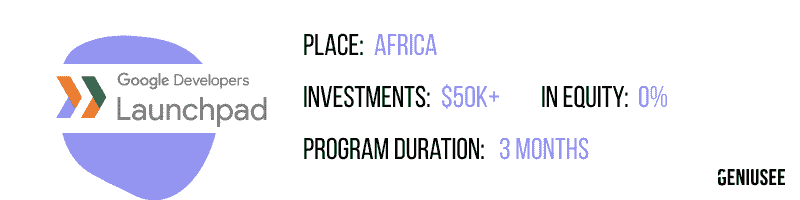****

****如果你在阿尔及利亚、博茨瓦纳、喀麦隆、科特迪瓦、埃及、埃塞俄比亚、加纳、肯尼亚、摩洛哥、尼日利亚、卢旺达、塞内加尔、南非、坦桑尼亚、突尼斯、乌干达和津巴布韦经营一家种子期创业公司，那么你可能有资格获得谷歌的 Launchpad Accelerator Africa。谷歌提供免费支持，获得其开发人员和 20 多个团队的密集指导，获得与硅谷专家和当地顶级导师的合作，公关培训和全球媒体机会，以及与谷歌三个月的密切合作伙伴关系。****

*   ****[**Fb 启动加速器**](https://cchubnigeria.com/fbstart/)****

****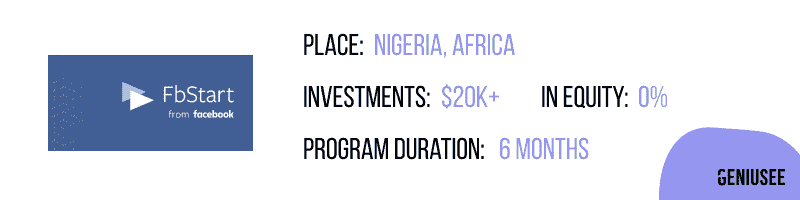****

****这个位于拉格斯的加速器是社交媒体巨头脸书和尼日尼亚共同创造中心的一项倡议。这个创业加速器有一个为期六个月的研究和指导计划，面向尼日利亚和加纳从事人工智能(AI)、机器学习、增强现实(AR)和虚拟现实(VR)的创业创新者。获准加入该计划的人将获得 20，0 00 多美元的无股权融资、产品开发和业务支持，还可以从脸书和 CcHub 网络获得技术专家和业务导师的帮助，以及一个配有高速互联网、会议室等设施的办公场所。****

# ******结论******

****参与创业加速器的好处是种子资金、即时的人脉网络、获得导师、教育项目和更高的成功几率。然而，从该项目毕业后并不能保证成功。主要的缺点是加速器也变得越来越受欢迎，这就是为什么在过程中和过程后脱颖而出的需求变得越来越重要。****