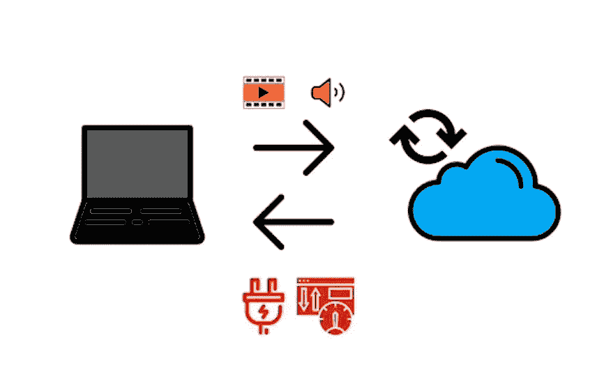
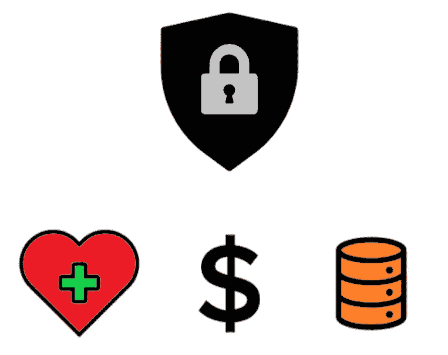

# 什么是 AI at Edge？

> 原文：<https://medium.datadriveninvestor.com/what-is-ai-at-edge-45c686fbe8a9?source=collection_archive---------11----------------------->

大家好！我是 Eshan Agarwal，我是一个机器学习爱好者。所以当你想到自动驾驶汽车时，你首先会想到什么，可能像我一样，你会想到我们如何才能制造这种类型的无人驾驶汽车，如果我们的系统无法预测方向盘的正确决策会发生什么，这可能是由于糟糕的互联网连接或服务器上的流量增加，我们的人工智能系统如何识别其他车辆，道路，行人等。

最近我从 Udacity 获得了英特尔 Edge AI 基础课程的奖学金。我学习了 ***什么是 AI at Edge*** 以及我们如何以非常好的精确度和准确度实现各种计算机视觉任务，如自动驾驶汽车、人类姿势估计、车辆检测等。

 [## 生活在边缘|数据驱动的投资者

### 为边缘和混合计算而重新设计的旧思想这是一种数据抓取！感觉每个行业的每个人…

www.datadriveninvestor.com](https://www.datadriveninvestor.com/2019/03/22/living-life-on-the-edge/) 

我知道它们看起来非常酷，在 [***英特尔开放 Vino 工具包***](https://software.intel.com/en-us/openvino-toolkit) 的帮助下，我们可以非常准确地轻松实现所有这些类型的酷计算机视觉任务。

 [## 英特尔发布 OpenVINO 工具包

### 借助英特尔发布的 open vino toolkit，在应用和解决方案中模拟人类视觉。

software.intel.com](https://software.intel.com/en-us/openvino-toolkit) 

这是我的第一篇博客，也是我将要写的关于这个主题的系列博客之一，向你们解释 AI at Edge 以及更多关于[英特尔开放葡萄酒工具包](https://software.intel.com/en-us/openvino-toolkit)的信息。

# **内容**

1.  什么是 AI at Edge？
2.  为什么 AI 在边缘很重要？
3.  AI 在边缘的应用？
4.  云 vs 边缘？
5.  历史关联

# **什么是 AI at Edge？**

边缘意味着本地(或接近本地)处理，而不是云中的任何地方。这可以是实际的本地设备，如智能冰箱，或者尽可能靠近源的服务器(即位于附近区域而不是在世界另一端的服务器)。

edge 可用于需要低延迟的情况，或者网络本身不总是可用的情况。它的使用可能来自于我们在上面讨论自动驾驶汽车时对某些应用程序中实时决策的渴望。

许多使用云的应用程序在本地获取数据，将数据发送到云，处理数据，然后再发送回来。边缘意味着不需要发送到云；它通常更安全(取决于边缘设备的安全性),并且对网络的影响更小。边缘人工智能算法仍然可以在云中训练，但要在边缘运行。

# **为什么 AI 在 Edge 很重要？**

网络通信可能很昂贵(带宽、功耗等。)有时是不可能的(想想偏远地区或自然灾害期间)

实时处理对于自动驾驶汽车等无法处理重要决策延迟的应用程序来说是必要的

Processing data on cloud is expensive

边缘应用程序可能使用个人数据(如健康数据)，这些数据如果被发送到云中可能是敏感的，而财务数据等商业数据也可能被窃取。

Edge is more secured

专为特定硬件定制的优化软件可以帮助 edge AI 模型实现更高的效率

# **AI 在边缘的应用？**

人工智能在 Edge 有大量的应用。IOT 设备是 edge 的一大用途。我们可以在需要低延迟和低网络的地方使用它，如机器人做手术，计算心率，自动驾驶汽车，跟踪濒临偷猎的动物。

***物联网设备越多，边缘应用的使用就越多。***

Application of Edge

边缘不是一切都需要的。并不是每个应用都需要它——当你的语音应用向服务器提问时，或者当美国宇航局的工程师正在处理他们不需要 Edge 的最新黑洞数据时，你可能需要等待一秒钟。

# **云 vs 缘？**

许多云应用程序在本地获取数据，将其发送到云中进行处理，然后做出响应。而在边缘的情况下，不需要将其发送到云，因此它更安全，用于低延迟要求，对您的网络影响更小。

Cloud vs Edge

# **历史背景**

*   近年来，云计算得到了很多新闻，但是它的重要性也在增长。
*   [据英特尔](https://www.intel.com/content/www/us/en/internet-of-things/infographics/guide-to-iot.html)称，物联网设备从 2006 年的 20 亿台增长到 2020 年的 2000 亿台。
*   从 20 世纪 70 年代的第一台网络自动取款机，到 90 年代的万维网，再到 21 世纪初的智能电表，我们已经走过了漫长的道路。
*   从电话等常用设备到智能扬声器、智能冰箱、锁、仓库应用等，物联网池不断扩大。

***边缘不代表不需要云计算。云仍然可以用于训练人工智能模型。想想您的移动地图应用程序在没有网络的情况下工作得有多好。***

感谢您的阅读。在本系列的下一篇博客中，我将向您介绍[**Intel Open Vino Toolkit**](https://software.intel.com/en-us/openvino-toolkit)，它对于训练您自己的 AI 模型非常有用。即使不需要您自己的大量数据和昂贵的培训，您也可以部署已经为许多应用程序创建的强大模型。

我不打算在这篇博客中向你解释更多关于这个工具包的内容，因为我不想让你因为长时间阅读而感到无聊。同时，您可以通过访问 [this](https://software.intel.com/en-us/openvino-toolkit) 来了解更多关于 Open Vino Toolkit 的信息。

最后再次感谢您阅读本书，如有任何问题，请随时提问。希望你喜欢这个博客，并阅读我未来的博客。想要更多关于这个话题的博客，请不要忘记关注我。