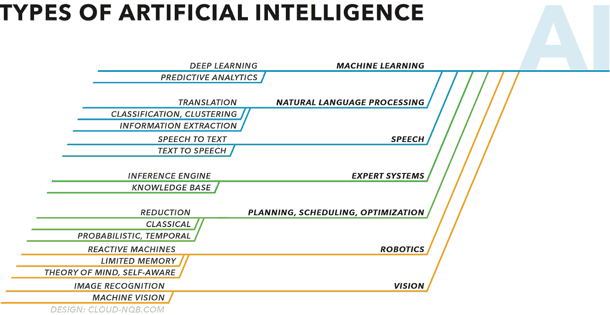
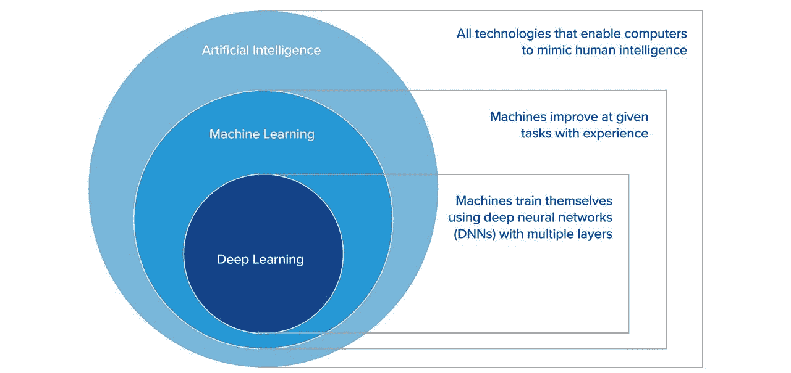

# 面向产品经理的 AI(第一部分):什么是 AI /机器学习？

> 原文：<https://medium.datadriveninvestor.com/what-is-ai-machine-learning-ai-for-product-managers-part-1-39100ed92727?source=collection_archive---------7----------------------->

Photo by [Franck V.](https://unsplash.com/@franckinjapan?utm_source=medium&utm_medium=referral) on [Unsplash](https://unsplash.com?utm_source=medium&utm_medium=referral)

# 介绍

今天最成功的产品和公司使用人工智能来解决仅在几年前似乎不可能的问题，提供令人愉快的用户体验，甚至重新定义整个行业和生活方式。从[谷歌闪电般的搜索引擎](https://www.wired.com/2016/02/ai-is-changing-the-technology-behind-google-searches/)到 [Spotify 的“发现周刊”推荐算法](https://qz.com/571007/the-magic-that-makes-spotifys-discover-weekly-playlists-so-damn-good/)，人工智能已经慢慢进入我们的日常生活，不管我们是否意识到这一点。

因此，今天所有组织中的产品领导者必须非常熟悉人工智能对他们、他们的公司和他们的行业意味着什么。他们必须思考人工智能技术如何让他们能够解决全新的问题，或者更好地解决现有的问题，并在他们推出的产品中进行创新。

 [## 认知计算——一套被广泛认为是……

### 作为它的用户，我们已经习惯了科技。这些天几乎没有什么是司空见惯的…

www.datadriveninvestor.com](https://www.datadriveninvestor.com/2020/02/19/cognitive-computing-a-skill-set-widely-considered-to-be-the-most-vital-manifestation-of-artificial-intelligence/) 

在接下来的几篇文章中，我将为产品经理提供一个高级入门，让他们熟悉什么是人工智能，定义现有的不同类别/类型，了解它如何在我们今天已经喜爱的产品中得到利用，并思考我们如何利用它来构建明天更好的产品。

# AI 是什么？

人工智能是开发能够执行类似人类任务的计算机系统(和软件)的科学和工程。

这些任务中的大多数可以分为以下几类:

*   机器学习(例如 Spotify 学习你的音乐偏好)
*   自然语言处理(例如 Pypestream 的会话引擎，理解用户意图)
*   语音(例如谷歌的助手、亚马逊的 Alexa 或苹果的 SIRI)
*   专家系统(即输入用户问题，输出建议/预测)
*   计划、调度、优化(更多关于这个的[在这里](https://en.wikipedia.org/wiki/Automated_planning_and_scheduling))
*   机器人技术(例如亚马逊的仓库机器人运动技能和寻路)
*   视觉(例如，Waymo 的自动驾驶汽车，或智能文档扫描仪)

出于本文的目的，我们将放大并关注**机器学习**。

# 强 AI，弱 AI

今天所有的人工智能产品和应用都属于被认为是狭义人工智能(或弱人工智能)的范畴，即在狭义任务上(例如，只提供搜索结果或只驾驶汽车)胜过人类的系统。这与人工通用人工智能(强人工智能或 AGI)形成对比，人工通用人工智能是一个用来描述在任何给定任务中都能胜过人类的(理论上的)单一系统的术语。

在他的书《生活 3.0》中，麻省理工学院教授 Max Tegmark 深入探讨了如果我们真的实现了这一天，AGI 将会带来的潜在路径和影响。虽然是理论上的，但这是一本很好的读物，我发现作为一种工具，它很有见地，可以帮助设想未来将要开发的产品。

虽然还没有人接近开发 AGI(尽管有公司公开追求这一目标，即 [OpenAI](https://openai.com/) )，但今天的产品领导者和公司通过构建利用狭窄功能的产品来继续创新和颠覆。

# 什么是机器学习？

机器学习(ML)是人工智能的一个子集，涉及到能够从经验中学习的计算机算法的开发(与明确编程做某事相反)。

换句话说，就像人类医生可能通过观察和研究无数的例子来学习如何在病人的 X 射线中识别癌症一样，现在机器可以通过编程来做同样的事情。

机器学习算法接受数据，学会自己识别模式，并能够基于其学习返回对未来案例的预测。

此外，计算机返回的每个预测可能会被标记为正确或不正确，并反馈到系统中，给它另一个学习的例子，随着时间的推移，进一步提高其准确性。

# 为什么是机器学习？

在机器学习之前，计算机在经典计算的范围内运行。在这种范式中，指令是显式编写(编程)的，计算机只在所提供的指令范围内运行。

当涉及到复杂的任务时，例如驾驶汽车时，这尤其受到限制，在这种情况下，没有一个人能够有效地识别和编写一套全面而准确的规则，该规则将指定合格的驾驶员，同时详细说明如何处理可能出现的不可预见和无限量的不同情况。(例如，小孩跑着穿过街道去追一个球)

那么，你可能会问，人类是如何学会完成像驾驶这样复杂的任务的？体验。我们尝试，我们不断尝试，我们观察他人，我们再次尝试，我们提高并慢慢发展对我们的世界、我们的行动的抽象理解，并发展安全有效地驾驶汽车到达目的地的技能。

机器学习可以解决经典计算无法解决的问题，它的应用范围从大规模的颠覆性创新(例如无人驾驶汽车)到我们可以内置到产品中的小型和可访问的功能(例如电子邮件垃圾邮件过滤器和文本自动更正)。

下面是机器学习的 4 个子类，很容易熟悉:

*   **深度学习:**机器学习的一个子领域，专注于开发受人脑结构启发的算法，称为人工神经网络。
*   **强化学习:**基于奖惩概念的机器学习子集。使用这种方法，软件代理通过与他们的环境交互来学习。(例如游戏人工智能，机器人导航)很想看看这是怎么回事吗？看看[这段 OpenAI 训练软件代理使用强化学习](https://www.youtube.com/watch?v=kopoLzvh5jY)玩捉迷藏的视频。
*   **监督学习:**一种机器学习算法，目的是通过提供输入输出对的例子来推断如何做某事。(例如图像/文本分类)
*   **无监督学习:**一种机器学习算法，目的是在数据中寻找模式，没有明确定义的输出。(例如，聚类或异常检测)

(关于监督学习和非监督学习的更深入的阐述，以及每种学习的详细例子，请查看本文。)

# 结论

人工智能正在吞噬世界([马克·安德里森可能会这么说](https://techcrunch.com/2016/06/07/software-is-eating-the-world-5-years-later/))，并彻底改变整个行业。

*   人工智能是指具有执行“人类任务”能力的计算机/软件，如学习、视觉、语言等。
*   今天所有可用的人工智能应用都被认为是“狭窄的”或“弱的”，因为它们只专注于特定的任务(或一小组任务)。即便如此，它们也让我们能够解决几年前无法想象的问题(例如无人驾驶汽车)。
*   机器学习是一种人工智能，它专注于算法学习执行特定任务的能力，而无需明确给出如何执行的指令。相反，它从经验中学习。
*   深度学习、强化学习、监督学习和非监督学习是机器学习的子集，它们通过不同的技术来实现学习的任务。

我希望这篇文章有助于回答与人工智能和机器学习相关的关键问题。

在接下来的几篇文章中，我将深入更多类型的人工智能，并继续回答我通过[Linkedin](https://www.linkedin.com/in/claudiofuen/)/[Twitter](https://twitter.com/claud_fuen)/Medium 得到的问题。

你还想让我回答什么问题？克劳迪奥([http://claudiofuentes.com/](http://claudiofuentes.com/))