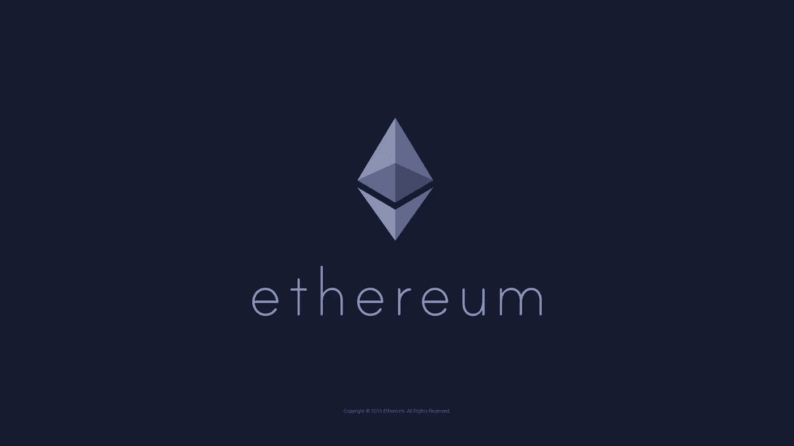
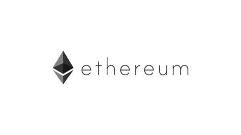

# 什么是以太币——ERC 20

> 原文：<https://medium.datadriveninvestor.com/what-is-an-ethereum-token-erc-20-f3f97e196adb?source=collection_archive---------0----------------------->

对于初学者来说，以太坊和以太坊令牌的整个概念会很快变得混乱。以太坊不仅有自己的货币(以太)，还有代币，代币本身可以充当货币，这种想法让很多人感到困惑。在我们了解以太币是什么之前，了解以太币网络的一些基本概念是很重要的。

整个以太坊网络是大量相互连接的节点(计算机)。事实上，整个网络可以理解为一个单元，即“以太坊虚拟机”或简称 EVM。在这个网络上已经发生和将要发生的所有交易都被自动更新并记录在一个开放的分布式分类帐中。但是有什么好处呢？在我们澄清这一点之前，了解什么是“智能合同”是很重要的。

智能合约用于在以太坊的生态系统中执行任务。当以太坊中有人想要执行某项任务时，他们会与一个或多个人发起智能契约。智能合约是在以太坊网络中用编程语言“solidity”编写的一组指令，基于称为 IF-THIS-THEN-THAT 逻辑(If-This-That)的 IFTTT 逻辑。基本上，当一个指令链的第一步完成时，下一个函数被执行，然后是下一个，重复这个过程直到到达契约的末尾。

 [## 数字货币、区块链和货币的未来|数据驱动的投资者

### “区块链”、“加密货币”、“令牌化”，以及现在的“央行数字货币”已经成为…

www.datadriveninvestor.com](https://www.datadriveninvestor.com/2020/02/18/digital-currencies-blockchain-and-the-future-of-money/) 

理解这一点最简单的方法是想象一台自动售货机。每一步都是下一步的导火索。有点像多米诺骨牌效应。让我们来看看与自动售货机交互时的各个步骤:

> 第一步:你把钱给机器。
> 
> 第二步:你按下与你想要的物品相对应的按钮。
> 
> 步骤 3:分发物品。

如果上一步没有执行，这些步骤中的任何一步是否有效？这些步骤中的每一步都与前一步直接相关。还有一个因素需要考虑，这是智能合约的重要组成部分。您可以看到，与自动售货机的整个交互是专门与机器(供应商)一起工作的。没有第三方参与。

那么，如果这一交易发生在以太坊网络中，它会是什么样子呢？假设您刚刚从以太坊网络中的自动售货机购买了一些东西，步骤会是什么样子？

> 步骤一:给机器一些钱。以太坊网络中的所有节点都会对此进行记录，并且交易会在总账(区块链)中进行更新。
> 
> 第二步:你按下与你想购买的产品相对应的按钮，以太坊网络和总账中的记录被更新。
> 
> 第三步:物品发出并取走。它由所有节点和总账记录。

通过智能合约进行的每一笔交易都会被网络记录和更新。这样做的效果是，合同各方都要对自己的行为负责。恶意操作被排除在外，因为每个操作对整个网络都是可见的。但是这些人终止交易的主要原因是什么呢？如果你帮助申请人，你会得到什么？这就是以太的用武之地。

# 醚

智能合同中的每一步都是一项交易或一项复杂的计算，都有成本，而成本是以“天然气”来衡量的。这种气体的价格由请求者以“乙醚”的形式支付。以太是以太坊网络中用来运行一切的货币。当谈论 ETH 和 ETC 时，我们实际上是在谈论以太在其各自的区块链中的价值。

每个命令都有一个具体的气体限制，这确保了故障代码不会导致乙醚钱包中的全部气体被用完。基本上，人们在合同中完成交易的主要原因是收集更多乙醚的动机。

但是当乙醚的供应量被合同消耗了一半时会发生什么呢？如果您没有所需的乙醚量来支付汽油费用，智能合约到期期间发生的所有交易都将被重置。但是，以太钱包仍将反映余额的变化，因为在区块链中进行的所有交易都是不可逆的。

# 有两件事必须绝对清楚:

智能合约用于完成以太坊中的任务。
以太是以太坊网络中用来做任何事情的货币。

# 什么是以太币

## 给初学者的解释

以太坊和其他任何加密货币最大的区别在于，它不仅仅是一种货币，而是一个环境或平台。在这里，每个人都可以通过智能合同利用区块链技术创建自己的项目和 DAPPS(分散式应用程序)。这是一个非常重要的区别，因为正是这个事实显示了以太坊中可能发生的事情的真实范围。

想象以太坊就像互联网，所有的 DAPPS 都是存在于其中的网站。这些 DAPPs 的有趣之处在于，它们都是去中心化的，不归一个人所有。

# 这些令牌可以通过两种方式进行区分:

使用令牌(可用令牌)工作令牌(工作令牌)

**用法令牌:**这些令牌在各自的 DAPP 中的功能类似于货币。**假人**就是一个很好的例子。如果您想使用假人的服务，您必须使用假人网络令牌(GNT)进行支付。虽然这些令牌具有货币价值，但它们并不授予网络本身任何特殊的权利或特权。

**工作令牌:**这些令牌将某人标识为 DAPP 中的一种股东。因此，令牌持有者对 DAPP 的发展方向有发言权。一个很好的例子就是 DAO 标记。如果您是 DAO 令牌持有者，您有权投票决定某个 DAPP 是否应该从 DAO(分散自治组织)获得资金。

# 我们为什么需要代币？

你可能想知道为什么我们不简单地用乙醚来支付这些 DAPPS 的每一笔交易？为什么我们需要这样一个 DAPPS 单独的硬币？答案很简单，即使在现实生活中，有大量的应用程序和地方，我们使用某种形式的令牌，而不是现金。

也许你去过游乐园或温泉。你付了入场费，手腕上戴了一条带子，可以使用公园里的所有游乐设施。你甚至可以用这个手镯“支付”你的食物。在这个例子中，水上公园是 DAPP(分散式应用程序)，你的钱是以太，手镯是令牌。

当你买了《星球大战》的电影票，又用票额外买了爆米花和可乐的时候，感觉如何？你是怎么进电影院的？你给他们看了票。你如何购买你的爆米花和可乐？出示车票。在这种情况下，电影院是 DAPP，你的钱是 ether，票是 token。

我在每月一期的 [**简讯中分享了更多私密的想法，你可以在这里查看**](https://mailchi.mp/bf8f8e8ed697/keep-in-touch-with-lukas) 。请在评论中告诉我，并在各种社交媒体平台上加入我:

[**推特**](https://twitter.com/WiesfleckerL)●[**insta gram**](https://www.instagram.com/lukaswiesflecker/)●[**脸书**](https://www.facebook.com/lukaswiesfleckerr)●[**Snapchat**](https://www.snapchat.com/add/luggooo)**●[**LinkedIn**](https://www.linkedin.com/in/lukas-wiesflecker-1b11251a5/)**

**无论你做什么，都要带着爱和激情去做！**