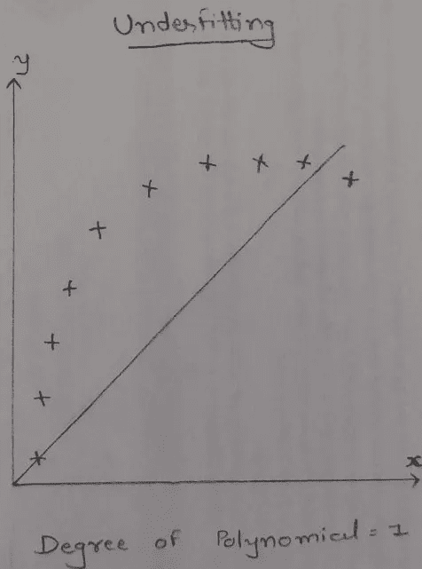

# 机器学习中的偏差-方差权衡是什么？

> 原文：<https://medium.datadriveninvestor.com/what-is-bias-variance-trade-off-in-machine-learning-c13f21dc86f8?source=collection_archive---------18----------------------->

Image [source](https://unsplash.com/photos/fCzSfVIQlVY)

在建立预测机器学习模型的过程中，我们总是会遇到一些类型的错误，无论是训练数据还是测试数据。在这里，让我们用简单的语言来理解这个错误问题，因为有时，用数学和技术术语来理解这个概念是很困难的。

# ***什么是偏见？***

*   *偏差是模型的预测值和正确值之间的误差。*
*   *简单来说，偏差就是训练数据的误差。*
*   *这会导致不合身。*

*   *让我们用回归来理解欠拟合问题。在上面的图片中，我使用了多项式线性回归。因此，它将作为一个简单的线性回归，并创建了最佳拟合线。这里，R 平方误差会很高，因为这些点是多项式形式的，对于训练数据集，它给出了非常高的误差，因此，训练数据的精度很低，对于测试数据，精度下降。这种情况被称为欠拟合问题。对于欠拟合问题，偏差和方差很高，因为训练和测试数据集误差很高。*
*   *还有，用分类来理解这个问题。例如，模型给出的训练误差为 25%，测试误差为 26%。因此，在这种情况下，训练和测试数据集的误差都很高。这意味着偏差和方差误差都非常高。在这种情况下，这是一场灾难，因为模型有高偏差和高方差。因此，它在训练数据和测试数据上表现不佳。*

# ***什么是方差？***

*   *方差是模型预测结果的误差。该模型从训练数据集学习噪声，并且在测试数据集上表现不佳。*
*   *简单来说，方差就是测试数据的误差。*
*   *会导致高灵敏度和过拟合。*

*   上图显示了过度拟合问题的回归问题。*这里，训练数据的 R 平方误差会更小，因为曲线上的点拟合得更好，我们将获得更高的训练精度。但是该模型在测试数据上表现不佳，因此测试数据的准确性下降。这种情况称为过度拟合问题。对于这个问题，因为训练数据集误差低，而测试数据集误差高，所以偏差低，方差高。*
*   对于分类示例，模型给出 1%的训练误差和 20%的测试误差。所以在这种情况下，训练误差低，测试误差高。这意味着模型具有低偏差和高方差。因此，它在训练数据上表现良好，但在测试数据上表现不佳。

# *什么是偏差-方差权衡？*

*   *偏差-方差权衡是指在不过度拟合和欠拟合数据的情况下，找到偏差和方差的正确平衡。*

*   *上图显示了一个二次多项式将线性回归线设定为一条更小的曲线，并且它满足了大部分的点。因此，该模型在训练和测试数据上表现良好，并且我们将获得较小的 R 平方误差。*
*   *例如，模型给出的训练误差为 7%，测试误差为 6%。因此，在这种情况下，训练和测试数据集的误差都很低。这意味着偏差和方差误差都很低。因此它在训练数据和测试数据上表现良好。*

# *减少偏置误差:*

*   ***超参数调优:*** *任何机器学习模型都需要不同的超参数，如约束、权重、优化器、激活函数或学习率，以概括不同的数据模式。调整这些超参数是必要的，以便模型可以最优地解决机器学习问题。*
*   ***尝试合适的算法:*** *在依赖任何模型之前，我们需要确保模型最适合我们的假设。改变模型以减少偏差。*
*   ***足够的数据/数据代表:*** *确保数据足够、多样，并代表所有可能的群体或结果。*
*   ***维护单独的训练和测试数据:*** *将数据集拆分为训练集(50%)、测试集(25%)和验证集(25%)。训练集用于建立模型，测试集用于检查模型的准确性，验证集用于评估您的模型超参数的性能。*
*   ***降低数据的维度:*** *从数据中去除一些特征以减少偏差。*

# *减少方差误差:*

*   *减少方差意味着防止过拟合问题。我的同事 Mahitha 已经在她的一篇博客中解释了防止过度拟合问题的解决方案。你可以在这个* [*链接*](https://mahithas.medium.com/overfitting-identify-and-resolve-df3e3fdd2860) *找到她的博客。*

**结论:**

*希望你现在明白偏差和方差对于执行机器学习非常重要，最佳偏差和最佳方差会带来更好的一致性和更可靠的模型。*

如果你喜欢这个博客或者觉得它有帮助，请留下你的掌声！

***谢谢。***

**进入专家视角—** [**订阅 DDI 英特尔**](https://datadriveninvestor.com/ddi-intel)