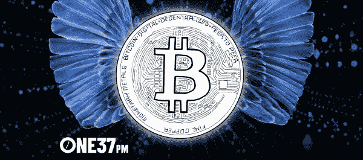
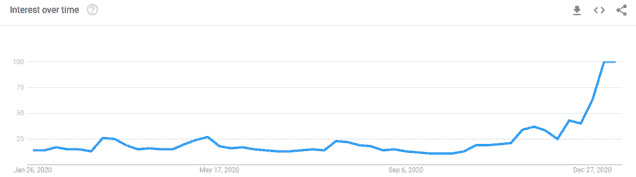
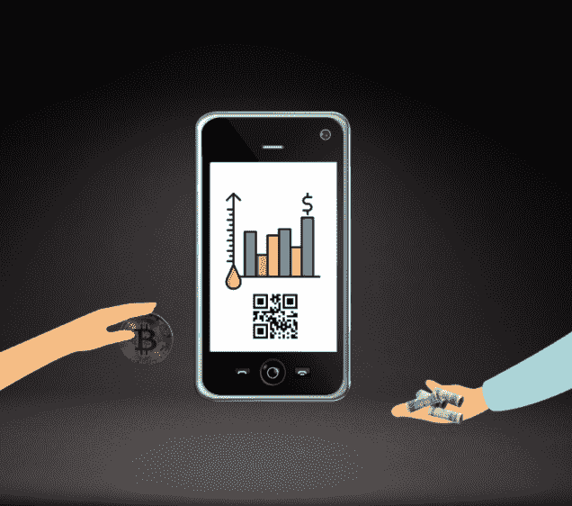

# 比特币是什么，现在开始还来得及吗？

> 原文：<https://medium.datadriveninvestor.com/what-is-bitcoin-and-is-it-too-late-to-get-started-d591e4119d6b?source=collection_archive---------38----------------------->

## 简单点说吧。

[One37PM](https://www.one37pm.com/grind/money/what-is-bitcoin)

所以你 17 岁的邻居一直在吹嘘那个新的 PS5 勺子，你终于屈服了。比特币是什么，现在开始还来得及吗？

现在在加密领域有如此多的噪音，很难突破并获得直接的事实。感觉每个媒体负责人要么对比特币的成功特别感兴趣，要么讨厌比特币及其代表的一切。

简单点说吧。

# 比特币是什么？

比特币是 2009 年由匿名开发者中本聪创造的一种新货币。比特币交易是在公共账本上进行的——没有中间人参与。

换句话说，双方可以在不需要银行的情况下交易商品和服务。

随着时间的推移，比特币对于现实世界的交易变得更加实用。你现在可以用比特币购买任何东西——度假、Xbox 游戏、一双鞋子、[甚至披萨](https://www.investopedia.com/news/bitcoin-pizza-day-celebrating-20-million-pizza-order/)。每天都有更多的公司加入到加密潮流中来。

很多媒体炒作也来自于交易时存在的财富机会。因为比特币非常不稳定，价格投机者可以在比特币交易所赚(也可能赔)大钱。

# 比以往更有趣

比特币的崛起催生了新一代比特币百万富翁和亿万富翁——T4，有些人还在读高中。过去几周，比特币在 Google trends 上达到了最受欢迎的程度,……就在那时，比特币的价格达到了每枚约 41，000 美元的峰值。巧合吗？那鸿

Google Trends

有趣的是，比特币越受欢迎，它的潜在价值就越大。稍后会有更多的介绍。

# 比特币技术的本质

每个比特币本质上都是一组独特的数字。

一枚硬币或硬币的一部分有自己的“发送”地址(私人)，每个数字钱包都有一个唯一的“接收”地址(公共)。如果我想发送比特币给…比如说…你的莎莉阿姨，我必须知道莎莉阿姨的接收地址。她必须知道我的发送地址才能确认交易。

我们使用这些地址在网上买卖东西，甚至当面买卖。对于面对面的交易，只需要像二维码扫描仪或 Square 这样的数字收银机这样简单的东西。

[Jared Wolf](http://humanfuture.medium.com)

所以，你可能会想……一组“独特”的数字怎么会值 4 万美元呢？似乎有点粗略。

嗯，比特币既是一种交易媒介，也是一种“投机”资产。它的价值来源于可用性*和*感知价值。

# 比特币与传统货币相比如何？

当我们谈论传统货币[(后尼克松冲击)](https://corporatefinanceinstitute.com/resources/knowledge/economics/nixon-shock/)时，我们指的是法定货币。法定货币由政府发行，没有任何商品(如黄金)支持。这意味着它的价值是基于政府发行货币的合法性。

法定货币的例子包括美元、欧元、人民币、日元等。

另一方面，比特币是一种从 1)其作为交换媒介(技术)的效用和 2)价格投机(作为资产)中获取价值的货币。除非比特币被普遍采用，否则这些因素不可避免地被捆绑在一起。

如果比特币没有效用，它就没有感知价值。如果它没有感知价值，它的效用就更小。

法定货币和比特币的另一个主要区别是，比特币完全是数字化的。没有纸质版本。然而，世界上几乎每个主要政府都创造了自己的与纸币挂钩的数字货币。但那是以后的事了。

# 如何购买比特币？

如果你想购买比特币，你有一些选择。你可以在交易所购买，你可以让别人转让给你以换取菲亚特，或者自己开采。

## 在交易所购买

有两种类型的交易所可以用来购买比特币:1)集中式交易所和 2)分散式交易所(dex)。

集中交易的一个例子是比特币基地。它拥有交易所的中央权力。dex 通常是开源的，允许用户匿名。

**集中交易所**

*   减少对平台的控制
*   更多安全风险
*   对初学者来说更常见
*   更高的费用
*   更多功能
*   身份检查，不匿名
*   快速交易

**分散交易所**

*   更多用户控制
*   最小的安全风险
*   对于中级、高级用户更常见
*   零费用或小额费用
*   有限的功能
*   较慢的交易(你通常要为较快的交易支付更多的“汽油”费用

# 进行转账

如果你的好友要给你发送比特币，你需要一个手机 app 或者电脑来接收。这意味着你需要创建一个数字钱包。

通过在比特币基地这样的流行应用程序上创建账户，你就创建了一个数字钱包。或者，你可以购买像 [Trezor](https://wallet.trezor.io/#/) 这样的冷链(硬件)钱包来接收你的比特币。这样更安全，因为没人能黑进硬件。

冷链钱包的弊端？新手可能会对它们感到困惑。如果你不知道你在做什么，你可能会犯一个致命的错误，比如把你的比特币送走。

像比特币基地这样的应用程序广受欢迎，因为它们降低了对比特币感兴趣的日常邮递员的准入门槛。你真的不需要任何技术知识就能入门。只是期望为便利支付更多的费用。

# 挖掘比特币

也可以挖矿比特币。挖掘比特币=解决复杂的数学难题(他们就是这样得到奖励的)。这篇文章是写给比特币初学者的，所以我根本不会去碰它。

# 交易比特币

一旦你拥有了比特币，你也可以在交易平台上进行兑换，从而获利。

价格跳水？低买。美国消费者新闻与商业频道对比特币进行了正面报道？等待 24 小时，高价卖出。

听起来很容易，但是你会很快失去很多钱。[像在秒。](https://medium.com/crypto-punks/how-we-lost-90-of-crypto-investments-in-a-few-hours-64fdf1fd5ea1)有这么多快速致富的计划，我会在做单笔交易之前在交易平台*上做几天*的广泛研究。

执行交易策略也是如此。不要读两篇关于加密交易的文章，然后用 100 倍的杠杆投入 10000 美元。在交易任何密码之前，你应该花至少一个月的时间从牛市到熊市的角度持续阅读。

另外，记住交易并不适合所有人。这是体育赌博的金融等价物，只不过你不是从威斯康辛州来赌包装工队的。这是一个纽约人在赌拉脱维亚足球或其他你可能一无所知的边缘运动。

了解自己，评估自己的风险承受能力，做出明智的决定。

# 现在买比特币还来得及吗？

早在 2020 年 12 月，古根海姆的首席信息官 Scott Minerd 说过一句著名的话[比特币应该价值 40 万美元](https://cryptopotato.com/bitcoin-price-should-be-400k-says-guggenheims-cio/)。对于非金融人士来说，古根海姆是一家全球知名的金融服务公司。

如果古根海姆说的是…我们可以排除 40 万美元的比特币是为罗根·斯通兄弟和自由主义者保留的想法。

当然，比特币有其缺陷；它远非完美。但如果我们在回答一个简单的问题……现在买比特币还来得及吗？答案很明确:没有。我们仍处于早期阶段。

如果你能接受挑战央行、创建一个由个人而非机构拥有和运营的金融体系的想法，那么你参加派对永远不会太晚。

*原载于 2021 年 2 月 3 日 https://www.one37pm.com**[*。*](https://www.one37pm.com/grind/money/what-is-bitcoin)*